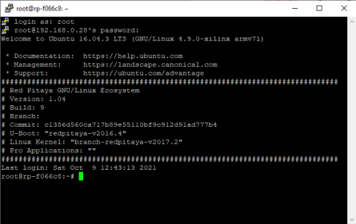

.. _ssh:

###############################
Establish remote SSH connection
###############################

Access information for SSH connection:

* Username: ``root``
* Password: ``root``

If you are unable to connect, check that Red Pitaya is connected to your :ref:`local network <isConnected>`.

Connection instructions are available for:

.. contents::
    :local:
    :backlinks: none
    :depth: 1

|
|

Windows 10
==========

For this example, the|PuTTy tool| was used on Windows XP and Windows 7 Starter OS.
Run PuTTy and enter the Red Pitaya's IP address into the **Host Name (or IP address)** field.

.. |PuTTy tool| raw:: html

   <a href="http://www.putty.org" target="_blank">PuTTy tool</a>

.. figure:: 445px-PuTTy_connection_settings.png
   :align: center

   PuTTy SSH connection settings.

|

If you attempt to connect to Red Pitaya for the first time, a security alert will pop up asking you to confirm the connection.
At this time, the ssh-key will be added to the registry on your computer. A command prompt pops up after login is successful.

When connected to RP via SSH (PuTTy), you get the following command prompt screen:

   SSH connection via PuTTy

|

The last command prompt/terminal line should read as “root@rp-xxxxxx:~#“ (the default home directory on Red Pitaya is /root).

|

.. note::

    After updating the OS or after some time has passed since the last SSH connection, you might get the following message when trying to establish an SSH connection.

    .. code-block:: console

        @@@@@@@@@@@@@@@@@@@@@@@@@@@@@@@@@@@@@@@@@@@@@@@@@@@@@@@@@@@
        @    WARNING: REMOTE HOST IDENTIFICATION HAS CHANGED!     @
        @@@@@@@@@@@@@@@@@@@@@@@@@@@@@@@@@@@@@@@@@@@@@@@@@@@@@@@@@@@
        IT IS POSSIBLE THAT SOMEONE IS DOING SOMETHING NASTY!
        Someone could be eavesdropping on you right now (man-in-the-middle attack)!
        It is also possible that the RSA host key has just been changed.
        The fingerprint for the RSA key sent by the remote host is
        06:ea:f1:f8:db:75:5c:0c:af:15:d7:99:2d:ef:08:2a.
        Please contact your system administrator.
        Add correct host key in /home/user/.ssh/known_hosts to get rid of this message.
        Offending key in /home/user/.ssh/known_hosts:4
        RSA host key for domain.com has changed and you have requested strict checking.
        Host key verification failed.

    |
    
    Do not worry, nothing is wrong with your Red Pitaya. The problem is that the Red Pitaya identification key has changed. To fix this use the following code:

    .. code-block:: console

        ssh-keygen -R rp-xxxxxx.local

    And try to establish the SSH connection again.

    Alternatively, open Explorer and go to **C:/Users/<your-username>/.ssh** and open the **known_hosts** file. Delete all lines containing *rp-xxxxxx.local*.

|
|

Linux
=====

Start Terminal and type (replace the IP address with the right one):

.. code-block:: shell-session

   user@ubuntu:~$ ssh root@192.168.1.100
   root@192.168.1.100's password: root
   Red Pitaya GNU/Linux/Ecosystem version 0.90-299
   redpitaya>

.. figure:: linux_terminal.png
   :align: center

|
|

macOS
=====

Run terminal **Launchpad → Other → Terminal** and type (replace the IP address with the right one):

.. code-block:: shell-session
  
   localhost:~ user$ ssh root@192.168.1.100
   root@10.0.3.249's password: root
   Red Pitaya GNU/Linux/Ecosystem version 0.90-299
   redpitaya>
