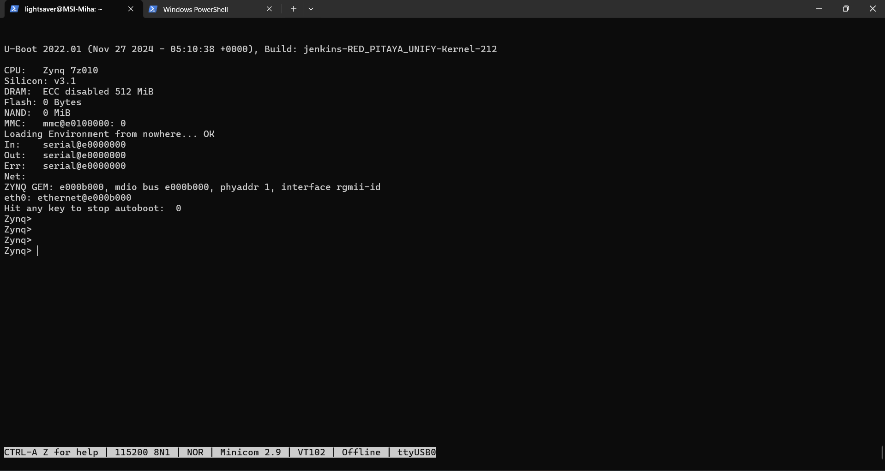

.. _console:

###############################
Setting up the serial console
###############################

The debug console can be used to follow the boot process:

1.  **FSBL** (if debug mode is enabled)

    The serial console can also be used to see the output 
    of other bare metal applications, for example, the memory test.

2.  **U-Boot**

    During the boot process, U-Boot will show status and debug information.

    After FSBL starts U-Boot, there is a 3-second delay before U-Boot starts the Linux kernel.
    If during this time a key is pressed, U-boot will stop the boot process and give the user access to its shell.

3.  **Linux console**

    During the boot process, Linux will show status and debug information.

    When ``systemd`` reaches ``multi-user.target`` a login prompt will appear.

        User name: ``root``
        Password: ``root``

|

Hardware setup
==============

Here is a list of additional hardware you will need to set up the serial console:

- **All Gen 2 and TI models** - USB to USB-C cable
- **All STEMlab 125-14 and SDRlab 122-16 models** - USB to micro USB cable.
- **SIGNALlab 250-12** - USB to USB-C cable
- **STEMlab 125-10** - serial to USB adapter (the pins must first be soldered onto the board)

The following instructions are written for the STEMlab 125-14. For other boards, the procedure is the same, but the cable connection may differ.

.. figure:: img/console-connector.png
    :width: 1000

Connect your Red Pitaya and PC with a micro USB to USB-A cable and follow the instructions for your OS.

.. figure:: img/pitaya-USB-connection-300x164.png
    :width: 400

|

Software requirements
======================

Windows
--------

Download and install the |FTDI-driver| on your PC. After installation, a new COM port will appear in the Device Manager, which you can use in Hyperterminal or another terminal utility to connect to Red Pitaya.
Connect your Red Pitaya to the micro USB port on the board. In your terminal utility, fill in the serial port name and set the **speed to 115200**.

To adjust the connection settings for serial communication, right-click on the COM port and select Properties.

.. figure:: img/device_manager.png

.. figure:: img/Comm_port.png

Boot reference must be done through ``Minicom`` or a similar serial console application.

|

**Using Windows Subsystem for Linux (WSL)**

For Windows users, we recommend using WSL to access the serial console with ``minicom``. WSL provides a Linux environment on Windows and allows you to connect USB devices to Linux tools.

If you haven't set up WSL yet, please follow our :ref:`WSL Setup Guide <wsl_setup>` first.

Once WSL is set up, here's how to connect the Red Pitaya serial console:

1.  Open *Windows PowerShell* or *Windows Terminal* (we'll call this the Windows terminal)
#.  Open *Windows Terminal* as an administrator in a separate window for USB device management
#.  In the administrator Windows terminal, list all available USB devices and find the "bus-id" of the Red Pitaya console (listed as *USB Serial Converter*):
   
    .. code-block:: bash
        
        usbipd list

#.  Bind the Red Pitaya console to WSL:

    .. code-block:: bash

        usbipd bind --busid <bus-id>   

#.  Attach the USB serial converter to WSL:
 
    .. code-block:: bash

        usbipd attach --wsl --busid <bus-id>

    Here is a visual representation of the commands so far:

    .. figure:: img/windows_terminal_commands.png
        :width: 1000

#.  In the first Windows terminal, start WSL:

    .. code-block:: bash

        wsl

#.  In the WSL terminal, verify the Red Pitaya console is connected (should appear as *ttyUSB0*):

    .. code-block:: bash

        lsusb

    .. figure:: img/wsl_lsusb.png
        :width: 1000

#.  Continue to the *Establishing serial console connection* section below
#.  When finished, disconnect the Red Pitaya console from WSL using this command in the administrator Windows terminal:

    .. code-block:: bash

        usbipd detach --busid <bus-id>

|

Linux and Mac
--------------

There is broad support for USB-to-serial converters in the Linux kernel, so in most cases the converter will be detected soon after it is plugged in.

- |minicom|, |screen| or a similar program for setting up a remote serial console.

|

Establishing serial console connection
=======================================

At this point you should have the Red Pitaya connected to your PC via a USB-to-serial converter and are able to access the Linux terminal either through the WSL or naturally from the Linux.

Check the driver output in the kernel log using ``dmesg``:

.. code-block:: none
    :emphasize-lines: 11

    $ dmesg
    ...
    [95074.784075] usb 1-2.4.3: new full-speed USB device number 20 using ehci-pci
    [95074.885386] usb 1-2.4.3: New USB device found, idVendor=0403, idProduct=6015
    [95074.885399] usb 1-2.4.3: New USB device strings: Mfr=1, Product=2, SerialNumber=3
    [95074.885406] usb 1-2.4.3: Product: FT231X USB UART
    [95074.885411] usb 1-2.4.3: Manufacturer: FTDI
    [95074.885416] usb 1-2.4.3: SerialNumber: DN003P0Q
    [95074.890105] ftdi_sio 1-2.4.3:1.0: FTDI USB Serial Device converter detected
    [95074.890228] usb 1-2.4.3: Detected FT-X
    [95074.891157] usb 1-2.4.3: FTDI USB Serial Device converter now attached to ttyUSB0

The first Red Pitaya board connected to your PC will create a device named ``/dev/ttyUSB0``. If **N** USB or serial devices are connected, they will appear as ``/dev/ttyUSBn``, where **n** is 
**{0, 1, ..., N-1}**. To access these devices, programs should be run with ``sudo``.

Minicom or a similar serial console application must be used to view the boot reference log.

|

``minicom``
------------

Minicom is a text-based modem control and terminal emulation program. It is commonly used for setting up a remote serial console.

To configure ``minicom`` use the ``-s`` option.

.. code-block:: shell-session

    sudo minicom -s

A configuration menu will open.

.. code-block:: console

    +-----[configuration]------+
    | Filenames and paths      |
    | File transfer protocols  |
    | Serial port setup        |
    | Modem and dialing        |
    | Screen and keyboard      |
    | Save setup as dfl        |
    | Save setup as..          |
    | Exit                     |
    | Exit from Minicom        |
    +--------------------------+

Go to ``Serial Port Setup``, press **Enter**, and set up the next options:

* Serial Device: ``/dev/ttyUSB0`` (device index ``0`` or a higher number)
* Bps/Par/Bits: ``115200 8N1`` (baud rate, byte length, parity, and stop bits)
* Hardware/Software Flow Control: No (flow control should be disabled)

.. code-block:: console

    +-----------------------------------------------------------------------+
    | A -    Serial Device      : /dev/ttyUSB0                              |
    | B - Lockfile Location     : /var/lock                                 |
    | C -   Callin Program      :                                           |
    | D -  Callout Program      :                                           |
    | E -    Bps/Par/Bits       : 115200 8N1                                |
    | F - Hardware Flow Control : No                                        |
    | G - Software Flow Control : No                                        |
    |                                                                       |
    |    Change which setting?                                              |
    +-----------------------------------------------------------------------+

``Minicom`` requires some special ``Control+A`` key sequences to operate. The most common commands you will need are:
   
    - ``Control+A`` followed by ``X`` to exit Minicom
    - ``Control+A`` followed by ``Z`` to open the help menu

Please see the |minicom| manual for details.

After you have configured the details, exit the settings. At this point Minicom should be connected to your Red Pitaya:

.. figure:: img/Minicom_connected.png
    :width: 1000

If you are asked to log in into the Red Pitaya, please use the following credentials:

    - **User name:** ``root``
    - **Password:** ``root``

Leave the Minicom open and unplug Red Pitaya from power. After plugging it back in, you should see the boot sequence for Red Pitaya.

At the begginning of the boot sequence, you can press any key to stop the autoboot process and enter the Zynq U-Boot shell. This is useful for debugging and changing the boot parameters.

If you are not able to see the boot sequence, please check the connection between the Red Pitaya and your PC, and the settings in Minicom.

|

``screen``
------------

GNU ``screen`` is, in general, a terminal multiplexer. It also supports connecting to a serial console and provides syntax to configure the serial connection's baud rate, byte length, parity, and flow control.

Compared to ``Minicom``, it provides better fonts and support for terminal window resizing.

.. code-block:: shell-session

    $ sudo screen /dev/ttyUSB1 115200 cs8

Similar to ``Minicom``, ``screen`` requires some special ``Control+A`` key sequences to operate.
Please see the |screen| manual for details.

The configuration is the same as for ``Minicom``. Please refer to the previous section for details.

|

Reference boot sequence
=======================

You can compare these reference boot sequences against yours.

U-Boot
------

.. tabs::

    
      
    .. tab:: OS 2.00

        .. code-block::

            U-Boot 2022.01 (Nov 27 2024 - 05:10:38 +0000), Build: jenkins-RED_PITAYA_UNIFY-Kernel-212

            CPU:   Zynq 7z010
            Silicon: v3.1
            DRAM:  ECC disabled 512 MiB
            Flash: 0 Bytes
            NAND:  0 MiB
            MMC:   mmc@e0100000: 0
            Loading Environment from nowhere... OK
            In:    serial@e0000000
            Out:   serial@e0000000
            Err:   serial@e0000000
            Net:   
            ZYNQ GEM: e000b000, mdio bus e000b000, phyaddr 1, interface rgmii-id
            eth0: ethernet@e000b000
            Hit any key to stop autoboot:  3    2    1     0 
            Running script from SD...
            Device: mmc@e0100000
            Manufacturer ID: 3
            OEM: 5344
            Name: SB16G 
            Bus Speed: 50000000
            Mode: SD High Speed (50MHz)
            Rd Block Len: 512
            SD version 3.0
            High Capacity: Yes
            Capacity: 14.8 GiB
            Bus Width: 4-bit
            Erase Group Size: 512 Bytes
            5097 bytes read in 14 ms (355.5 KiB/s)
            ## Executing script at 02000000
            Setting bus to 0

            EEPROM @0x50 read: addr 0x00000000  off 0x1804  count 1024 ... done
            202704 bytes read in 54 ms (3.6 MiB/s)
            design filename = "red_pitaya_top;UserID=0XFFFFFFFF;COMPRESS=TRUE;Version=2020.1"
            part number = "7z010clg400"
            date = "2024/11/27"
            time = "00:07:47"
            bytes in bitstream = 202580
            zynq_align_dma_buffer: Align buffer at 1000007c to 10000040(swap 1)
            INFO:post config was not run, please run manually if needed
            Set devicetree and ramdisk high loading address to 0x20000000
            Loading from SD card (FAT file system) to memory
            Device: mmc@e0100000
            Manufacturer ID: 3
            OEM: 5344
            Name: SB16G 
            Bus Speed: 50000000
            Mode: SD High Speed (50MHz)
            Rd Block Len: 512
            SD version 3.0
            High Capacity: Yes
            Capacity: 14.8 GiB
            Bus Width: 4-bit
            Erase Group Size: 512 Bytes
            Load uImage
            6429880 bytes read in 364 ms (16.8 MiB/s)
            Load dts/z10_125/devicetree.dtb
            18180 bytes read in 33 ms (537.1 KiB/s)
            Booting Linux kernel with ramdisk and devicetree
            ## Booting kernel from Legacy Image at 02004000 ...
                Image Name:   Linux-5.15.0-xilinx
                Image Type:   ARM Linux Kernel Image (uncompressed)
                Data Size:    6429816 Bytes = 6.1 MiB
                Load Address: 00008000
                Entry Point:  00008000
                Verifying Checksum ... OK
            ## Flattened Device Tree blob at 04000000
                Booting using the fdt blob at 0x4000000
                Loading Kernel Image
                Loading Device Tree to 1ead7000, end 1eade703 ... OK

            Starting kernel ...

            Booting Linux on physical CPU 0x0
            Linux version 5.15.0-xilinx (jenkins@instance-1) (arm-linux-gnueabihf-gcc (GCC) 8.2.0, GNU ld (Linaro_Binutils-) 2.31) #1 SMP PREEMPT Wed Nov 27 05:12:29 UTC 2024
            CPU: ARMv7 Processor [413fc090] revision 0 (ARMv7), cr=18c5387d
            CPU: PIPT / VIPT nonaliasing data cache, VIPT aliasing instruction cache
            OF: fdt: Machine model: xlnx,zynq-7000
            Memory policy: Data cache writealloc
            OF: reserved mem: OVERLAP DETECTED!
            buffer@1000000 (0x01000000--0x03000000) overlaps with labuf@1000000 (0x01000000--0x03000000)
            Reserved memory: created CMA memory pool at 0x1f000000, size 16 MiB
            OF: reserved mem: initialized node linux,cma, compatible id shared-dma-pool
            Zone ranges:
            Normal   [mem 0x0000000000000000-0x000000001fffffff]
            HighMem  empty
            Movable zone start for each node
            Early memory node ranges
            node   0: [mem 0x0000000000000000-0x000000001fffffff]
            Initmem setup node 0 [mem 0x0000000000000000-0x000000001fffffff]
            percpu: Embedded 12 pages/cpu s18572 r8192 d22388 u49152
            Built 1 zonelists, mobility grouping on.  Total pages: 129920
            Kernel command line: console=ttyPS0,115200 root=/dev/mmcblk0p2 ro rootfstype=ext4 earlyprintk rootwait uio_pdrv_genirq.of_id=generic-uio
            Unknown command line parameters: earlyprintk
            Dentry cache hash table entries: 65536 (order: 6, 262144 bytes, linear)
            Inode-cache hash table entries: 32768 (order: 5, 131072 bytes, linear)
            mem auto-init: stack:off, heap alloc:off, heap free:off
            Memory: 455572K/524288K available (9216K kernel code, 373K rwdata, 2740K rodata, 1024K init, 142K bss, 52332K reserved, 16384K cma-reserved, 0K highmem)
            rcu: Preemptible hierarchical RCU implementation.
            rcu: 	RCU event tracing is enabled.
            rcu: 	RCU restricting CPUs from NR_CPUS=4 to nr_cpu_ids=2.
                Trampoline variant of Tasks RCU enabled.
                Tracing variant of Tasks RCU enabled.
            rcu: RCU calculated value of scheduler-enlistment delay is 10 jiffies.
            rcu: Adjusting geometry for rcu_fanout_leaf=16, nr_cpu_ids=2
            NR_IRQS: 16, nr_irqs: 16, preallocated irqs: 16
            efuse mapped to (ptrval)
            slcr mapped to (ptrval)
            GIC physical location is 0xf8f01000
            L2C: platform modifies aux control register: 0x72360000 -> 0x72760000
            L2C: DT/platform modifies aux control register: 0x72360000 -> 0x72760000
            L2C-310 erratum 769419 enabled
            L2C-310 enabling early BRESP for Cortex-A9
            L2C-310 full line of zeros enabled for Cortex-A9
            L2C-310 ID prefetch enabled, offset 1 lines
            L2C-310 dynamic clock gating enabled, standby mode enabled
            L2C-310 cache controller enabled, 8 ways, 512 kB
            L2C-310: CACHE_ID 0x410000c8, AUX_CTRL 0x76760001
            random: get_random_bytes called from start_kernel+0x36c/0x5f8 with crng_init=0
            zynq_clock_init: clkc starts at (ptrval)
            Zynq clock init
            sched_clock: 64 bits at 166MHz, resolution 6ns, wraps every 4398046511103ns
            clocksource: arm_global_timer: mask: 0xffffffffffffffff max_cycles: 0x26703d7dd8, max_idle_ns: 440795208065 ns
            Switching to timer-based delay loop, resolution 6ns
            Console: colour dummy device 80x30
            Calibrating delay loop (skipped), value calculated using timer frequency.. 333.33 BogoMIPS (lpj=1666666)
            pid_max: default: 32768 minimum: 301
            Mount-cache hash table entries: 1024 (order: 0, 4096 bytes, linear)
            Mountpoint-cache hash table entries: 1024 (order: 0, 4096 bytes, linear)
            CPU: Testing write buffer coherency: ok
            CPU0: Spectre v2: using BPIALL workaround
            CPU0: thread -1, cpu 0, socket 0, mpidr 80000000
            Setting up static identity map for 0x100000 - 0x100060
            rcu: Hierarchical SRCU implementation.
            smp: Bringing up secondary CPUs ...
            CPU1: thread -1, cpu 1, socket 0, mpidr 80000001
            CPU1: Spectre v2: using BPIALL workaround
            smp: Brought up 1 node, 2 CPUs
            SMP: Total of 2 processors activated (666.66 BogoMIPS).
            CPU: All CPU(s) started in SVC mode.
            devtmpfs: initialized
            VFP support v0.3: implementor 41 architecture 3 part 30 variant 9 rev 4
            clocksource: jiffies: mask: 0xffffffff max_cycles: 0xffffffff, max_idle_ns: 19112604462750000 ns
            futex hash table entries: 512 (order: 3, 32768 bytes, linear)
            pinctrl core: initialized pinctrl subsystem
            NET: Registered PF_NETLINK/PF_ROUTE protocol family
            DMA: preallocated 256 KiB pool for atomic coherent allocations
            thermal_sys: Registered thermal governor 'step_wise'
            cpuidle: using governor menu
            amba f8801000.etb: Fixing up cyclic dependency with replicator
            amba f8803000.tpiu: Fixing up cyclic dependency with replicator
            amba f8804000.funnel: Fixing up cyclic dependency with replicator
            amba f889c000.ptm: Fixing up cyclic dependency with f8804000.funnel
            amba f889d000.ptm: Fixing up cyclic dependency with f8804000.funnel
            hw-breakpoint: found 5 (+1 reserved) breakpoint and 1 watchpoint registers.
            hw-breakpoint: maximum watchpoint size is 4 bytes.
            e0000000.serial: ttyPS0 at MMIO 0xe0000000 (irq = 33, base_baud = 6249999) is a xuartps
            printk: console [ttyPS0] enabled
            e0001000.serial: ttyPS1 at MMIO 0xe0001000 (irq = 34, base_baud = 6249999) is a xuartps
            raid6: int32x8  gen()   121 MB/s
            raid6: int32x8  xor()    83 MB/s
            raid6: int32x4  gen()   134 MB/s
            raid6: int32x4  xor()    90 MB/s
            raid6: int32x2  gen()   205 MB/s
            raid6: int32x2  xor()   129 MB/s
            raid6: int32x1  gen()   171 MB/s
            raid6: int32x1  xor()   110 MB/s
            raid6: using algorithm int32x2 gen() 205 MB/s
            raid6: .... xor() 129 MB/s, rmw enabled
            raid6: using intx1 recovery algorithm
            vgaarb: loaded
            SCSI subsystem initialized
            usbcore: registered new interface driver usbfs
            usbcore: registered new interface driver hub
            usbcore: registered new device driver usb
            pps_core: LinuxPPS API ver. 1 registered
            pps_core: Software ver. 5.3.6 - Copyright 2005-2007 Rodolfo Giometti <giometti@linux.it>
            PTP clock support registered
            EDAC MC: Ver: 3.0.0
            FPGA manager framework
            Advanced Linux Sound Architecture Driver Initialized.
            clocksource: Switched to clocksource arm_global_timer
            NET: Registered PF_INET protocol family
            IP idents hash table entries: 8192 (order: 4, 65536 bytes, linear)
            tcp_listen_portaddr_hash hash table entries: 512 (order: 0, 6144 bytes, linear)
            TCP established hash table entries: 4096 (order: 2, 16384 bytes, linear)
            TCP bind hash table entries: 4096 (order: 3, 32768 bytes, linear)
            TCP: Hash tables configured (established 4096 bind 4096)
            UDP hash table entries: 256 (order: 1, 8192 bytes, linear)
            UDP-Lite hash table entries: 256 (order: 1, 8192 bytes, linear)
            NET: Registered PF_UNIX/PF_LOCAL protocol family
            RPC: Registered named UNIX socket transport module.
            RPC: Registered udp transport module.
            RPC: Registered tcp transport module.
            RPC: Registered tcp NFSv4.1 backchannel transport module.
            PCI: CLS 0 bytes, default 64
            armv7-pmu f8891000.pmu: hw perfevents: no interrupt-affinity property, guessing.
            hw perfevents: enabled with armv7_cortex_a9 PMU driver, 7 counters available
            Initialise system trusted keyrings
            workingset: timestamp_bits=14 max_order=17 bucket_order=3
            jffs2: version 2.2. (NAND) (SUMMARY)  � 2001-2006 Red Hat, Inc.
            xor: measuring software checksum speed
                arm4regs        :  1059 MB/sec
                8regs           :   808 MB/sec
                32regs          :   806 MB/sec
            xor: using function: arm4regs (1059 MB/sec)
            Key type asymmetric registered
            Asymmetric key parser 'x509' registered
            io scheduler mq-deadline registered
            io scheduler kyber registered
            zynq-pinctrl 700.pinctrl: zynq pinctrl initialized
            dma-pl330 f8003000.dmac: Loaded driver for PL330 DMAC-241330
            dma-pl330 f8003000.dmac: 	DBUFF-128x8bytes Num_Chans-8 Num_Peri-4 Num_Events-16
            brd: module loaded
            loop: module loaded
            libphy: Fixed MDIO Bus: probed
            CAN device driver interface
            libphy: MACB_mii_bus: probed
            macb e000b000.ethernet eth0: Cadence GEM rev 0x00020118 at 0xe000b000 irq 37 (00:26:32:f0:a2:35)
            e1000e: Intel(R) PRO/1000 Network Driver
            e1000e: Copyright(c) 1999 - 2015 Intel Corporation.
            usbcore: registered new interface driver brcmfmac
            usbcore: registered new interface driver rt2800usb
            ehci_hcd: USB 2.0 'Enhanced' Host Controller (EHCI) Driver
            ehci-pci: EHCI PCI platform driver
            usbcore: registered new interface driver cdc_acm
            cdc_acm: USB Abstract Control Model driver for USB modems and ISDN adapters
            usbcore: registered new interface driver usb-storage
            usbcore: registered new interface driver usbserial_generic
            usbserial: USB Serial support registered for generic
            usbcore: registered new interface driver ch341
            usbserial: USB Serial support registered for ch341-uart
            usbcore: registered new interface driver cp210x
            usbserial: USB Serial support registered for cp210x
            usbcore: registered new interface driver ftdi_sio
            usbserial: USB Serial support registered for FTDI USB Serial Device
            usbcore: registered new interface driver pl2303
            usbserial: USB Serial support registered for pl2303
            usbcore: registered new interface driver usb_serial_simple
            usbserial: USB Serial support registered for carelink
            usbserial: USB Serial support registered for zio
            usbserial: USB Serial support registered for funsoft
            usbserial: USB Serial support registered for flashloader
            usbserial: USB Serial support registered for google
            usbserial: USB Serial support registered for libtransistor
            usbserial: USB Serial support registered for vivopay
            usbserial: USB Serial support registered for moto_modem
            usbserial: USB Serial support registered for motorola_tetra
            usbserial: USB Serial support registered for novatel_gps
            usbserial: USB Serial support registered for hp4x
            usbserial: USB Serial support registered for suunto
            usbserial: USB Serial support registered for siemens_mpi
            ULPI transceiver vendor/product ID 0x0424/0x0007
            Found SMSC USB3320 ULPI transceiver.
            ULPI integrity check: passed.
            ci_hdrc ci_hdrc.0: EHCI Host Controller
            ci_hdrc ci_hdrc.0: new USB bus registered, assigned bus number 1
            ci_hdrc ci_hdrc.0: USB 2.0 started, EHCI 1.00
            hub 1-0:1.0: USB hub found
            hub 1-0:1.0: 1 port detected
            i2c_dev: i2c /dev entries driver
            at24 0-0050: supply vcc not found, using dummy regulator
            at24 0-0050: 8192 byte 24c64 EEPROM, writable, 32 bytes/write
            at24 0-0051: supply vcc not found, using dummy regulator
            cdns-i2c e0004000.i2c: 400 kHz mmio e0004000 irq 30
            Driver for 1-wire Dallas network protocol.
            cdns-wdt f8005000.watchdog: Xilinx Watchdog Timer with timeout 10s
            EDAC MC: ECC not enabled
            Xilinx Zynq CpuIdle Driver started
            sdhci: Secure Digital Host Controller Interface driver
            sdhci: Copyright(c) Pierre Ossman
            sdhci-pltfm: SDHCI platform and OF driver helper
            ledtrig-cpu: registered to indicate activity on CPUs
            clocksource: ttc_clocksource: mask: 0xffff max_cycles: 0xffff, max_idle_ns: 537538477 ns
            timer #0 at (ptrval), irq=50
            usbcore: registered new interface driver usbhid
            usbhid: USB HID core driver
            fpga_manager fpga0: Xilinx Zynq FPGA Manager registered
            mmc0: SDHCI controller on e0100000.mmc [e0100000.mmc] using ADMA
            NET: Registered PF_INET6 protocol family
            Segment Routing with IPv6
            In-situ OAM (IOAM) with IPv6
            sit: IPv6, IPv4 and MPLS over IPv4 tunneling driver
            NET: Registered PF_PACKET protocol family
            can: controller area network core
            NET: Registered PF_CAN protocol family
            can: raw protocol
            can: broadcast manager protocol
            can: netlink gateway - max_hops=1
            zynq_pm_remap_ocm: no compatible node found for 'mmio-sram'
            mmc0: new high speed SDHC card at address aaaa
            zynq_pm_suspend_init: Unable to map OCM.
            mmcblk0: mmc0:aaaa SB16G 14.8 GiB 
            Registering SWP/SWPB emulation handler
            Loading compiled-in X.509 certificates
            mmcblk0: p1 p2
            Btrfs loaded, crc32c=crc32c-generic, zoned=no, fsverity=no
            of-fpga-region fpga-full: FPGA Region probed
            of_cfs_init
            of_cfs_init: OK
            cfg80211: Loading compiled-in X.509 certificates for regulatory database
            cfg80211: Loaded X.509 cert 'sforshee: 00b28ddf47aef9cea7'
            platform regulatory.0: Direct firmware load for regulatory.db failed with error -2
            ALSA device list:
            cfg80211: failed to load regulatory.db
            No soundcards found.
            EXT4-fs (mmcblk0p2): INFO: recovery required on readonly filesystem
            EXT4-fs (mmcblk0p2): write access will be enabled during recovery
            random: fast init done
            EXT4-fs (mmcblk0p2): recovery complete
            EXT4-fs (mmcblk0p2): mounted filesystem with ordered data mode. Opts: (null). Quota mode: disabled.
            VFS: Mounted root (ext4 filesystem) readonly on device 179:2.
            devtmpfs: mounted
            Freeing unused kernel image (initmem) memory: 1024K
            Run /sbin/init as init process
            systemd[1]: System time before build time, advancing clock.
            systemd[1]: Failed to find module 'autofs4'
            systemd[1]: systemd 249.11-0ubuntu3.12 running in system mode (+PAM +AUDIT +SELINUX +APPARMOR +IMA +SMACK +SECCOMP +GCRYPT +GNUTLS +OPENSSL +ACL +BLKID +CURL +ELFUTILS +FIDO2 +IDN2 -IDN +IPTC +KMOD +LIBCRYPTSETUP +LIBFDISK +PCRE2 -PWQUALITY -P11KIT -QRENCODE +BZIP2 +LZ4 +XZ +ZLIB +ZSTD -XKBCOMMON +UTMP +SYSVINIT default-hierarchy=unified)
            systemd[1]: Detected architecture arm.

            Welcome to Ubuntu 22.04.5 LTS!

            systemd[1]: Hostname set to <rp-f0a235>.
            systemd[1]: Using hardware watchdog 'cdns_wdt watchdog', version 0, device /dev/watchdog
            systemd[1]: Set hardware watchdog to 5s.
            systemd[1]: /etc/systemd/system/jupyter.service:8: Standard output type syslog is obsolete, automatically updating to journal. Please update your unit file, and consider removing the setting altogether.
            systemd[1]: /etc/systemd/system/jupyter.service:9: Standard output type syslog is obsolete, automatically updating to journal. Please update your unit file, and consider removing the setting altogether.
            systemd[1]: /etc/systemd/system/jupyter.service:16: PIDFile= references a path below legacy directory /var/run/, updating /var/run/jupyter.pid � /run/jupyter.pid; please update the unit file accordingly.
            random: systemd: uninitialized urandom read (16 bytes read)
            systemd[1]: Queued start job for default target Multi-User System.
            random: systemd: uninitialized urandom read (16 bytes read)
            systemd[1]: Created slice Slice /system/modprobe.
            [  OK  ] Created slice Slice /system/modprobe.
            random: systemd: uninitialized urandom read (16 bytes read)
            systemd[1]: Created slice Slice /system/serial-getty.
            [  OK  ] Created slice Slice /system/serial-getty.
            systemd[1]: Created slice Slice /system/systemd-fsck.
            [  OK  ] Created slice Slice /system/systemd-fsck.
            systemd[1]: Created slice User and Session Slice.
            [  OK  ] Created slice User and Session Slice.
            systemd[1]: Started ntp-systemd-netif.path.
            [  OK  ] Started ntp-systemd-netif.path.
            systemd[1]: Started Dispatch Password Requests to Console Directory Watch.
            [  OK  ] Started Dispatch Password �ts to Console Directory Watch.
            systemd[1]: Started Forward Password Requests to Wall Directory Watch.
            [  OK  ] Started Forward Password R�uests to Wall Directory Watch.
            systemd[1]: Condition check resulted in Arbitrary Executable File Formats File System Automount Point being skipped.
            systemd[1]: Reached target Local Encrypted Volumes.
            [  OK  ] Reached target Local Encrypted Volumes.
            systemd[1]: Reached target Path Units.
            [  OK  ] Reached target Path Units.
            systemd[1]: Reached target Remote File Systems.
            [  OK  ] Reached target Remote File Systems.
            systemd[1]: Reached target Slice Units.
            [  OK  ] Reached target Slice Units.
            systemd[1]: Reached target Swaps.
            [  OK  ] Reached target Swaps.
            systemd[1]: Reached target Local Verity Protected Volumes.
            [  OK  ] Reached target Local Verity Protected Volumes.
            systemd[1]: Listening on fsck to fsckd communication Socket.
            [  OK  ] Listening on fsck to fsckd communication Socket.
            systemd[1]: Listening on initctl Compatibility Named Pipe.
            [  OK  ] Listening on initctl Compatibility Named Pipe.
            systemd[1]: Condition check resulted in Journal Audit Socket being skipped.
            systemd[1]: Listening on Journal Socket (/dev/log).
            [  OK  ] Listening on Journal Socket (/dev/log).
            systemd[1]: Listening on Journal Socket.
            [  OK  ] Listening on Journal Socket.
            systemd[1]: Listening on Network Service Netlink Socket.
            [  OK  ] Listening on Network Service Netlink Socket.
            systemd[1]: Listening on udev Control Socket.
            [  OK  ] Listening on udev Control Socket.
            systemd[1]: Listening on udev Kernel Socket.
            [  OK  ] Listening on udev Kernel Socket.
            systemd[1]: Condition check resulted in Huge Pages File System being skipped.
            systemd[1]: Mounting POSIX Message Queue File System...
                    Mounting POSIX Message Queue File System...
            systemd[1]: Mounting Kernel Debug File System...
                    Mounting Kernel Debug File System...
            systemd[1]: Condition check resulted in Kernel Trace File System being skipped.
            systemd[1]: Starting Journal Service...
                    Starting Journal Service...
            systemd[1]: Starting Restore / save the current clock...
                    Starting Restore / save the current clock...
            systemd[1]: Starting Set the console keyboard layout...
                    Starting Set the console keyboard layout...
            systemd[1]: Condition check resulted in Create List of Static Device Nodes being skipped.
            systemd[1]: Starting Load Kernel Module configfs...
                    Starting Load Kernel Module configfs...
            systemd[1]: Starting Load Kernel Module drm...
                    Starting Load Kernel Module drm...
            systemd[1]: Starting Load Kernel Module efi_pstore...
                    Starting Load Kernel Module efi_pstore...
            systemd[1]: Starting Load Kernel Module fuse...
                    Starting Load Kernel Module fuse...
            systemd[1]: Starting File System Check on Root Device...
                    Starting File System Check on Root Device...
            systemd[1]: Starting Load Kernel Modules...
                    Starting Load Kernel Modules...
            systemd[1]: Starting Generate network units from Kernel command line...
                    Starting Generate network �ts from Kernel command line...
            systemd[1]: Starting Coldplug All udev Devices...
                    Starting Coldplug All udev Devices...
            systemd[1]: Started Journal Service.
            [  OK  ] Started Journal Service.
            [  OK  ] Mounted POSIX Message Queue File System.
            [  OK  ] Mounted Kernel Debug File System.
            [  OK  ] Finished Restore / save the current clock.
            [  OK  ] Finished Load Kernel Module configfs.
            [  OK  ] Finished Load Kernel Module drm.
            [  OK  ] Finished Load Kernel Module efi_pstore.
            [  OK  ] Finished Load Kernel Module fuse.
            [  OK  ] Finished Set the console keyboard layout.
            [  OK  ] Finished File System Check on Root Device.
            [  OK  ] Finished Load Kernel Modules.
            [  OK  ] Finished Generate network units from Kernel command line.
                    Mounting Kernel Configuration File System...
            [  OK  ] Started File System Check Daemon to report status.
                    Starting Remount Root and Kernel File Systems...
                    Starting Apply Kernel Variables...
            EXT4-fs (mmcblk0p2): re-mounted. Opts: errors=remount-ro. Quota mode: disabled.
            [  OK  ] Mounted Kernel Configuration File System.
            [  OK  ] Finished Remount Root and Kernel File Systems.
            [  OK  ] Finished Apply Kernel Variables.
                    Starting Load/Save Random Seed...
                    Starting Create System Users...
            [  OK  ] Finished Coldplug All udev Devices.
            [  OK  ] Finished Create System Users.
                    Starting Create Static Device Nodes in /dev...
            [  OK  ] Finished Create Static Device Nodes in /dev.
            [  OK  ] Reached target Preparation for Local File Systems.
                    Mounting /var/log...
                    Starting Rule-based Manage�for Device Events and Files...
            [  OK  ] Mounted /var/log.
                    Starting Flush Journal to Persistent Storage...
            [  OK  ] Finished Flush Journal to Persistent Storage.
            [  OK  ] Started Rule-based Manager for Device Events and Files.
            [  OK  ] Found device /dev/ttyPS0.
            [  OK  ] Found device /dev/mmcblk0p1.
                    Mounting /boot...
                    Starting File System Check on /dev/mmcblk0p1...
            [  OK  ] Mounted /boot.
            [  OK  ] Finished File System Check on /dev/mmcblk0p1.
                    Mounting /opt/redpitaya...
            [  OK  ] Mounted /opt/redpitaya.
            [  OK  ] Reached target Local File Systems.
                    Starting Set console font and keymap...
                    Starting Create Volatile Files and Directories...
            [  OK  ] Finished Set console font and keymap.
            [  OK  ] Finished Create Volatile Files and Directories.
                    Starting Load Kernel Module efi_pstore...
                    Starting Load Kernel Module fuse...
                    Starting Record System Boot/Shutdown in UTMP...
            [  OK  ] Finished Load Kernel Module efi_pstore.
            [  OK  ] Finished Load Kernel Module fuse.
            [  OK  ] Finished Record System Boot/Shutdown in UTMP.
            [  OK  ] Reached target System Initialization.
            [  OK  ] Started Daily apt download activities.
            [  OK  ] Started Daily apt upgrade and clean activities.
            [  OK  ] Started Daily dpkg database backup timer.
            [  OK  ] Started Periodic ext4 Onli�ata Check for All Filesystems.
            [  OK  ] Started Discard unused blocks once a week.
            [  OK  ] Started Message of the Day.
            [  OK  ] Started Daily Cleanup of Temporary Directories.
            [  OK  ] Reached target Timer Units.
            [  OK  ] Listening on Avahi mDNS/DNS-SD Stack Activation Socket.
            [  OK  ] Reached target Socket Units.
            [  OK  ] Reached target Basic System.
            [  OK  ] Listening on D-Bus System Message Bus Socket.
            [  OK  ] Started D-Bus System Message Bus.
                    Starting Remove Stale Onli�t4 Metadata Check Snapshots...
                    Starting Set hostname to redpitaya-[MAC]...
            [  OK  ] Reached target Preparation for Network.
                    Starting Service for startup wifi...
            [  OK  ] Started ntp-systemd-netif.service.
                    Starting Service for an ap�s connected to the E3 slot....
                    Starting sockproc enables Lua running shell scripts...
                    Starting User Login Management...
                    Starting WPA supplicant...
            [  OK  ] Started Service for an app� is connected to the E3 slot..
            [  OK  ] Started Service for startup wifi.
            [  OK  ] Started sockproc enables Lua running shell scripts.
            [  OK  ] Started WPA supplicant.
                    Starting Hostname Service...
            [  OK  ] Finished Load/Save Random Seed.
            [  OK  ] Started User Login Management.
            [  OK  ] Finished Remove Stale Onli�ext4 Metadata Check Snapshots.
            [  OK  ] Started Hostname Service.
            [  OK  ] Finished Set hostname to redpitaya-[MAC].
                    Starting Network Configuration...
            [  OK  ] Started Network Configuration.
                    Starting Wait for Network to be Configured...
                    Starting Network Name Resolution...
            [  OK  ] Started Network Name Resolution.
            [  OK  ] Reached target Network.
            [  OK  ] Reached target Host and Network Name Lookups.
                    Starting Avahi mDNS/DNS-SD Stack...
            [  OK  ] Started Jupyter notebook server.
                    Starting Network Time Service...
            [  OK  ] Started Service for startup script Red Pitaya.
                    Starting Customized Nginx �for Red Pitaya applications...
                    Starting OpenBSD Secure Shell server...
                    Starting Permit User Sessions...
            [  OK  ] Finished Permit User Sessions.
            [  OK  ] Started Avahi mDNS/DNS-SD Stack.
            [  OK  ] Started Serial Getty on ttyPS0.
                    Starting Set console scheme...
            [  OK  ] Finished Set console scheme.
            [  OK  ] Created slice Slice /system/getty.
            [  OK  ] Started Getty on tty1.
            [  OK  ] Reached target Login Prompts.
            [  OK  ] Started Network Time Service.
            [  OK  ] Finished Wait for Network to be Configured.
            [  OK  ] Started OpenBSD Secure Shell server.
            [  OK  ] Reached target Network is Online.
            [  OK  ] Started ntp-systemd-netif.service.
                    Starting LSB: Shell In A Box Daemon...
            [  OK  ] Started Customized Nginx w�r for Red Pitaya applications.
            [  OK  ] Started LSB: Shell In A Box Daemon.
            [  OK  ] Reached target Multi-User System.
                    Starting Record Runlevel Change in UTMP...
            [  OK  ] Finished Record Runlevel Change in UTMP.

            Ubuntu 22.04.5 LTS rp-f0a235 ttyPS0

            rp-f0a235 login: root (automatic login)

            Welcome to Ubuntu 22.04.5 LTS (GNU/Linux 5.15.0-xilinx armv7l)

            * Documentation:  https://help.ubuntu.com
            * Management:     https://landscape.canonical.com
            * Support:        https://ubuntu.com/pro

            This system has been minimized by removing packages and content that are
            not required on a system that users do not log into.

            To restore this content, you can run the 'unminimize' command.
            ##############################################################################
            # Red Pitaya GNU/Linux Ecosystem
            # Version: 2.06-6f943450b
            # Build: 425
            # Branch: 
            # Commit: 6f943450b2e4eebf9cf17d9df533fe3a03015b7c
            # U-Boot: "redpitaya-v2022.1"
            # Linux Kernel: "branch-redpitaya-v2024.1"
            # Pro Applications: ""
            ##############################################################################
            root@rp-f0a235:~# 

    .. tab:: OS version 1.04

        .. code-block:: none

            U-Boot 2016.01 (Nov 16 2016 - 12:23:28 +0100), Build: jenkins-redpitaya-master-156
            
            Model: Red Pitaya Board
            Board: Xilinx Zynq
            I2C:   ready
            DRAM:  ECC disabled 480 MiB
            I2C:EEPROM selection failed
            MMC:   sdhci@e0100000: 0
            In:    serial@e0000000
            Out:   serial@e0000000
            Err:   serial@e0000000
            Model: Red Pitaya Board
            Board: Xilinx Zynq
            Net:   ZYNQ GEM: e000b000, phyaddr 1, interface rgmii-id
            eth0: ethernet@e000b000
            Hit any key to stop autoboot:  0
            Running script from SD...
            Device: sdhci@e0100000
            Manufacturer ID: 19
            OEM: 4459
            Name: 00000
            Tran Speed: 25000000
            Rd Block Len: 512
            SD version 1.0   
            High Capacity: Yes
            Capacity: 3.7 GiB
            Bus Width: 4-bit 
            Erase Group Size: 512 Bytes
            reading u-boot.scr
            1203 bytes read in 17 ms (68.4 KiB/s)
            ## Executing script at 02000000
            Set devicetree and ramdisk high loading address to 0x20000000
            Loading from SD card (FAT file system) to memory
            Device: sdhci@e0100000
            Manufacturer ID: 19
            OEM: 4459
            Name: 00000
            Tran Speed: 25000000
            Rd Block Len: 512
            SD version 1.0   
            High Capacity: Yes
            Capacity: 3.7 GiB
            Bus Width: 4-bit 
            Erase Group Size: 512 Bytes
            reading u-boot.scr
            1203 bytes read in 17 ms (68.4 KiB/s)
            ## Executing script at 02000000
            Set devicetree and ramdisk high loading address to 0x20000000
            Loading from SD card (FAT file system) to memory
            Device: sdhci@e0100000
            Manufacturer ID: 19
            OEM: 4459
            Name: 00000
            Tran Speed: 25000000
            Rd Block Len: 512
            SD version 1.0   
            High Capacity: Yes
            Capacity: 3.7 GiB
            Bus Width: 4-bit 
            Erase Group Size: 512 Bytes
            reading uImage   
            4590664 bytes read in 404 ms (10.8 MiB/s)
            reading devicetree.dtb
            17342 bytes read in 19 ms (890.6 KiB/s)
            Booting Linux kernel with ramdisk and devicetree
            ## Booting kernel from Legacy Image at 02004000 ...
                Image Name:   Linux-4.4.0-xilinx
                Image Type:   ARM Linux Kernel Image (uncompressed)
                Data Size:    4590600 Bytes = 4.4 MiB
                Load Address: 00008000
                Entry Point:  00008000
                Verifying Checksum ... OK
            ## Flattened Device Tree blob at 04000000
                Booting using the fdt blob at 0x4000000
                Loading Kernel Image ... OK
                Loading Device Tree to 1d33c000, end 1d3433bd ... OK

|

FAQ
======

Boot sequence not visible on the serial console
---------------------------------------------------------

1.  Make sure that the serial console is connected to the correct port and that the baud rate is set to 115200.
2.  Check whether the FTDI drivers for Windows are installed correctly.
3.  Check the status LEDs on Red Pitaya:

    - If the **green and blue LEDs are ON** and the other status LEDs are working correctly, unplug the power and repower the board. If the issue persists, please double-check the serial console instructions above or use a different cable.
    
    - If the **green LED is ON**, but no other LEDs are visible, this means that the boot process is stuck:
        
        -   Please check whether the Red Pitaya OS is installed on the SD card.
        -   If the OS is installed correctly and the boot log is not visible, the Zynq SoC might be damaged. In this case, please contact Red Pitaya support (support@redpitaya.com).
            If the board is still under warranty, we will replace it.

    - If the **green LED is OFF**, please check whether the power supply is connected and working correctly. If the power supply is good, then the board might be damaged.

|
