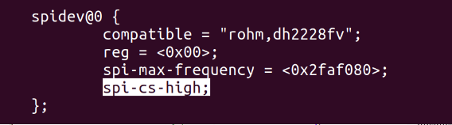

#########################
SPI interface
#########################

SPI interface support for the :ref:`E2 <E2>` connector without the need for a specific FPGA code.

By default, on all RedPitaya boards, the CS state of the SPI is set to HIGH (inactive).

If you want to set the default value to LOW (inactive), then you need to rebuild the device tree. This can be done on the Red Pitaya itself.
First, you need to open the file using a command in the console with a description of the device tree.

.. code-block:: console

   root@rp-f01c3d:~# rw
   root@rp-f01c3d:~# nano /opt/redpitaya/dts/$(monitor -f)/dtraw.dts

In the file, you need to find the SPI device: spidev@0
and add the line *spi-cs-high* to this device;

   Example of SPI config

After that, you need to rebuild the tree and restart the board

.. code-block:: console

   root@rp-f01c3d:~# cd /opt/redpitaya/dts/$(monitor -f)/
   root@rp-f01c3d:~# dtc -I dts -O dtb ./dtraw.dts -o devicetree.dtb
   root@rp-f01c3d:~# reboot

.. note::

   The settings are applied only after the device tree is loaded. When the board starts up, the CS value is in the HIGH state but will change to LOW after the boot is complete.

.. note::

   You can also switch the driver mode through the settings. See commands from :ref:`hw api<scpi_command_list>`:

   * rp_SPI_GetCSMode
   * rp_SPI_SetCSMode
