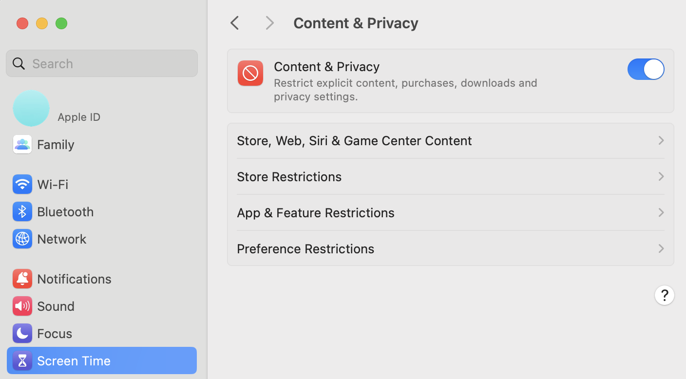

.. _known_sw_issues:

########################
Known Software Issues
########################

This page lists known software issues with Red Pitaya platforms. Issues are organized by status and severity.

.. contents:: Issue Categories
   :local:
   :depth: 1

Active Issues
=============

These issues exist in current OS versions and require workarounds or will be fixed in future releases.

Direct Connection on macOS
---------------------------

* **Affected OS**: 2.00 and higher
* **Affected Hardware**: All models
* **Severity**: Minor
* **Workaround**: Available

**Symptoms**

macOS computers may fail to connect to Red Pitaya web interface. The connection attempt times out or refuses to establish.

**Root Cause**

macOS **Content and Privacy Settings** block WebSocket connections by default.

**Workaround**

1. Open **System Preferences** → **Screen Time** → **Content & Privacy**
2. Disable restrictions or add exceptions for Red Pitaya
3. **Log out and log back in** for changes to take effect
4. If issues persist, completely disable Content and Privacy settings

|

Wi-Fi Signal Level Reporting
-----------------------------

* **Affected OS**: 2.00 to 2.07-51
* **Affected Hardware**: All models with Wi-Fi dongles
* **Severity**: Minor
* **Workaround**: None

**Symptoms**

Wi-Fi dongles connected to Red Pitaya show incorrect signal strength (0 out of 5 bars) for some networks. The same dongles display correct signal levels when connected to other devices.

**Root Cause**

Legacy Linux kernel driver has compatibility issues with signal strength reporting for certain Wi-Fi chipsets.

**Status**

Will be resolved in OS 3.00 by updating the Linux kernel driver and adding support for newer Wi-Fi dongles.

|

Resolved Issues
===============

These issues have been fixed in specific OS versions. Upgrade to the indicated version or higher to resolve.

JupyterLab Matplotlib NumPy Compatibility
------------------------------------------

* **Affected OS**: 2.07-48 to 2.07-51
* **Fixed in**: OS 3.00 NB 697 or higher
* **Affected Hardware**: All models
* **Severity**: Major
* **Workaround**: Available

**Symptoms**

Importing Matplotlib in JupyterLab raises ``ImportError`` due to NumPy version incompatibility:

.. code-block:: python

    ImportError: numpy.core.multiarray failed to import
    
    A module that was compiled using NumPy 1.x cannot be run in
    NumPy 2.2.5 as it may crash. To support both 1.x and 2.x
    versions of NumPy, modules must be compiled with NumPy 2.0.

**Root Cause**

Matplotlib library compiled against NumPy 1.x is incompatible with NumPy 2.x.

**Resolution**

-  **Recommended:** Upgrade to OS 3.00 NB 697 or higher (Matplotlib updated to NumPy 2.x compatible version)
-  **Manual fix for older OS:** Linux Ubuntu computer or :ref:`Windows computer with WSL <wsl_setup>` required

    .. note::
    
        While it would be simpler to update Matplotlib directly from the Red Pitaya Linux terminal, the board's limited RAM (512 MB or 1 GB) is insufficient to complete the package 
        upgrade process. This workaround script performs the update by mounting the SD card on a computer with adequate resources.

    #. Download the :download:`updatematplotlib.sh script <files/updatematplotlib.sh>`.
    #. Insert the micro SD card into your Computer (using USB card reader if needed).
    #. On Windows connect to the Windows Subsystem for Linux and run the USBIPD to connect the SD card to the WSL (:ref:`WSL installation instructions <wsl_setup>`). On Linux Ubuntu, skip this step.
    #. Find the Linux OS partition on the inserted card using the "lsblk" command. By default, it's /dev/sdd2, but it may be different. This is the largest partition on the inserted card.
    #. If the partition is different from sdd2, change the partition path in the script.
    #. Run the script with sudo.

    For reference, you can view the :download:`expected output <files/updatematplotlib_reference_text.txt>` from running the script.

|

I2C Device Descriptor Exhaustion
---------------------------------

* **Affected OS**: 2.00 to 2.07-43
* **Fixed in**: OS 2.07-48 or higher
* **Affected Hardware**: All models
* **Severity**: Major

**Symptoms**

SCPI server or C/Python API hangs after several hundred I2C read/write operations. Error message:

.. code-block:: console

    9560,"*I2C:IOctl:Write:Buffer2 Failed write buffer to i2c: Failed to init I2C."

**Root Cause**

I2C driver failed to properly close device file descriptors after each operation, causing descriptor exhaustion.

**Resolution**

Fixed in OS 2.07-48 by correcting the I2C driver to properly close devices after operations.

|

Streaming Application EOL Error
--------------------------------

* **Affected OS**: 2.05-37, 2.07-43
* **Fixed in**: OS 2.07-48 or higher
* **Affected Hardware**: All models
* **Severity**: Major

**Symptoms**

- :ref:`Streaming desktop application <stream_desktop_app>` reports EOL error within two minutes
- :ref:`Command line client <stream_command_client>` errors when using ``-t`` (time) parameter

**Root Cause**

Streaming application (Data stream control) sent status updates less than once per minute, causing browser timeout and application reload.

**Resolution**

Fixed in OS 2.07-48 by increasing update frequency to prevent browser timeout.

|

STEMlab 125-10 Out-of-Memory
-----------------------------

* **Affected OS**: 2.00 to 2.07-43
* **Fixed in**: OS 2.07-48 or higher
* **Affected Hardware**: STEMlab 125-10 only
* **Severity**: Critical

**Symptoms**

Logic Analyzer application crashes on startup with out-of-memory error from NGINX.

**Root Cause**

STEMlab 125-10 has 256 MB RAM (half of STEMlab 125-14's 512 MB). OS 2.00 applications require more RAM than 1.04 OS, exceeding STEMlab 125-10 resources.

.. warning::

    STEMlab 125-10 will reach end-of-life for software support (date TBD). All users will be notified in advance. A final OS version with full application support will be provided before EOL.

**Resolution**

Fixed in OS 2.07-48 by optimizing application memory usage.

**Workaround for older OS versions:**

Add 1 GB SWAP space to SD card:

1. Create backup of SD card using ``dd`` command
2. Resize OS partition using ``parted``
3. Add SWAP space following `this guide <https://www.digitalocean.com/community/tutorials/how-to-add-swap-space-on-ubuntu-22-04>`_

|

Web Interface Reload on Direct Ethernet Connection
---------------------------------------------------

* **Affected OS**: 2.00 to 2.05-23
* **Fixed in**: OS 2.05-37 or higher
* **Affected Hardware**: All models
* **Severity**: Major

**Symptoms**

Web interface constantly reloads when connecting Red Pitaya directly to computer via Ethernet cable (without switch/router).

**Resolution**

Fixed in OS 2.05-37 by correcting network configuration for point-to-point Ethernet connections.

|

Local Network Visibility
-------------------------

* **Affected OS**: 2.00 to 2.05-23
* **Fixed in**: OS 2.05-37 or higher
* **Affected Hardware**: All models
* **Severity**: Minor

**Symptoms**

Red Pitaya doesn't appear in ARP table at boot (``arp -a`` shows no entry). Device remains pingable and appears in ARP table after accessing ``rp-xxxxxx.local``.

**Resolution**

Fixed in OS 2.05-37 by improving mDNS and network initialization timing.

|

SIGNALlab 250-12 Output Voltage Range
--------------------------------------

* **Affected OS**: 1.04 and earlier
* **Fixed in**: OS 2.00-23 or higher
* **Affected Hardware**: SIGNALlab 250-12 only
* **Severity**: Major

**Symptoms**

Oscilloscope application cannot properly set output voltage range (gain x1 and x5) and cannot reach ±10 V. Issue does not affect SCPI or API commands.

**Resolution**

Fixed in OS 2.00-23 by correcting oscilloscope application gain configuration.

|
