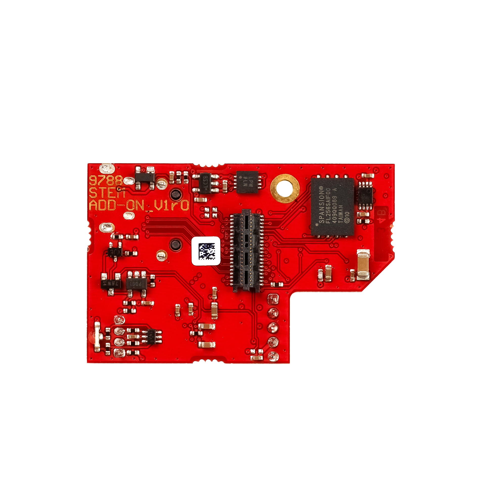

.. _QSPI_eMMC_board:

QSPI eMMC board connection
###########################

The QSPI eMMC module provides secure and robust Red Pitaya boot and shutdown options.

|e3_top| |e3_bottom|

.. |e3_top| image:: img/QSPI_eMMC_module_Gen2_top.png
   :width: 600

.. note::
        
    When the QSPI eMMC board is connected to the Red Pitaya board, Red Pitaya will not boot automatically. Check the `Booting Red Pitaya with QSPI eMMC board`_ chapter for more information.

Features
========

* Single button power on/off of Red Pitaya board.
* QSPI and eMMC boot options.
* On-board STM microcontroller that provides:

    * Red Pitaya power up.
    * Safe Red Pitaya shutdown.
    * Watchdog timer functionality.
    * Boot media selection (SD card/eMMC).

* Arduino (C++) firmware with open source code.
* Connector for 8 high-speed differential pairs directly connected to the Zynq 7020 FPGA (16 GPIOs).

The QSPI eMMC module is powered by the Red Pitaya board, so no additional power supply is needed.

Contents
===========

* 1 QSPI eMMC add-on board,
* 1 M2 screw.

Hardware requirements
======================

The QSPI eMMC module is compatible with the following Red Pitaya board modules:

* :ref:`STEMlab 125-14 PRO Gen 2 <top_125_14_pro_gen2>`.
* :ref:`STEMlab 125-14 PRO Z7020 Gen 2 <top_125_14_pro_z7020_gen2>`.

.. note::

    The high speed differential pairs are only supported on the STEMlab 125-14 PRO Z7020 Gen 2 board model.

Installing the QSPI eMMC board
================================

Here is a quick installation guide for the QSPI eMMC board:

1. Make sure the Red Pitaya board is powered off and disconnected from the power supply.

    .. figure:: img/E3_board_assembly_1.jpeg
        :align: center
        :width: 800

#. Connect the QSPI eMMC board to the Red Pitaya board via the E3 connector.

    .. figure:: img/E3_board_assembly_2.jpeg
        :align: center
        :width: 800

#. Secure the QSPI eMMC board with an M2 screw. Please avoid over-tightening the screw as it may damage the board.

    .. figure:: img/E3_board_assembly_3.jpeg
        :align: center
        :width: 800

.. _QSPI_eMMC_board_boot:

Booting Red Pitaya with QSPI eMMC board
========================================

Once the QSPI eMMC board is connected to the Red Pitaya board, you can power on the Red Pitaya board by pressing the **P-ON** button on the QSPI eMMC board. The Red Pitaya board will boot from the SD card. To boot from the eMMC or QSPI, Linux settings must be configured.

1. Connect the power supply and ethernet cable to the Red Pitaya board. Unlike in normal operation, the Red Pitaya board **will not power on automatically**. You will see the **green power LED** on the Red Pitaya board perform a blink, then turn off.
#. To start the booting process, press and hold the **P-ON** button on the QSPI eMMC board for 1 second. The **green power LED** on the Red Pitaya board will turn on and the boot process will start. The **green status LED** on the QSPI eMMC board will *blink during the boot process* and *turn on when the boot is complete* (1 minute).
#. Once the Red Pitaya board is booted, the QSPI eMMC board will monitor the state of the Watchdog timer of the Red Pitaya board. If Red Pitaya freezes or hangs, the QSPI eMMC board will automatically reboot the Red Pitaya board.
#. To power off the Red Pitaya board, press and hold the **P-ON** button on the QSPI eMMC board for 1 second. The Red Pitaya board will perform a safe shutdown and turn off.
#. If the **P-ON** button is pressed and held for more than 5 seconds, the QSPI eMMC board will immediately power off the Red Pitaya board.

QSPI and eMMC boot options
==========================

The QSPI and eMMC boot options are not enabled by default and must be configured in the Linux settings. We recommend using the OS to transfer the OS from the SD card to the eMMC or QSPI.

To boot the board from the eMMC, please turn on the switch on the QSPI eMMC board.

.. note::

    The QSPI and eMMC do not come with the Red Pitaya OS pre-installed.

Hardware and software specifications
==================================================

For full information on the E3 software including state machine diagram, modes of operation, and source code, please refer to the :ref:`QSPI eMMC board software section <E3_QSPI_eMMC_module_SW>`.

For full information on the E3 hardware specifications and schematics, please refer to the :ref:`QSPI eMMC board hardware section <E3_QSPI_eMMC_module_HW>`.

