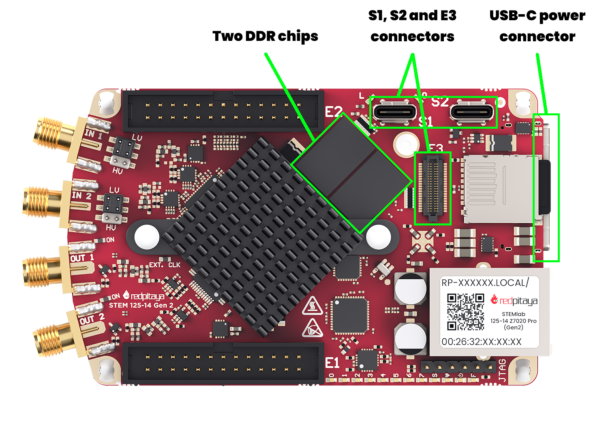
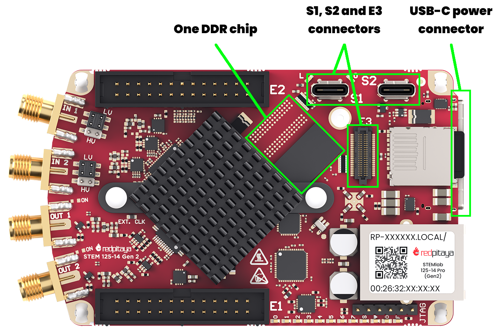
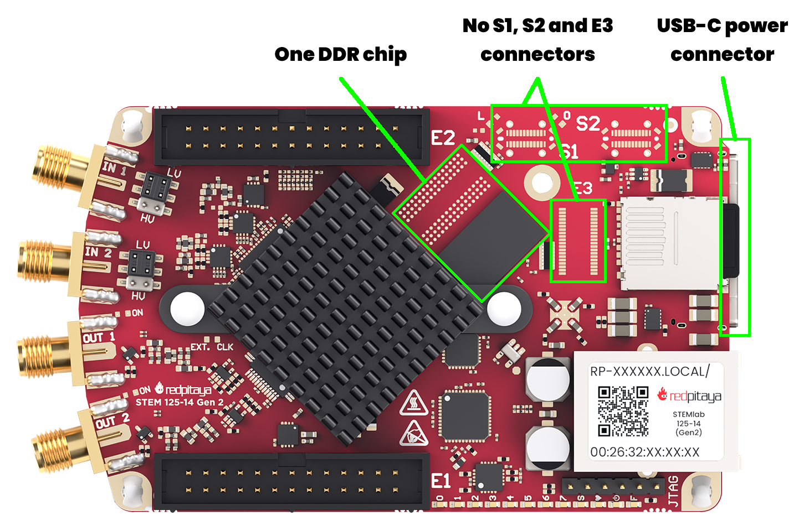
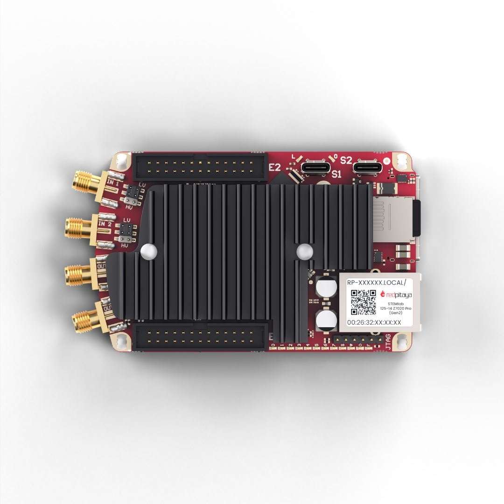
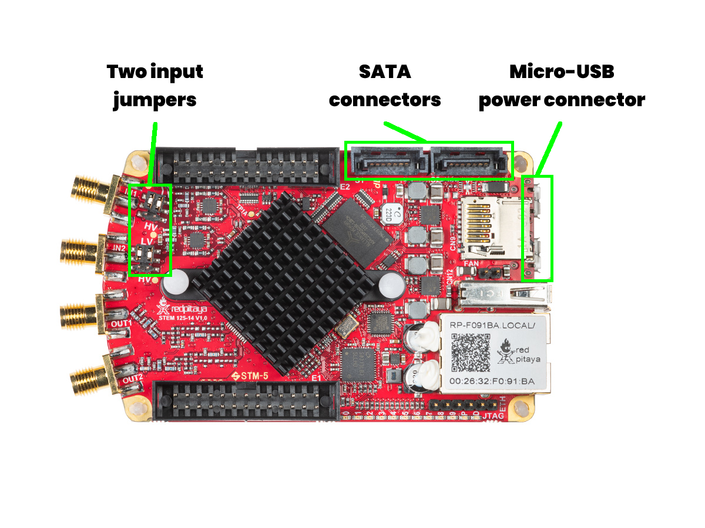
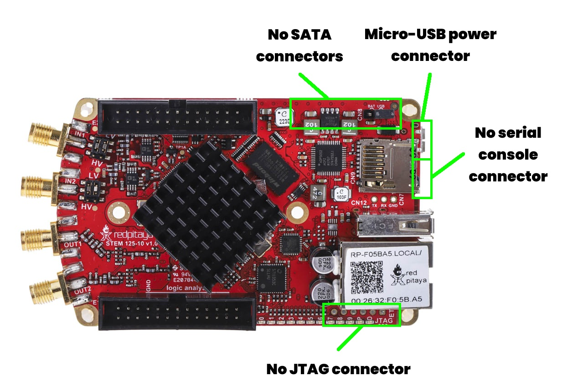
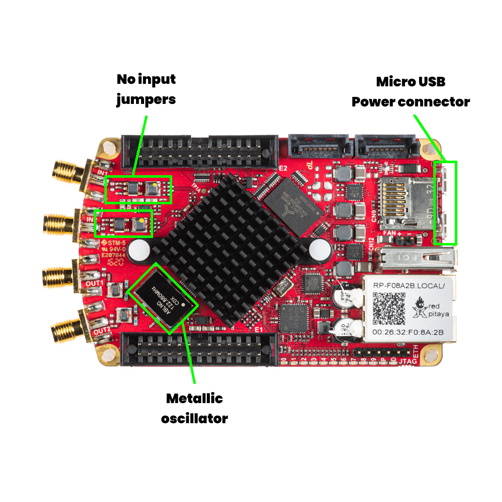
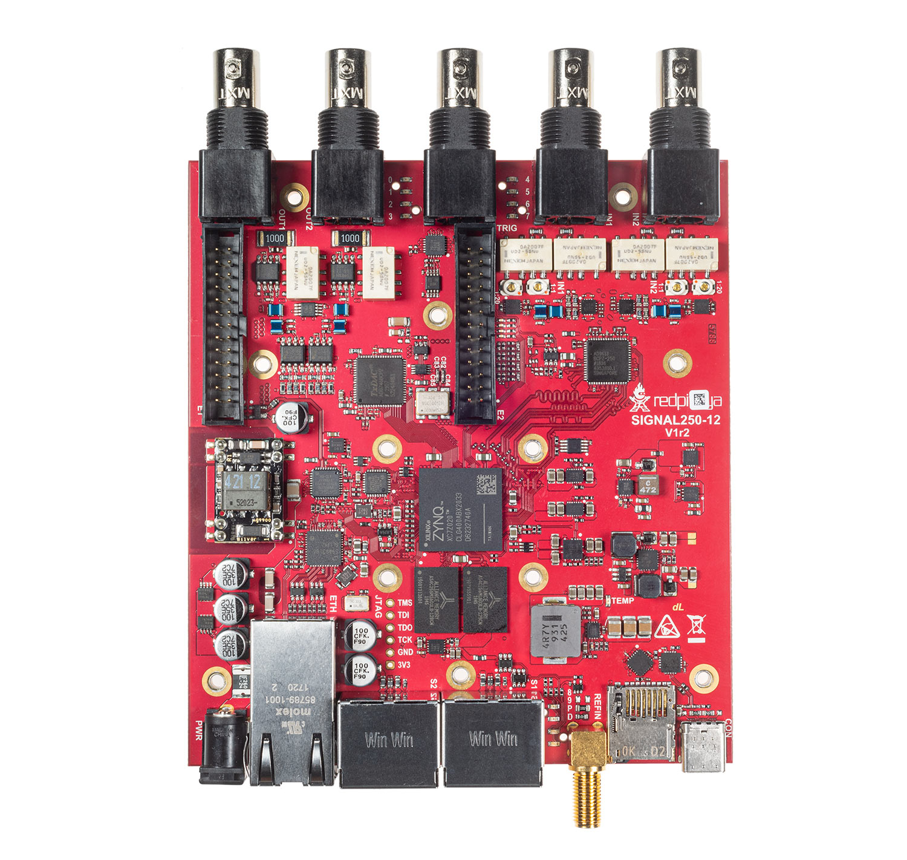

.. _ID_guide:

############################
Identify your board model
############################

This guide will help you identify your Red Pitaya board model. Whether you are a first time user or an experienced developer, knowing your board model is essential for proper setup, configuration, and usage.

.. contents:: Table of Contents
    :local:
    :backlinks: top
    :depth: 2

|

List of Red Pitaya board models
=================================

Red Pitaya offers several board models, each with its own specifications and features. The main board models are categorized into two generations:

**Gen 2 boards** (newer): 

    * STEMlab 125-14 Gen 2
    * STEMlab 125-14 PRO Gen 2
    * STEMlab 125-14 PRO Z7020 Gen 2
    * STEMlab 125-14 TI
    * STEMlab 65-16 TI

**Original Gen boards**: 

    * STEMlab 125-14
    * STEMlab 125-10
    * SDRlab 122-16
    * SIGNALlab 250-12
    * STEMlab 125-14 4-Input

|

How to identify your board model
=================================

Before starting to work with the Red Pitaya board, it's helpful to know which Red Pitaya board you have. The easiest way to identify the board model is by looking at the physical characteristics and labels on the board itself.

1.  **Check the sticker on the Ethernet connector:** Most Red Pitaya boards have a sticker on the Ethernet port with the board model name and MAC address.

    .. figure:: img/Ethernet_sticker.png
        :width: 600
        :align: center

2.  **Look for the model name printed on the board:** The model name is usually printed directly on the PCB near the center or edges of the board. Both top and bottom side of the PCB should be checked.
    While the printed model name may not always match the exact commercial name, it usually contains key identifiers such as "125-14", "250-12", or "65-16", which correspond to different Red Pitaya models.

    .. figure:: img/Board_model_location.png
        :width: 600
        :align: center
        :alt: Board model location

3.  **Visual comparison:** If you're still unsure, you can follow the visual comparison guide below to help identify your board model based on its layout and components.

    The key visual differences between the board models include:
    
        * Power connector type
        * Presence and type of external connectors (e.g., SMA, BNC)
        * Board size
        * Presence and number of jumpers
        * Specific component placements and configurations

    .. figure:: img/Visual_reference_guide.png
        :width: 800
        :align: center

|

Visual identification guide
============================

Some board models are visually similar, so here is a detailed guide to help you distinguish between them. If you are still unsure about your board model after following this guide, please contact Red Pitaya support for assistance.

Gen 2 boards
-----------------

The second generation of Red Pitaya boards features updated hardware and improved performance. They are easily distinguished by the USB-C power connectors. Here are the visual identifiers for each Gen 2 board model.
The main reference model for comparison is the **STEMlab 125-14 PRO Z7020 Gen 2**.

STEMlab 125-14 PRO Z7020 Gen 2
~~~~~~~~~~~~~~~~~~~~~~~~~~~~~~

* USB-C power and console connector
* USB-C S1 and S2 connectors
* E3 connector
* Both DDR chips populated

For hardware documentation, see the :ref:`STEMlab 125-14 PRO Z7020 Gen 2 hardware documentation <top_125_14_pro_z7020_gen2>`.

|

STEMlab 125-14 PRO Gen 2
~~~~~~~~~~~~~~~~~~~~~~~~~~

* USB-C power and console connector
* USB-C S1 and S2 connectors
* E3 connector
* Only one DDR chip present

For hardware documentation, see the :ref:`STEMlab 125-14 PRO Gen 2 hardware documentation <top_125_14_pro_gen2>`.

|

STEMlab 125-14 Gen 2
~~~~~~~~~~~~~~~~~~~~

* USB-C power and console connector
* No USB-C S1 and S2 connectors
* No E3 connector
* Only one DDR chip present

For hardware documentation, see the :ref:`STEMlab 125-14 Gen 2 hardware documentation <top_125_14_gen2>`.

|

STEMlab 125-14 TI
~~~~~~~~~~~~~~~~~~

* Huge heatsink covering most of the board
* USB-C power and console connector
* Almost indistinguishable from STEMlab 65-16 TI board - check the sticker on the Ethernet connector for confirmation

For hardware documentation, see the :ref:`STEMlab 125-14 TI hardware documentation <top_125_14_TI>`.

|

STEMlab 65-16 TI
~~~~~~~~~~~~~~~~~

.. figure:: img/ID_STEMlab_65-16_TI.png
    :width: 800
    :align: center

* Huge heatsink covering most of the board
* USB-C power and console connector
* Almost indistinguishable from STEMlab 125-14 TI board - check the sticker on the Ethernet connector for confirmation

For hardware documentation, see the :ref:`STEMlab 65-16 TI hardware documentation <top_65_16_TI>`.

|

Original Gen boards
---------------------

The original generation of Red Pitaya boards includes several models with varying features. They can be identified by their power connectors and component layouts. 
The main reference model for comparison is the **STEMlab 125-14**.

STEMlab 125-14
~~~~~~~~~~~~~~~

* Micro USB power and console connectors
* USB-A connector
* SATA S1 and S2 connectors
* Two input jumpers

For hardware documentation, see the :ref:`STEMlab 125-14 hardware documentation <top_125_14>`.

STEMlab 125-14 also comes in five different variations, which are extremely hard to differentiate visually:

    1. :ref:`STEMlab 125-14 <top_125_14>` - the standard version
    2. :ref:`STEMlab 125-14 External Clock <top_125_14_EXT>`
    3. :ref:`STEMlab 125-14 Low Noise <top_125_14_LN>`
    4. :ref:`STEMlab 125-14 Z7020 Low Noise <top_125_14_Z7020_LN>`
    5. :ref:`STEMlab 125-14 LN Slave (part of X-channel system) <top_125_14_MULTI>`

We recommend checking the sticker on the Ethernet connector for confirmation of the exact variation. Usually, the boards also include a sticker on the side of E1 connector. 
If you are still unsure, please contact Red Pitaya support for assistance.

|

STEMlab 125-10
~~~~~~~~~~~~~~

* A single Micro USB power connector
* USB-A connector
* No SATA S1 and S2 connectors
* Two input jumpers

For hardware documentation, see the :ref:`STEMlab 125-10 hardware documentation <top_125_10>`.

|

SDRlab 122-16
~~~~~~~~~~~~~~~

* Micro USB power and console connectors
* USB-A connector
* SATA S1 and S2 connectors
* No input jumpers
* Metallic oscillator visible on the top side of the board

For hardware documentation, see the :ref:`SDRlab 122-16 hardware documentation <top_122_16>`.

SDRlab 122-16 comes in two different variations, which are extremely hard to differentiate visually:

    1. :ref:`Standard SDRlab 122-16 <top_122_16>`
    2. :ref:`SDRlab 122-16 External Clock <top_122_16_EXT>`

We recommend checking the sticker on the Ethernet connector for confirmation of the exact variation. If you are still unsure, please contact Red Pitaya support for assistance.

|

STEMlab 125-14 4-Input
~~~~~~~~~~~~~~~~~~~~~~~~

.. figure:: img/ID_STEMlab-125-14-4-Input.png
    :width: 800
    :align: center

* Micro USB power and console connectors
* USB-A connector
* SATA S1 and S2 connectors
* Four input jumpers

For hardware documentation, see the :ref:`STEMlab 125-14 4-Input hardware documentation <top_125_14_4-IN>`.

|

SIGNALlab 250-12
~~~~~~~~~~~~~~~~~

|siglab_open| |siglab_enclosure|

.. |siglab_enclosure| image:: img/ID_SIGNALlab-250-12_full.png
    :width: 800

* Bigger board size
* BNC connectors for inputs/outputs
* Enclosure

For hardware documentation, see the :ref:`SIGNALlab 250-12 hardware documentation <top_250_12>`.

|
