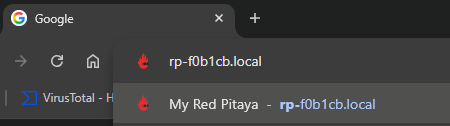

.. _quickstart_connect:

#####################
Connect to Red Pitaya
#####################

This guide will help you connect to your Red Pitaya board and access its web interface in just a few simple steps.

.. contents::
    :local:
    :backlinks: top
    :depth: 2

|

***************************
Identify your board model
***************************

Please refer to the :ref:`Identify your board model guide <ID_guide>` to determine which Red Pitaya board model you have before proceeding with the connection steps.

|

***********************
Connection requirements
***********************

Before connecting your Red Pitaya, make sure you have:

* **SD card** with Red Pitaya OS installed (see :ref:`Prepare SD card guide <prepareSD>`)
* **Ethernet cable**
* **Power supply**:

    * 5V 3A minimum (for Gen 2 boards)
    * 5V 2A minimum (for most Original Gen board models)
    * 24V 0.5A (for SIGNALlab 250-12)

* **Router or network switch** with DHCP enabled (|wiki-dhcp|)
* **Computer** with a web browser (Chrome, Firefox, Safari, or Edge)

.. note::

    **Connection methods:**
    
    Red Pitaya supports multiple connection methods:
    
    * **LAN network connection** (recommended - covered in this guide)
    * Direct Ethernet cable connection (PC to Red Pitaya)
    * Wi-Fi connection
    
    For alternative connection methods, see the :ref:`Network manager tool <network_manager>` chapter.

***********************************
Connection steps (all board models)
***********************************

Follow these five simple steps to connect to your Red Pitaya:

1. **Update the SD card** with the |latestOS|.

#. **Insert the SD card** into your Red Pitaya board.

    .. figure:: img/125_sticker_2.png
        :width: 600
        :align: center

#. **Connect to your network** - Use an Ethernet cable to connect your Red Pitaya to your router (or a network socket connected to the router).

    .. figure:: img/125_router.png
        :width: 600
        :align: center
        
    *Note: For SIGNALlab 250-12, see the image below:*

    .. figure:: img/250_router.png
        :width: 600
        :align: center

#. **Connect the power supply** to your Red Pitaya board.

    .. warning::
    
        **QSPI eMMC board users only:**
        
        If you have a QSPI eMMC board connected, your Red Pitaya will **not** boot automatically. After connecting power, you must press and hold the **P-ON button** on the QSPI eMMC board for 1 second to turn on the Red Pitaya.
        
        Read more in the :ref:`QSPI eMMC board chapter <QSPI_eMMC_board>`.

    **What to expect during boot:**
    
    Watch the LED sequence on your board. It should follow this pattern:
    
    .. raw:: html

        

            <iframe src="https://www.youtube.com/embed/9xZCAkXAkw8" frameborder="0" allowfullscreen style="position: absolute; top: 0; left: 0; width: 100%; height: 100%;"></iframe>
        

    If you see unexpected LED behavior, check the :ref:`troubleshooting section <faq>`.

#. **Open your web browser** and connect to Red Pitaya.

|

*************************************
Find your Red Pitaya's web address
*************************************

There are two ways to access your Red Pitaya:

Method 1: Using the hostname (recommended)
===========================================

Look at the Ethernet connector on your Red Pitaya. You'll see a sticker with a code like **rp-xxxxxx**.

.. figure:: img/Ethernet_sticker.png
    :width: 800
    :align: center

.. note:: 

    Boards with enclosures (like SIGNALlab 250-12) have the sticker on the bottom of the enclosure instead.

Type this address into your web browser's address bar, adding ``.local/`` at the end:

.. code-block:: none

    rp-xxxxxx.local/

Replace ``xxxxxx`` with the six characters from your board's sticker.

    
Example of entering the address in your browser

|

Method 2: Using the IP address
===============================

If the hostname method doesn't work, you can find your Red Pitaya's IP address:

1. Open a terminal (macOS/Linux) or Command Prompt (Windows)
2. Type: ``arp -a`` and press Enter
3. Look for the MAC address that matches the one on your Red Pitaya's sticker
4. Use the corresponding IP address in your browser

Example:

.. code-block:: none

    192.168.1.100

|

***************************
Success! You're connected
***************************

After following the steps above, you should see the Red Pitaya main page in your browser:

.. figure:: img/main_web_interface.png
    :width: 800
    :align: center

    Red Pitaya's main page user interface

**What's next?**

Here's a quick video tutorial on using the Red Pitaya web interface:

.. raw:: html

    

        <iframe src="https://www.youtube.com/embed/I21xyTCiZ-8" frameborder="0" allowfullscreen style="position: absolute; top: 0; left: 0; width: 100%; height: 100%;"></iframe>
    

You can now:

* Explore the built-in applications (Oscilloscope, Signal Generator, Spectrum Analyzer, etc.)
* Check out the :ref:`Applications & Features <appsFeatures>` section for tutorials
* For alternative connection methods (Wi-Fi, direct connection), see the :ref:`Network manager tool <network_manager>` chapter

|

***************
Troubleshooting
***************

If you're having trouble connecting:

**Can't access rp-xxxxxx.local:**

* Verify you're using the correct MAC address from your board's sticker
* Try adding or removing the trailing slash: ``rp-xxxxxx.local/`` vs ``rp-xxxxxx.local``
* Make sure your computer and Red Pitaya are on the same network
* Try Method 2 (IP address) instead

**Red Pitaya doesn't boot (no LED activity):**

* Check the power supply (must be 5V 2A minimum)
* Verify the SD card is properly inserted
* If using QSPI eMMC board, make sure you pressed the P-ON button

**LED pattern looks wrong:**

* Watch the :ref:`LED boot sequence video <quickstart_connect>` above to compare
* The SD card may be corrupted - try re-imaging it

**For more help:**

Check the comprehensive :ref:`troubleshooting guide <faq>` or ask on the |redpitaya-forum|.

If you need to contact support, please provide:

* **Board model** (e.g., STEMlab 125-14 Gen 2, SIGNALlab 250-12)
* **Board variation** (if any): Low Noise, External Clock, etc.
* **OS version** (shown in bottom-right corner of web interface)
* **Detailed description** of the problem
* **Steps you've already tried**

.. substitutions

.. |latestOS| replace:: :ref:`latest version <prepareSD>`

.. _Wikipedia page with more information: https://en.wikipedia.org/wiki/Dynamic_Host_Configuration_Protocol

.. Note: Using global |redpitaya-forum| substitution instead of |forum|

