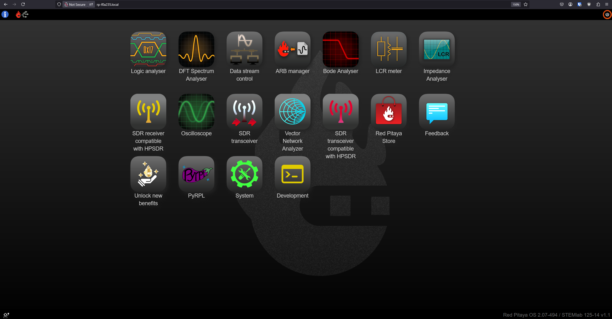

.. _quickstart_connect:

#####################
Connect to Red Pitaya
#####################

Red Pitaya boards use *plug and play* approach. You can connect to the Red Pitaya board in multiple ways:

* **LAN network connection** (recommended),
* **Direct Ethernet cable connection** (PC to Red Pitaya board),
* **Wi-Fi connection**.

We recommend using the LAN network connection as it is the most straightforward and reliable method, which gives you quick access to all Red Pitaya applications using only your web browser.
The other methods of connection are described in the :ref:`Network manager tool <network_manager>` chapter.

.. note::

    **Prerequisites:**
    DHCP must be enabled on your local network. Here is a link to the `Wikipedia page with more information`_.

Follow these five simple steps to start using your Red Pitaya:

.. tabs::

    .. group-tab:: Gen 2

        .. note::
        
            When the QSPI eMMC board is connected to the Red Pitaya board, Red Pitaya will not boot automatically. Check the E3 tab below or the :ref:`QSPI eMMC board booting section <QSPI_eMMC_board_boot>` for more information.

        .. tabs::

            .. tab:: 125-14 Gen 2, 125-14 Pro Gen 2, 125-14 Pro Z7020 Gen 2

                #. Update the Red Pitaya OS on the included SD card to the |latestOS|.
                #. Insert the SD card into your Red Pitaya board.

                    .. figure:: SDcard/img/pitaya-quick-start-insert-sd-card.png
                        :width: 400
                        :align: center

                #. Connect your Red Pitaya board to the router (or an ethernet socket connected to the router).

                    .. figure:: img/125_router.png
                        :width: 400
                        :align: center

                #. Connect the power supply to the Red Pitaya board.
                #. Open your web browser and type ``rp-xxxxxx.local/`` (or Red Pitaya's IP address) into the address bar.

                    .. figure:: img/125_stiker.png
                        :width: 400
                        :align: center

                    .. figure:: img/125_stiker_2.png
                        :width: 400
                        :align: center

            .. tab:: QSPI eMMC board booting

                #. Update the Red Pitaya OS on the included SD card to the |latestOS|.
                #. Insert the SD card into your Red Pitaya board.

                    .. figure:: SDcard/img/pitaya-quick-start-insert-sd-card.png
                        :width: 400
                        :align: center

                #. Connect your Red Pitaya board to the router (or an ethernet socket connected to the router).

                    .. figure:: img/125_router.png
                        :width: 400
                        :align: center

                #. Connect the power supply to the Red Pitaya board.
                #. Press and hold the **P-ON** button on the QSPI eMMC board for 2 seconds to turn on the Red Pitaya board. Read more about the QSPI eMMC board in the :ref:`QSPI eMMC board <QSPI_eMMC_board>` chapter.
                #. Open your web browser and type ``rp-xxxxxx.local/`` (or Red Pitaya's IP address) into the address bar.

                    .. figure:: img/125_stiker.png
                        :width: 400
                        :align: center

                    .. figure:: img/125_stiker_2.png
                        :width: 400
                        :align: center

    .. group-tab:: Gen 1

        .. tabs::

            .. tab:: 125-14, 122-16, 4-Input, 125-10 (discontinued)

                #. Update the Red Pitaya OS on the included SD card to the |latestOS|.
                #. Insert the SD card into your Red Pitaya board.

                    .. figure:: SDcard/img/pitaya-quick-start-insert-sd-card.png
                        :width: 400
                        :align: center

                #. Connect your Red Pitaya board to the router (or an ethernet socket connected to the router).

                    .. figure:: img/125_router.png
                        :width: 400
                        :align: center

                #. Connect the power supply to the Red Pitaya board.
                #. Open your web browser and type ``rp-xxxxxx.local/`` (or Red Pitaya's IP address) into the address bar.

                    .. figure:: img/125_stiker.png
                        :width: 400
                        :align: center

                    .. figure:: img/125_stiker_2.png
                        :width: 400
                        :align: center

            .. tab:: 250-12

                #. Update the Red Pitaya OS on the included SD card to the |latestOS|.
                #. Insert the SD card into your Red Pitaya board.

                    .. figure:: SDcard/img/pitaya-quick-start-insert-sd-card.png
                        :width: 400
                        :align: center

                #. Connect your Red Pitaya board to the router (or an ethernet socket connected to the router).

                    .. figure:: img/250_router.png
                        :width: 400
                        :align: center

                #. Connect the power supply to the Red Pitaya board.
                #. Open your web browser and type ``rp-xxxxxx.local/`` (or Red Pitaya's IP address) into the address bar.

                    .. figure:: img/250_stiker.png
                        :width: 800
                        :align: center

``xxxxxx`` are the last six characters of the MAC address of your Red Pitaya board. The MAC address is written on the Ethernet connector.
Alternatively, you can replace the ``rp-xxxxxx.local`` with Red Pitaya's IP address, which you can get by matching Red Pitaya's MAC address in the APR table (type ``arp -a`` into the terminal/CMD).
        
After the **fifth step**, you will get a Red Pitaya main page, as shown below.

    Red Pitaya's main page user interface.

.. raw:: html

    

        <iframe src="https://www.youtube.com/embed/I21xyTCiZ-8" frameborder="0" allowfullscreen style="position: absolute; top: 0; left: 0; width: 100%; height: 100%;"></iframe>
    

For connecting to the Red Pitaya board through 

.. note::

    For any issues during setup, check :ref:`troubleshooting <faq>` or look on the |forum| for a solution.
    If you cannot find a solution, please write to support@redpitaya.com or post your problem on the forum, providing the following details:

    * **Red Pitaya board model** (STEMlab 125-14, SDRlab 122-16, SIGNALlab 250-12, etc.),
    * Is the board a variation of any board models (Low Noise, External Clock, etc.),
    * **Red Pitaya OS version** (bottom-right corner of the web interface),
    * **Description of the problem** in as much detail as possible,
    * Any other information you think might be relevant to the situation.

.. substitutions

.. |latestOS| replace:: :ref:`latest version <prepareSD>`

.. _Wikipedia page with more information: https://en.wikipedia.org/wiki/Dynamic_Host_Configuration_Protocol

.. |forum| raw:: html

    <a href="https://forum.redpitaya.com/" target="_blank">forum</a>

