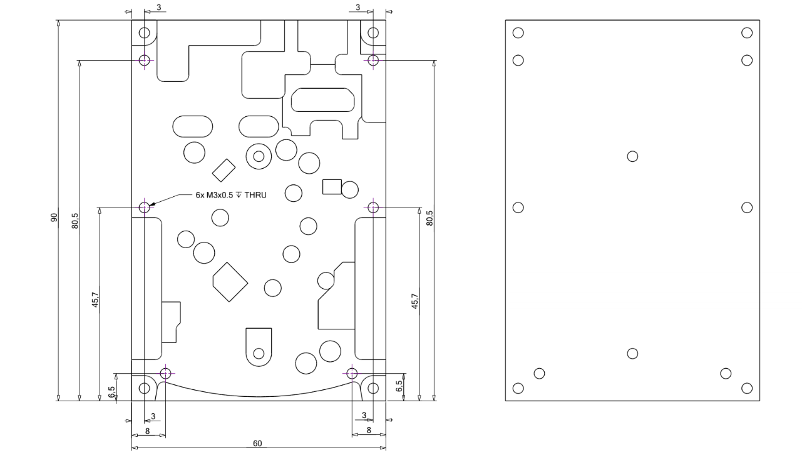

.. _heatsink:

####################################
Red Pitaya heatsink interface setup
####################################

The heatsink interface is CNC machined from aluminium to match the profile of the STEMlab 125-14. It connects to the bottom of the STEMlab 125-14 and has additional holes to connect the interface (attached to the board) to a larger heatsink for even better heat dissipation.

Benefits of the heatsink interface:

    * Better cooling than the standard heatsink on the STEMlab 125-14 (increased :ref:`temperature operating range <board_operation_orig_gen>`),
    * Easy to install,
    * Can be used with any external heatsink.

Compatibility
===================

The heatsink interface is compatible with the following Red Pitaya models:

    * STEMlab 125-14 (also Ext. Clk. and Low-Noise versions),
    * STEMlab 125-10.

.. note::

    Please note that STEMlab 125-14 4-Input is not compatible with the heatsink interface.

Components
============

.. figure:: img/Heatsink_thermal_foam.png
    :align: center
    :width: 600

    Components of the Red Pitaya heatsink interface
    
Table of contents:

    * Heatsink interface,
    * Dark grey thermal pad.

Not included:

    * 4 M3x0.5 screws to fix the STEMlab 125-14 to the heatsink interface,
    * 6 M3x0.5 screws to fix the heatsink interface to the external cooling surface,
    * External heat sink.

Heatsink interface dimensions:

    Dimensioned drawing of heatsink interface

Before the assembly
======================

Before starting the installation, please consider where the Red Pitaya with heatsink interface will be mounted. Depending on your setup, additional preparation may be required. For example, drilling holes in the metallic surface to which the assembly will be attached, or selecting a suitable external heatsink (with appropriate hole patterns).

If you have the Red Pitaya aluminium case, it is possible to attach the top of the aluminium case to the Red Pitaya with the heatsink interface. In this case, the four screws connecting the heatsink interface, the Red Pitaya board and the top of the aluminium case will have to be attached from underneath, so some additional planning may be required. If you decide to do this, please see the alternative instructions at the end.

Assembly instructions
======================

#. Remove the small plastic feet by pressing on the clips at the top with a small pair of pliers and pushing the feet down.
   
    .. figure:: img/rp_heatsink_remove_feet.jpg
        :align: center
        :width: 600
      
        The underside of the Red Pitaya board showing the plastic feet.

#. Repeat the process with the top heat sink, squeezing the clips together at the bottom and gently pushing the bracket upwards.

    .. figure:: img/rp_heatsink_remove_heatsink.jpg
        :align: center
        :width: 600
   
        The top of the Red Pitaya board with the heat sink removed.

#. Remove the rest of the thermal compound.
#. Place the heatsink interface in front of you.

    .. figure:: img/Heatsink_no_foam.png
        :align: center
        :width: 600

#. Use the dark grey thermal pad. This is a special thermal pad with protective film on both sides. Remove the protective film from the side facing the heat sink interface and attach it to the heat sink interface. Take care to remove the film from the correct side as the pad is not symmetrical. The interface should now look like this. The top side of the thermal pad will still have foil attached at this poin

    .. figure:: img/Heatsink_thermal_foam.png
        :align: center
        :width: 600

#. Remove the protective film from the top of the thermal pad.
#. Insert the Red Pitaya board into the heatsink interface, bottom side down. Make sure the holes on the board and the interface are aligned.

    .. figure:: img/Heatsink_stack.png
        :align: center
        :width: 600

    .. note::

        The external heatsink shown in the picture above is not included in the package and is only shown for illustrative purposes. The heatsink interface can be used with any external heatsink that has a flat surface and is the same size or larger than the Red Pitaya board.

    .. figure:: img/Heatsink_side_view2.jpg
        :align: center
        :width: 600

#. Fit the four M3 screws that connect the Red Pitaya to the heatsink interface.
#. Turn the assembly over.

    .. figure:: img/Heatsink_side_view.jpg
        :align: center
        :width: 600

#. Attach the external heatsink and install the six M3 screws that connect the heatsink interface to the external heatsink.

    .. figure:: img/Heatsink_bottom_view.jpg
        :align: center
        :width: 600
        
        Example of connection of Red Pitaya with heatsink interface to an external heatsink.

    .. note::

        Since the size and shape of an external heatsink may vary from application to application, the external heatsink is not supplied with the heatsink interface.
        Any external heat sink the size of Red Pitaya or larger can be used. The heatsink should have a flat surface on the side that will be in contact with the heatsink interface.
        
        The heatsink interface can also be mounted directly on the case of the device in which the Red Pitaya is installed. In this case, the heatsink interface can be secured to the case using screws or thermal adhesive.

.. warning::

    The heatsink interface provides better cooling than the standard heatsink on the STEMlab 125-14. During the installation process of the heatsink interface, the heatsink on the top of Red Pitaya is removed and replaced with the heatsink interface.
    Please do not power up the board without either the default heatsink or the heatsink interface attached, as this may cause excessive heating which will prevent the board from functioning properly.
