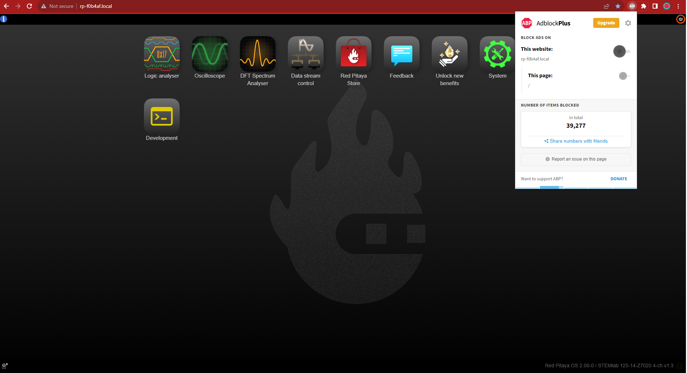

.. _faq:

######
FAQ
######

.. note::

   Not found what you are looking for? Please |contact_page| or :ref:`report a bug <report_bug>`. Please include all the relevant information regarding the problem.
   For easier debugging on OS versions 2.00 and above, please also include the :ref:`Downloaded system report <system_info>` in the bottom left corner of your Red Pitaya main webpage.

.. |contact_page| raw:: html

   <a href="https://redpitaya.com/contact-us/" target="_blank">contact us</a>

Connectivity
==============

How to get started with Red Pitaya?
------------------------------------

*   :ref:`Quick start <quick_start>`

How to connect to Red Pitaya in a few simple steps?
----------------------------------------------------

*   :ref:`Connected to router <LAN>`
*   :ref:`Direct connection to computer <dir_cab_connect>`

Red Pitaya not booting anymore?
---------------------------------

*   A possible cause could be a corrupted card, and the recommendation is a manual OS re-write: :ref:`Prepare SD card <prepareSD>`
*   Please check :ref:`Problems connecting to RP <troubleshooting>` for status LED description.
*   :ref:`Was the OS updated recently? <trouble_OS>`

.. _rebooting:

Red Pitaya is constantly rebooting?
------------------------------------

* A board reset during boot-up is indicated by the green and blue LEDs lighting up, followed by the orange and red LEDs pausing their blinking to remain ON for about 2 seconds, then the cycle repeats. Repeated board resets suggest an **external clock signal is missing** (not connected) on the **external clock board** variations. 

How to connect the external clock to RP?
------------------------------------------

*   :ref:`STEMlab 125-14 & STEMlab 125-14-Z7020 <top_125_14_EXT>`
*   :ref:`SDRlab 122-16 <top_122_16_EXT>`

.. _internetAccess:

How can I make sure that my Red Pitaya has access to the internet?
--------------------------------------------------------------------

1. Connect to your Red Pitaya over :ref:`SSH <ssh>`.
2. Make sure that you can ``ping google.com`` website:

   .. code-block:: shell-session

      root@rp-f03dee:~# ping -c 4 google.com
      PING google.com (216.58.212.142) 56(84) bytes of data.
      64 bytes from ams15s21-in-f142.1e100.net (216.58.212.142): icmp_seq=1 ttl=57 time=27.3 ms
      64 bytes from ams15s21-in-f142.1e100.net (216.58.212.142): icmp_seq=2 ttl=57 time=27.1 ms
      64 bytes from ams15s21-in-f142.1e100.net (216.58.212.142): icmp_seq=3 ttl=57 time=27.1 ms
      64 bytes from ams15s21-in-f142.1e100.net (216.58.212.142): icmp_seq=4 ttl=57 time=27.1 ms

      --- google.com ping statistics ---
      4 packets transmitted, 4 received, 0% packet loss, time 3004ms
      rtt min/avg/max/mdev = 27.140/27.212/27.329/0.136 ms
 
 
.. _faqConnected:

How can I make sure that Red Pitaya is connected to the same network as my computer/tablet/smartphone?
--------------------------------------------------------------------------------------------------------

The most common answer would be: just make sure that your Red Pitaya and your PC/tablet/smartphone are both connected to the same router or your smartphone hotspot.

In order to test it, you can use a PC that is connected to the same local network as your Red Pitaya and try the following:

1. Open the terminal window.

   *   **Windows**: Go to RUN, type in ``cmd`` and press enter.
   *   **Linux**: Click on the application button, type in ``Terminal`` and press enter.
   *   **macOS**: Hit **cmd + space**, type in ``Terminal`` and press enter.

2. Enter the ``arp -a`` command to get a list of all devices in your local area network
   and try to find your Red Pitaya MAC address on the list.

   .. code-block:: shell-session

      $ arp -a
      ? (192.168.178.117) at 00:08:aa:bb:cc:dd [ether] on eth0
      ? (192.168.178.118) at 00:26:32:f0:3d:ee [ether] on eth0
      ? (192.168.178.105) at e8:01:23:45:67:8a [ether] on eth0

   .. note::

      If you have a cable connection, then your MAC address
      is written on your Red Pitaya LAN connector.

   .. figure:: img/MAC.png
      :align: center

.. note:: 

   If you have established a wireless connection, then you should check the MAC address of your wireless USB dongle. The MAC addresses are typically written on the USB dongles. 

3. Type your Red Pitaya IP into your WEB browser and connect to it.

   .. figure:: img/Browser_IP.png
      :align: center

If your Red Pitaya is not listed on the list of your local network devices on the local network, then it is necessary to check that your Red Pitaya is connected to your local network.

.. _isConnected:

Is Red Pitaya connected to my local network?
----------------------------------------------

1. Connect your Red Pitaya to a PC over a :ref:`Serial Console <console>`.

2. Type “ip a” and hit enter to check the status of your ethernet connection on Red Pitaya.

   a) If you have connected to your Red Pitaya over a wireless connection, you should check the status of the ``wlan0`` interface.

   b) If you have connected to your Red Pitaya over a cable connection, you should check the ``eth0`` interface.

3. Type Red Pitaya IP into your web browser to see if you can connect to it.

   .. figure:: img/Browser_IP.png
      :align: center

.. _troubleshooting:

Problems connecting to RP?
----------------------------

.. figure:: img/blinking-pitaya-eth.gif
   :align: center

Red Pitaya status LED description:

- **Green LED** - power good
- **Blue LED** - FPGA image loaded and OS booted
- **Red LED** - CPU heartbeat
- **Orange LED** - SD card access

#. First, check the LEDs:

   a. If the **green LED** is **OFF** or is **blinking**. It seems like something is wrong with the power supply, or maybe it's the USB cable. Make sure that:

       1. you have plugged the USB cable into the correct USB connector on the Red Pitaya
       2. your power supply is capable of 5 V/2 A (or 12 V/1 A for SIGNALlab 250-12)
       3. try to replace the USB cable and also the USB power supply

   #. If the **green LED** is turned **ON** but the **blue LED** is turned **OFF**. In this case, there is an error while loading the Red Pitaya system from the SD card. Make sure that:

       - you have correctly inserted the Red Pitaya SD card and the Red Pitaya OS has been installed (Notice that Red Pitayas already comes with a pre-installed OS on SD cards. Anyhow, SD cards might get corrupted - in such case follow these instruction on how to :ref:`Prepare SD card <prepareSD>` to properly re-install Red Pitaya OS to SD card)
       - try to use another SD card
       - try connecting via a :ref:`serial console <console>` and check the boot sequence
       - if you have **Pavel Demin's Alpine Linux OS** image installed, this may indicate normal behaviour. The status LEDs are normally turned OFF, check the |red_pitaya_notes| for more information.

   #. If both the **green** and **blue** LEDs are **ON**, but the red and orange LEDs stop blinking a few seconds after the boot, only to remain ON for about 2 seconds, and then the cycle repeats. This indicates that the **Red Pitaya is in a reboot cycle**. Notice that the red and orange LEDs always start blinking approx 10 seconds after the green and blue LEDs are turned ON.

       - Check your Red Pitaya board model. If you are using an external clock version, check whether the external clock signal is properly connected to the :ref:`E2 <E2>` connector.

#. If the status LEDs are working normally, the Red Pitaya is properly booted. If you are unable to connect to it, this is most likely a networking issue:

    - Make sure your Red Pitaya and computer are both connected to the same :ref:`local network <faqConnected>`.
    - Consult the :ref:`connection guide <connection>` for advice.
    - Try using the recommended Google Chrome browser.
    - Disable any adblockers for the "rp-xxxxxx.local" website.
    - Try disabling the VPN, because it may be preventing the connection.
    - Type "arp -a" into the Comand Prompt or Terminal and look for Red Pitaya's IP. Then try using the IP instead of "rp-xxxxxx.local" in the browser's URL window.
    - If you are a Windows user, please look at the note below.

   .. note::

      **Windows 7/8** users should install `Bonjour Print Services <https://downloads.redpitaya.com/tools/BonjourPSSetup.exe>`_, otherwise access to ``*.local`` addresses will not work.

   **Windows 10 or higher** already supports mDNS and DNS-SD, so there is no need to install additional software.

|

#. **Advanced troubleshooting:**

    - If you are a Linux or macOS user and the Red Pitaya is directly connected to the computer (with the ethernet cable), check the ethernet connector settings if they are set to **DHCP** and **Local Only**. Alternatively, try connecting to the Red Pitaya through the router.
    - If you updated form 1.04 to 2.00 OS version, check GitHub issues |#250| and |#254|.
    - Try connecting via the :ref:`serial console <console>`. Check the boot log and see whether you can access the on-board Linux Terminal.
    - Check the :ref:`Nightly Builds Changelog <nightly_builds>` for any relevant updates.

#. Extremely rare cases:

    - If the board is operating normally, but the **blue LED** is **OFF**, check if the LED is damaged. If the board is in warranty, we will replace it.
    - Check whether any of the SD card holder pins are bent upwards and do not have contact with the SD card pins. Take out the SD card and push them into the normal position.

.. |red_pitaya_notes| raw:: html

   <a href="https://github.com/pavel-demin/red-pitaya-notes" target="_blank">Pavel Demin's Red Pitaya Notes</a>

.. |#250| raw:: html

   <a href="https://github.com/RedPitaya/RedPitaya/issues/250" target="_blank">#250</a>

.. |#254| raw:: html

   <a href="https://github.com/RedPitaya/RedPitaya/issues/254" target="_blank">#254</a>

How to find the Red Pitaya URL if it is not written on the sticker?
---------------------------------------------------------------------

The Red Pitaya URL is ``rp-xxxxxx.local`` where ``xxxxxx`` must be replaced with the last 6 digits of the MAC address that is written on the sticker.

If the RP MAC address is ``00:26:33:F1:13:D5``, the last 6 digits are ``F113D5`` and the URL is ``rp-f113d5.local``.

.. figure:: img/ethernet_MAC.png
   :align: center

Slow Wi-Fi connection?
-----------------------

If your wireless connection with Red Pitaya works very slowly and all the applications seem very unresponsive and not running smoothly, please check the following:

*   Check the Wi-Fi signal strength on your PC/tablet/smartphone.
*   Check the Wi-Fi signal strength of your Red Pitaya.

   1. Connect to your Red Pitaya via an :ref:`SSH <ssh>` connection.

   #. Enter the ``cat /proc/net/wireless`` command to get information about link quality and signal strength.

      .. figure:: img/cat_wireless.png
         :align: center

      Link quality measures the number of packet errors that occur. The lower the number of packet errors, the higher this will be. Link quality goes from 0-100%.

      Level, or signal strength, is a simple measure of the amplitude of the signal that is received. The closer you are to the access point, the higher this will be.

*   If you are in an area with many routers around you, more of them might operate on the same Wi-Fi channel, which drastically decreases data throughput and slows down connection. Here are the instructions on how to |Wifi channel|. For MAC users, we recommend using the Scan feature of the |Wireless Diagnostic Tool| in order to find the best Wi-Fi channel.

.. note::
    
    For full performance, a wired connection is preferred.

.. |Wifi channel| raw:: html

   <a href="http://www.howtogeek.com/howto/21132/change-your-wi-fi-router-channel-to-optimize-your-wireless-signal/" target="_blank">change your wifi router channel in order to optimize your wireless signal</a>

.. |Wireless Diagnostic Tool| raw:: html

   <a href="http://www.howtogeek.com/211034/troubleshoot-and-analyze-your-mac%E2%80%99s-wi-fi-with-the-wireless-diagnostics-tool/" target="_blank">Wireless Diagnostic Tool</a>

Wi-Fi dongle not detected?
---------------------------

Please note that not all are compatible. A list is in the documentation: :ref:`Supported USB Wi-Fi adapters <support_wifi_adapter>`

.. _trouble_OS:

OS
=====

How to upgrade OS?
--------------------

*   :ref:`Prepare SD card <prepareSD>`

Is Red Pitaya not booting even after OS update?
-------------------------------------------------

*    Please use the Balena Etcher application to rewrite the OS manually. The latest Windows update has been reported to have broken the Win32 disc imager. :ref:`Prepare SD card <prepareSD>`
*    **Upgraded from an older Red Pitaya OS to the 2.00 Unified OS?** Please try |GitHub_250| and |GitHub_254|

.. |GitHub_250| raw:: html

   <a href="https://github.com/RedPitaya/RedPitaya/issues/250" target="_blank">GitHub issue #250</a>

.. |GitHub_254| raw:: html

   <a href="https://github.com/RedPitaya/RedPitaya/issues/255" target="_blank">GitHub issue #254</a>

Is Red Pitaya failing to update?
----------------------------------

Please use the Balena Etcher application to rewrite the OS manually. The latest Windows update has been reported to have broken the Win32 disc imager. :ref:`Prepare SD card <prepareSD>`

Applications & Web Interface
===============================

How can I start using RP measurement applications?
----------------------------------------------------

*   :ref:`Connect to Red Pitaya <ConnectSTEMlab>`

My device shows the wrong measurements. How can I calibrate it?
-----------------------------------------------------------------

The Red Pitaya can be calibrated using the :ref:`Calibration Tool <calibration_app>`

Problems with OS update application, and accessing the marketplace?
---------------------------------------------------------------------

1. Make sure your Red Pitaya has access to the :ref:`internet <internetAccess>`.
#. Force a refresh of the Red Pitaya application page. |Wiki refresh|?
   
.. |Wiki refresh| raw:: html

   <a href="http://www.wikihow.com/Force-Refresh-in-Your-Internet-Browser" target="_blank">How</a>

Web interface not functioning properly, or experimenting with freezing?
-------------------------------------------------------------------------

Please ensure that your browser's ad blockers are turned off for the "rp-xxxxxx.local" webpage and that your proxy settings are correct. For local connections to the Red Pitaya unit, proxy settings should not be required. A VPN may also be preventing the connection.

Undesired disconnections?
---------------------------

If possible, we recommend testing the setup on a different computer and a different network, as well as, checking the state of the Ethernet cables and power supply, proxy settings, and re-writing the OS.

An application is not working?
---------------------------------

We suggest upgrading to the latest OS and trying again. Otherwise, please :ref:`report the bug <report_bug>`.

.. note::

   It is important to note that applications developed by the Red Pitaya community are not distributed or tested by the Red Pitaya team and that our team accepts no responsibility. If you’d like to share feedback, report bugs, or need help on contributed projects, apps, or software, we highly recommend contacting the project authors.

.. note::

   The 2.00 Unified OS update has seen registry changes in the FPGA, so, likely, older applications will not work after the OS update (Xilinx also changed how the FPGA is loaded into the FPGA).

Software
===========

For establishing an SSH connection, creating a custom FPGA image, custom ecosystem, and/or custom web applications, please refer to :ref:`Developers guide Software <software>`.

How can I acquire data with Red Pitaya?
------------------------------------------------

There are multiple approaches to acquiring data with Red Pitaya. Here is a quick description of each possiblity:

   - **Oscilloscope application** – The data is acquired at full speed, but all the limitations of a standard oscilloscope apply (currently, the data can only be extracted upon user request via the application. Remote data collection is currently impossible). More info :ref:`here <osc_app>`.
   - **SCPI data acquisition (Python, MATLAB, LabVIEW)** – Triggered data acquisition. The data is acquired in 16384 sample-long buffers. The code is executed on a computer, and string commands are sent to the Red Pitaya via |socket communication|. Data is acquired on the Red Pitaya and then sent back as a string that can be converted to a floating-point format. Trigger can be set to either IN1, IN2, or External (also IN3 and IN4 for STEMlab 125-14 4-Input). Trigger level can be specified. The acquisition must be restarted before a new “data buffer” can be acquired. There is a dead time between capturing two consecutive buffers where data is not saved. More details :ref:`here <scpi_commands>`.
   - **API commands (C, Python)** – Functions exactly the same as SCPI data acquisition, but it is faster since everything is running on the Red Pitaya board itself (the code is executed on the board). More info :ref:`here <API_commands>`.
   - **Streaming application** – Continuous data acquisition. The data is streamed from one or both inputs directly to a file on a computer. The data can be acquired indefinitely, but there are speed limitations. 
The total data flow at the inputs (IN1 and IN2) must not exceed 20 MB/s when streaming directly to a computer or 10 MB/s when streaming to the SD card. More details on the limitations are available :ref:`here <streaming_top>`.
   - **Deep Memory (AXI mode)** *(OS 2.00-23 and higher)* – Long sequence triggered data acquisition. The data can be acquired at different speeds (up to 125 MHz), and it is saved directly into the DDR RAM. The buffer length can be specified by the user but must not exceed 256 MB for both channels. After the acquisition is complete, Red Pitaya needs some time to transfer the whole file to the computer (the RAM must be emptied) before the acquisition can be reset. Functions exactly the same as **API commands**. More details are available :ref:`here <deepMemoryAcq>`.
   -	**Custom Acquisition (FPGA)** – Red Pitaya is open-source so any mode above can be customized by the user to tune it to their specific application.

.. |socket communication| raw:: html

   <a href="https://en.wikipedia.org/wiki/Network_socket" target="_blank">socket communication</a>

How can I generate data with Red Pitaya?
------------------------------------------------

Here are all possible generation options on the Red Pitaya (please be aware of AC coupling limitations on SDRlab 122-16):

   - **Oscilloscope application** - basic waveform generation. More info :ref:`here <osc_app>`.
   - **SCPI commands (Python, MATLAB, LabVIEW)**, remote control from computer - can generate basic waveforms as well as custom/arbitrary waveforms (defined in a 16384 sample-long buffer which represents one period of the signal - the frequency is calculated for the whole buffer). More details :ref:`here <scpi_commands>`.
   - **API commands (C, Python)**, on-board program - same functionality as standard SCPI commands, but generally faster and includes the benefit of possible direct communication with the FPGA. More info :ref:`here <API_commands>`.
   - **Custom/user-defined (FPGA reprogramming)** - Red Pitaya is open-source, so anyone has the option of reprogramming the FPGA image to customise the functionality.

How to control Red Pitaya remotely using LabVIEW, MATLAB, and Python?
-----------------------------------------------------------------------

*  :ref:`Remote control <scpi_commands>`

Where can I find the ecosystem, software, and FPGA images?
------------------------------------------------------------

*   |RP_GitHub| - please check the specific branches for older ecosystem versions
*   |RP_GitHub_FPGA|
*   |RP_archive| - software archive

.. note::

   *Impossible. Perhaps the archives are incomplete.*

   If you need a specific old version of the ecosystem or the OS that is missing from the archives, we suggest you ask the community on the |RP_forum|. There is a chance someone has it lying around on the disk.

.. |RP_GitHub| raw:: html

   <a href="https://github.com/RedPitaya/RedPitaya" target="_blank">Red Pitaya ecosystem</a>

.. |RP_GitHub_FPGA| raw:: html

   <a href="https://github.com/RedPitaya/RedPitaya-FPGA" target="_blank">Red Pitaya FPGA</a>

.. |RP_archive| raw:: html

   <a href="https://downloads.redpitaya.com/downloads/" target="_blank">Red Pitaya archive</a>

.. |RP_forum| raw:: html

   <a href="https://forum.redpitaya.com/" target="_blank">Red Pitaya Forum</a>

How to start with FPGA development?
-------------------------------------

*   :ref:`Software <software>`
*   :ref:`FPGA tutorials <knowledgebase:learn_FPGA>`

Hardware
===========

For hardware schematics, step models, and specifications, please refer to :ref:`Developers guide Hardware <dev_guide_hardware>`.

Where can I find Red Pitaya schematics, 3D models (.step), and important componetns?
--------------------------------------------------------------------------------------

Please take a look at **Developers guide Hardware => board model => Schematics, Mechanical Specifications and 3D Models**. See the general link above, or board-specific links below.

*   :ref:`STEMlab 125-10 <top_125_10>`
*   :ref:`STEMlab 125-14 <top_125_14>`
*   :ref:`SDRlab 122-16 <top_122_16>`
*   :ref:`SIGNALlab 250-12 <top_250_12>`

Is there a hardware difference between the STEMlab125-14 and the ISO17025 versions?
--------------------------------------------------------------------------------------

No, the hardware is identical. The only difference is that the latter would have been sent to a certification lab and the appropriate measurements would have been made.

What are the main differences between different Red Pitaya boards?
---------------------------------------------------------------------

Take a look at the :ref:`board comparison table <rp-board-comp>`.

.. _report_bug:

How to report a bug?
======================

Please send us an e-mail at support@redpitaya.com with the following information:

*   The model of Red Pitaya used,
*   Version of Red Pitaya OS,
*   Information about the bug,
*   Clear instructions about how to reproduce it.
