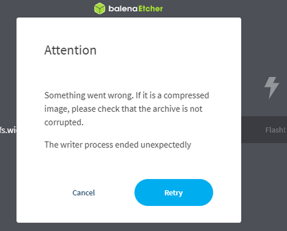

.. _faq:

######
FAQ
######

.. note::

    Not found what you are looking for? Please :ref:`contact us <report_problem>`. Please include all the relevant information regarding the problem.
    For easier debugging on OS versions 2.00 and above, please also include the :ref:`Downloaded system report <system_info>` in the bottom left corner of your Red Pitaya main webpage.

.. tip::

    **Application showing errors?** Check the :ref:`Application-specific troubleshooting <app_troubleshooting_section>` section below for links to dedicated troubleshooting guides for specific applications.

|

General troubleshooting
========================

Here is a comprehensive guide to troubleshooting common problems with Red Pitaya. If you are experiencing problems with your Red Pitaya, please refer to the following sections:

**Quick Start & Basic Issues:**

    * :ref:`Connectivity <faq_connectivity>` - Network, web interface access, Wi-Fi issues
    * :ref:`OS <faq_os>` - OS update, boot, and installation problems
    * :ref:`Applications & Web Interface <faq_apis_interface>` - Application errors and web interface issues
    * :ref:`How to report a problem? <report_problem>` - Contact support with proper information

**Hardware & Software Development:**

    * :ref:`Hardware <faq_hw>` - Board specifications, schematics, and hardware questions
    * :ref:`Software <faq_sw>` - FPGA development, remote control, and Python packages
    * :ref:`Software troubleshooting <sw_troubleshooting>` - Known software issues and OS compatibility
    * :ref:`Known hardware issues (Original Gen) <known_hw_issues_orig_gen>` - Hardware bugs and workarounds
    * :ref:`Known hardware issues (Gen 2) <known_hw_issues_gen2>` - Gen 2 specific hardware issues

**Advanced Features:**

    * :ref:`SCPI & API known issues <commands_known_issues>` - Remote control command changes by OS version
    * :ref:`Multiboard synchronisation FAQ <faq_multiboard>` - X-channel system and Click Shield questions
    * :ref:`Gen 2 FAQ <faq_gen2>` - Gen 2 board specific questions

|

.. _app_troubleshooting_section:

Application-specific troubleshooting
======================================

Some applications have their own dedicated troubleshooting sections:

* **Streaming application** - See :ref:`data streaming limitations <streaming_limits>` for performance issues and maximum data rates
* **Playback & Record application** - See the dedicated Troubleshooting section in :ref:`Playback & Record documentation <playback&record>` for trigger errors and buffer configuration

|

.. _troubleshooting:

Troubleshooting procedure
==========================

If you are experiencing problems with the Red Pitaya, please follow the steps below to troubleshoot the problem:

#. **Update the OS/firmware to the latest version**
#. **Check the status LEDs on the Red Pitaya board**
#. **Check the network connection**
#. **Check hardware connections**
#. **Check the serial console boot log**
#. **Advanced troubleshooting steps**
#. **Extremely rare cases**

If you are unable to solve the problem, please :ref:`contact us <report_problem>`.

1. Update the OS/firmware to the latest version
-----------------------------------------------

A lot of problems can be solved by updating the OS/firmware to the latest version. Please refer to the :ref:`OS update instructions <os_update>`.

2. Check the status LEDs
-------------------------

.. figure:: img/blinking-pitaya-eth.gif
    :align: center
    :width: 600

Red Pitaya Status LED Description:

    * **Green LED** - Power good.
    * **Blue LED** - FPGA image loaded and OS booted.
    * **Red LED** - CPU heartbeat.
    * **Orange LED** - SD card access.

Firstly, you should check the status LEDs as they will give you feedback on the type of error you are experiencing.

#. If the **green LED** is **OFF** or **blinking**. There appears to be something wrong with the power supply or USB cable. Make sure that:

    * You have plugged the power cable into the correct USB port on the Red Pitaya.
    * Your power supply is capable of delivering 5 V/2 A (12 V/1 A for SIGNALlab 250-12 or 5 V/3 A for Gen 2 boards). Please note that computer USB ports typically provide only 0.5 A, which is not enough to power the Red Pitaya board.
    * Try replacing the power cable and the USB power supply.
        
    If none of the above helps, please :ref:`contact us <report_problem>`.

#. If the **green LED** is turned **ON** but the **blue LED** is turned **OFF** and the **orange LED** is **barely lit**. In this case, there is an error loading the Red Pitaya file system from the SD card. Make sure that:

    * You have connected the power cable to the correct USB port on the Red Pitaya.
    * You have inserted the Red Pitaya SD card correctly and the Red Pitaya OS is installed (Note that Red Pitaya boards come with a pre-installed OS on SD cards. However, SD cards can become corrupted - in this case follow these instructions to :ref:`Prepare SD card <prepareSD>` to properly reinstall the Red Pitaya OS on the SD card).
    * If you have recently upgraded your OS and Red Pitaya was working and now it is not, this is probably due to an incorrect ``hw_rev`` number in the EEPROM. Please see this GitHub issue |#250|.
      The RMA terms in the GitHub issue will be offered to anyone with this issue, regardless of warranty.
    * Use a different SD card.
    * Connect via the :ref:`serial console <console>` and check the boot sequence for feedback:
            
        1. Red Pitaya should print information about the boot sequence.
        #. Check that the Zynq SoC (U-Boot) is booting (message *Autoboot will start in 3...2...1... (Hit any key to stop)*).
        #. Check that the Linux kernel boot sequence shows no :ref:`signs of looping <faq_rebooting>`. If you detect looping, please check if you have an *External Clock* board and the external clock is connected and has the correct specifications.
        #. If the kernel boot reaches the Linux welcome message, then the Red Pitaya is fine. Check that the **blue LED** is not damaged.

        If the serial console gives no feedback during the boot sequence, please :ref:`contact us <report_problem>`.

    * If you have **Pavel Demin's Alpine Linux OS** image installed, this may indicate normal behaviour. The status LEDs are normally off, see the |red_pitaya_notes| for more information.

#.  If both the **Green** and **Blue** LEDs are **ON**, but the **Red** and **Orange** LEDs stop flashing a few seconds after booting, only to remain ON for about 2 seconds, and then the cycle repeats.
    This indicates that the **Red Pitaya is in a reboot cycle**. Note that the red and orange LEDs will always start flashing approximately 10 seconds after the green and blue LEDs are turned ON.

    * Check your Red Pitaya board model. If you are using an *External Clock* version, check that the external clock signal is correctly connected to the :ref:`E2 <E2_orig_gen>` connector. Make sure that the clock specifications match the recommended ones:

        * :ref:`STEMlab 125-14 External Clock <top_125_14_EXT>`.
        * :ref:`SDRlab 122-16 External Clock <top_122_16_EXT>`.

3. Check the network connection
--------------------------------

If the status LEDs are working normally, then the Red Pitaya is booting correctly. The next most common problem is a network connection issue, where the Red Pitaya board is working fine, but a network issue is preventing you from accessing it or is disrupting the connection. Please check the following:

1. Make sure your Red Pitaya and computer are both connected to the same :ref:`local network <faq_connected>`. Especially, if you have a complex network with multiple routers, switches, or access points.
#. Consult the :ref:`connection guide <quickstart_connect>` for advice.
#. Try using the recommended up-to-date Google Chrome browser.
#. Disable any adblockers for the ``rp-xxxxxx.local`` website.
#. Disable the VPN as it may be preventing the connection.
#. Type ``arp -a`` in a command prompt or terminal and look for Red Pitaya's IP. Then try using the IP instead of ``rp-xxxxxx.local`` in the URL window of the browser.
#. Check that DHCP is enabled on your router.
#. Connect the board to a router instead of directly to the computer and retry the steps above.
#. Try connecting to the board from a different computer and router. Some networks may have security restrictions that prevent you from connecting (for example, university networks require all devices to connect through a special web page to confirm a person's identity).
#. Check the Ethernet cable and socket for damage (check if you can connect to the internet/access the local web from the same cable and socket).
#. If you are a Windows user, please see the note below.

    .. note::

        * **Windows 7/8** users should install :rp-download:`Bonjour Print Services <tools/BonjourPSSetup.exe>`, otherwise access to ``*.local`` addresses will not work.
        * **Windows 10 or higher** already supports mDNS and DNS-SD, so there is no need to install any additional software.

#. If you are a Linux or MacOS user and the Red Pitaya is connected directly to the computer (via the Ethernet cable), check the Ethernet port IPv4 and IPv6 settings to see if they are set to **DHCP** and **Local Only**. Alternatively, connect to the Red Pitaya via a router.
#. If a MAC computer will not connect to the Red Pitaya, it is possible that **Content and privacy settings** are blocking websockets.  After updating the settings you will need to log out and log in again.

    .. figure:: img/MAC_content_privacy.png
        :width: 800

    .. figure:: img/MAC_content_privacy2.png
        :width: 600

    It may be necessary to completely disable content and privacy settings.

    .. figure:: img/MAC_content_privacy3.png
        :width: 600

|

4. Check hardware connections
------------------------------

If you are not receiving a signal on the Red Pitaya, but the applications are working properly, there may be a problem with hardware connections. Please check the following:

* Confirm that the SMA cables are not damaged, have bad contact, or are loose.
* Confirm that the setup and connections are correct. Sometimes the signal is not being received because a lens in a laser system is misaligned, a probe is not connected properly, or a component is not powered.

5. Check the serial console boot log
-------------------------------------

If the status LEDs are working normally and the network connection debugging does not resolve the issue, meaning that the board is inaccessible through the web interface or the :ref:`SSH connection <ssh>`, please try the following sequence:

1. Power up the board and connect the Ethernet cable as normal.
#. After booting the board, connect a serial console cable (micro-USB to USB-A for Original Gen of boards, or USB-C to USB-A for Gen 2 boards) between the Red Pitaya board and your computer.
#. In a command prompt or terminal, type ``arp -a`` and check if the Red Pitaya is listed on the local network.
#. ``ping`` the Red Pitaya IP address or the ``rp-xxxxxx.local`` address. Do this even if the IP address is unreachable or the board does not appear on the local network.
#. Try connecting to the board's web interface using either the IP address or the ``rp-xxxxxx.local`` address in the browser's URL window.
#. Restart the router (or clear the internal cache/ARP table of the router) and try connecting to the board again.

If you are unable to connect to the board after an OS update, please use the above sequence. This issue may occur when connecting to the board for the first time after an OS update, but it should not happen again after the first boot.
This should resolve most issues related to the **OPENBSD failed to start** error reported in the serial console boot log.

If the issue persists, please establish a :ref:`serial console <console>` connection and check the boot log sequence for feedback. Then, :ref:`report the problem <report_problem>` and attach the boot log file.

6. Advanced Troubleshooting
----------------------------

#. If you have updated from 1.04 (or older) to 2.00 OS version, check GitHub issues |#250| and |#254|.
#. For Original Gen STEMlab 125-14 board models, check if the UART TX pin on the :ref:`E2 <E2_orig_gen>` connector is driven high (3V3) before or during the boot sequence, this can prevent you from logging into the unit.
#. Try connecting via :ref:`serial console <console>`. Check the boot log and see if you can access the built-in Linux terminal.
#. Check the :ref:`nightly builds changelog <nightly_builds>` for any relevant updates.
#. Check the known hardware issues for :ref:`Original Gen <known_hw_issues_orig_gen>` and :ref:`Gen 2 <known_hw_issues_gen2>` boards and known software issues in the :ref:`software section <known_sw_issues>`.

7. Extremely rare cases
------------------------

#. If the board works normally but the **blue LED** is **OFF**, check that the LED is not damaged. If the board is under warranty, we will replace it.
#. Check that one of the pins of the SD card holder is bent upwards and not in contact with the pins of the SD card. Remove the SD card and push it into the normal position.

|

.. _faq_connectivity:

Connectivity
==============

How to get started with Red Pitaya?
------------------------------------

    * :ref:`Quick start <quick_start>`.

How to connect to Red Pitaya in a few simple steps?
----------------------------------------------------

    * :ref:`Connected to router <LAN>`.
    * :ref:`Direct connection to computer <dir_cab_connect>`.

Red Pitaya not booting anymore?
---------------------------------

    * A possible cause could be a corrupted card, and the recommendation is a manual OS re-write: :ref:`Prepare SD card <prepareSD>`.
    * Please check :ref:`troubleshooting guide <troubleshooting>` for status LED description.
    * :ref:`Was the OS updated recently? <faq_os>`.

.. _faq_rebooting:

Red Pitaya is constantly rebooting?
------------------------------------

    * A board reset during boot-up is indicated by the green and blue LEDs lighting up, followed by the orange and red LEDs pausing their blinking to remain ON for about 2 seconds, then the cycle repeats. Repeated board resets suggest an **external clock signal is missing** (not connected) on the **external clock board** variations.
      Check the external clock specifications and instructions for your Red Pitaya board model:

        * :ref:`STEMlab 125-14 Gen 2 <top_125_14_gen2>`.
        * :ref:`STEMlab 125-14 External clock <top_125_14_EXT>`.
        * :ref:`SDRlab 122-16 External clock <top_122_16_EXT>`.

How to connect the external clock to RP?
------------------------------------------

    * :ref:`STEMlab 125-14 Gen 2 <top_125_14_gen2>`.
    * :ref:`STEMlab 125-14 & STEMlab 125-14-Z7020 External clock <top_125_14_EXT>`.
    * :ref:`SDRlab 122-16 External clock <top_122_16_EXT>`.

.. _faq_internetAccess:

How can I make sure that my Red Pitaya has access to the internet?
--------------------------------------------------------------------

1. Connect to your Red Pitaya over :ref:`SSH <ssh>`.
2. Make sure that you can ``ping google.com`` website:

    .. code-block:: console

        root@rp-f03dee:~# ping -c 4 google.com
        PING google.com (216.58.212.142) 56(84) bytes of data.
        64 bytes from ams15s21-in-f142.1e100.net (216.58.212.142): icmp_seq=1 ttl=57 time=27.3 ms
        64 bytes from ams15s21-in-f142.1e100.net (216.58.212.142): icmp_seq=2 ttl=57 time=27.1 ms
        64 bytes from ams15s21-in-f142.1e100.net (216.58.212.142): icmp_seq=3 ttl=57 time=27.1 ms
        64 bytes from ams15s21-in-f142.1e100.net (216.58.212.142): icmp_seq=4 ttl=57 time=27.1 ms

        --- google.com ping statistics ---
        4 packets transmitted, 4 received, 0% packet loss, time 3004ms
        rtt min/avg/max/mdev = 27.140/27.212/27.329/0.136 ms
 
 
.. _faq_connected:

How can I make sure that Red Pitaya is connected to the same network as my computer/tablet/smartphone?
--------------------------------------------------------------------------------------------------------

The most common answer would be: just make sure that your Red Pitaya and your PC/tablet/smartphone are both connected to the same router or your smartphone hotspot.

In order to test it, you can use a PC that is connected to the same local network as your Red Pitaya and try the following:

1. Open the terminal window.

    * **Windows**: Go to RUN, type in ``cmd`` and press enter.
    * **Linux**: Click on the application button, type in the *Terminal* and press enter.
    * **macOS**: Hit ``cmd`` + ``space``, type in the *Terminal* and press enter.

#. Enter the ``arp -a`` command to get a list of all devices in your local area network
   and try to find your Red Pitaya MAC address on the list.

    .. code-block:: console

        $ arp -a
        ? (192.168.178.117) at 00:08:aa:bb:cc:dd [ether] on eth0
        ? (192.168.178.118) at 00:26:32:f0:3d:ee [ether] on eth0
        ? (192.168.178.105) at e8:01:23:45:67:8a [ether] on eth0

    .. note::

        Red Pitaya's MAC address is written on the Ethernet connector.

    .. figure:: img/MAC.png
        :align: center
        :width: 200

    .. note:: 

        If you have established a :ref:`wireless connection <network_manager>`, then you should check the MAC address of your wireless USB dongle. The MAC addresses are typically written on the USB dongles. 

#. Type your Red Pitaya IP into your WEB browser and connect to it.

    .. figure:: img/Browser_IP.png
        :align: center
        :width: 300

If your Red Pitaya is not listed on the list of your local network devices on the local network, then it is necessary to check that your Red Pitaya is connected to your local network.

.. _faq_isConnected:

Is Red Pitaya connected to my local network?
----------------------------------------------

1. Connect your Red Pitaya to a PC over a :ref:`Serial Console <console>`.

2. Type ``ip a`` and hit enter to check the status of your Ethernet connection on Red Pitaya.

    a. If you have connected to your Red Pitaya over a wireless connection, you should check the status of the ``wlan0`` interface.

    b. If you have connected to your Red Pitaya over a cable connection, you should check the ``eth0`` interface.

3. Type Red Pitaya IP into your web browser to see if you can connect to it.

    .. figure:: img/Browser_IP.png
        :align: center
        :width: 300

How to find the Red Pitaya URL if it is not written on the sticker?
---------------------------------------------------------------------

The Red Pitaya URL is ``rp-xxxxxx.local`` where ``xxxxxx`` must be replaced with the last 6 digits of the MAC address that is written on the sticker.

If the RP MAC address is ``00:26:33:F1:13:D5``, the last 6 digits are ``F113D5`` and the URL is ``rp-f113d5.local``.

.. figure:: img/ethernet_MAC.png
    :align: center
    :width: 400

|

Slow Wi-Fi connection?
-----------------------

If your wireless connection with Red Pitaya works very slowly and all the applications seem very unresponsive and not running smoothly, please check the following:

1.  Check the Wi-Fi signal strength on your PC/tablet/smartphone.
#.  Check the Wi-Fi signal strength of your Red Pitaya.

    a. Connect to your Red Pitaya via an :ref:`SSH <ssh>` connection.

    b. Enter the ``cat /proc/net/wireless`` command to get information about link quality and signal strength.

        .. figure:: img/cat_wireless.png
            :align: center
            :width: 600

        Link quality measures the number of packet errors that occur. The lower the number of packet errors, the higher this will be. Link quality goes from 0-100%.
        Level, or signal strength, is a simple measure of the amplitude of the signal that is received. The closer you are to the access point, the higher this will be.

#.  If you are in an area with many routers around you, more of them might operate on the same Wi-Fi channel, which drastically decreases data throughput and slows down 
    connection. Here are the instructions on how to |Wifi channel|. For MAC users, we recommend using the Scan feature of the |Wireless Diagnostic Tool| in order to find the best Wi-Fi channel.

.. note::
    
    For full performance, a wired connection is preferred.

Wi-Fi dongle not detected?
---------------------------

Please note that not all are compatible. A list is in the documentation: :ref:`Supported USB Wi-Fi adapters <support_wifi_adapter>`.

|

.. _faq_os:

OS
=====

How to update & upgrade OS?
----------------------------

    * :ref:`OS update options <os_update>`.

Is Red Pitaya not booting even after OS update?
-------------------------------------------------

    * Please use the Balena Etcher application to :ref:`rewrite the OS manually <prepareSD>`.
    * **Upgraded from an older Red Pitaya OS to the 2.00 Unified OS?** Please try |#250| and |#254|.

Is Red Pitaya failing to update?
----------------------------------

There are two possible solutions to this problem:

    * If the :ref:`Software update tool <software_update_manager>` reports that your Red Pitaya is offline, please connect the Red Pitaya into an Ethernet socket with internet access.
      Internet connection is not shared with the directly connected devices without some setting configurations.

    * Please use the Balena Etcher application to :ref:`manually rewrite the Red Pitaya OS on the SD card <prepareSD>`.

Balena Etcher archive corrupted error?
----------------------------------------

If you are getting the following error when trying to flash the OS image to the SD card using Balena Etcher:

Please delete the partitions on the SD card and try flashing the OS image again. You can find instructions on how to delete partitions on the SD card in the :ref:`OS partitions <SDcard_partitions>` section.

This error sometimes occurs when installing new OS versions on SD cards that already contain older Red Pitaya OS versions.

|

.. _faq_apis_interface:

Applications & Web Interface
===============================

How can I start using RP measurement applications?
----------------------------------------------------

    * :ref:`Connect to Red Pitaya <quickstart_connect>`.

My device shows the wrong measurements. How can I calibrate it?
-----------------------------------------------------------------

The Red Pitaya can be calibrated using the :ref:`Calibration Tool <calibration_app>`.

I am not getting any signal on the inputs or outputs of my Red Pitaya?
-------------------------------------------------------------------------

If you are not getting any signal on the inputs or outputs of your Red Pitaya, please check the following:

1.  Check the :ref:`input jumpers <jumper_pos>`. Sometimes the jumpers have poor contact and need to be removed and replaced. If the jumpers are loose or missing, please replace them.
#.  Check the :ref:`calibration settings <calibration_app>` in the web interface. A bad calibration can cause Red Pitaya to display incorrect measurements or even appear to detect no signal at all. This applies to both the inputs and outputs of the Red Pitaya.
    Both the DC and frequency calibration settings should be checked and reset to factory defaults if necessary.

Problems with OS update application, and accessing the marketplace?
---------------------------------------------------------------------

1. Make sure your Red Pitaya has access to the :ref:`internet <faq_internetAccess>`.
#. Force a refresh of the Red Pitaya application page. Here is a |WikiHow-refresh|.
#. The OS update application can take a long time to update the OS on Red Pitaya. The quickest way to update the OS is to :ref:`manually rewrite the OS on the SD card <prepareSD>`.

Web interface not functioning properly, or freezing?
------------------------------------------------------

Please ensure that your browser's ad blockers are turned off for the ``rp-xxxxxx.local`` webpage and that your proxy settings are correct. For local connections to the Red Pitaya unit, proxy settings should not be required. A VPN may also be preventing the connection.

.. figure:: img/AdBlock_disable.png
    :align: center
    :width: 800

Here are a few things you can try:

* Update the Google Chrome browser.
* Disable ad blocker's for the ``rp-xxxxxx.local`` website.
* Disable VPN.
* Clear cookies for the ``rp-xxxxxx.local`` website.
* Try *incognito mode*.
* Update the Red Pitaya OS to the :ref:`latest version <prepareSD>`.

Undesired disconnections?
---------------------------

We recommend :ref:`connecting the Red Pitaya to a router <network_manager>` (or an Ethernet port that is connected to it) and testing the setup again.
If the problem persists, please test the setup on a different computer and a different network. Also check the state of the Ethernet cables and power supply, 
proxy settings, and re-writing the OS.

An application is not working?
---------------------------------

We suggest :ref:`upgrading to the latest OS <prepareSD>` and trying again. Otherwise, please :ref:`report a problem <report_problem>`.

.. note::

    It is important to note that applications developed by the Red Pitaya community are not distributed or tested by the Red Pitaya team and that our team 
    accepts no responsibility. If you'd like to share feedback, report bugs, or need help on contributed projects, apps, or software, we highly recommend 
    contacting the project authors.

.. note::

    With the 2.00 Unified OS, we also updated Ubuntu to 22.04 LTS, which introduced registry changes implemented by AMD Xilinx in the way the FPGA bitstream 
    image is loaded into the FPGA. As a result, we had to update all official applications to work with the new structure. Unfortunately, not all 3rd party 
    applications have been updated, so they may not work with the latest OS versions. In this case, we recommend either downgrading the Red Pitaya OS version 
    to 1.04 or using an alternative application.

Lock-in PID applications
--------------------------------------

Here is a compatibility table for all the lock-in and PID applications that are compatible with Red Pitaya boards. Please note that some of these applications 
are developed by 3rd parties and may not be supported by the Red Pitaya team.

+-------------------------------+----------------------+------------------------------------------------------+-------------------------------------+-----------------------------------------------------------------------------+
| **Lock-in PID application**   | **Application type** | **Compatible Red Pitaya OS**                         | **Red Pitaya board compatibility**  | **Link to documentation**                                                   |
+===============================+======================+======================================================+=====================================+=============================================================================+
| Linien                        | 3rd party            | | 2.00-15 and above                                  | STEMlab 125-14 (LN, Ext. clk)       | :github:`Linien GitHub <linien-org/linien>`                                 |
|                               |                      | | 1.04 (limited compatibility)                       |                                     |                                                                             |
+-------------------------------+----------------------+------------------------------------------------------+-------------------------------------+-----------------------------------------------------------------------------+
| Lock-in+PID (Marcelo Luda)    | 3rd party            | | 2.00 or higher                                     | | STEMlab 125-14 (LN, Ext. clk)     | |Marcelo-Lock-in|                                                           |
|                               |                      | | 1.04                                               | | STEMlab 125-10 (discontinued)     |                                                                             |
+-------------------------------+----------------------+------------------------------------------------------+-------------------------------------+-----------------------------------------------------------------------------+
| PyRPL                         | 3rd party            | | 2.00 or higher                                     | | STEMlab 125-14 (LN, Ext. clk)     | |PyRPL|                                                                     |
|                               |                      | | 1.04                                               | | STEMlab 125-10 (discontinued)     |                                                                             |
+-------------------------------+----------------------+------------------------------------------------------+-------------------------------------+-----------------------------------------------------------------------------+

|

.. note::

    With the 2.00 Unified OS, we also updated Ubuntu to 22.04 LTS, which introduced registry changes implemented by AMD Xilinx in the way the FPGA bitstream 
    image is loaded into the FPGA. As a result, we had to update all official applications to work with the new structure. Unfortunately, not all 3rd party 
    applications have been updated, so they may not work with the latest OS versions. We recommend checking the specific application website for any updates 
    that enable the 2.00 OS compatibility and installing them. Alternatively, please downgrade the Red Pitaya OS version to 1.04 or use an alternative application.

|

.. _faq_sw:

Software
===========

For establishing an SSH connection, creating a custom FPGA image, custom ecosystem, and/or custom web applications, please refer to 
:ref:`Developers guide Software <dev_guide_software>`.

How can I acquire data with Red Pitaya?
------------------------------------------------

    * :ref:`Introduction to data acquisition and generation with Red Pitaya <intro_gen_acq>`.

How can I generate data with Red Pitaya?
------------------------------------------------

    * :ref:`Introduction to data acquisition and generation with Red Pitaya <intro_gen_acq>`.

How to control Red Pitaya remotely using LabVIEW, MATLAB, and Python?
-----------------------------------------------------------------------

    *  :ref:`Remote control <scpi_commands>`.

Where can I find the ecosystem, software, and FPGA images?
------------------------------------------------------------

    * |RP_GitHub| - please check the specific branches for older ecosystem versions.
    * |RP_GitHub_FPGA|.
    * |RP_archive| - software archive (some images may require separate ecosystem and Linux OS installation). Check the 
        :ref:`nightly build installation instructions <nighly_build_installation>`.

.. note::

    *Impossible. Perhaps the archives are incomplete.*

    If you need a specific old version of the ecosystem or the OS that is missing from the archives, we suggest you ask the community on the |redpitaya-forum|. 
    There is a chance someone has it lying around on the disk.

How to start with FPGA development?
-------------------------------------

    * :ref:`Software <dev_guide_software>`.
    * :ref:`FPGA tutorials <knowledgebase:learn_FPGA>`.

Are there any restrictions on installing Python packages?
---------------------------------------------------------

No, there are no restrictions on installing Python packages. Any package that can be installed on Ubuntu Linux can be installed on Red Pitaya.
If you are facing issues with the installation, they are most likely caused by one of the following reasons:

    * **Not enough space on the SD card.** Ensure there is enough space on the SD card as some packages may require a lot of space.
    * **Not enough memory.** If the package installation requires a lot of memory, it may not be possible to install it on Red Pitaya (512 MB RAM).

Enabling ``swap`` does not help with this issues.

Building packages from source tarball may help circumvent these issues.

|

.. _faq_hw:

Hardware
===========

For hardware schematics, step models, and specifications, please refer to :ref:`Developers guide Hardware <dev_guide_hardware>`.

Where can I find Red Pitaya schematics, 3D models (.step), and important components?
--------------------------------------------------------------------------------------

Please take a look at **Developers guide Hardware => board model => Schematics, Mechanical Specifications and 3D Models**. 
See the general link above, or board-specific links below.

    * :ref:`STEMllab 125-14 Gen 2 <top_125_14_gen2>`.
    * :ref:`STEMlab 125-14 <top_125_14>`.
    * :ref:`SDRlab 122-16 <top_122_16>`.
    * :ref:`SIGNALlab 250-12 <top_250_12>`.
    * :ref:`STEMlab 125-10 <top_125_10>`.

Are the FPGA, ADC and DAC synchronised?
----------------------------------------

Yes, the FPGA, ADC and DAC are synchronised on all Red Pitaya boards (they share the same clock signal). This means that the data acquisition and generation 
processes are tightly integrated, allowing for precise timing and coordination between the different components.

Is there a hardware difference between the STEMlab 125-14 and the ISO17025 versions?
--------------------------------------------------------------------------------------

No, the hardware is identical. The only difference is that the latter would have been sent to a certification lab and the appropriate measurements would have been made.

Is there a hardware difference between normal boards and OEM versions?
--------------------------------------------------------------------------------------

No, the hardware is identical. The OEM board comes without the additional accessories (power supply, SD card, etc.) that are present in the starter kit.

What is the difference between STEMlab 125-14 and STEMlab 125-14 Low Noise?
--------------------------------------------------------------------------------------

STEMlab 125-14 Low Noise has additional linear power regulators that reduce the noise on the fast analog outputs. This is the only difference between the two boards.
You can find more information in the :ref:`STEMlab 125-14 Low Noise documentation <top_125_14_LN>`.

Is the STEMlab 125-14 board in the "Calibrated kit" calibrated?
--------------------------------------------------------------------------------------

Yes, the STEMlab 125-14 board in the "Calibrated kit" is factory calibrated. Please keep in mind that all Red Pitaya boards regardless of the kit 
are calibrated in the factory. Recalibration, if necessary, can be performed by the user via the :ref:`Calibration Tool <calibration_app>`.
If you are looking for a board with a calibration certificate, please check the :rp-store:`ISO17025 <stemlab-125-14-iso17025>` 
version of the STEMlab 125-14 board.

What are the main differences between different Red Pitaya boards?
---------------------------------------------------------------------

Take a look at the board comparison tables:

* :ref:`Original Gen board comparison table <rp-board-comp-orig_gen>`.
* :ref:`Gen 2 board comparison table <rp-board-comp-gen2>`.

What is the bandwidth of the Red Pitaya boards?
-------------------------------------------------

All Red Pitaya boards operate in the base band (DC to approximately 60 MHz). The SDRlab 122-16 (core clock frequency 122.88 MHz) has AC coupling that limits 
the lower frequency to 300 kHz and has an ADC that can downsample signals from 550 MHz into the base band. To reach higher frequency ranges, additional 
analog frontend modules are required (for example, frequency mixers).

|

.. _faq_gen2_section:

Gen 2 FAQ
==========

For Gen 2 board-specific questions, hardware specifications, external clock connections, USB-C daisy chain synchronisation, and E3 connector information, 
please refer to the :ref:`Gen 2 FAQ <faq_gen2>` section.

|

.. _report_problem:

How to report a problem?
=========================

Please email us at support@redpitaya.com with the following information:

    * The model of Red Pitaya you are using.
    * The version of Red Pitaya OS.
    * Information about the problem you are experiencing and any additional information that may be relevant.
    * Any visual material showing the status LEDs or the state of the board is welcome.
    * Clear instructions on how to reproduce the problem.

.. substitutions - using new centralized link management system

.. |Wifi channel| replace:: `change your wifi router channel in order to optimize your wireless signal <https://helpdeskgeek.com/how-to-change-your-wi-fi-channel-and-improve-performance/>`__

.. |Wireless Diagnostic Tool| replace:: `Wireless Diagnostic Tool <https://www.howtogeek.com/211034/troubleshoot-and-analyze-your-macs-wi-fi-with-the-wireless-diagnostics-tool/>`__

.. Note: The following use the new extlinks system for easier maintenance
.. |red_pitaya_notes| replace:: :github:`Pavel Demin's Red Pitaya Notes <pavel-demin/red-pitaya-notes>`

.. |#250| replace:: :rp-github:`#250 <RedPitaya/issues/250>`

.. |#254| replace:: :rp-github:`#254 <RedPitaya/issues/254>`

.. Note: The following use global substitutions defined in conf.py rst_epilog
.. |RP_GitHub| replace:: |redpitaya-github| ecosystem

.. |RP_GitHub_FPGA| replace:: :rp-github:`Red Pitaya FPGA <RedPitaya-FPGA>`

.. |RP_archive| replace:: :rp-download:`Red Pitaya archive <downloads/>`

