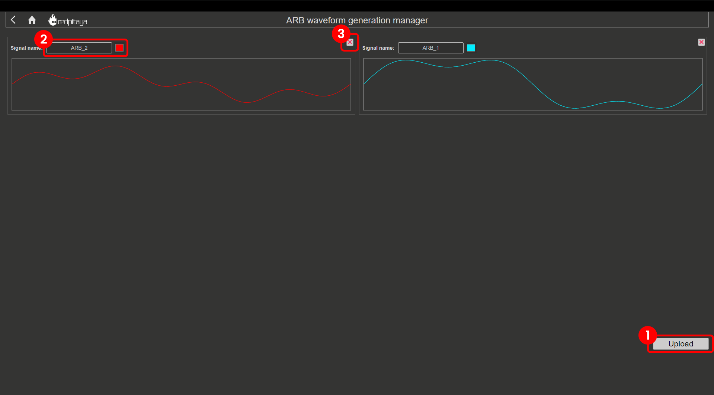

.. _arb_manager_app:

任意波形管理器
#############################

任意波形管理器是信号发生器应用的升级版，该应用属于 :ref:`示波器和信号发生器 <osc_app>` 以及 :ref:`频谱分析仪 <spec_anal_app>` 应用的一部分，可实现任意波形生成。这一优秀工具此前只能通过 SCPI 和 API 命令使用，现在已作为任意波形管理器应用提供。

除 STEMlab 125-14 4-Input 版本（不具备快速模拟输出）外，任意波形管理器适用于所有 Red Pitaya 板卡。

功能
===========

- 将一个周期的自定义波形上传到 Red Pitaya
- 从示波器和频谱分析仪应用生成自定义波形

#. **Upload：** 上传自定义波形 CSV 文件的按钮。
#. **信号名称和颜色：** 更改自定义信号名称和波形颜色。
#. **删除波形：** 删除自定义波形。

|

上传自定义波形
============================

要将自定义信号上传到任意波形发生器，请按照以下步骤操作。

#. 打开任意波形管理器

   .. figure:: img/ARB_manager.png
       :width: 1000

#. 点击 **Upload** 按钮，上传包含一个周期自定义信号且具有 16384 个采样/数据点的 **CSV** 文件。
#. 等待信号出现在屏幕上。
#. 配置波形名称和颜色。要更改名称，请点击名称字段；要更改颜色，请点击颜色字段。可以使用吸管工具从屏幕中选择颜色，也可以通过弹出的颜色管理器实用程序进行配置。

    .. figure:: img/ARB_manager_recolour.png
       :width: 1000 
#. 退出 ARB Manager 并打开示波器或频谱分析仪。自定义波形应出现在 *Waveform Type* 下拉菜单中。自定义字体颜色与 ARB Manager 中设置的波形颜色相匹配，因此可以轻松地将它们与标准波形区分开。

    .. figure:: img/ARB_Osc_waveforms.png
        :width: 300

.. note::

    **波形数据格式和幅度控制**

    - **所有波形值必须归一化** 到 ``[-1, 1]`` 范围，其中 ``1`` 表示 DAC 最大输出，``-1`` 表示最小输出。
    - 波形数据是仅定义信号 **形状** 的 **模板**；它不包含幅度信息。
    - 实际输出 **幅度** 通过示波器/频谱分析仪应用中的幅度/电压滑块，或通过 ``SOUR<n>:VOLT`` SCPI 命令独立控制。
    - FPGA 应用以下公式：**Output = (Waveform Template Value × Calibrated Amplitude Multiplier) + Calibration Offset**
    - 校准乘数用于补偿 DAC 的满量程范围，而 FPGA 本身并不知道该范围。

|

创建自定义波形的示例代码
--------------------------------------------

以下是创建自定义波形的 Python 代码示例。

.. code-block:: python
    
    #!/usr/bin/env python3
    
    import numpy as np
    import pandas as pd
    from matplotlib import pyplot as plt
    
    N = 16384                               # Number of samples
    t = np.linspace(0, 1, N)*2*np.pi
    
    x = np.sin(t) + 1/3*np.sin(3*t)         # Custom waveform definition
    y = 1/2*np.sin(t) + 1/4*np.sin(4*t)
    
    # IMPORTANT: Ensure all waveform values are normalized to [-1, 1]
    # The waveform is a TEMPLATE that defines only the signal SHAPE
    # The actual output AMPLITUDE is set separately via the volume slider or SOUR<n>:VOLT command
    
    plt.plot(t, x, t, y)                    # Double-check with plot
    plt.title('Custom waveform')
    plt.show()
    
    # Normalize values to ensure they're in [-1, 1] range
    x_norm = x / np.max(np.abs(x))
    y_norm = y / np.max(np.abs(y))
    
    # Port waveforms to CSV format
    pd.DataFrame(x_norm).to_csv('arb_waveform1.csv', index=False, header=False, float_format=np.float64)
    pd.DataFrame(y_norm).to_csv('arb_waveform2.csv', index=False, header=False, float_format=np.float64)
  
|

源代码
=============

`任意波形管理器源代码 <https://github.com/RedPitaya/RedPitaya/tree/master/apps-tools/arb_manager>`_ 可在我们的 GitHub 上获取。
