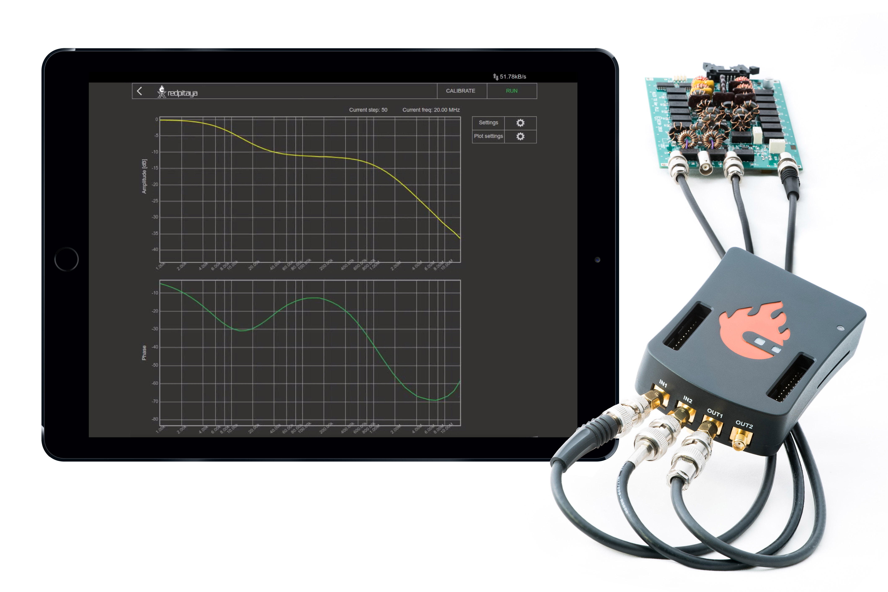
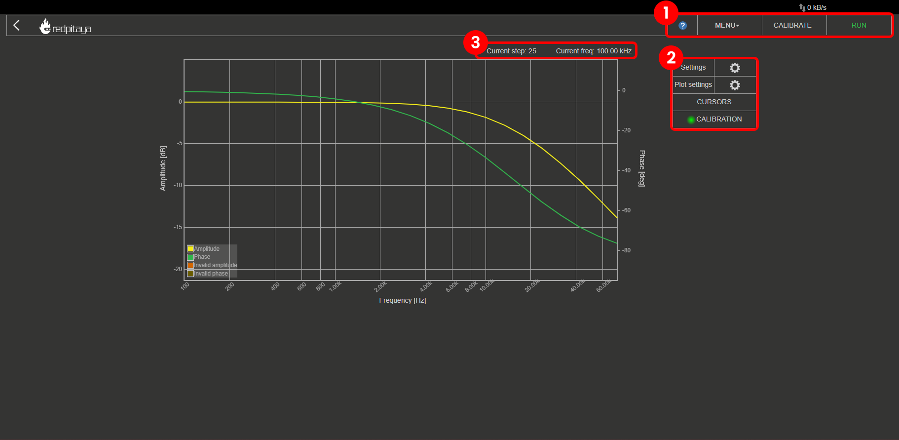
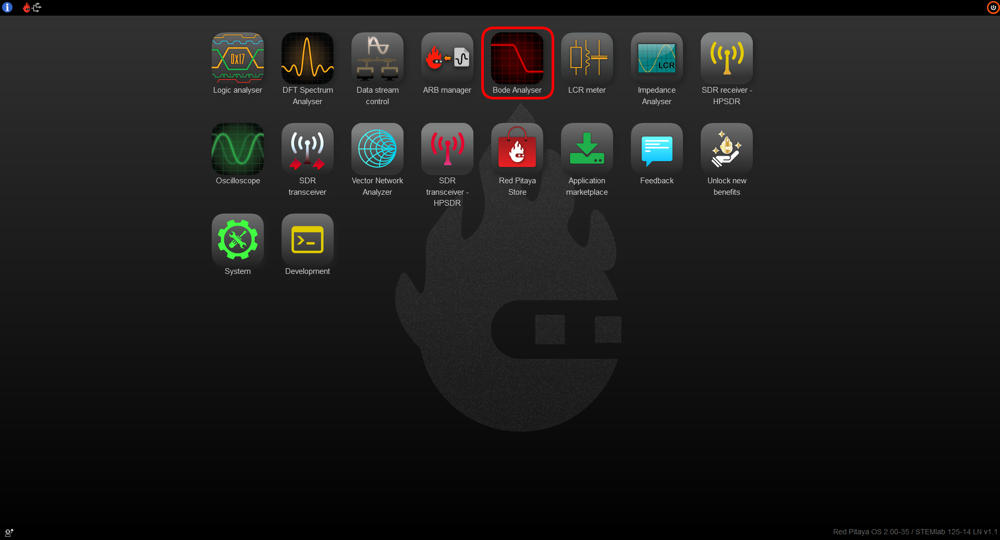
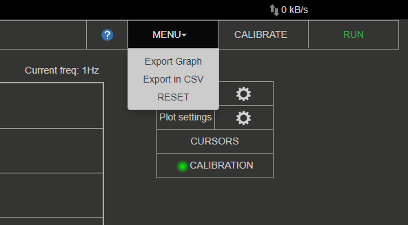
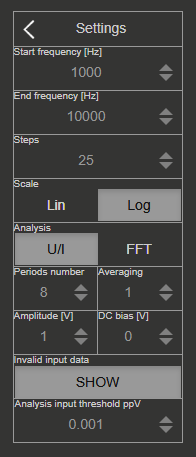
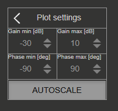
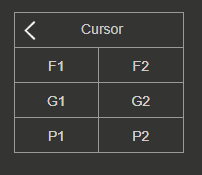
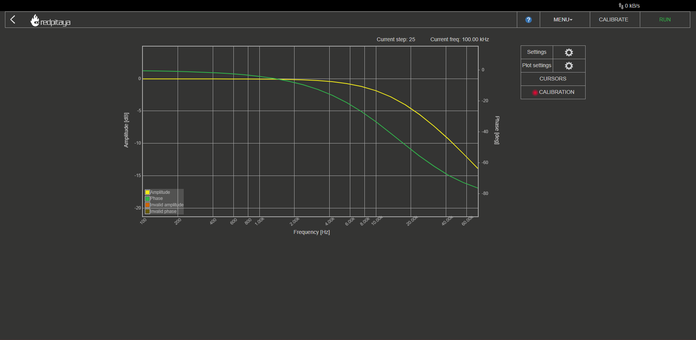

.. _bode_app:

#############
Bode 分析仪
#############

此应用可将 Red Pitaya 变为经济实用的 Bode 分析仪。它非常适合教育工作者、学生、创客、爱好者以及需要经济且功能强大的测试与测量设备的专业人员。

Bode 分析仪适合测量无源和有源滤波器、复杂阻抗以及其他电子电路的频率响应。利用增益/相位频率响应，可以完整表征任意被测设备。它支持线性和对数扫频，可测量 1 Hz 至 60 MHz 的增益和相位。
基本用户界面支持快速交互和参数设置。Bode 分析仪可用于测量控制电路（例如电源中的 DC/DC 转换器）的稳定性、终端对放大器或滤波器的影响、超声波和压电系统等。

此应用基于 Web，无需安装任何本机软件。用户可以在运行常见操作系统（MAC、Linux、Windows、Android 和 iOS）的智能手机、平板电脑或 PC 上，通过任意 Web 浏览器（推荐 Google Chrome）访问它。

Bode 分析仪应用的图形用户界面分为 4 个区域：

#. **顶部设置菜单：** 导出数据、校准以及启动或停止测量。
#. **测量控制面板：** 设置测量参数和绘图参数，并在主图形区域放置光标。
#. **当前测量数据：** 当前步数以及测量所需生成脉冲的频率。
#. **主图形区域：** 主图形区域分为 DUT（被测设备）的增益和相位频率响应图。

|

功能
==========

Bode 分析仪应用的主要功能如下：

   -   测量参数：增益、相位。
   -   Bode 分析仪应用可测量指定 DUT（被测设备）的增益和相位频率响应。
   -   Bode 分析仪应用的频率扫频范围为 1 Hz 至 60 MHz，分辨率为 1 Hz。
   -   提供线性和对数频率扫频模式。对数扫频模式（刻度）支持大频率范围测量，线性扫频模式用于小频率范围测量。
   -   可以调整激励信号参数（幅度和 DC 偏置），以适应不同灵敏度和条件（放大器等）下的测量。
   -   校准功能可校准长引线并消除引线和电缆对最终测量的影响。如果存在寄生效应，它还会校准 Red Pitaya。Bode 校准数据存储在 **/tmp/ba_calib.data**。

要打开 Bode 分析仪，请点击 Web 主界面中的相应图标：

|

顶部设置菜单
==================

顶部设置菜单包含以下功能：

#. **问号按钮：** 打开 Bode 分析仪文档网页（当前页面）。
#. **菜单下拉框：**

    - *Export data：* 将当前显示的数据导出为“Graph”或“CSV file”。选择图形时，会截取应用截图并由浏览器自动下载；否则会从板卡下载包含数据的 CSV 文件。
    - *Reset：* 将 Bode 分析仪应用的所有设置恢复为默认值。

#. **Calibrate 按钮：** 为当前设置启动校准。
#. **Stop/Run 按钮：** 启动和停止测量。

|

测量控制面板
==========================

此处可以设置频率范围、刻度、步数、激励信号幅度、激励信号 DC 偏置和平均次数等测量参数。

设置
---------

- **Start frequency [Hz]：** Bode 分析仪从此频率开始测量 DUT 的频率响应。
- **End frequency [Hz]：** Bode 分析仪在此频率结束 DUT 的频率响应测量。
- **Steps：** 执行的测量次数。根据 **Scale** 设置划分 **Start frequency** 与 **End frequency** 之间的频率范围，并在每个点执行测量。
- **Scale：** 线性或对数扫频模式（刻度）。对数扫频模式支持大频率范围测量，线性扫频模式用于小频率范围测量。
- **Analysis：** 确定计算所用算法，可设置为 U/I（电压/电流）或 FFT。U/I 分析使用积分计算增益和相位（速度快但精度较低），FFT 分析使用快速傅里叶变换方法（速度较慢但精度较高）。两种算法都基于将信号分解为复数并计算它们之间的相位差。

在每个频率点，Red Pitaya 会发送一个突发信号，其周期数为 **Period number**，单向幅度为 **Amplitude [V]**，偏置为 **DC bias[V]**，频率则根据上述设置重新计算。
**Averaging** 决定最终测量结果是否为所有已发送脉冲的平均值。

- **Period number：** 单次测量中的信号周期数。
- **Amplitude [V]：** 激励信号幅度。
- **DC bias [V]：** 激励信号 DC 偏置（offset）。
- **Averaging：** 设置为 ``1`` 时，每次测量结果是所有已发送信号周期的平均值。
- **Invalid input data：** 在图形上显示无效测量结果的按钮。
- **Analysis input threshold ppV：** 小于此设置的测量响应将被视为最小阈值（用于计算）。

.. note::

    **Amplitude** 与 **DC bias** 之和上限为 1 Volt。例如，当 Amplitude 设置为 0.4 V 时，DC bias 最大可设置为 0.6 V。

绘图设置
--------------

图形的设置。

- **Gain min, Gain max [dB]：** 幅度轴（左侧 Y 轴）的最小值和最大值。
- **Phase min, Phase max [deg]：** 相位轴（右侧 Y 轴）的最小值和最大值。
- **Autoscale：** 选中后忽略上述两个设置，并根据测量结果自动计算。

光标设置
---------------

每个坐标轴最多可以放置两个光标。**F** 表示频率，**G** 表示增益，**P** 表示相位。每个光标都会显示当前值，以及同一坐标轴上两个光标之间的绝对差值。
可以使用 *Click+Drag* 移动光标。

|

校准
============

为获得最佳结果，建议每次更改测量设置后都执行 Bode 分析仪校准。
校准功能可校准长引线并消除引线和电缆对最终测量的影响。如果存在寄生效应，校准还会校准 Red Pitaya。Bode 校准数据存储在 **/tmp/ba_calib.data**。

未校准时，*Measurement control panel* 中 **Calibration** 状态旁会显示 **Red** 指示灯。

#.  要执行校准，请点击 *Top settings menu* 中的 **Calibrate** 按钮。随后会弹出以下窗口：

    .. tabs::

        .. tab:: STEMlab 125-14, 125-10
    
            .. figure:: img/Bode_analyzer_calibration_menu.png
                :width: 600

        .. tab::  SIGNALlab 250-12

            .. figure:: img/Bode_analyzer_calibration_menu_siglab.png
                :width: 600

#.  检查设置，确保所有连接与图中所示一致：

    - **IN1** 连接到 DUT 的输入端（测量生成的脉冲）。
    - **IN2** 连接到 DUT 的输出端（测量经过滤波的脉冲）。
    - **OUT1** 连接到 DUT 的输入端（生成信号脉冲）。
    - 使用导线将 **DUT 的输入和输出短接**。

    |

    .. note::

        为获得最佳结果，请在 OUT1 上使用 50 Ω 端接。

#.  点击校准界面右下角的 **Calibrate** 按钮。**Reset Calibration** 按钮会删除已存储的 Bode 校准数据。
#.  校准会在 100 Hz 至 62.5 MHz 之间以对数模式执行 500 点测量。请等待校准完成。
#.  校准完成后，*Measurement control panel* 中 **Calibration** 状态旁会显示 **Green** 指示灯。

    .. figure:: img/Bode_analyzer_calibrated.png
        :width: 1000

#.  **断开 DUT 输入与输出之间的短接**。
#.  配置设置并开始测量。

|

规格
=============== 

+--------------------------------------------+--------------------------------+--------------------------------+-------------------------------+
|                                            | | STEMlab 125-14               | SIGNALlab 250-12               | STEMlab 125-10 (discontinued) |
|                                            | | STEMlab 125-14 Z7020         |                                |                               |
+============================================+================================+================================+===============================+
| 频率跨度                                   | 1 Hz - 60 MHz                  | 1 Hz - 60 MHz                  | 1 Hz - 50 MHz                 |
+--------------------------------------------+--------------------------------+--------------------------------+-------------------------------+
| 频率分辨率                                 | 1 Hz                           | 1 Hz                           | 1 Hz                          |
+--------------------------------------------+--------------------------------+--------------------------------+-------------------------------+
| 激励信号幅度                               | 0 - 1 V                        | 0 - 1 V                        | 0 - 1 V                       |
+--------------------------------------------+--------------------------------+--------------------------------+-------------------------------+
| 激励信号 DC 偏置                           | 0 - 1 V (max 1 V - Amplit.)    | 0 - 1 V (max 1 V - Amplit.)    | 0 - 1 V (max 1 V - Amplit.)   |
+--------------------------------------------+--------------------------------+--------------------------------+-------------------------------+
| 分辨率                                     | 14 bit                         | 12 bit                         | 10 bit                        |
+--------------------------------------------+--------------------------------+--------------------------------+-------------------------------+
| 每次测量最大步数                           | 1000                           | 1000                           | 1000                          |
+--------------------------------------------+--------------------------------+--------------------------------+-------------------------------+
| 最大输入幅度                               | |  ± 1 V (LV jumper settings), | |  ± 1 V (Low Gain),           | | ± 1 V (LV jumper settings), |
|                                            | |  ± 20 V (HV jumper settings) | |  ± 20 V (High Gain)          | | ± 20 V (HV jumper settings) |
+--------------------------------------------+--------------------------------+--------------------------------+-------------------------------+
| 测量参数                                   | Gain, Phase                    | Gain, Phase                    | Gain, Phase                   |
+--------------------------------------------+--------------------------------+--------------------------------+-------------------------------+
| 频率扫频模式                               | Linear/Logarithmic             | Linear/Logarithmic             | Linear/Logarithmic            |
+--------------------------------------------+--------------------------------+--------------------------------+-------------------------------+
| 分析模式                                   | U/I, FFT                       | U/I, FFT                       | U/I, FFT                      |
+--------------------------------------------+--------------------------------+--------------------------------+-------------------------------+

.. note::

    请注意，:ref:`模拟输入 <anain>` 后方的跳线必须设置为正确的输入范围！

|

源代码
============

我们的 GitHub 上提供了 `Bode 分析仪源代码 <https://github.com/RedPitaya/RedPitaya/tree/master/apps-tools/ba_pro>`_。
