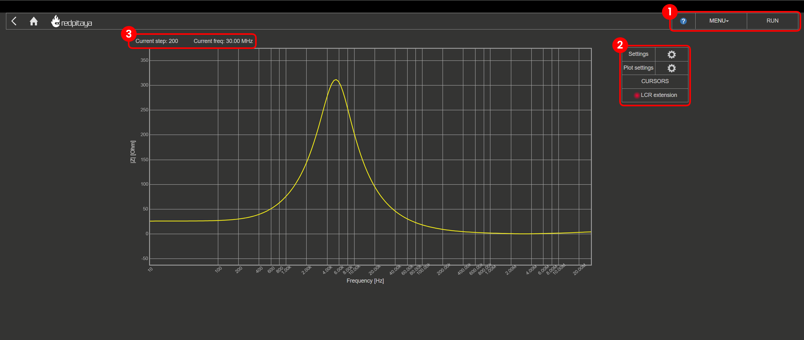
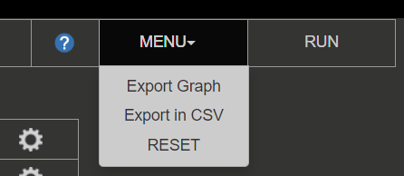
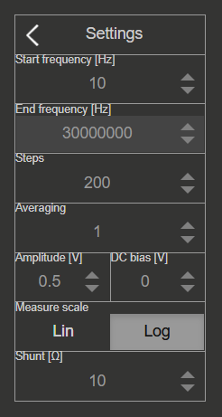
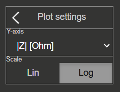
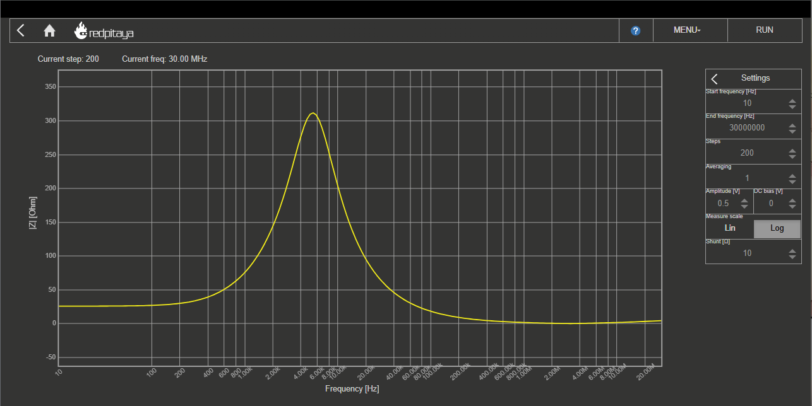

.. _impedance_app:

###################
阻抗分析仪
###################

此应用可将 Red Pitaya 变为阻抗分析仪。它非常适合教育工作者、学生、创客、爱好者以及需要经济且功能强大的测试与测量设备的专业人员。

阻抗是表征电子元件、电子电路及元件制造材料的重要参数。阻抗分析还可用于表征具有介电特性的材料，例如生物组织、食品或地质样本（`Wikipedia - impedance analyzer <https://en.wikipedia.org/wiki/Impedance_analyzer>`_）。

阻抗分析仪使用直流电压法，频率范围为 1 Hz 至 50 MHz。频率范围和测量次数均可任意选择。

所有 Red Pitaya 应用均基于 Web，无需安装任何本机软件。用户可以在运行常见操作系统（MAC、Linux、Windows、Android 和 iOS）的智能手机、平板电脑或 PC 上，通过 Web 浏览器访问这些应用。

功能
=========

阻抗分析仪可测量以下参数：

- Impedance :math:`|Z|\, [Ω]`
- Phase :math:`P\, [°]`
- Admittance :math:`Y\, [S]`
- Inverse phase :math:`-P\, [°]`
- Serial resistance :math:`R_S\, [Ω]`
- Parallel resistance :math:`R_P\, [Ω]`
- Serial reactance :math:`X_S\, [Ω]`
- Parallel conductance :math:`G_P\, [S]`
- Parallel susceptance :math:`B_P\, [S]`
- Serial capacitance :math:`C_S\, [F]`
- Parallel capacitance :math:`C_P\, [F]`
- Serial inductance :math:`L_S\, [H]`
- Parallel inducatnce :math:`L_P\, [H]`
- Quality factor :math:`Q`
- Dissipation factor :math:`D`

阻抗分析仪应用的图形用户界面分为 4 个区域：

#. **顶部设置菜单：** 导出数据、重置设置以及启动或停止测量。
#. **测量控制面板：** 设置分流电阻、测量参数和绘图参数，并在主图形区域放置光标。
#. **当前测量数据：** 当前步数以及测量所需生成脉冲的频率。
#. **主图形区域：** 主图形区域显示 DUT（被测设备）的阻抗响应。

|

顶部设置菜单
==================

顶部设置菜单包含以下功能：

#. **问号按钮：** 打开阻抗分析仪文档网页（当前页面）。
#. **菜单下拉框：**

    - **Export data：** 将当前显示的数据导出为“Graph”或“CSV file”。选择图形时会截取应用截图并由浏览器自动下载；否则会从板卡下载包含数据的 CSV 文件。
    - **Reset：** 将阻抗分析仪应用的所有设置恢复为默认值。

#. **Stop/Run 按钮：** 启动和停止测量。

|

测量控制面板
==========================

此处可以设置频率范围、刻度、步数、激励信号幅度、激励信号 DC 偏置和平均次数等测量参数。

设置
---------

- **Start frequency [Hz]：** 阻抗分析仪从此频率开始测量 DUT 的频率响应，即频率轴的最小值。
- **End frequency [Hz]：** 阻抗分析仪在此频率结束 DUT 的频率响应测量，即频率轴的最大值。
- **Steps：** 执行的测量次数。根据 **measure scale** 设置划分 **Start frequency** 与 **End frequency** 之间的频率范围，并在每个点执行测量。
- **Measure scale：** 线性或对数扫频模式（刻度）。对数扫频模式支持大频率范围测量，线性扫频模式用于小频率范围测量。
- **Averaging：** 每个最终结果都是 “*Averaging*” 次测量的平均值。
- **Amplitude [V]：** 激励信号幅度。
- **DC bias [V]：** 激励信号 DC 偏置（offset）。
- **Shunt [Ω]** 分流电阻的阻值。

.. note::

    **Amplitude** 与 **DC bias** 之和上限为 1 Volt。例如，当 Amplitude 设置为 0.4 V 时，DC bias 最大可设置为 0.6 V。

绘图设置
--------------

频率轴会缩放以显示 **start** 和 **end frequencies** 之间的完整范围（轴范围会随频率设置变化）。Y 轴会根据测量数据自动缩放。

- **Y-axis data：** 从以下数据选项中选择。完成测量后，图形会自动按照所选设置重新计算数据：

    - Impedance :math:`|Z|\, [Ω]`
    - Phase :math:`P\, [°]`
    - Admittance :math:`Y\, [S]`
    - Inverse phase :math:`-P\, [°]`
    - Serial resistance :math:`R_S\, [Ω]`
    - Parallel resistance :math:`R_P\, [Ω]`
    - Serial reactance :math:`X_S\, [Ω]`
    - Parallel conductance :math:`G_P\, [S]`
    - Parallel susceptance :math:`B_P\, [S]`
    - Serial capacitance :math:`C_S\, [F]`
    - Parallel capacitance :math:`C_P\, [F]`
    - Serial inductance :math:`L_S\, [H]`
    - Parallel inducatnce :math:`L_P\, [H]`
    - Quality factor :math:`Q`
    - Dissipation factor :math:`D`

- **Measurement scale：** 线性或对数模式，会影响 **Y-axis** 数据的显示。

光标设置
---------------

每个坐标轴最多可以放置两个光标。每个光标都会显示当前值，以及同一坐标轴上两个光标之间的绝对差值。
可以使用 *Click+Drag* 移动光标。

LCR 表指示灯
----------------------

连接 LCR 表扩展板时，指示灯显示绿色；否则显示红色。

|

.. _impedance_connection:

如何使用阻抗分析仪
==================================

阻抗分析仪需要使用 *LCR 表扩展模块* 或 *外部分流电阻* 才能正常运行。每种方法各有优缺点。下面简要介绍硬件设置方法。

LCR 扩展模块
---------------------

.. figure::  img/E_module_connection.png
    :width: 1000

LCR 表扩展模块连接更简单，并会在以下分流电阻值之间自动切换：

- 10 Ω
- 100 Ω
- 1 kΩ
- 10 kΩ
- 100 kΩ
- 1 MΩ

有关 LCR 表扩展模块的更多信息，请参见我们的 :ref:`文档 <lcr_extension_module>`。

外部分流电阻
-------------------------

.. figure::  img/IA_shunt_connection.png
    :width: 600

.. note::

    为尽量减小 Red Pitaya 输入阻抗对测量的影响，请按照上图重新配置跳线（在两个输入端分别连接中间两个引脚），以旁路输入电阻分压器。
    这会将 **输入电压范围降低到 +-0.5 V**，因此请确保输出电压设置不超过 +-0.5 V（绝对最大值 0.75 V）。

**选择分流电阻**

使用最佳分流电阻时，IN1（电压测量）和 IN2（电流测量）的动态输入范围都会最大化。这意味着在指定频率范围内，电压会从 0 变化到最大值（0.5 V）。最佳分流电阻值高度取决于 DUT 和所选频率范围。

选择最佳分流电阻是一个最大化动态输入范围的迭代过程。

1. 首先估计电阻值以选择起始值（例如从 10 的幂次电阻值开始）。如果已知 DUT 的近似阻抗，起始值会更准确。
2. 在所选频率范围内测量 IN2 的动态范围，开始第一次迭代（例如通过电路生成扫频信号）。
3. 在保持其他设置不变的情况下更改分流电阻值，以增大 IN2 的动态范围。
4. 重复步骤 2 和 3，直到动态范围的变化可以忽略不计。

    测量并联 RLC 电路阻抗的示例。

|

源代码
==============

我们的 GitHub 上提供了 `阻抗分析仪源代码 <https://github.com/RedPitaya/RedPitaya/tree/master/apps-tools/impedance_analyzer>`_。
