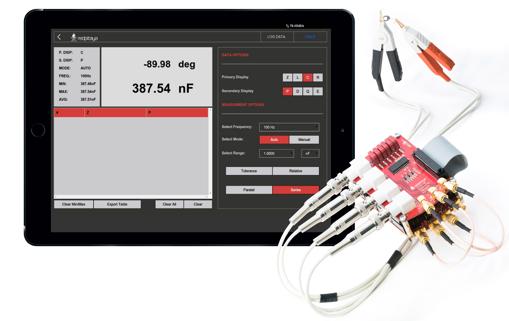
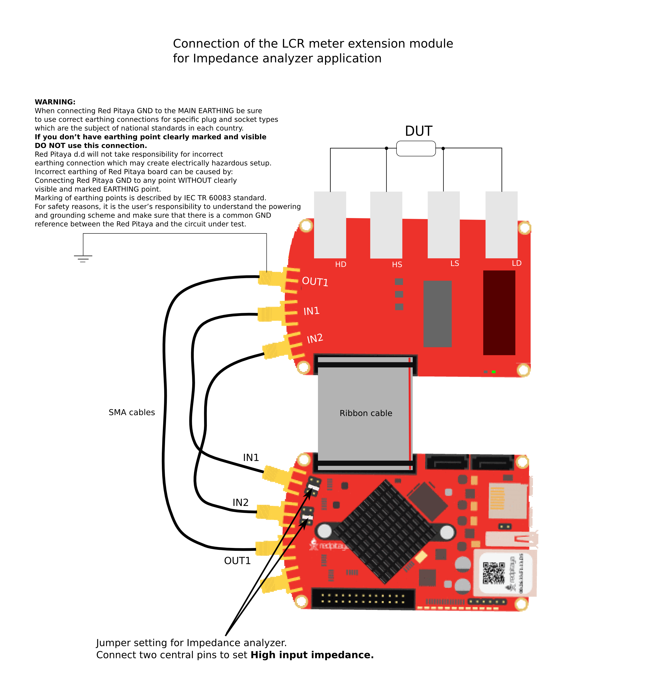

.. _lrc_app:

############
LCR 电表
############

此应用可将 Red Pitaya 变成一台经济实用的 LCR 电表。它适合需要经济实用且功能强大的测试测量设备的专业人员、教育工作者、学生、创客和爱好者。
电阻器、电容器和电感器是所有电路的基本元件。在项目过程中，您经常需要测量工作台上现有的元件。Red Pitaya 的 LCR 电表只需切换应用即可加快测量流程并准确测量元件。

.. note:: 

    使用 LCR 电表应用需要额外的扩展模块。该模块可从 `Red Pitaya 商店 <https://redpitaya.com/shop/>`_ 购买。

所有 Red Pitaya 应用均基于 Web，无需安装任何本机软件。 用户可通过浏览器在智能手机、平板电脑或运行常见操作系统（MAC、Linux、Windows、Android 和 iOS）的 PC 上访问这些应用。
LCR 电表应用的各个元素经过合理布局，提供类似台式 LCR 电表的熟悉用户界面。

.. figure::  img/lcr_main.png
	:width: 1000

图形界面分为 6 个主要区域：

#. **顶部设置菜单** - 提供应用的总体控制，包括重置应用设置、记录数据以及开始/停止测量。
#. **记录表** - 显示已记录的测量数据，并提供导出或清除数据的选项。
#. **主显示与次显示** - 显示测量的主参数和次参数以及应用的当前设置。
#. **数据选项** - 选择要测量并显示在主显示和次显示中的主参数与次参数。
#. **测量选项** - 选择测量频率、分流电阻值和等效电路。
#. **显示选项** - 选择测量模式、量程模式，并启用容差和相对测量。

|

功能
*********

.. contents:: 目录
    :local:
    :depth: 2
    :backlinks: top

|

1. 兼容性
=================

LCR 电表应用兼容以下 Red Pitaya 型号：

**Gen 2 板卡：**

* STEMlab 125-14 PRO Z7020 Gen 2
* STEMlab 125-14 PRO Gen 2
* STEMlab 125-14 Gen 2

**原始板卡：**

* STEMlab 125-14 (LN, ext. clk, Z7020, etc.)
* SIGNALlab 250-12
* STEMlab 125-10

|

2. 连接 LCR 模块
==============================

3. 顶部设置菜单
=======================

顶部设置菜单提供应用的总体控制。蓝色问号可打开当前文档页面。

设置
---------

设置菜单用于控制应用设置：

* **重置** - 将应用设置重置为默认值。

记录数据
---------

记录数据按钮用于开始和停止记录测量数据。 开始记录后，按钮会变为红色，记录的数据会显示在 
`4. 记录表`_。用户可以导出或清除已记录的数据。

保持按钮
------------

保持按钮会冻结主显示和次显示上的当前测量值。按下保持按钮后，按钮会变为红色并冻结当前值。再次按下按钮可解除冻结。

|

4. 记录表
====================

记录表显示已记录的测量数据。表中每条记录包含以下信息：

* **编号** - 记录编号。
* **日期和时间** - 记录测量的日期和时间。
* **分流电阻** - 测量所用的分流电阻值。
* **频率** - 测量所用的频率。
* **主参数** - 测量得到的主参数值。根据所选主参数，数值单位可能为 Ohm、Farad 或 Henry。
* **次参数** - 测量得到的次参数值。根据所选次参数，数值可能以度表示，也可能无单位。

单击表中的记录即可选中该记录。 按下记录表选项中的“Clear”按钮可从表中清除选中的记录。

应用启动时数据表为空。用户可按下顶部设置菜单中的“记录数据”按钮开始记录数据。
表格最多可容纳 1000 条记录。达到上限后，最早的记录将被删除，以便为新记录腾出空间。

它提供以下选项：

* **导出表格** - 将已记录的数据导出为 CSV 文件。
* **间隔** - 选择记录间隔。用户可从 100 ms、500 ms、1 s、1.5 s、2.0 s、2.5 s 和 3.0 s 中选择。
* **全部清除** - 清除表中的已记录数据。
* **清除** - 清除表中选中的数据行。

|

5. 主显示与次显示
================================

主显示和次显示展示测量的主参数与次参数以及应用的当前设置。

左侧主显示展示以下信息：

* **主参数** - 测量得到的主参数值，位于屏幕中央。
* **次参数** - 测量得到的次参数值，位于主参数正上方。2
* **容差和相对值** - 容差值和相对值显示在主显示左下角。这些值在启用容差或相对模式之前会显示为灰色
  ，直到启用容差或相对模式。

右侧次显示展示以下信息：

* **主显示（P. DISP）** - 显示主参数的单位符号。
* **次显示（S. DISP）** - 显示次参数的单位符号。
* **模式** - 显示当前分流电阻选择模式（Auto 或 Manual）。
* **频率** - 显示当前选择的测量频率。
* **分流电阻** - 显示当前选择的分流电阻值。
* **Min/Max/Average** - 显示测量主参数的最小值、最大值和平均值。这些值根据最近 
  100 次测量计算。用户可以旋转次显示右下角的箭头来重置这些值。

|

6. 数据选项
================

数据选项菜单用于控制要测量并显示在主显示和次显示中的主参数与次参数。

测量的主参数
-----------------------------

LCR 电表应用可测量无源电气元件的基本参数：

    * **R** - 电阻。
    * **C** - 电容。
    * **L** - 电感。
    * **Z** - 阻抗。

测量的次参数
-------------------------------

除主参数外，还会测量并计算次参数。这些参数常用于描述无源元件的特性 
以及无源元件的质量：

    * **P** - 阻抗相位（测量电流与电压之间的相位）。
    * **D** - 损耗因数（常用于量化电容器质量）。
    * **Q** - 品质因数（常用于量化电感器质量）。
    * **ESR** - 等效串联电阻。

|

7. 测量选项
=======================

测量选项菜单用于控制测量频率、分流电阻值和等效电路。

选择频率
-------------------------

LCR 电表支持以下测量频率：

* 10 Hz
* 100 Hz
* 1 kHz
* 10 kHz
* 100 kHz
* 1 MHz

用户可以选择所需频率，LCR 应用将使用该频率的正弦信号测量阻抗。

选择分流电阻
---------------

LCR 电表应用使用分流电阻测量被测设备（DUT）中的电流。分流电阻与 DUT 串联，通过测量分流电阻两端的压降来计算电流。
用户可以从一系列分流电阻中选择，以测量不同范围的阻抗。

可用的分流电阻如下：

* **自动** - LCR 电表将根据测得的阻抗自动选择合适的分流电阻。
* **10 Ω**
* **100 Ω**
* **1 kΩ**
* **10 kΩ**
* **100 kΩ**
* **1 MΩ**

只有使用 LCR 电表扩展模块时，才能自动选择分流电阻。

等效电路计算模式
------------------------------------

并联和串联测量模式分别表示使用并联或串联等效电路，根据测得的阻抗 Z 计算参数（R、C、L……）。
LCR 电表只测量复数值 *Z=|Z|e(jP)*，其中 P 是测得的相位，*|Z|* 是阻抗幅值。其他参数均根据串联或并联等效电路计算。

|

8. 显示选项
=====================

显示选项菜单用于控制测量模式、量程模式，并启用容差和相对测量。

选择模式
------------

量程模式决定 LCR 电表如何选择测量范围。LCR 电表可以根据测量值自动选择最佳量程，也可以由用户手动选择量程。

* **自动** - LCR 电表根据测量值自动选择最佳量程。
* **手动** - 用户可以在**选择范围**菜单中手动选择量程。

选择范围
-------------

用户可以在**选择范围**菜单中选择测量范围。该设置决定测量值的小数点位置及其单位。可用范围如下：

小数点位置：

* **1.0000**
* **10.000**
* **100.00**
* **1000.0**

测量值单位：

* **nΩ**
* **μΩ**
* **mΩ**
* **Ω**
* **kΩ**
* **MΩ**

测量模式
------------------

容差和相对按钮分别启用相应的测量模式。选择其中一个后，主显示中会启用对应的数值。

    * **容差模式** - 保存单击“Tolerance”按钮前测得的最后一个值，并用于计算新值与保存值之间的百分比差异。
    * **相对模式** - 保存单击“Relative”按钮前测得的最后一个值，并用于计算新值与保存值之间的相对差异。

|

规格
*****************

.. ! 检查 SIGNALlab 基本精度。

.. list-table::
    :widths: 32 24 24 24
    :header-rows: 1

    * -
      - **STEMlab 125-14**
        **STEMlab 125-14 Gen 2** [#f1]_
      - **SIGNALlab 250-12**
      - **STEMlab 125-10**
    * - 测量的主参数
      - Z、L、C、R
      - Z、L、C、R
      - Z、L、C、R
    * - 测量的次参数
      - P、D、Q、E
      - P、D、Q、E
      - P、D、Q、E
    * - 可选频率
      - 10 Hz、100 Hz、1 kHz、10 kHz、100 kHz、1 MHz
      - 10 Hz、100 Hz、1 kHz、10 kHz、100 kHz、1 MHz
      - 10 Hz、100 Hz、1 kHz、10 kHz、100 kHz、1 MHz
    * - 阻抗范围
      - 1 Ω - 10 MΩ
      - 1 Ω - 10 MΩ
      - 1 Ω - 10 MΩ
    * - DC 偏置
      - 0.5 V
      - 0.5 V
      - 0.5 V
    * - 基本精度
      - 1.00 %
      - 2.00 %
      - 5.00 %
    * - 最大输入电压
      - 0.5 Vpp
      - 0.5 Vpp
      - 0.5 Vpp
    * - 输入保护
      - 是
      - 是
      - 是
    * - 参数范围 Z
      - 1 Ω - 10 MΩ
      - 1 Ω - 10 MΩ
      - 1 Ω - 10 MΩ
    * - 参数范围 Rs、Rp
      - 1 Ω - 10 MΩ
      - 1 Ω - 10 MΩ
      - 1 Ω - 10 MΩ
    * - 参数范围 Ls、Lp
      - 100 nH - 1000 H
      - 100 nH - 1000 H
      - 100 nH - 1000 H
    * - 参数范围 Cs、Cp
      - 1 pF - 100 mF
      - 10 pF - 100 mF
      - 10 pF - 100 mF
    * - 参数范围 P
      - ±180 deg
      - ±180 deg
      - ±180 deg

**脚注：**

.. [#f1] 这些规格适用于所有 Red Pitaya Gen 2 板卡，以及原始一代 STEMlab 125-14 的各种版本（外部时钟、低噪声等）。

|

源代码
************

`LCR Meter 源代码 <https://github.com/RedPitaya/RedPitaya/tree/master/apps-tools/lcr_meter>`_ 可在我们的 GitHub 上获取。

.. substitutions
