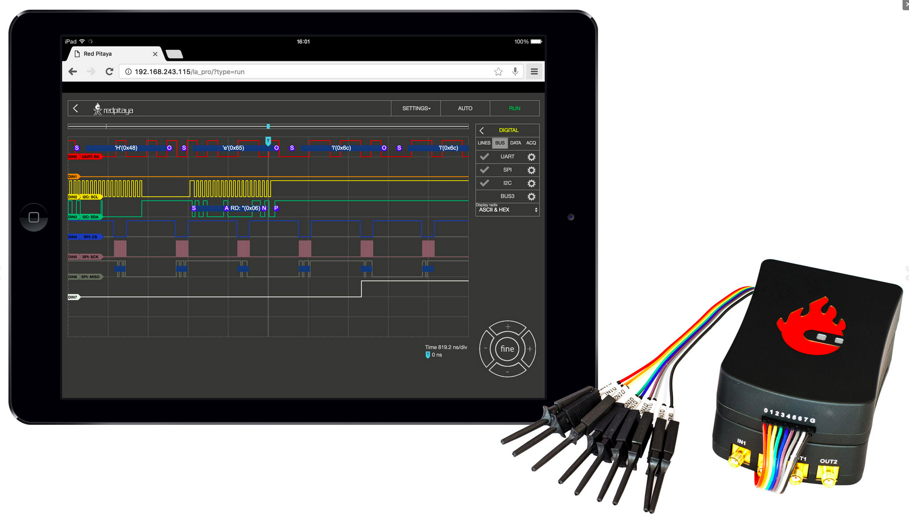
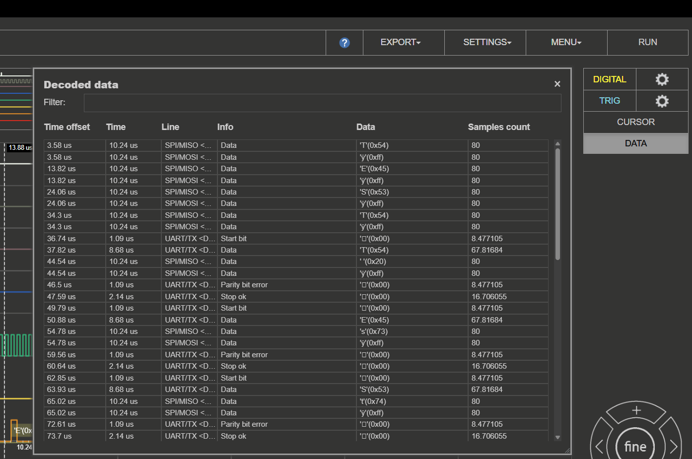
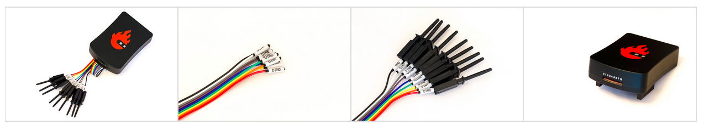
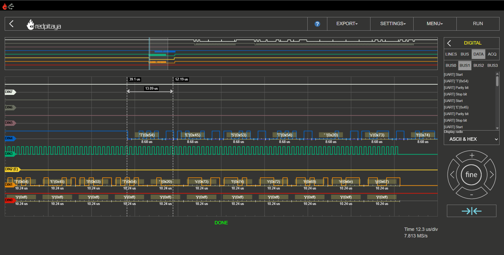

.. _la_app:

逻辑分析仪
##############

逻辑分析仪用于分析数字信号：既可以分析 Raspberry Pi 或 Arduino 板的 GPIO 输出等二进制信号，也可以分析不同总线（I2C、SPI、UART 和 CAN）并解码传输的数据。该应用基于 Web，无需安装任何本机软件。用户可以通过智能手机、平板电脑或运行常见操作系统（MAC、Linux、Windows、Android 和 iOS）的 PC，使用任意 Web 浏览器访问它（推荐 Google Chrome）。

开箱即可用于分析最高 3.3 V 的数字信号。对于更高的电压，可以使用扩展模块将电压范围扩展到 5 V，并为 GPIO 引脚提供保护。所有 Red Pitaya 型号均提供逻辑分析仪应用。

.. figure:: img/LA_main.png
	:width: 1200

用户界面包含以下元素：

    1. **顶部设置菜单** - 包含导出数据、保存设置、修改常规应用设置以及运行或停止测量等基本功能。
    #. **数字与触发设置** - 可以在此配置数字输入、触发设置、添加游标并设置总线解码。
    #. **坐标轴控制面板** - 按下垂直 ± 按钮可更改时间轴（X 轴）的刻度。水平 <> 按钮用于沿时间轴向左或向右移动。
    #. **刻度信息** - 显示当前每格时间范围和采样率。
    #. **状态显示** - 显示当前记录状态（完成、等待、就绪）。
    #. **触发指示器** - 垂直蓝色触发指示器显示时间轴上的触发事件。触发事件始终位于时间轴的零点。
    #. **缩略图** - 显示完整的已记录信号，并可快速浏览记录的数据。

|

功能
*********

.. contents:: Table of Contents
   :local:
   :depth: 2
   :backlinks: top

|

1. 顶部设置菜单
=====================

用于控制逻辑分析仪应用。蓝色问号会打开当前文档页面。

.. figure:: img/LA_top_menu.png
    :width: 600

导出
------

以以下格式之一导出当前显示的数据：

    - **图形** - 截取应用窗口，并通过浏览器自动下载。
    - **RLE** - 游程编码（RLE）是一种简单的数据压缩形式，将连续数据存储为单个数据值及其计数。RLE 格式用于以压缩形式存储记录数据，之后可以解码或重新导入逻辑分析仪应用。
    - **行** - 以 CSV 格式导出数据，并可对数据进行归一化及导出当前视图。
    - **文件** - 以 WAV、CSV 或 TDMS 格式导出数据，并可对数据进行归一化及导出当前视图。

设置
----------

设置菜单用于控制应用设置：

    - **保存** - 使用指定名称保存当前逻辑分析仪设置。设置保存于 SD 卡本地存储中（因板卡型号而异）。
    - **重置** - 将所有逻辑分析仪设置重置为默认值。
    - **调用** （用户指定名称）- 调用之前保存的逻辑分析仪设置。每个已保存的设置都会列在下拉菜单中，用户可以选择所需设置。

菜单
---------

    * **上传 RLE** - 上传之前保存的 RLE 文件，并在逻辑分析仪应用中显示数据。必须设置总线解码参数，上传的数据才能正确解码。
    * **系统信息** - 显示 Red Pitaya 板的信息（FPS、数据吞吐量、CPU 负载、内存使用量）。
    * **扩展模块** - 检查是否连接了 LA 扩展模块（反转逻辑电平）。

运行/停止
---------

开始或停止数据采集/逻辑分析。

|

2. 数字信号设置
===========================

逻辑分析仪应用最多可以捕获 8 个不同的数字信号。信号以二进制值（0 或 1）显示。点击 "DIGITAL" 选择字段旁的齿轮图标 2 即可访问数字设置。

.. figure:: img/LA_digital.png
    :width: 1000

数字设置分为四个部分：

    * **线路** - 启用或禁用各个数字通道。
    * **总线** - 将数字通道分配给特定总线，并配置总线解码设置。
    * **数据** - 以表格形式显示一个或多个总线的解码数据。
    * **采集** - 设置采样率以及采样前/后的数据缓冲区。

在未配置总线系统时，通道作为纯数字输入工作并显示相应波形。**ACQ** 标签页会打开采样率设置选择字段。

.. note::

    采样率（在 **Acq** 标签页中）应至少设置为被测数字信号波特率的两倍。

.. note::

    采样率会显著影响可显示的时间范围。逻辑分析仪应用的存储深度为 1 MS，因此可以存储和显示 1,000,000 个二进制值。由此可见，采样率决定每秒记录的值数量。如果选择最高采样率（125 MS/s），每秒将记录 125,000,000 个值。由于时间存储器只能存储 1,000,000 个值，因此时间窗口为 0.008 秒。采样率为 1 MS/s 时，记录信号的时间窗口为完整的一秒。

.. figure:: img/LA_pre_post_trigger.png
    :width: 1000

设置采样前数据缓冲区值后，可以确定记录中的触发事件位置。当需要了解定义的触发事件之前发生了什么时，这尤其有用。例如，采样率设置为 4 MS/s，则存储的时间段约为 0.25 s = 250 ms。如果采样前数据缓冲区设置为 10 ms，记录信号就会显示事件前 10 ms 和事件后 240 ms 的情况。

线路
-----

点击复选标记即可启用或禁用通道。每条线路都可以分配名称，该名称会显示在对应的线路游标中。要更改名称，请点击通道名称并输入所需名称（最多 4 个字符）。

总线编码器设置
--------------------

总线编码器设置定义用于解码数字信号的协议。数据采样率应设置为记录数据时使用的确切采样率：

- **数据捕获** - 捕获数据时，``Data samplerate`` 会自动设置为记录数据的采样率。
- **上传 RLE** - 上传 RLE 文件时，必须手动将 ``Data samplerate`` 设置为记录数据时使用的采样率。

逻辑分析仪最多可以同时解码四种不同的总线协议。解码数据的步骤如下：

1. **设置数据采样率** - 将数据采样率设置为记录数据时使用的采样率。
2. **选择总线** - 选择要解码的总线（Bus 0 - 3）。
3. **选择总线协议** - 选择所需总线协议（I2C、SPI、UART、CAN）。
4. **配置总线设置** - 配置总线设置（例如波特率、数据位等）。
5. **设置显示进制** - 设置解码数据的显示进制（ASCII、ASCII & HEX、DEC、BIN、HEX）。

.. note::

    设置逻辑分析仪的完整示例见 `如何解码总线数据？`_ 章节。

总线编码器选项
--------------------

逻辑分析仪应用支持以下总线协议：

**UART**

.. figure:: img/LA_digital_enc_uart.png
    :width: 600

可以调整以下设置：

    * **数据线路** - 选择代表 RX 和 TX 信号的数字通道。
    * **波特率** - 设置 UART 信号的波特率。
    * **数据位** - 设置 UART 信号的数据位数（5、6、7、8、9）。
    * **停止位** - 设置 UART 信号的停止位数（0、0.5、1、1.5、2）。
    * **奇偶校验** - 设置 UART 信号的奇偶校验（None、Even、Odd、Mark/Always 1、Space/Always 0）。
    * **位顺序** - 设置 UART 信号的位顺序（LSB first、MSB first）。
    * **极性** - 设置 UART 信号的极性（Normal、Inverted）。

**SPI**

.. figure:: img/LA_digital_enc_spi.png
    :width: 600

可以调整以下设置：

    * **数据线路** - 选择代表 MOSI、MISO、SCK 和 CS 信号的数字通道。
    * **位顺序** - 设置 SPI 信号的位顺序（LSB first、MSB first）。
    * **数据位** - 设置 SPI 信号的数据位数（7、8、9）。
    * **时钟极性** - 设置 SPI 信号的时钟极性（Low/0、High/1）。
    * **时钟相位** - 设置 SPI 信号的时钟相位（Leading/0、Trailing/1）。
    * **启用** - 设置 SPI 信号的启用信号（Low/0、High/1）。
    * **极性** - 设置 SPI 信号的极性（Normal、Inverted）。

**I2C**

.. figure:: img/LA_digital_enc_i2c.png
    :width: 600

可以调整以下设置：

    * **数据线路** - 选择代表 SDA 和 SCL 信号的数字通道。
    * **地址显示** - 设置 I2C 信号的地址显示方式（Shifted、Unshifted）。
    * **极性** - 设置 I2C 信号的极性（Normal、Inverted）。

**CAN**

.. figure:: img/LA_digital_enc_can.png
    :width: 600

可以调整以下设置：

    * **数据线路** - 选择代表 CAN_RX 信号的数字通道。
    * **标称比特率** - 设置 CAN 信号的标称比特率。
    * **快速比特率** - 设置 CAN 信号的快速比特率。
    * **采样点** - 设置 CAN 信号的采样点。
    * **极性** - 设置 CAN 信号的极性（Normal、Inverted）。
    * **最大检测帧数** - 设置检测帧的最大数量。

数据
----

数据标签页允许以表格形式显示一个或多个总线的解码数据。数据可以用 ASCII、ASCII & HEX、DEC、BIN 或 HEX 格式显示。

.. !

有关数据的更多信息，请参阅文档中的 `5. 解码数据表`_ 部分。

采集
-----------

采集标签页允许设置采样率以及采样前/后的数据缓冲区。采样率应至少设置为被测数字信号波特率的两倍。采样前数据缓冲区值用于确定触发事件之前记录多少数据。

|

3. 触发设置
====================

点击 "TRIG" 选择字段旁的齿轮图标即可访问触发设置。

.. figure:: img/LA_trigger.png
    :width: 300

触发设置用于定义开始数据采集的条件。每个数字通道都可以按特定条件设置为触发源。可用的触发类型如下：

    * **X - 忽略** - 无事件。
    * **0 - 低** - 低电平。
    * **1 - 高** - 高电平。
    * **R - 上升** - 上升沿。
    * **F - 下降** - 下降沿。
    * **E - 任一** - 边沿变化（上升沿或下降沿）。

当所有数字通道触发源都处于所需状态时，触发条件满足（当前仅提供 **AND 模式**）。

要进行自动采集，至少一个触发源必须设置为上升沿或下降沿。其他触发源可以设置为任意可用触发类型。

点击 **RUN** 按钮开始记录。状态显示会告知过程仍在运行（**WAITING**）还是已经完成（**DONE**）。采集完成后，结果会显示在图形中。附加触发选项 LOW 和 HIGH 用于所谓的模式触发。例如，将触发源设置为 DIN0 - 上升沿（采集开始必须至少有一个通道设置为带上升沿或下降沿的触发源），将 DIN1 设置为 HIGH、DIN2 设置为 LOW，应用逻辑就会等待 DIN0 从 0 变为 1、DIN1 为 1 且 DIN2 为 0 的状态，然后开始采集。

|

4. 游标
============

与 Oscilloscope 一样，逻辑分析仪也提供用于快速测量的游标。由于这里没有可变幅度读数，只有离散信号电平，因此游标仅适用于时间轴。启用后，游标会显示相对于零点（触发事件）的时间以及两者之间的差值。

.. figure:: img/LA_cursors.png
	:width: 1200

|

5. 解码数据表
======================

数据表以表格形式显示一个或多个总线的解码数据。数据可搜索，并包含以下列：

    * **时间偏移** - 解码数据相对于触发事件（零点）的时间偏移。
    * **时间** - 事件持续时间。
    * **线路** - 解码数据所属的数字通道。
    * **信息** - 数据包类型信息（例如 Start bit、Data、Stop bit 等）。
    * **数据** - 按所选格式（ASCII、ASCII & HEX、DEC、BIN、HEX）显示的解码数据。
    * **采样起点** - 解码数据开始处的采样编号。
    * **采样计数** - 解码数据占用的采样数量。

在搜索字段中输入搜索词即可过滤解码数据表。表格只显示任意列包含该搜索词的行。

.. note::

    要使总线数据显示在数据表中，必须在 **DIGITAL** 设置菜单的 **DATA** 标签页下选择（高亮）该总线。同时必须完成总线配置并解码数据。

点击数据表中的某一行，会将时间轴对齐到所选数据的起点（与图形中部对齐）；请参阅下图中的游标位置。

.. figure:: img/LA_data_decoding.png
    :width: 1200

|

6. 坐标轴控制面板
=======================

.. figure:: img/LA_axis_control.png
    :width: 300

坐标轴控制面板允许更改时间轴（X 轴）的刻度，并沿时间轴向左或向右移动。垂直 ± 按钮更改时间轴刻度，水平 <> 按钮用于沿时间轴移动。选择精细按钮后，可以用更小步长移动时间轴。当前每格时间范围和采样率显示在 **刻度信息部分**。

点击坐标轴控制面板下方的蓝色触发指示器，会将时间轴居中到触发事件。触发事件始终位于时间轴的零点。

|

7. 触发位置指示器
==============================

触发位置指示器是显示时间轴上触发事件位置的垂直蓝线。触发事件始终位于时间轴的零点。

双击图形中的任意位置，时间轴会重新以触发事件为中心，触发位置指示器也会与时间轴零点对齐。

|

8. 缩略图
===========

缩略图显示完整的已记录信号，可用于快速浏览记录数据。缩略图位于图形顶部，显示记录信号的缩小版本。当前视图以白色高亮，蓝线表示触发时刻。可以点击并拖动白色区域沿时间轴移动，也可以点击缩略图区域跳转到记录信号中的相应位置。处理长时间记录时，缩略图尤其有用，因为无需滚动整个图形即可快速浏览数据。

|

硬件/连接
***********************

为了获得逻辑分析仪应用的最佳性能并保护 Red Pitaya 板，建议使用逻辑分析仪扩展模块。使用 LA 扩展模块很简单：将其插入 Red Pitaya，并将探头连接到所需测量点。

如果不使用扩展模块，则将逻辑分析仪探头连接到 Red Pitaya 板的 :ref:`E1 <E1_orig_gen>` 时需要格外小心（**仅限 3V3 逻辑**）。下图显示了逻辑分析仪板使用的引脚。

直接使用 Red Pitaya 板的 GPIO :ref:`E1 <E1_orig_gen>` 引脚适用于任何 Red Pitaya 型号。下图左侧给出了连接示例。
    
.. figure:: img/13_LA_connect.png
	:width: 1000

|

规格
****************

.. list-table::
    :widths: 30 40 40
    :header-rows: 1

    * -
      - **直接连接 E1**
      - **LA 扩展模块**
    * - 通道
      - 8
      - 8
    * - 最大采样率
      - 125 MS/s
      - 125 MS/s
    * - 最大输入频率
      - 50 MHz
      - 50 MHz
    * - 支持的总线协议
      - I2C、SPI、UART、CAN
      - I2C、SPI、UART、CAN
    * - 输入电压
      - 3.3 V
      - 2.5 ... 5.5 V
    * - 过压保护
      - N/A
      - 集成
    * - 电平阈值
      - 0.8V（低），2.0V（高）
      - 0.8V（低），2.0V（高）
    * - 输入阻抗
      - 100 kΩ，3 pF
      - 100 kΩ，3 pF
    * - 触发类型
      - 电平、边沿、模式
      - 电平、边沿、模式
    * - 存储深度
      - 1 MS（典型值）
      - 1 MS（典型值）
    * - 采样间隔
      - 8 ns
      - 8 ns
    * - 最小脉冲持续时间
      - 10 ns
      - 10 ns

如何解码总线数据？
************************

下面是使用逻辑分析仪应用解码总线数据的快速教程。

1. **扩展模块** - 如果将 LA 扩展模块连接到 Red Pitaya 板，请在设置菜单中勾选 **Ext. Module**。这会反转逻辑电平并保护 GPIO 引脚。
#. **连接探头** - 将探头连接到所需测量点。
#. **选择数字通道** - 在 **DIGITAL** 菜单中选择所需数字通道，最多可选择 8 个通道。
#. **配置总线** - 在 **BUS** 菜单中选择所需总线协议（I2C、SPI、UART、CAN），并配置总线设置（例如波特率、数据位等）。
#. **设置触发** - 在 **TRIGGER** 菜单中配置触发条件。
#. **开始测量** - 点击 **RUN** 按钮开始数据采集。满足触发条件前，状态显示为 **WAITING**；采集完成后显示 **DONE**。

捕获的数据会被自动检测，并按照所选格式解码。解码数据会作为独立图层直接叠加在信号上，也可以在 **DIGITAL DATA** 菜单中以表格形式查看。

|

源代码
************

:rp-github:`逻辑分析仪源代码 <RedPitaya/tree/master/apps-tools/la_pro>` 位于我们的 GitHub。
