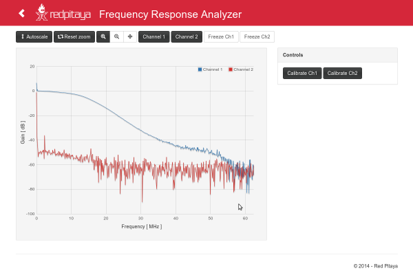
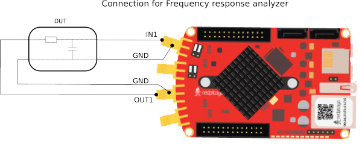

.. _freqRes_app:

***************************
频率响应分析仪
***************************

.. note::

    本节内容已过时。官方 Red Pitaya OS 中的频率响应分析仪已由 :ref:`阻抗分析仪 <impedance_app>` 提供。

频率响应分析仪可以测量所需 DUT（被测设备）的频率幅度响应。频率响应测量范围为 0 Hz 至 60 MHz。测量实时进行，频率范围不可调节。每个通道都可以独立测量，即可同时测量两个 DUT。

该应用在 OUT1 和 OUT2 上生成带限噪声信号。信号输入 DUT 后，在 IN1 和 IN2 上采集 DUT 的响应。应用使用 DFT 算法分析采集到的信号，并在 GUI 上绘制 DUT 的频率响应。该应用适用于滤波器测量等场景。

频率响应分析仪可以测量所需 DUT（被测设备）的频率幅度响应。频率响应测量范围为 0 Hz 至 60 MHz。测量实时进行，频率范围不可调节。每个通道都可以独立测量，即可同时测量两个 DUT。下图展示了使用频率响应分析仪时将 DUT 连接到 Red Pitaya 的方式。

.. note::

   频率响应分析仪应用可在 Red Pitaya 应用市场中获取。
