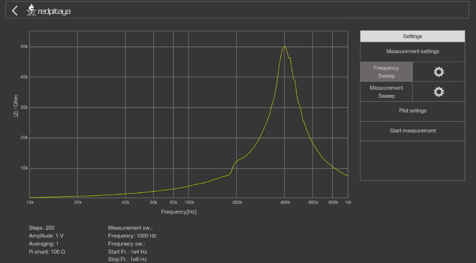
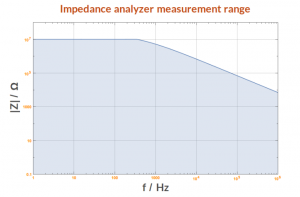
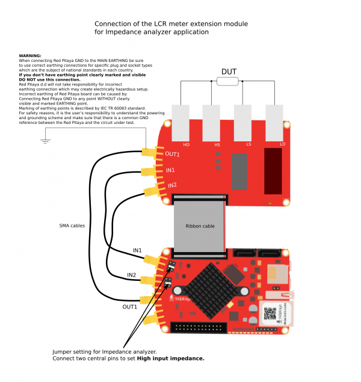
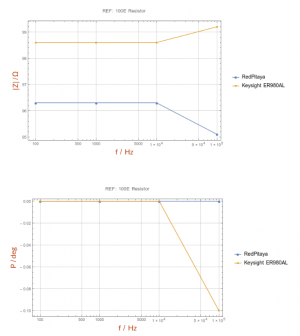
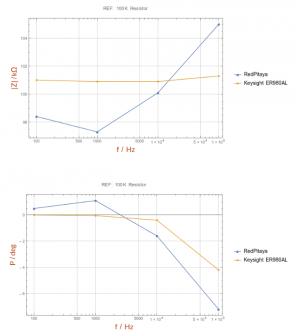
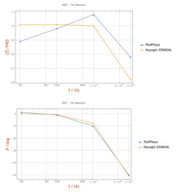
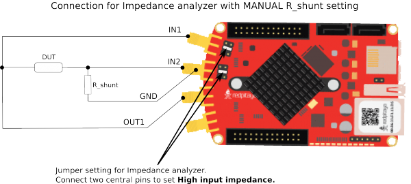

.. _imp_anal_marketplace:

###################
阻抗分析仪
###################

.. note::

    本节内容已过时。自 2.00-30 起，阻抗分析仪应用已由 Red Pitaya OS 正式支持。
    有关 :ref:`阻抗分析仪 <impedance_app>` 的更多信息请见此处。

阻抗分析仪应用可测量所选 DUT（被测设备）的阻抗、相位和其他参数。可以在 **频率扫描** 模式下以 1 Hz 的频率分辨率进行测量，也可以在 **测量扫描** 模式下以恒定频率执行指定数量的测量。可选频率范围为 1 Hz 至 60 MHz，但建议频率范围最高为 1 MHz。阻抗范围为 0.1 Ω 至 10 MΩ。将阻抗分析仪应用与 LCR 扩展模块配合使用时，请在分流电阻字段中输入 0。

.. note::

    阻抗范围取决于所选频率和最高精度，因此并非所有频率和阻抗范围都能执行合适的测量。下图给出了阻抗范围。电容器或电感器的范围可以根据该图进行外推。阻抗分析仪的基本精度为 5%。阻抗分析仪应用针对 1 m 开尔文探头进行了校准。在恒定频率下使用 **测量扫描** 模式可以获得更准确的测量结果。

使用阻抗分析仪应用时，按照下图将 Red Pitaya GND 连接到市电 EARTH 导线可获得最佳结果。我们还建议对 Red Pitaya 和 LCR 扩展模块进行屏蔽。

下图展示了所选 DUT 的对比测量结果。测量分别使用 Red Pitaya 和 Keysight 精密 LCR 表完成。通过这些曲线可以得到 Red Pitaya 的基本精度。

.. note::

    Red Pitaya LCR 测量仪和阻抗分析仪未针对特定精度或范围进行认证。

不使用 LCR 扩展模块时，也可以通过手动设置分流电阻来使用阻抗分析仪应用。下面介绍此选项。

.. note::

    使用自己的设置时，需要更改代码中的 ``C_cable`` 参数。

.. note::

    阻抗分析仪应用可在 Red Pitaya marketplace 中获取。
