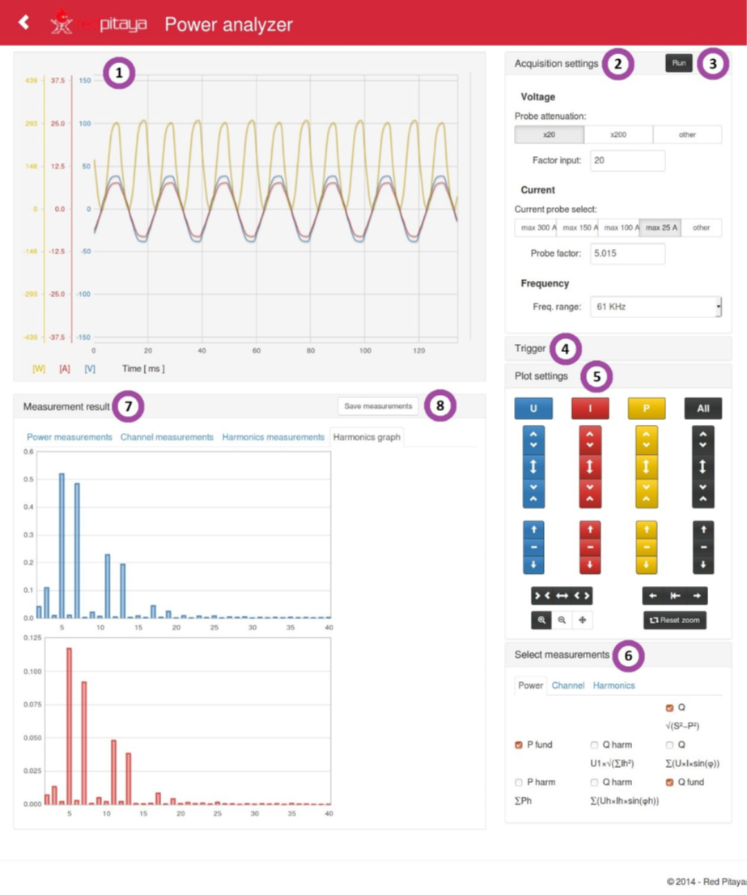

.. _power_anal_app:

**************
功率分析仪
**************

该应用基于示波器应用，并对控制器和服务器模块进行了修改。

    功率分析仪应用的用户界面。

用户界面分为八个部分：

    -   **图形：** 用户界面使用 *flot* 库绘制接收的数据。功率根据电流和电压数据计算。三者随后都转换为数据序列。序列长度会根据屏幕分辨率调整，库负责数据点之间的插值。
    -   **采集设置：** 用户可以选择电流探头、电压探头衰减和采样频率。选择电流探头后，Red Pitaya 上的 LED 会亮起，表示相应输出通道已开启。用户还可以输入探头衰减和探头因子，以便使用不同参数。在频率下拉菜单中可选择不同带宽（对应抽取率），其值为采样频率的一半。最后一个选项是 DC 模式，此时应用只测量两个信号的平均值和有功功率。
    -   **停止：** 点击按钮会暂时停止应用。
    -   **触发设置：** 设置模式、通道、边沿和触发电平。
    -   **绘图设置：** 打开或关闭特定图形；修改信号的刻度、偏移和时间基准。
    -   **测量设置：** 包含多个标签页，与 **测量结果** 中的标签页相同。每个标签页都可选择要显示的不同设置。在谐波标签页中，可以输入计算使用的谐波数量。
    -   **测量结果：** 为便于使用，包含多个标签页，与 **测量设置** 中的标签页相同。图形位置也大致对应选择框所在位置。
    -   **保存测量：** 点击后开始记录数据。每次测量都会记录时间戳。结果可在 Red Pitaya 的 **measurements** 目录中找到，文件名由记录开始的日期和时间戳组成。

有关控制器、服务器和服务器模块内部工作原理的更多信息，请参阅论文第 5.2.2 章及之后章节（论文第 42 页）。

有关功率分析仪的更多信息请见此处（点击 PDF 图标下载论文；请注意论文使用斯洛文尼亚语）：

-   |Power Analyzer|

.. note::

   功率分析仪应用作为大学论文项目创建，目前已不再积极维护。上方提供论文链接供参考，论文正文为斯洛文尼亚语。
   有兴趣使用此应用的用户应注意，它可能不会获得更新或支持。
   
.. |Power Analyzer| raw:: html

   <a href="https://repozitorij.uni-lj.si/IzpisGradiva.php?id=85012&lang=eng" target="_blank">功率分析仪文档</a>
