.. _osc_app:

示波器与信号发生器
###############################

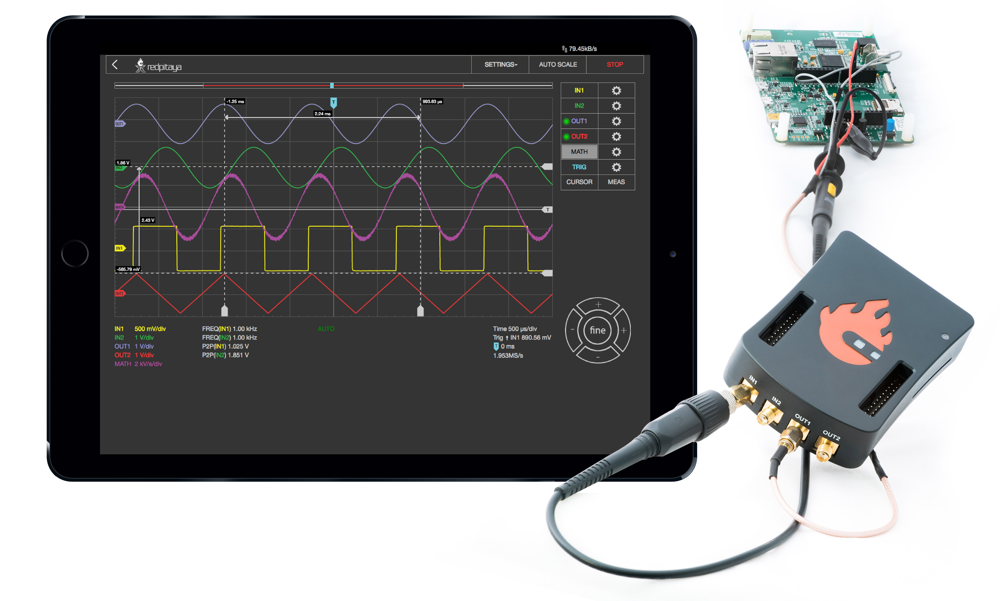

此应用可将 Red Pitaya 板卡变为双通道示波器和双通道信号发生器。它是教育工作者、学生、创客、业余爱好者以及寻求高性价比、高功能测试测量设备的专业人员的理想工具。简单直观的用户界面提供信号分析与测量所需的全部工具。

高端规格可以满足工作台上需要强大工具的用户。此应用基于 Web，无需安装原生软件。用户可以在运行常见操作系统（MAC、Linux、Windows、Android 和 iOS）的智能手机、平板电脑或 PC 上，通过任意 Web 浏览器（推荐 Google Chrome）访问。示波器与信号发生器应用中的各个元素布局合理，提供熟悉的用户界面。

.. tabs::

   .. tab:: 双通道设备

        .. figure:: img/Slika_02_OSC.png
            :width: 1000
            :align: center

   .. tab:: 四通道设备

        .. note::

            由于没有输出端口，STEMlab 125-14 4-Input 不提供信号发生器。

        .. figure:: img/Slika_02_OSC_4-in.png
            :width: 1000
            :align: center

除图形区域外，用户界面由以下六个区域组成：

    1. **顶部设置菜单** - 包含设置、导出数据、自动缩放以及运行/停止测量等基本功能。
    #. **通道与触发设置** - 用于控制输入和输出、触发器、辅助线及测量。
    #. **坐标轴控制面板** - 按水平 ± 按钮可改变时间轴（X 轴）刻度；垂直 ± 按钮可改变幅度轴（Y 轴），从而改变信号的显示电压范围。
    #. **时间与触发信息** - 显示当前每格时间刻度、触发设置（时间窗口、触发器、X 轴零点）和采样率。
    #. **通道幅度刻度** - 指示所有显示通道的 Y 轴刻度。
    #. **测量显示** - 显示已执行测量的结果。

功能特性
********

示波器与信号发生器的主要功能如下：

    -   运行/停止和自动设置功能
    -   信号位置与刻度控制
    -   触发控制（源、幅度、斜率）
    -   触发模式：自动、正常和单次触发
    -   游标
    -   测量
    -   数学运算
    -   信号发生器控制（波形、幅度、频率、相位）
    -   自定义波形输出（任意波形发生器）
    -   慢速模拟输入和输出控制

.. contents:: 目录
    :local:
    :backlinks: top

1. 顶部设置菜单
=====================

用于控制示波器应用。蓝色问号会打开本说明页面。

.. figure:: img/osc_top_menu.png
    :width: 800

设置
----------

设置菜单用于控制应用设置：

- **Save** - 使用指定名称保存当前示波器和信号发生器设置。设置保存在 SD 卡本地存储中（取决于板卡型号）。
- **Reset** - 将所有示波器和信号发生器设置恢复为默认值。
- **Recall** （用户指定名称）- 调用之前保存的示波器和信号发生器设置。每个已保存设置都会列在下拉菜单中，用户可选择所需设置。

菜单
-----

包含以下设置：

- **ARB Manager** - 直接进入 :ref:`任意波形管理器应用 <arb_manager_app>`，可在其中上传用于生成的自定义波形。
- **Sys Info** - 选中后，示波器应用会在左下角显示 FPS、CPU 负载等系统信息。
- **IN/E2** - 选中后，显示 E2 连接器慢速模拟输入的电压。
- **ADC 16 bit** - 选中后，在抽取因子足够高时，示波器以 16 位分辨率显示数据（适用于原生分辨率非 16 位的板卡）。
- **Ext. Clock** （仅 SIGNALlab 250-12）- 启用 SIGNALlab 的外部时钟同步。详情请参阅下方章节。

外部参考时钟（仅 SIGNALlab 250-12）
-------------------------------------------------

可通过设置菜单启用外部参考时钟输入。启用后，其状态会显示在主界面中。“绿色”状态表示采样时钟已锁定到外部参考时钟。

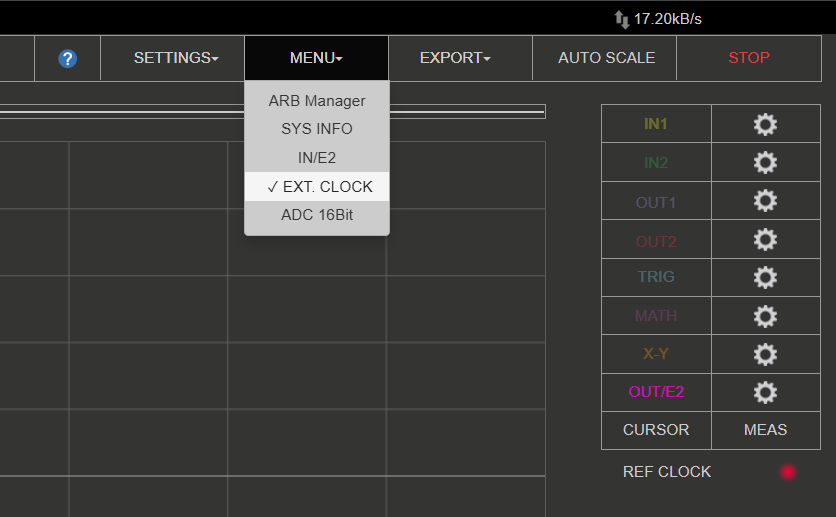

导出
---------

将当前显示的数据导出为“Graph”或“File”。选择 Graph 时，应用会截取屏幕并通过浏览器自动下载；否则数据会以 WAV、CSV 或 TDMS 格式导出，并可选择对数据归一化以及导出当前视图。

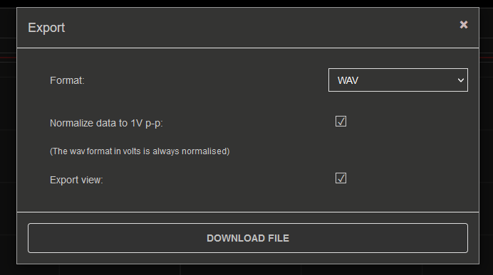

自动缩放
----------

自动设置示波器以最佳方式显示输入信号。按下此按钮后，电压轴和时间轴会被设置为使屏幕至少显示一个完整信号周期。

    .. figure:: img/Slika_03_OSC_left.png
        :width: 1000
        :align: center

    .. figure:: img/Slika_03_OSC_right.png
        :width: 1000
        :align: center

运行/停止
-----------

启动/停止数据采集和示波器。停止时，应用会忽略所有触发条件。

2. 输入
==========

在示波器与信号发生器应用界面的右侧会列出 IN1 和 IN2 通道。单击通道名称（不要点击齿轮）即可选中通道，然后可以直接控制该通道的所有设置。不同设备型号可用的设置如下：

.. tabs::

    .. tab:: STEMlab 125-14、125-10、4-Input

        .. figure:: img/osc_inputs_standard.png
            :height: 400

        -   **Show** - 显示或隐藏通道对应的曲线。
        -   **Invert** - 将图形关于 X 轴翻转。
        -   **Name** - 重命名通道（最多 4 个字符）。
        -   **Probe attenuation** - （必须手动选择）探头衰减倍数。
        -   **Center offset** - 沿 Y 轴偏移曲线（通道游标）。偏移仅应用于 Web 界面，不影响实际信号。
        -   **Zero reference** - 相对于通道游标垂直偏移曲线，便于放大查看信号的特定部分。偏移仅应用于 Web 界面，不影响实际信号。
        -   **Input attenuation (LV and HV)** - 板卡输入衰减。必须根据每个通道的 :ref:`跳线位置 <anain>` 进行选择。
        -   **Filter (On/Off)** - 启用或禁用输入通道的频率均衡滤波器。Gen 2 板卡禁用此滤波器。
        -   **Interpolation** - 见下方的“插值”章节。
        -   **Trace Mode** - 见下方的“轨迹模式”章节。

    .. tab:: SDRlab 122-16

        .. figure:: img/osc_inputs_sdrlab.png
            :height: 400

        -   **Show** - 显示或隐藏通道对应的曲线。
        -   **Invert** - 将图形关于 X 轴翻转。
        -   **Name** - 重命名通道（最多 4 个字符）。
        -   **Probe attenuation** - （必须手动选择）探头衰减倍数。
        -   **Center offset** - 沿 Y 轴偏移曲线（通道游标）。偏移仅应用于 Web 界面，不影响实际信号。
        -   **Zero reference** - 相对于通道游标垂直偏移曲线，便于放大查看信号的特定部分。偏移仅应用于 Web 界面，不影响实际信号。
        -   **Interpolation** - 见下方的“插值”章节。
        -   **Trace Mode** - 见下方的“轨迹模式”章节。

    .. tab:: SIGNALlab 250-12

        .. figure:: img/osc_inputs_signallab.png
            :height: 400

        -   **Show** - 显示或隐藏通道对应的曲线。
        -   **Invert** - 将图形关于 X 轴翻转。
        -   **Name** - 重命名通道（最多 4 个字符）。
        -   **Probe attenuation** - （必须手动选择）探头衰减倍数。
        -   **Center offset** - 沿 Y 轴偏移曲线（通道游标）。偏移仅应用于 Web 界面，不影响实际信号。
        -   **Zero reference** - 相对于通道游标垂直偏移曲线，便于放大查看信号的特定部分。偏移仅应用于 Web 界面，不影响实际信号。
        -   **Input attenuation** - 调整 V/div 设置时自动选择 1:1 (± 1V) / 1:20 (± 20V)；也可通过 Web 界面手动选择范围。
        -   **Input coupling (DC/AC)** - 选择输入耦合方式。
        -   **Interpolation** - 见下方的“插值”章节。
        -   **Trace Mode** - 见下方的“轨迹模式”章节。

插值
-------------

控制屏幕上采样数据点之间的渲染方式。 **禁用** （默认）时，各采样点直接以离散点显示；启用后，采样点使用以下算法之一连接：

1. **Linear** — 在采样点之间绘制直线。
2. **B-Spline** — 平滑曲线拟合。
3. **Catmull-Rom** — 精确通过每个采样点的平滑曲线。
4. **Lanczos** — 高质量重建滤波器。

轨迹模式
----------

启用 **Trace Mode** 后，新数据到达时屏幕会保留历史波形数据，形成类似模拟示波器的余辉显示，从而可以观察信号随时间的变化和罕见事件。

可用选项如下：

-   **Fast mode：** 针对高数据吞吐量优化轨迹渲染。
-   **Inverted opacity：** 反转轨迹不透明度，使较旧数据更亮、较新数据更暗。
-   **Trace colour selection：** 选择表示数据点密度的配色方案——频繁出现的值使用一种颜色，罕见值使用另一种颜色。

.. _output-ref:

3. 输出
===========

.. note::

    请注意，用户界面中显示的输出波形**仅供参考**，不能准确表示输出信号的**相位**。输出波形与屏幕起点对齐，而输入波形与时间偏移游标对齐。

在示波器与信号发生器应用界面的右侧会列出 OUT1 和 OUT2 通道。单击通道名称（不要点击齿轮）即可选中通道，然后可以直接控制该通道的所有设置。可用设置如下：

.. tabs::

    .. tab:: STEMlab 125-14、125-10、4-Input

        .. figure:: img/gen_outputs_standard.png
            :height: 500

        -   **ON** - 打开/关闭发生器输出。
        -   **Show** - 显示信号预览（请注意，该信号与输入/输出信号不同相）。
        -   **Waveform Type** - 正弦、方波（矩形波）、三角波、Sawu（上升锯齿波）、Sawd（下降锯齿波）、DC、DC_NEG、PWM（脉宽调制）和 NOISE（白噪声）。通过 :ref:`ARB Manager 应用 <arb_manager_app>` 提供的自定义波形也会显示在此处。
        -   **Name** - 重命名通道（最多 4 个字符）。
        -   **Trigger** - 为发生器选择内部或外部触发器。
        -   **Sweep mode** - 配置扫频模式设置（见下文）。
        -   **Burst mode** - 配置突发模式设置（见下文）。
        -   **Frequency** - 输出信号频率（1 Hz - 50 MHz）。
        -   **Amplitude** - 输出信号单向幅度（以 GND 为参考）。
        -   **Offset** - DC 偏移。
        -   **Phase** - 输出信号相位。
        -   **Duty cycle** - PWM 信号占空比。
        -   **Rise/Fall time** - 输出信号的最小上升和下降时间。
        -   **Load** - 输出负载（50 Ohm 或 High-Z）。
        -   **Center offset** - 沿 Y 轴偏移曲线（通道游标）。偏移仅应用于 Web 界面，不影响实际信号。
        -   **Initial voltage** - 输出信号初始电压。发生器触发时，输出信号从该电压开始。
        -   **Trig Gen** - 手动触发信号发生器。

    .. tab:: SDRlab 122-16

        .. figure:: img/gen_outputs_sdrlab.png
            :height: 500

        -   **ON** - 打开/关闭发生器输出。
        -   **Show** - 显示信号预览（请注意，该信号与输入/输出信号不同相）。
        -   **Waveform Type** - 仅正弦波（由于采用 AC 耦合）。通过 :ref:`ARB Manager 应用 <arb_manager_app>` 提供的自定义波形也会显示在此处。
        -   **Name** - 重命名通道（最多 4 个字符）。
        -   **Trigger** - 为发生器选择内部或外部触发器。
        -   **Sweep mode** - 配置扫频模式设置（见下文）。
        -   **Burst mode** - 配置突发模式设置（见下文）。
        -   **Frequency** - 输出信号频率（300 kHz - 60 MHz）。
        -   **Amplitude** - 输出信号单向幅度（以 GND 为参考）。
        -   **Phase** - 输出信号相位。
        -   **Center offset** - 沿 Y 轴偏移曲线（通道游标）。偏移仅应用于 Web 界面，不影响实际信号。
        -   **Initial voltage** - 输出信号初始电压。发生器触发时，输出信号从该电压开始。
        -   **Trig Gen** - 手动触发信号发生器。

    .. tab:: SIGNALlab 250-12

        .. figure:: img/gen_outputs_signallab.png
            :height: 500

        -   **ON** - 打开/关闭发生器输出。
        -   **Show** - 显示信号预览（请注意，该信号与输入/输出信号不同相）。
        -   **Waveform Type** - 正弦、方波（矩形波）、三角波、Sawu（上升锯齿波）、Sawd（下降锯齿波）、DC、DC_NEG、PWM（脉宽调制）和 NOISE（白噪声）。通过 :ref:`ARB Manager 应用 <arb_manager_app>` 提供的自定义波形也会显示在此处。
        -   **Name** - 重命名通道（最多 4 个字符）。
        -   **Trigger** - 为发生器选择内部或外部触发器。
        -   **Sweep mode** - 配置扫频模式设置（见下文）。
        -   **Burst mode** - 配置突发模式设置（见下文）。
        -   **Frequency** - 输出信号频率（1 Hz - 50 MHz）。
        -   **Amplitude** - 输出信号单向幅度（以 GND 为参考）。
        -   **Output gain** - 显示输出增益级状态（x1 或 x5）。调整幅度时会自动设置输出增益级。
        -   **Offset** - DC 偏移。
        -   **Phase** - 输出信号相位。
        -   **Duty cycle** - PWM 信号占空比。
        -   **Rise/Fall time** - 输出信号的最小上升和下降时间（SQUARE 及其他不连续波形）。
        -   **Load** - 输出负载（50 Ohm 或 High-Z）。
        -   **Center offset** - 沿 Y 轴偏移曲线（通道游标）。偏移仅应用于 Web 界面，不影响实际信号。
        -   **Initial voltage** - 输出信号初始电压。发生器触发时，输出信号从该电压开始。
        -   **Trig Gen** - 手动触发信号发生器。

.. note::

    STEMlab 125-14 4-Input 没有任何输出端口。

突发模式
-----------

配置输出以突发模式运行。频率、幅度和其他设置沿用连续模式（上级菜单）的设置。突发模式会一直保持激活，直到关闭或将设置 RESET 为默认值。所有突发生成完毕后，突发信号停止生成。突发模式状态由输出通道设置中的相应指示灯显示。

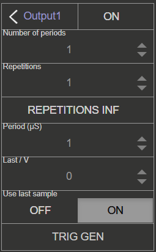

- **ON** - 打开/关闭突发模式。
- **Number of periods (NCYC)** - 一次突发中的信号周期数，也称为 Number of Cycles (NCYC)。
- **Repetitions (NOR)** - 重复突发次数，也称为 Number Of Repetitions (NOR)。
- **REPETITIONS INF** - 选中后，突发信号会无限重复。
- **Period (μs)** - 第一次突发开始与下一次突发开始之间的周期（可设置为 0）。
- **Last value** - 生成最后一次突发重复后，输出信号保持在突发信号的 ``last value``；否则输出信号返回 GND。
- **Use last sample** - 选中后，生成最后一次突发重复后，输出信号保持在突发信号的最后一个采样点（忽略 Last value）。
- **Trig Gen** - 手动触发信号发生器。

扫频模式
-----------

配置输出以扫频模式运行。除频率外的所有设置沿用连续模式（上级菜单）的设置。扫频模式会一直保持激活，直到关闭或将设置 RESET 为默认值。关闭通道不会关闭扫频模式，但会停止生成扫频信号。扫频模式状态由输出通道设置中的相应指示灯显示。

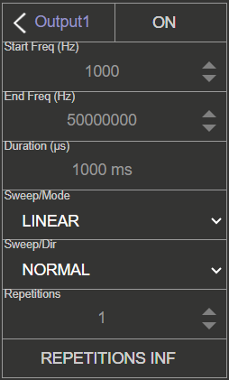

- **Start Freq (Hz)** - 扫频起始频率，单位为 Hertz。
- **End Freq (Hz)** - 扫频结束/停止频率，单位为 Hertz。
- **Duration (μs)** - 扫频持续时间，单位为 microseconds。使用 UP-DOWN 方向时，该时间同时适用于两个方向（例如设置为 1000 ms，向上扫频耗时 1000 ms，随后向下扫频也耗时 1000 ms）。
- **Sweep Mode** - LINEAR 或 LOG。
- **Sweep Dir** - 扫频方向：NORMAL 或 UP-DOWN。
- **Repetitions (NOR)** - 重复扫频次数，也称为 Number Of Repetitions (NOR)。
- **REPETITIONS INF** - 选中后，扫频信号会无限重复。

4. 触发
===========

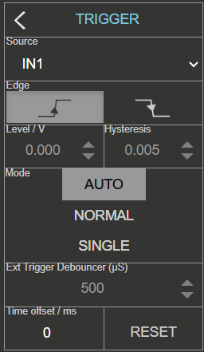

触发器用于让示波器屏幕稳定显示变化的波形。可用设置如下：

    - **Source** - 触发源可以是任意输入通道（IN1、IN2、IN3 或 IN4（仅限 4-Input 板卡））或外部源。
    - **Edge** - 采集期间，信号幅度可以从较高值穿过触发电平到较低值（下降沿），也可以反向穿过（上升沿）。Edge 设置决定触发条件的第一部分。
    - **Level/V** - 触发电平值用于确定信号幅度达到哪个值时满足触发条件。触发电平是触发条件的第二部分。
    - **Hysteresis/V** - 触发电平附近可产生另一个触发条件的最小电压跳变。信号幅度接近触发电平时，它可防止噪声产生额外触发。
    - **Mode** - 示波器触发模式

        -   **Auto** - 忽略触发状态和条件。信号采集与轨迹重绘以重复（连续）方式执行。这是默认设置。
        -   **Normal** - 仅在满足触发条件时执行采集（轨迹重绘）。也就是说，输入信号必须满足触发条件，示波器才会采集并（重新）绘制它。
        -   **Single** - 观测信号满足触发条件后仅采集一次，无论触发状态如何都停止轨迹重绘。

    - **External Trigger Debouncer (μs)** - 外部触发去抖滤波器的时长，用于防止外部触发输入上的噪声导致误触发。仅选择外部触发源时应用。
    - **Time offset/ms** - 触发时间偏移。此设置会移动屏幕上的时间偏移游标，决定触发在示波器屏幕上的位置。
    - **Reset** - 将时间偏移恢复为 0 ms（屏幕中央）。

Source 参数定义用于此目的的源。选择 IN1、IN2、IN3 或 IN4 时使用相应输入的信号；选择 EXT 时，可以通过以下接口从外部触发：

* :ref:`E1 连接器 <E1_gen2>` 上的 DIO0_P 引脚。
* 前面板上的 BNC 连接器（仅 SIGNALlab 250-12）。

触发条件由触发电平和触发沿共同组成。两个条件都满足时执行采集，并在屏幕上绘制信号。

5. 数学运算
============

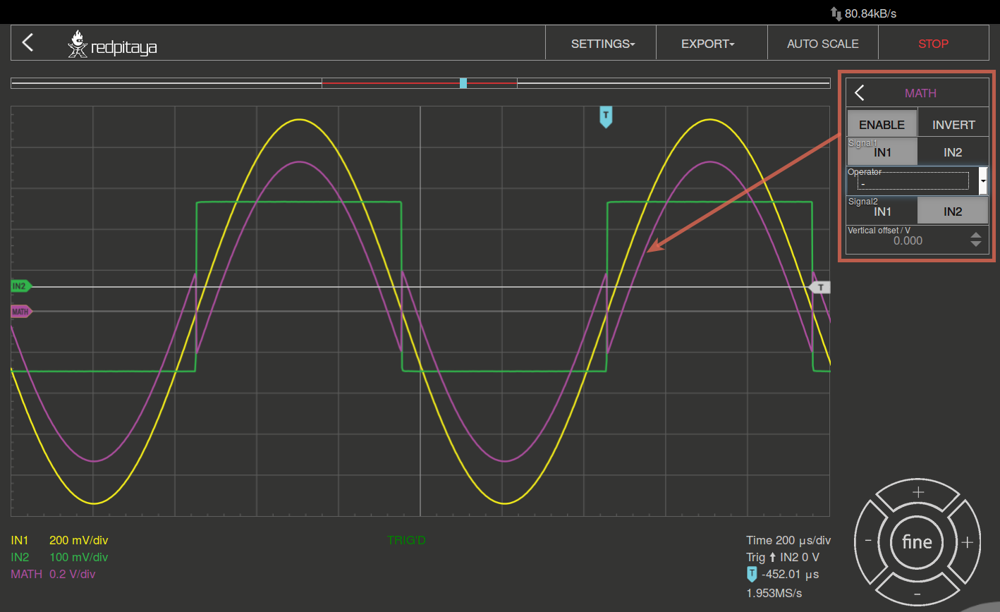

数字示波器的一项重要功能是“math”通道。可用设置如下：

    -   **\+** 将选定通道相加。
    -   **\-** 将选定通道相减。
    -   **\*** 将选定通道相乘。
    -   **ABS** 求选定信号的绝对值。
    -   **dy/dt** 求选定信号的时间导数。
    -   **ydt** 求选定信号的时间积分。
    -   **INVERT** 反转信号。

6. 输出/E2
===========

控制慢速模拟输出上的电压。在标有慢速模拟输出编号的字段中输入以 Volts 为单位的值。

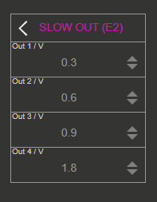

7. 游标
==========

此功能便于用户获取相关基本测量数据，例如信号周期、幅度、时间延迟、两点间幅度差、两点间时间差等。单击并拖动屏幕上的游标即可移动它们。

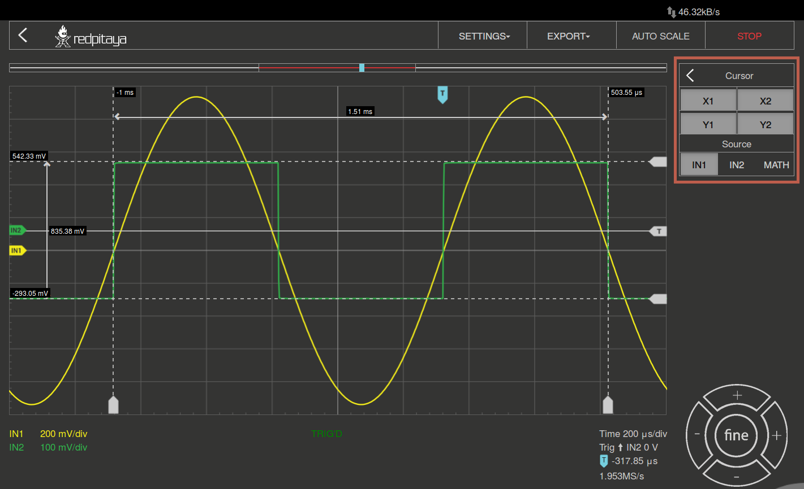

8. 导航
===========

当需要分析大量数据时，便捷浏览数据非常重要。将数据拖动到所需位置即可左右导航，使用鼠标滚轮即可轻松放大和缩小。

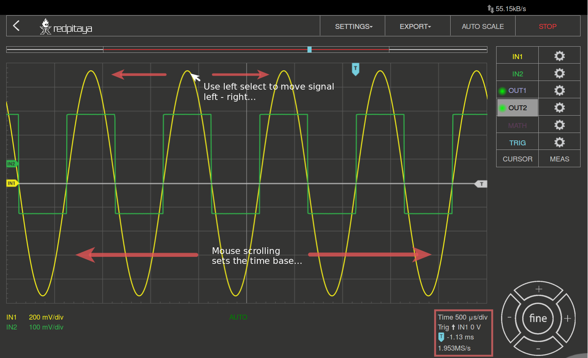

.. tip::

    -   选中通道时使用 **Shift + 滚轮** ，仅沿 **Y 轴** （电压刻度）缩放该通道的信号。
    -   **单击游标** 左侧的通道，可将该通道设为 **活动通道** 。

9. 测量
===============

菜单位于 **MEAS** 按钮下方。在这里最多可以选择 4 个测量值，然后提供相应参数。在 Operator 字段中选择所需测量项目，再设置从哪个通道获取信号。单击 DONE 后，数值会显示在通道设置底部。可选择以下项目：

    -   **P2P** - 测得的最低与最高电压值之差。
    -   **MEAN** - 信号的计算平均值。
    -   **MAX** - 测得的最大电压值。
    -   **MIN** - 测得的最低电压值。
    -   **RMS** - 信号的计算 RMS（均方根）。
    -   **DUTY CYCLE** - 信号占空比（脉冲持续时间与周期长度之比）。
    -   **PERIOD** - 显示周期长度，即振动的时间长度。
    -   **FREQ** - 信号频率。

单击列表中的特定测量项目即可移除该测量。

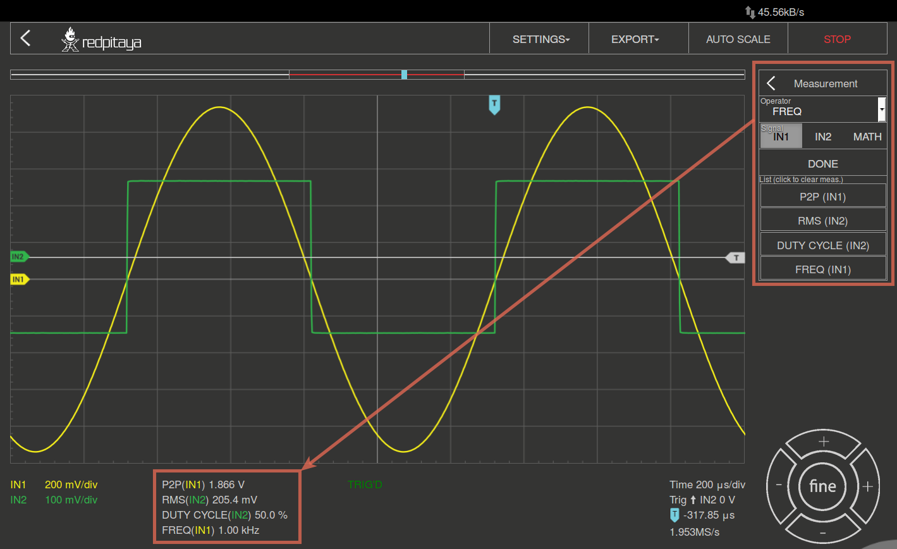

规格
**************

示波器
============

.. list-table::
    :widths: 30 30 30 30 30 30 30
    :header-rows: 1

    * -
      - STEMlab 125-14 [#f3]_, STEMlab 125-14 Gen 2 [#f3]_, STEMlab 125-14 TI
      - STEMlab 125-14 4-Input
      - STEMlab 65-16 TI
      - SDRlab 122-16
      - SIGNALlab 250-12
      - STEMlab 125-10
    * - 输入通道
      - 2
      - 4
      - 2
      - 2
      - 2
      - 2
    * - 带宽
      - 50 MHz
      - 50 MHz
      - 25 MHz
      - 300 kHz - 50 MHz
      - 60 MHz
      - 40 MHz
    * - 分辨率
      - 14 bit
      - 14 bit
      - 16 bit
      - 16 bit
      - 12 bit
      - 10 bit
    * - 存储深度
      - 16k samples
      - 16k samples
      - 16k samples
      - 16k samples
      - 16k samples
      - 16k samples
    * - 输入范围
      - ±1 V (LV) [#f1]_
        ±20 V (HV)
      - ±1 V (LV) [#f1]_
        ±20 V (HV)
      - ±1 V (LV) [#f1]_
        ±20 V (HV)
      - ±0.25 V / -2 dBm
      - ±1 V (LV) [#f2]_
        ±20 V (HV)
      - ±1 V (LV) [#f1]_
        ±20 V (HV)
    * - 输入耦合
      - DC
      - DC
      - DC
      - AC
      - AC/DC [#f2]_
      - DC
    * - 最小电压灵敏度
      - ±0.122 mV (LV)
        ±2.44 mV (HV)
      - ±0.122 mV (LV)
        ±2.44 mV (HV)
      - ±30.5 µV (LV)
        ±0.61 mV (HV)
      - ±7.6 µV
      - ±0.488 mV (LV)
        ±9.76 mV (HV)
      - ±1.95 mV (LV)
        ±39 mV (HV)
    * - 外部触发
      - E1 connector (DIO0_P)
      - E1 connector (DIO0_P)
      - E1 connector (DIO0_P)
      - E1 connector (DIO0_P)
      - BNC 触发连接器
      - E1 connector (DIO0_P)
    * - 输入阻抗
      - 1 MΩ
      - 1 MΩ
      - 1 MΩ
      - 50 Ω
      - 1 MΩ
      - 1 MΩ

信号发生器
================

.. list-table::
    :widths: 30 30 30 30 30 30 30
    :header-rows: 1

    * -
      - STEMlab 125-14 Gen 2 [#f3]_, STEMlab 125-14 TI, STEMlab 65-16 TI
      - STEMlab 125-14 [#f3]_
      - STEMlab 125-14 4-Input
      - SDRlab 122-16
      - SIGNALlab 250-12
      - STEMlab 125-10
    * - 输出通道
      - 2
      - 2
      - N/A
      - 2
      - 2
      - 2
    * - 频率范围
      - 0 - 50 MHz
      - 0 - 50 MHz
      - N/A
      - 300 kHz - 50 MHz
      - 0 - 60 MHz
      - 0 - 50 MHz
    * - 分辨率
      - 14 bit
      - 14 bit
      - N/A
      - 14 bit
      - 12 bit
      - 10 bit
    * - 信号缓冲区
      - 16k samples
      - 16k samples
      - N/A
      - 16k samples
      - 16k samples
      - 16k samples
    * - 输出范围
      - ±1 V @ 50 Ω
        ±2 V @ Hi-Z
      - ±1 V
      - N/A
      - ±0.25 V/ -2 dBm @ 50 Ω
      - ±1 V @ 50 Ω (x1 scaling)
        ±2 V @ Hi-Z (x1 scaling)
        ±5 V @ 50 Ω (x5 scaling)
        ±10 V @ Hi-Z (x5 scaling)
      - ±1 V
    * - 耦合
      - DC
      - DC
      - N/A
      - AC
      - AC/DC [#f2]_
      - DC
    * - 输出负载
      - 50 Ω / High-Z
      - 50 Ω
      - N/A
      - 50 Ω
      - 50 Ω / High-Z
      - 50 Ω

.. [#f1] 可通过跳线选择

.. [#f2] 可通过软件选择

.. [#f3] 及其变体。

源代码
************

:rp-github:`示波器与信号发生器源代码 <RedPitaya/tree/master/apps-tools/scopegenpro>` 可在我们的 GitHub 上获取。
