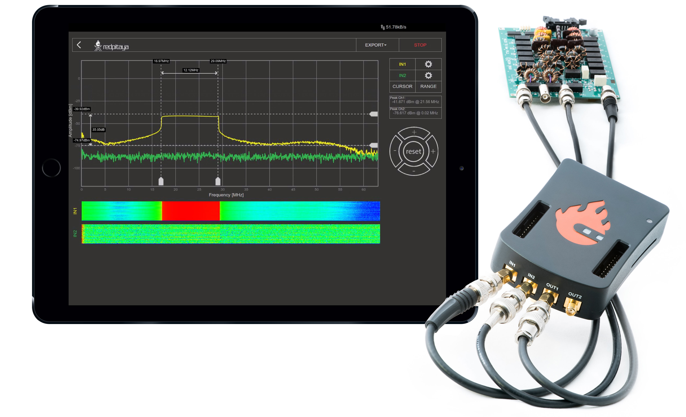
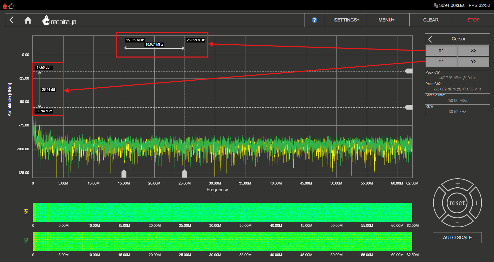
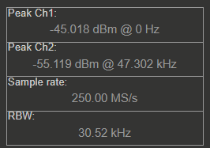

.. _spec_anal_app:

频谱分析仪
#################

此应用可将 Red Pitaya 板卡变为双通道 DFT 频谱分析仪。它非常适合教育工作者、学生、创客、爱好者以及需要经济且功能强大的测试与测量设备的专业人员。DFT 频谱分析仪应用使用 DFT 算法，可快速、强力地完成频谱分析。

频率跨度为 DC 至 62.5 MHz，用户可以任意选择频率范围。您可以轻松测量信号质量、信号谐波、杂散分量和功率。所有 Red Pitaya 应用均基于 Web，无需安装任何本机软件。用户可以在运行任意常见操作系统（MAC、Linux、Windows、Android 和 iOS）的智能手机、平板电脑或 PC 上通过 Web 浏览器访问这些应用。DFT 频谱分析仪应用的各个元素布局合理，提供熟悉的用户界面。

.. figure:: img/spectrum_main.png
	:width: 1000

除图形外，用户界面由四个区域组成：

    1.  **顶部设置菜单** - 提供设置、导出数据、清除显示以及运行/停止测量等基本功能。
    #.  **通道设置和测量** - 此菜单用于控制输入、光标和频率范围设置。
    #.  **坐标轴控制面板** - 按下水平 ± 按钮可改变时间轴（X 轴）刻度。垂直 ± 按钮可改变幅度轴（Y 轴），从而改变信号显示的幅度范围。
    #.  **瀑布图** - 瀑布图以另一种方式表示信号频谱，图中的颜色表示某一频率处的信号幅度。瀑布图还可用于以随时间变化的方式表示信号频谱。

|

功能
**********

.. contents:: Table of contents
    :local:
    :backlinks: top

|

1. 顶部设置菜单
=====================

用于控制频谱分析仪应用。蓝色问号会打开当前文档页面。

.. figure:: img/spectrum_top_menu.png
    :width: 600

设置
----------

设置菜单用于控制应用设置：

* **Save** - 使用指定名称保存当前频谱分析仪设置。设置保存在 SD 卡的本地存储中（取决于板卡型号）。
* **Reset** - 将所有频谱分析仪设置恢复为默认值。
* **Recall** （用户指定名称） - 调取之前保存的频谱分析仪设置。每个已保存的设置都会列在下拉菜单中，用户可选择所需设置。

菜单
-----

包含以下设置：

* **ARB Manager** - 直接进入 :ref:`任意波形管理器应用 <arb_manager_app>`，可在其中上传用于生成的自定义波形。
* **ADC 16 bit** - 选中后，在抽取因子足够高时，频谱分析仪将以 16 位分辨率显示数据（适用于原生分辨率不是 16 位的板卡）。

.. - **Ext. Clock** (only SIGNALlab 250-12) - Enables the External Clock synchronisation for the SIGNALlab. For more info see the chapter below.

.. External reference clock (only SIGNALlab 250-12)
.. -------------------------------------------------

.. The external reference clock input can be enabled through the settings menu. Once enabled, its status is displayed in the main interface. The "green" status indicates that the sampling clock is locked to the external reference clock.
.. 
.. .. figure:: img/osc_top_menu_ext_clk.png
..     :width: 500

清除
------

清除频谱图，并重置频谱信号的最小/最大值。

运行/停止
-----------

启动/停止数据采集和频谱分析仪。停止时，主图形会冻结。

|

2. 输入
==========

在频谱分析仪应用界面的右侧会列出 IN1 和 IN2 通道。只需点击通道名称（而不是齿轮图标）即可高亮该通道，然后可以控制相应通道的所有设置。各设备型号可用的设置如下：

.. tabs::

    .. group-tab:: STEMlab 125-14, 125-10, 4-Input

        .. figure:: img/spectrum_inputs_standard.png
            :height: 400

        * **Show** - 显示或隐藏与通道对应的曲线。
        * **Freeze** - 冻结与通道对应的曲线。
        * **Min** - 启用或禁用频谱图的保持模式。启用“MIN”按钮后，MIN 信号频谱图会显示采集到的信号频谱最低值。
        * **Max** - 启用或禁用频谱图的保持模式。启用“MAX”按钮后，MAX 信号频谱图会显示采集到的信号频谱最高值。
        * **Probe attenuation** -（必须手动选择）探头的衰减倍数。
        * **Input attenuation (LV and HV)** - 板卡输入衰减。必须根据每个通道的 :ref:`跳线位置 <anain>` 进行选择。
        * **Filter (On/Off)** - 启用或禁用输入通道上的频率均衡滤波器。Gen 2 板卡禁用此滤波器。
        * **Reset minmax** - 重置所选通道的信号频谱最小/最大值。

    .. group-tab:: SDRlab 122-16

        .. figure:: img/spectrum_inputs_sdrlab.png
            :height: 400

        * **Show** - 显示或隐藏与通道对应的曲线。
        * **Freeze** - 冻结与通道对应的曲线。
        * **Min** - 启用或禁用频谱图的保持模式。启用“MIN”按钮后，MIN 信号频谱图会显示采集到的信号频谱最低值。
        * **Max** - 启用或禁用频谱图的保持模式。启用“MAX”按钮后，MAX 信号频谱图会显示采集到的信号频谱最高值。
        * **Probe attenuation** -（必须手动选择）探头的衰减倍数。
        * **Reset minmax** - 重置所选通道的信号频谱最小/最大值。

    .. group-tab:: SIGNALlab 250-12

        .. figure:: img/spectrum_inputs_signallab.png
            :height: 400

        * **Show** - 显示或隐藏与通道对应的曲线。
        * **Freeze** - 冻结与通道对应的曲线。
        * **Min** - 启用或禁用频谱图的保持模式。启用“MIN”按钮后，MIN 信号频谱图会显示采集到的信号频谱最低值。
        * **Max** - 启用或禁用频谱图的保持模式。启用“MAX”按钮后，MAX 信号频谱图会显示采集到的信号频谱最高值。
        * **Probe attenuation** -（必须手动选择）探头的衰减倍数。
        * **输入衰减（Input attenuation，LV 和 HV）** - 调整 dBm/div 设置时会自动选择 1:1 (± 1V) / 1:20 (± 20V)；用户也可以通过 Web 界面手动选择范围。
        * **Input coupling (DC/AC)** - 选择输入耦合方式。
        * **Filter (On/Off)** - 启用或禁用输入通道上的频率均衡滤波器。Gen 2 板卡禁用此滤波器。
        * **Reset minmax** - 重置所选通道的信号频谱最小/最大值。

|

3. 光标
============

光标是额外的一对垂直和水平线，可用于提取频谱图中的数值。

光标可交互操作，可以放置在图形的任意位置。图中会显示 X 光标所在位置对应的频率值以及 Y 光标所在位置对应的幅度值。光标差值可用于测量信号谐波以及幅度和频率之间的相对比值。

|

4. 范围
=========

范围设置用于设定频率跨度。当关注的频率范围小于频谱分析仪应用的完整频率范围时，此功能非常有用。

.. figure:: img/spectrum_range.png
	:width: 1000

|

5. 输出
============

在示波器和信号发生器应用界面的右侧会列出 OUT1 和 OUT2 通道。只需点击通道名称（而不是齿轮图标）即可高亮该通道，然后可以控制相应通道的所有设置。可用设置如下：

.. tabs::

    .. group-tab:: STEMlab 125-14, 125-10, 4-Input

        .. figure:: img/spectrum_outputs_standard.png
            :height: 500

        * **ON** - 启用/关闭发生器输出。
        * **Waveform Type** - 正弦波、方波（矩形波）、三角波、Sawu（上升锯齿波）、Sawd（下降锯齿波）、DC、DC_NEG、PWM（脉宽调制）和 NOISE（白噪声）。通过 :ref:`ARB Manager 应用 <arb_manager_app>` 提供的自定义波形也会显示在此处。
        * **Sweep mode** - 配置扫频模式设置（见下文）。
        * **Frequency** - 输出信号频率（1 Hz - 50 MHz）。
        * **Amplitude** - 输出信号的单向幅度（以 GND 为参考）。
        * **Offset** - DC 偏置。
        * **Phase** - 输出信号的相位。
        * **Duty cycle** - PWM 信号占空比。
        * **Rise/Fall time** - 输出信号的最小上升和下降时间。
        * **Load** - 输出负载（50 Ohm 或 High-Z）。

    .. group-tab:: SDRlab 122-16

        .. figure:: img/spectrum_outputs_sdrlab.png
            :height: 500

        * **ON** - 启用/关闭发生器输出。
        * **Waveform Type** - 仅支持正弦波（由于 AC 耦合）。通过 :ref:`ARB Manager 应用 <arb_manager_app>` 提供的自定义波形也会显示在此处。
        * **Sweep mode** - 配置扫频模式设置（见下文）。
        * **Frequency** - 输出信号频率（300 kHz - 50 MHz）。
        * **Amplitude** - 输出信号的单向幅度（以 GND 为参考）。
        * **Phase** - 输出信号的相位。

    .. group-tab:: SIGNALlab 250-12

        .. figure:: img/spectrum_outputs_signallab.png
            :height: 500

        * **ON** - 启用/关闭发生器输出。
        * **Waveform Type** - 正弦波、方波（矩形波）、三角波、Sawu（上升锯齿波）、Sawd（下降锯齿波）、DC、DC_NEG、PWM（脉宽调制）和 NOISE（白噪声）。通过 :ref:`ARB Manager 应用 <arb_manager_app>` 提供的自定义波形也会显示在此处。
        * **Sweep mode** - 配置扫频模式设置（见下文）。
        * **Frequency** - 输出信号频率（1 Hz - 50 MHz）。
        * **Amplitude** - 输出信号的单向幅度（以 GND 为参考）。
        * **Output gain** - 显示输出增益级状态（x1 或 x5）。调整幅度时会自动设置输出增益级。
        * **Offset** - DC 偏置。
        * **Phase** - 输出信号的相位。
        * **Duty cycle** - PWM 信号占空比。
        * **Rise/Fall time** - 输出信号的最小上升和下降时间。
        * **Load** - 输出负载（50 Ohm 或 High-Z）。

.. note::

    STEMlab 125-14 4-Input 没有任何输出。

扫频模式
-----------

将输出配置为扫频模式。除频率外，所有其他设置均沿用连续模式（上方菜单）的设置。扫频模式会一直保持活动状态，直到将其关闭或将设置重置为默认值。关闭通道不会关闭扫频模式，但会停止生成扫频信号。输出通道设置中的相应指示灯会显示扫频模式状态。

.. figure:: img/spectrum_outputs_sweep.png
    :height: 300

* **Start Freq (Hz)** - 扫频起始频率，单位为 Hertz。
* **End Freq (Hz)** - 扫频结束/停止频率，单位为 Hertz。
* **Duration (μs)** - 扫频持续时间，单位为微秒。在 UP-DOWN 方向运行时，此时间适用于两个方向（若设置为 1000 ms，则 UP 方向扫频需要 1000 ms，随后 DOWN 方向也需要 1000 ms）。
* **Sweep Mode** - 可选 LINEAR 或 LOG。
* **Sweep Dir** - 扫频方向，可选 NORMAL 或 UP-DOWN。
* **Repetitions (NOR)** - 重复扫频次数，也称为 Number Of Repetitions (NOR)。
* **REPETITIONS INF** - 选中后，扫频信号将无限重复。

|

6. 设置
=============

.. tabs::

    .. group-tab:: STEMlab 125-14, 125-10, 4-Input

        .. figure:: img/spectrum_settings_standard.png
            :height: 500

        * **Type** - 选择信号频谱幅度轴（Y 轴）的单位。可用单位包括 dBm、dBµ、dBV、dBµV、V、mW 和 dBW。
        * **Impedance (Ω)** - 指定被测设备（DUT）的输入阻抗。可选 50 Ω 和 75 Ω。此值用于计算以 dBm、dBµ、mW 和 dBW 为单位的信号频谱幅度。
        * **X-axis** - 选择频率轴（X 轴）的缩放方式。可选线性缩放和对数缩放（normal、p2 和 p10）。
        * **Window** - 选择 DFT 算法的窗函数。可选 Rectangular、Hanning、Hamming、Blackman-Harris、Flat Top、Kaiser (β = 4) 和 Kaiser (β = 8)。
        * **Buffer size** - 选择 DFT 算法使用的采样数。可选 16384、8192、4096、2048、1024、512 和 256 个采样点。
        * **Remove DC** - 启用或禁用从信号频谱中移除 DC 分量。启用后会移除 DC 分量，这对于分析 AC 信号很有用。

    .. group-tab:: SDRlab 122-16

        .. figure:: img/spectrum_settings_standard.png
            :height: 500

        * **Type** - 选择信号频谱幅度轴（Y 轴）的单位。可用单位包括 dBm、dBµ、dBV、dBµV、V、mW 和 dBW。
        * **Impedance (Ω)** - 指定被测设备（DUT）的输入阻抗。可选 50 Ω 和 75 Ω。此值用于计算以 dBm、dBµ、mW 和 dBW 为单位的信号频谱幅度。
        * **X-axis** - 选择频率轴（X 轴）的缩放方式。可选线性缩放和对数缩放（normal、p2 和 p10）。
        * **Window** - 选择 DFT 算法的窗函数。可选 Rectangular、Hanning、Hamming、Blackman-Harris、Flat Top、Kaiser (β = 4) 和 Kaiser (β = 8)。
        * **Buffer size** - 选择 DFT 算法使用的采样数。可选 16384、8192、4096、2048、1024、512 和 256 个采样点。
        * **Remove DC** - 启用或禁用从信号频谱中移除 DC 分量。启用后会移除 DC 分量，这对于分析 AC 信号很有用。

    .. group-tab:: SIGNALlab 250-12

        .. figure:: img/spectrum_settings_signallab.png
            :height: 500

        * **Type** - 选择信号频谱幅度轴（Y 轴）的单位。可用单位包括 dBm、dBµ、dBV、dBµV、V、mW 和 dBW。
        * **Impedance (Ω)** - 指定被测设备（DUT）的输入阻抗。可选 50 Ω 和 75 Ω。此值用于计算以 dBm、dBµ、mW 和 dBW 为单位的信号频谱幅度。
        * **X-axis** - 选择频率轴（X 轴）的缩放方式。可选线性缩放和对数缩放（normal、p2 和 p10）。
        * **Window** - 选择 DFT 算法的窗函数。可选 Rectangular、Hanning、Hamming、Blackman-Harris、Flat Top、Kaiser (β = 4) 和 Kaiser (β = 8)。
        * **Buffer size** - 选择 DFT 算法使用的采样数。可选 16384、8192、4096、2048、1024、512 和 256 个采样点。
        * **Remove DC** - 启用或禁用从信号频谱中移除 DC 分量。启用后会移除 DC 分量，这对于分析 AC 信号很有用。
        * **Ext. Clock** - 启用 SIGNALlab 的外部时钟同步。详情请参见下文。

窗函数和缓冲区大小注意事项
-----------------------------------------------

报告的峰值幅度取决于所选窗函数，在较小程度上也取决于所选缓冲区大小。比较使用不同窗函数获得的测量结果时，预计会产生约 0.5 dB 至 2.5 dB 的差异。

缓冲区大小还会影响分辨率带宽（RBW）。更大的缓冲区可提供更窄的 RBW，从而改善间隔很近的信号之间的分离度，并可能降低显示的噪声底。代价是每次测量更新需要更长的采集/处理时间。

外部参考时钟（仅 SIGNALlab 250-12）：
---------------------------------------------------

可以通过设置菜单启用外部参考时钟输入。启用后，其状态会显示在主界面中。“绿色”状态表示采样时钟已锁定到外部参考时钟。

|

7. 测量
====================

频谱分析仪应用会自动测量信号频谱的以下参数：

* **Peak frequency** - 信号频谱峰值所在的频率。
* **Sampling rate** - 信号频谱的采样率（取决于频率范围）。
* **RBW** - 信号频谱的分辨率带宽（取决于频率范围）。

峰值检测
----------------

测量期间，信号频谱的峰值会被测量并显示在“Peak Values”字段中。无论选择何种频率范围，峰值都是信号频谱的最大值。这种峰值查找方式可避免看不到所选频率跨度之外的峰值。

采样率和 RBW
-----------------------

采样率和 RBW 会根据所选频率范围自动计算。采样率是信号频谱的采样速率，RBW 是用于测量信号频谱的滤波器带宽。RBW 与采样率成反比，即采样率越高，RBW 越低，反之亦然。

|

8. 坐标轴控制与导航
===============================

坐标轴控制与导航用于改变信号频谱的频率和幅度范围。水平 ± 按钮用于选择 X（频率）轴的跨度（放大/缩小）。垂直 ± 按钮改变 Y（幅度）轴范围。按下 Reset 按钮后，频率和幅度跨度会恢复为默认值。

缩放
--------

缩放功能允许用户放大信号频谱图。在图上感兴趣的区域单击并拖动鼠标即可放大。要缩小，请点击 Reset 按钮，频率和幅度跨度会恢复为默认值。

自动缩放
-----------

自动缩放功能会自动调整信号频谱图的频率和幅度跨度以适应数据。启用后，无论选择何种频率范围，自动缩放都会调整图形以显示完整的信号频谱。

|

9. 瀑布图
====================

瀑布图以另一种方式表示信号频谱，图中的颜色表示某一频率处的信号幅度。瀑布图还可用于以随时间变化的方式表示信号频谱。

|

规格
***************

.. list-table::
    :widths: 24 18 18 18 18 18 18
    :header-rows: 1

    * -
      - **STEMlab 125-14** [#f1]_, **STEMlab 125-14 Gen 2** [#f1]_, **STEMlab 125-14 TI**
      - **STEMlab 125-14 4-Input**
      - **STEMlab 65-16 TI**
      - **SDRlab 122-16**
      - **SIGNALlab 250-12**
      - **STEMlab 125-10**
    * - 输入通道
      - 2
      - 4
      - 2
      - 2
      - 2
      - 2
    * - 带宽
      - 0 - 60 MHz
      - 0 - 60 MHz
      - 0 - 30 MHz
      - 0 - 60 MHz
      - 0 - 60 MHz
      - 0 - 50 MHz
    * - 分辨率
      - 14 bit
      - 14 bit
      - 16 bit
      - 16 bit
      - 12 bit
      - 10 bit
    * - DFT 缓冲区
      - 16384
      - 16384
      - 16384
      - 16384
      - 16384
      - 16384
    * - 动态范围
      - 80 dB
      - 80 dB
      - 96 dB
      - 96 dB
      - 74 dB
      - 60 dB
    * - 输入噪声电平
      - < -119 dBm/Hz
      - < -119 dBm/Hz
      -
      -
      -
      - < -100 dBm/Hz
    * - 输入范围
      - 10 dBm
      - 10 dBm
      - 10 dBm
      - -2 dBm
      - 10 dBm（LV 模式）
      - 10 dBm
    * - 输入阻抗
      - 1 MΩ / 10 pF
      - 1 MΩ / 10 pF
      - 1 MΩ / 10 pF
      - 50 Ω
      - 1 MΩ / 10 pF
      - 1 MΩ / 10 pF
    * - 输入耦合
      - DC
      - DC
      - DC
      - AC
      - AC/DC
      - DC
    * - 杂散频率分量
      - 通常 < -90 dBFS
      - 通常 < -90 dBFS
      -
      -
      -
      - 通常 < -70 dBFS

.. ! Revise the measurements

.. [#f1] 这包括 STEMlab 125-14 及其变体（外部时钟、LN 等）。STEMlab 125-14 Gen 2 板卡（PRO、PRO Z7020 等）同样适用。

|

源代码
*************

我们的 GitHub 上提供了 :rp-github:`频谱分析仪源代码 <RedPitaya/tree/master/apps-tools/spectrumpro>`。
