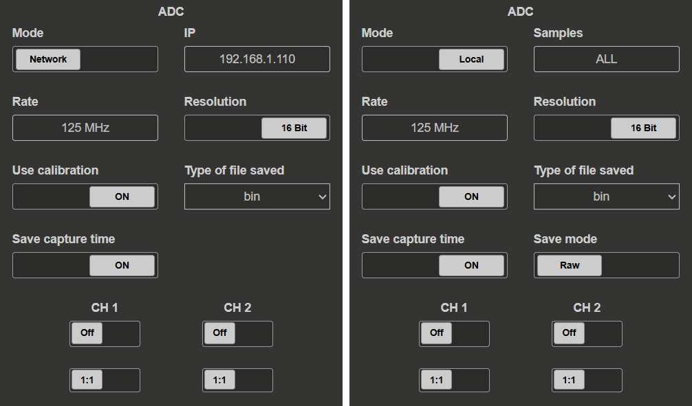

.. _stream_adc_config:

#############################
ADC 流配置
#############################

ADC 配置部分允许用户设置数据采集过程的参数。设置取决于
所选的 **Mode** （*Network* 或 *Local*）。

.. contents:: 目录
    :local:
    :backlinks: top

|

配置模式
********************

.. tabs::

    .. group-tab:: Network

        用户可以设置：

        * **IP address** - Red Pitaya 板卡的 IP 地址。  
        * **Rate** - 采样频率（速率）。应根据所选设置和 :ref:`data streaming limitation <streaming_limits>` 计算。
        * **Resolution** - 输入通道分辨率（8 或 16 位）。决定每个样本的字节数（1 或 2）。
        * **Use calibration** - 选择是否使用输入校准。
        * **Type of file saved** - 选择保存数据的文件格式。 支持以下格式：
            
            * WAV (标准音频文件格式) (WAV 文件最大大小为 4 GB),
            * TDMS (技术数据管理流文件格式),
            * BIN（快速紧凑的二进制格式）。可使用 :ref:`convert_tool <streaming_convert_tool>` 应用转换为 CSV 格式。

        * **Save capture time** - 选择是否将采集时间保存到文件名中。采集时间保存格式为： *YYYY-MM-DD HH:MM:SS*.
          此选项还会保存各个样本的采集时间（适用于所有文件格式）。
        * **输入通道** - 通过打开相应开关，选择用于数据采集的输入通道。 可用选项如下：
            
            * 通道 1 (CH1),
            * 通道 2 (CH2),
            * 通道 3 (CH3) - *仅限 STEMlab 125-14 4-Input*,
            * 通道 4 (CH4) - *仅限 STEMlab 125-14 4-Input*.

        * **输入衰减** - 为每个通道选择输入衰减模式。可用选项如下：
            
            * 1:20 - HV (高电压模式),
            * 1:1 - LV (低电压模式).

        *Save mode* 设置在远程客户端一侧指定。

        .. note::

            旧版 OS 还包含 **Port** 设置，用户可在其中指定数据流的网络端口号。
            流端口号现已固定。有关详情，请参见 :ref:`配置详情 <stream_port_numbers>`。

    .. group-tab:: Local

        用户可以设置：

        * **Samples** - 要采集的样本数（*ALL* 表示无限采样）
        * **Rate** - 采样频率（速率）。应根据所选设置和:ref:`data streaming limitation <streaming_limits>`.
        * **Resolution** - 输入通道分辨率（8 或 16 位）。决定每个样本的字节数（1 或 2）。
        * **Use calibration** - 选择是否使用输入校准。
        * **Type of file saved** - 选择保存数据的文件格式。 支持以下格式：
            
            * WAV (标准音频文件格式) (WAV 文件最大大小为 4 GB),
            * TDMS (技术数据管理流文件格式),
            * BIN（快速紧凑的二进制格式）。可使用 :ref:`convert_tool <streaming_convert_tool>` 应用转换为 CSV 格式。

        * **Save capture time** - 选择是否将采集时间保存到文件名中。采集时间保存格式为： *YYYY-MM-DD HH:MM:SS*.
          此选项还会保存各个样本的采集时间（适用于所有文件格式）。
        * **保存模式：** 选择数据的保存模式。支持以下模式：
            
            * RAW (ADC 计数形式的原始数据),
            * VOLTS (转换为 Volts 的数据).
        
        * **输入通道:** 通过打开相应开关，选择用于数据采集的输入通道。 可用选项如下：
            
            * 通道 1 (CH1),
            * 通道 2 (CH2),
            * 通道 3 (CH3) - *仅限 STEMlab 125-14 4-Input*,
            * 通道 4 (CH4) - *仅限 STEMlab 125-14 4-Input*.

        * **输入衰减:** 为每个通道选择输入衰减模式。可用选项如下：
            
            * 1:20 - HV (高电压模式),
            * 1:1 - LV (低电压模式).

|

文件格式
*************

ADC 流支持以下文件格式：

* **WAV (Wave Audio File Format)** - 最大文件大小为 4 GB 的标准音频文件格式，与大多数音频处理软件兼容。
* **TDMS (Technical Data Management Streaming)** - National Instruments 文件格式，专为高速数据采集和记录设计。
* **BIN (Binary)** - 快速紧凑的二进制格式。可使用 :ref:`convert_tool <streaming_convert_tool>` 应用转换为 CSV 格式。

|

时间戳
**********

**Save capture time** 选项允许用户将采集时间包含在文件名中，并保存各个样本的采集时间。采集时间保存格式为： *YYYY-MM-DD HH:MM:SS*. 
此功能有助于将数据与特定事件关联，或用于后处理分析。时间戳信息来自 FPGA 中的时间戳寄存器，确切分辨率取决于
FPGA 的核心时钟，但通常为纳秒量级。

|

保存模式
***********

本地流式传输数据时，可以选择保存模式：

* **RAW** - 以 ADC 计数形式保存原始数据（ADC 的原生格式）。
* **VOLTS** - 根据衰减设置将数据转换为 Volts 并保存。

.. note::

    RAW 模式更紧凑且保存速度更快，而 VOLTS 模式更便于分析。应根据具体使用场景和后处理要求进行选择。
    如果选择了“Use calibration”选项，两种模式都会自动包含校准。

|

通道配置
**********************

输入通道
===============

选择用于数据采集的输入通道：

* **CH1** - 始终可用
* **CH2** - 始终可用
* **CH3** - 仅限 STEMlab 125-14 4-Input
* **CH4** - 仅限 STEMlab 125-14 4-Input

.. note::

    启用更多通道会因数据吞吐量增加而降低最大采样率。有关详情，请参见 
    详情请参见 :ref:`数据流限制 <streaming_limits>`。

|

输入衰减
==================

为每个活动通道选择输入衰减模式：

* **1:1 - LV（低电压模式）：** ±1V 输入范围
* **1:20 - HV（高电压模式）：** ±20V 输入范围

衰减设置会影响每个通道的输入范围和灵敏度。

|

后续步骤
***********

* 如果需要信号生成，请配置 :ref:`DAC 流 <stream_dac_config>`
* 设置 :ref:`内存配置 <stream_memory_config>` 以优化性能
* 了解 :ref:`数据流限制 <streaming_limits>` 以计算最大采样率
