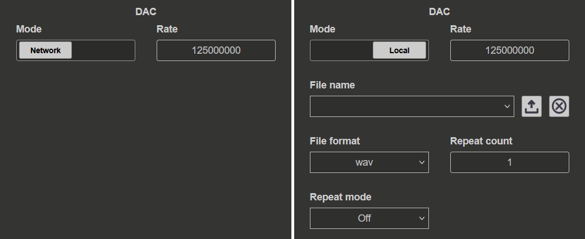

.. _stream_dac_config:

#############################
DAC 流式传输配置
#############################

DAC 配置部分允许用户设置数据生成过程的参数。设置取决于所选的 **Mode** （*Network* 或 *Local*）。

.. contents:: 目录
    :local:
    :backlinks: top

|

配置模式
********************

.. tabs::

    .. group-tab:: Network

        用户可以设置：

        * **Rate** - DAC 采样输出频率（速率）。应根据 :ref:`数据流式传输限制 <streaming_limits>` 进行选择。

        其他设置在 */root/.config/redpitaya/apps/streaming/streaming_config.json* 配置文件中指定。可以手动更新该文件，也可以通过 :ref:`命令行客户端 <stream_command_client>` 更新。

    .. group-tab:: Local

        用户可以设置：

        *   **Rate** - DAC 采样输出频率（速率）。应根据 :ref:`数据流式传输限制 <streaming_limits>` 进行选择。
        *   **File name** - 从下拉菜单选择用于生成数据的文件。文件必须为 WAV 或 TDMS 格式。两个按钮分别用于上传文件和删除所选文件。
        *   **File format** - 选择用于数据生成的文件格式。支持以下格式：
            
            * WAV（标准音频文件格式）；
            * TDMS（Technical Data Management Streaming 文件格式）。

        *   **Repeat mode** - 选择数据生成的重复模式。支持以下模式：
            
            * **Off** - 文件生成一次后停止流式传输。
            * **On** - 文件生成 *Repeat count* 次后停止流式传输。
            * **Infinity** - 持续生成文件，直到停止流式传输。

        *   **Repeat count** - 文件重复的次数。

WAV 和 TDMS 文件格式最多可以同时包含两个通道的信号。由于当前没有 **Channel select** 选项，第一个通道将在 OUT1 上生成，第二个通道将在 OUT2 上生成。

.. note::

    当前唯一支持的格式是 16-bit RAW。未来还将支持其他格式和 8-bit 模式。

|

DAC 流式传输模式
********************

DAC 流式传输有两种工作模式：

* **One-pack mode** - 数据文件小于 ``block size`` 变量。数据只发送到板卡一次，并生成 *repetition* 次。该模式允许最高 125 MS/s 的 DAC 速率。
* **True streaming mode** - 数据文件大于 ``block size``。数据从计算机流式传输到板卡。该模式允许最高 62.5 MS/s 的 DAC 速率。

One-pack 模式
==============

如果数据文件大小小于 ``block size`` 变量，应用会将单个数据块（block_size）从计算机传输到板卡。生成数据存储在 :ref:`DMM memory <deepMemoryMode>` 中，并可按完整核心时钟速度（通常为 125 MHz）生成。数据会按照 **Repeat count** 设置中指定的次数生成。

* **Maximum dac_rate** - 通常为 125 MHz（125 MS/s）（取决于 FPGA 核心时钟速度）
* **Use case** - 短波形、任意波形生成

|

True streaming 模式
====================

如果数据文件大小大于 ``block size`` 变量，数据就会从计算机流式传输到板卡。为获得最佳性能，建议将 ``block size`` 设置为 1 MB 或更大。

* **Maximum stable dac_rate** - 62.5 MHz（62.5 MS/s）
* **Use case** - 长波形、连续信号生成

.. warning::

    在 True streaming 模式下将 DAC 速率设置为高于 62.5 MHz，可能导致生成信号出现间隙，并使信号生成不稳定。

.. note::

    当前只能通过 :ref:`命令行客户端 <stream_command_client>` 远程生成数据。桌面应用目前不支持此功能。

|

文件格式
*************

DAC 流式传输支持以下文件格式：

* **WAV（Wave Audio File Format）** - 标准音频文件格式。最大文件大小为 4 GB。
* **TDMS（Technical Data Management Streaming）** - National Instruments 文件格式。

两种格式最多都可以包含两个通道（OUT1 和 OUT2）。

.. note::

    DAC 流式传输目前限于 16-bit 分辨率以及 WAV 或 TDMS 文件格式。WAV 文件格式的最大大小为 4 GB，因此在 16-bit 分辨率下，最多约可生成 2.68 亿个采样。

|

数据生成限制
****************************

有关 DAC 流式传输的实际限制和推荐设置，请参阅 :ref:`数据生成限制 <stream_dac_limitations>`。

|

ADC 与 DAC 同时流式传输
************************************

ADC 和 DAC 流式传输可以同时工作，用户可以同时从快速模拟输入采集数据，并在快速模拟输出上生成信号。

.. note::
    
    请注意，同时运行两种模式时，处理器负载会增加，每种模式的最大性能都会降低。

|

后续步骤
***********

* 尝试 :ref:`DAC 流式传输示例 <stream_dac_cli_example>`，了解如何生成自定义波形
* 查看 :ref:`数据生成限制 <stream_dac_limitations>`，了解性能约束
* 配置 :ref:`内存设置 <stream_memory_config>`，优化 DAC 流式传输性能
