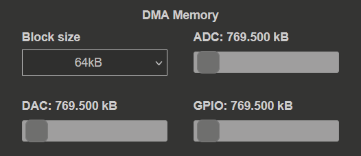

.. _stream_memory_config:

#########################
内存配置
#########################

内存配置区域管理 :ref:`深度存储模式（DMM） <deepMemoryMode>` 的保留内存区域，该区域由数据流应用和其他内存密集型操作共享。

.. contents:: 目录
    :local:
    :backlinks: top

|

配置选项
**********************

本节可以指定以下设置：

块大小
===========

* **说明：** 通过网络传输的数据包（数据块）大小。
* **范围：** 2 kB 至 8 MB
* **默认值：** 64 kB
* **选择方式：** 下拉菜单

块大小表示可通过网络发送的内存块最小大小。该大小由软件（CMemoryManager）管理，并决定向桌面应用传输数据时如何分块。

|

内存分配
==================

内存管理器提供三个滑块（ADC、DAC 和 GPIO），用于设置每种模式分配的内存量：

* **ADC：** 为 ADC 数据流保留的内存（默认值：769.5 kB）
* **DAC：** 为 DAC 数据流保留的内存（默认值：769.5 kB）
* **GPIO：** 为 GPIO 数据流保留的内存（默认值：769.5 kB）- **尚未实现**

使用滑块选择所需内存大小。可以指定全部保留内存，也可以只指定其中一部分。

.. note::

    GPIO 数据流模式尚未实现。

|

选择块大小
*************************

块大小应根据数据流速度和应用需求确定。

小块大小（2 kB - 256 kB）
====================================

**用于低数据流速率**

* **优点：** 填充所需时间更短，尤其是在抽取值较高时。
* **缺点：** 需要通过网络传输更多数据包。
* **推荐用于：** 低采样率（< 1 MS/s）。

示例：在 2 通道、16 位分辨率和 10 kS/s 速率下，填充 64 kB 块需要约 1.6 秒。

|

大块大小（1 MB - 8 MB）
=================================

**用于高数据流速率**

* **优点：** 实现最大网络传输性能（相同数据量下通过网络传输的次数更少）。
* **缺点：** 在低采样率下填充需要更长时间。
* **推荐用于：** 高采样率（> 10 MS/s）。

示例：在 62.5 MHz 下，使用至少 4 MB 的块大小可获得最佳性能。

.. warning::

    在 10 kS/s 下填充 8 MB 块约需 800 秒。请合理选择块大小。

|

内存分配策略
****************************

总保留内存（默认值 32 MB）必须在三种模式（ADC、DAC、GPIO）之间分配。

单模式运行
=======================

如果只需要一种模式（例如仅 ADC 数据流），可以将全部保留内存分配给该模式。

示例：

* ADC: 32 MB
* DAC: 0 MB
* GPIO: 0 MB

|

双模式运行
====================

同时运行 ADC 和 DAC 时，必须根据需求按比例分配内存。

ADC/DAC 均衡分配示例：

* ADC: 16 MB
* DAC: 16 MB
* GPIO: 0 MB

偏重 ADC 的工作负载示例：

* ADC: 24 MB
* DAC: 8 MB
* GPIO: 0 MB

|

内存警告
================

如果滑块数值显示为红色，表示为所选设置保留的内存不足。使用滑块调整保留内存量，直到数值恢复为白色。

.. note::

    如果将全部内存分配给 ADC 数据流，将无法使用 DAC 模式，因为没有足够内存。

|

更改保留内存大小
*******************************

保留的 :ref:`深度存储模式 <deepMemoryMode>` 区域默认大小为 32 MB，可以通过以下方式更改：

1. 在 Web 界面的 :ref:`系统信息设置 <system_info>` 中更改。
2. 在系统配置中 :ref:`手动更改大小 <DMM_change_reserved_memory>`。

增加保留内存大小可以：

* 使用更大的块大小。
* 为每种数据流模式提供更多内存。
* 改善 DAC one-pack 模式的性能。

.. warning::

    增加保留内存会减少其他应用和操作系统可用的内存。

|

内存错误故障排除
*******************************

常见错误：“Not enough memory”
==================================

**原因：**

1. 分配的总内存（ADC + DAC + GPIO）超过保留的 DMM 区域。
2. 块大小对于可用内存而言过大。
3. 对于 DAC 数据流，未选择用于生成数据的文件。

**解决方案：**

1. 减少一种或多种模式的内存分配。
2. 增大保留 DMM 区域的大小。
3. 使用更小的块大小。
4. 确保已为 DAC 数据流选择有效文件。

|

后续步骤
***********

* 了解 :ref:`数据流限制 <streaming_limits>`，理解内存如何影响性能。
* 根据内存分配配置 :ref:`ADC 数据流 <stream_adc_config>` 或 :ref:`DAC 数据流 <stream_dac_config>`。
* 查看 :ref:`高级配置 <stream_advanced_config>`，了解配置文件管理。
