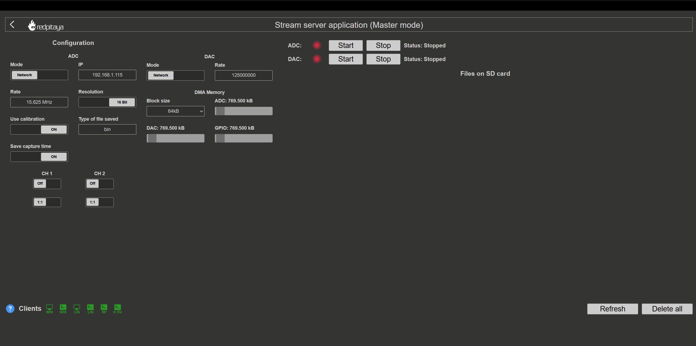
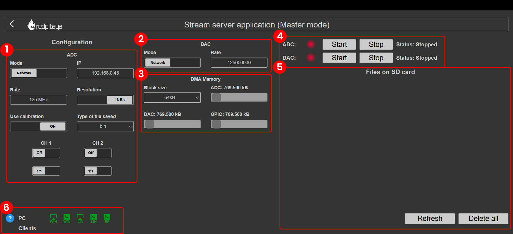

.. _streaming_top:

#########################
数据流控制
#########################

数据流控制（也称为 Streaming 应用）提供在 Red Pitaya 与计算机之间传输数据的能力。通过将多个板卡同步在一起，还可以扩展此功能以创建多通道系统（:ref:`X 通道系统 <x-ch_streaming>` 和 :ref:`X-channel 2.0（Click Shield）同步 <click_shield_sync>`）。

.. contents:: Table of contents
    :local:
    :backlinks: top

|

概述
**********

Streaming 应用旨在提供一种在 Red Pitaya 与计算机之间传输数据的简单高效方式。它同时支持 ADC 和 DAC 数据流，用户可以从快速模拟输入采集数据，并在快速模拟输出上生成信号。

此应用使用与 :ref:`深度存储模式 <deepMemoryMode>` 共享的保留内存区域，临时存储传入和传出板卡的数据流。这既能实现高效的数据传输与处理，也能为各种应用提供灵活且可扩展的解决方案。

主要功能
=============

* **从 Red Pitaya 快速模拟输入连续传输数据** (:ref:`ADC 数据流最大速率限制 <streaming_limits>`)：
    
    * 通过 TCP 以太网协议远程传输到计算机（:ref:`最大 62.5 MB/s <streaming_limits>`）。
    * 在本地传输到 Red Pitaya SD 卡上的文件（:ref:`最大 10 MB/s <streaming_limits>`）。

* **向 Red Pitaya 快速模拟输出连续传输数据** (:ref:`DAC 数据流最大速率限制 <streaming_limits>`)：

    * 通过 TCP 以太网协议从计算机上的文件远程传输（:ref:`最大 62.5 MB/s <streaming_limits>`）。
    * 在本地从 Red Pitaya SD 卡上的文件传输（:ref:`最大 10 MB/s <streaming_limits>`）。

* **GPIO 数据流**（**未来开发**）：

    * GPIO 数据流的基础工作已经完成，将在未来更新中发布。

* 面向多通道系统的**多板卡同步**

.. note::

    Streaming 应用仅支持连续数据流，不具备触发功能。数据流会从应用启动时开始连续传输，直到应用停止。

|

快速开始
============

Streaming 应用可以通过以下三种方式启动：

1.  **从 Red Pitaya Web 界面启动**

    .. figure:: img/redpitaya_main_page.png
        :width: 600
        :align: center

#.  **在 Red Pitaya Linux OS 内部**通过加载 **stream_app** FPGA 镜像并运行 **streaming-server** 启动（:ref:`SSH 连接 <ssh>`）。

    .. code-block:: bash

        overlay.sh stream_app
        streaming-server

Streaming server 运行后，LED 2 会亮起，LED 0 会闪烁，表示应用已就绪。

|

应用界面
=======================

应用界面分为以下几个区域：

1.  **ADC 数据流配置** - 配置 ADC 数据流设置，例如数据流模式、采样频率、输入通道选择和文件格式。参见 :ref:`ADC 配置 <stream_adc_config>`。

#.  **DAC 数据流配置** - 配置 DAC 数据流设置，例如数据流模式和输出数据速率。参见 :ref:`DAC 配置 <stream_dac_config>`。

#.  **DMA 内存配置** - 确定数据流的最小块大小以及 :ref:`深度存储模式 <deepMemoryMode>` 保留内存的管理方式。参见 :ref:`内存配置 <stream_memory_config>`。

#.  **数据流状态** - 用于启动和停止数据流过程的控制项。数据流过程的状态也会显示在此处。参见 :ref:`Web 界面使用 <stream_web_interface_usage>`。

#.  **SD 卡上的文件** - 列出保存在 SD 卡上的文件（采集数据和日志），并提供管理这些文件的按钮。参见 :ref:`Web 界面使用 <stream_web_interface_usage>`。

#.  **PC 客户端：** 列出可下载的桌面数据流应用客户端（Windows、Linux）、命令行客户端（Windows、Linux）以及 Red Pitaya 自身的控制台客户端。参见 :ref:`Web 界面使用 <stream_web_interface_usage>`。

|

文档结构
========================

本文档分为以下几个部分：

.. toctree::
    :maxdepth: 2

    配置 <configuration/configuration_top>
    使用指南 <usage/usage_top>
    参考 <reference/reference_top>
    高级主题 <advanced/advanced_top>

|

获取帮助
=============

* 查看 :ref:`数据流限制 <streaming_limits>` 部分，了解性能约束。
* 学习 :ref:`性能优化 <streaming_performance_optimization>`，以实现最大数据流速率。
* 查看 :ref:`示例 <examples_streaming>`，了解实际使用场景。
* 在 GitHub 上访问 :rp-github:`Streaming 应用源代码 <RedPitaya/tree/master/apps-tools/streaming_manager>`。
* 参阅 :ref:`技术细节 <streaming_technical_details>` 部分，了解应用的工作方式。

|

兼容性
===============

Red Pitaya 板卡与任何计算机操作系统兼容。但是，用于在计算机上运行的数据流客户端应用并非如此；这些客户端目前适用于 Linux 和 Windows 操作系统。操作系统的具体要求列在下方。我们始终建议使用 :ref:`最新 OS 版本 <prepareSD>` 和最新数据流客户端应用，以确保最佳性能和兼容性。

.. warning::

    数据流客户端应用与 Red Pitaya OS **必须使用相同版本**。由于不同版本之间的数据流协议和数据格式可能发生变化，使用与 OS 版本不匹配的客户端可能导致连接失败或数据损坏。更新 OS 时，请始终从数据流应用界面下载匹配的客户端。

* **Windows 11** - 请使用高于 2.05-37 的 Red Pitaya OS，因为旧版数据流客户端与 Windows 11 不兼容。我们建议使用最新版本的 OS 和数据流客户端应用，以确保最佳性能和兼容性。

|
