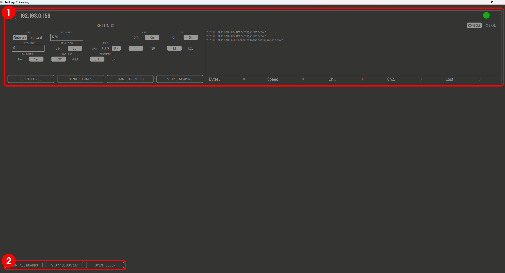
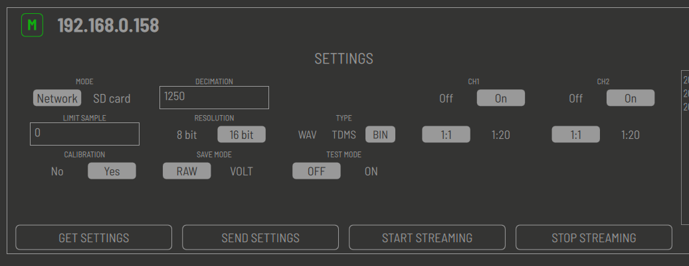
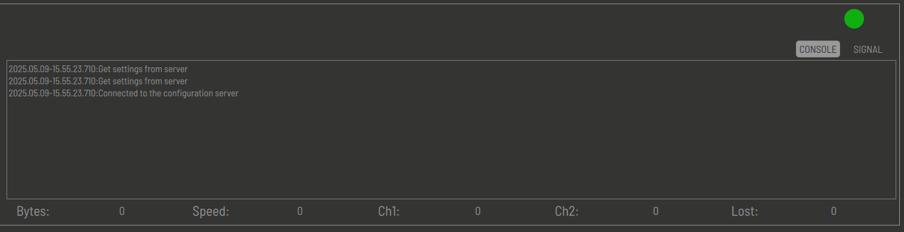

.. _stream_desktop_app:

远程数据流（桌面应用）
=======================================

使用远程数据流选项时，数据会通过网络传输到远程计算机。当所需数据处理超出 Red Pitaya 板卡能力、必须借助远程计算机上更强大的工具完成时，此选项非常有用。

桌面应用适用于 Windows 和 Linux 操作系统，并支持 :ref:`多板卡数据流 <multiboard_stream>`。

.. note::

    应从桌面应用配置数据流选项，而不要从 Web 界面配置，因为 Web 界面不一定反映数据流应用的实际设置。

    使用“Get settings”按钮获取每个板卡的当前设置。

#. **下载桌面客户端应用。**

    .. tabs::

        .. group-tab:: OS version 2.00.23 or newer

            客户端文件位于 *Streaming Application (Data Stream Control)* 中。可以直接从 Red Pitaya 下载。

            .. figure:: ../img/streaming_desktop_clients_200_23.png
                :width: 1000
                :align: center

        .. group-tab:: OS version 2.00-15 or older

            客户端文件位于我们的 :rp-download:`Clients <downloads/Clients/streaming/desktop/>` 服务器上。

#. **解压并运行应用。**

    .. tabs::

        .. group-tab:: Linux
        
            解压后，为以下文件启用执行权限：
    
            * *rpsa_client_qt.sh*.
            * *bin/rpsa_client_qt*.

                .. figure:: ../img/qt1.png
                    :width: 800
                    :align: center

        .. group-tab:: Windowns
    
            运行数据流桌面应用时应会触发防火墙警告（请求允许访问本地网络），应确认该警告以确保正常运行。

            .. note::

                防病毒程序可能会（暂时）阻止桌面客户端。如果遇到此问题，建议将 *Streaming Client* 文件夹加入白名单。

    运行后，桌面应用会自动检测同一本地网络中正在运行 Streaming Application 的 Red Pitaya 板卡（已加载 FPGA 镜像并启动 streaming-server，或已打开 Web 应用）。板卡与客户端必须位于同一网络。

    .. figure:: ../img/qt2.png
        :width: 1000
        :align: center

#. **配置数据流设置。** 为每个板卡选择所需设置，然后点击 **Send settings** 按钮将设置应用到板卡。

#. **启动数据流。** 桌面应用允许分别启动和停止每个检测到的板卡的数据流，也可以同时操作所有板卡。数据流会保存到桌面应用所在的同一目录。

|

桌面客户端应用
---------------------------

桌面客户端应用的 GUI 分为以下几个区域：

1. **板卡列表：** 列出同一本地网络中运行 Streaming Application 的 Red Pitaya 板卡。列表中的每个板卡都有与数据流应用相对应的可配置设置。
#. **数据流设置：** 所有检测到的板卡共用的设置。

|

板卡列表
-----------

板卡列表显示同一本地网络中运行 Streaming Application 的所有已检测 Red Pitaya 板卡。未运行数据流服务器的 Red Pitaya 板卡不会被检测到。为获得最佳性能，应将板卡连接到路由器。

根据左上角的图标，可检测到两类板卡：

    * **M** - 主板卡或主设备。
    * **S** - 从板卡或辅助设备。

图标的颜色（以及右上角圆点的颜色）表示板卡当前状态：

    * **Green** - 板卡已准备好传输数据。
    * **Red** - 应用启动后板卡曾经可用，但当前不可用（未运行 **Streaming application** 或未连接到网络）。

状态图标旁会显示板卡的 IP 地址。

除数据流应用中的设置外，还提供以下设置：

    * **Test Mode：** 用于测试桌面应用的特殊模式。不建议在正常操作中使用此模式。

每个板卡设置区域底部都有四个按钮：

    * **Get settings：** 从板卡获取当前数据流应用设置。点击此按钮会读取板卡当前设置并应用到桌面应用。
    * **Send settings：** 将当前数据流应用设置发送到板卡。在桌面应用中更新设置后，点击 **send settings** 按钮可确保设置发送到板卡。
    * **Start streaming：** 启动所选板卡的数据流过程。点击此按钮后会立即开始传输。
    * **Stop streaming：** 停止所选板卡的数据流过程。点击此按钮后会立即停止传输。

其他所有设置的说明，请参见 :ref:`ADC 数据流配置 <stream_adc_config>` 和 :ref:`DAC 数据流配置 <stream_dac_config>` 部分。

使用右上角的按钮，可以在控制台窗口和信号窗口之间切换；这两个窗口位于每个板卡条目的右侧。

* **控制台区域** - 显示数据流过程的当前状态，以及数据流过程中可能出现的错误消息。
* **信号区域** - 在数据流运行时显示采集到的数据流。显示的信号仅供参考，不应用于任何测量或分析。

板卡框底部的其余部分用于显示数据流过程的统计信息：

    * **Bytes：** 从板卡接收的字节数。
    * **Speed：** 当前数据传输速度，单位为 MB/s。
    * **Ch1：** 从通道 1 接收的采样数。
    * **Ch2：** 从通道 2 接收的采样数。
    * **Lost：** 数据流过程中丢失的采样数。

|

数据流设置
-------------------

数据流设置区域显示所有检测到的板卡共用的设置：

    * **Start all boards：** 启动所有检测到的板卡的数据流过程。点击此按钮后会立即开始传输。
    * **Stop all boards：** 停止所有检测到的板卡的数据流过程。点击此按钮后会立即停止传输。
    * **Open folder：** 打开保存数据流的文件夹。启动数据流过程时，系统会在桌面应用所在目录中自动创建该文件夹。

每次数据流都会创建三个文件：

    1. **数据文件：** 包含采集到的数据流。文件格式由 ADC 配置区域中所选设置决定。
    2. **丢失日志文件：** 包含数据流过程中丢失数据包的信息。建议每次数据流会话后检查此文件，以确保没有数据丢失。
    3. **日志文件：** 包含数据流过程的信息，例如采集的采样数、采样频率以及数据流过程中可能出现的错误消息。

三个文件的名称为 **data_file_<board_IP>_<date>_<time>.<file type>**，其中日期和时间是数据采集过程发生的日期和时间。文件类型由 ADC 配置区域中所选设置决定。

.. substitutions

.. |DIAdem| replace:: `DIAdem <https://www.ni.com/en-us/shop/data-acquisition-and-control/application-software-for-data-acquisition-and-control-category/what-is-diadem.html>`__
