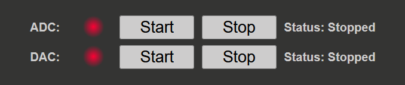
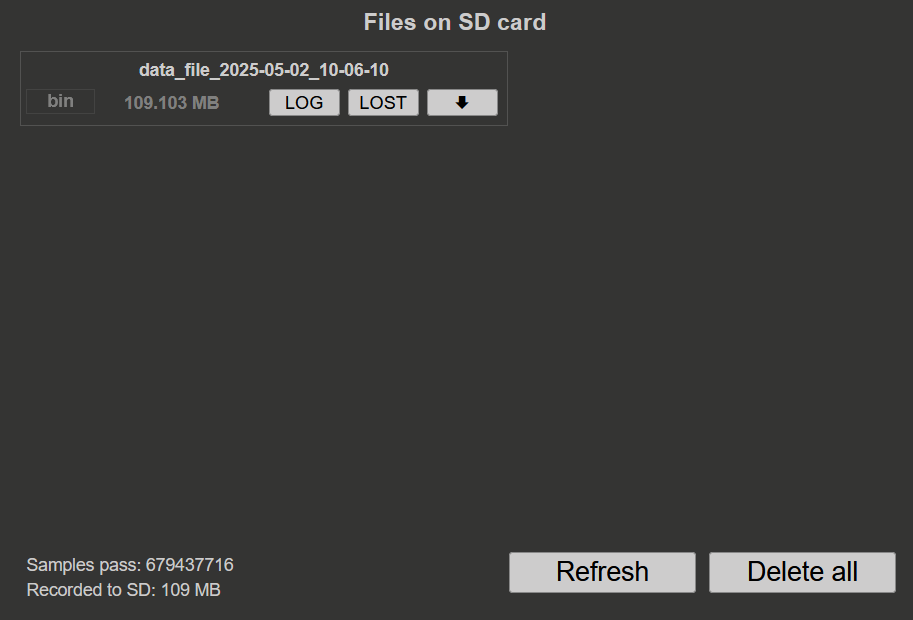
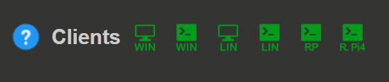

.. _stream_web_interface_usage:

#########################
Web 界面使用
#########################

本节介绍用于控制和监控流式传输过程的 Web 界面元素。

.. contents:: 目录
    :local:
    :backlinks: top

|

.. _streaming_status:

1. 流式传输状态
********************

流式传输状态部分显示 ADC 和 DAC 流式传输过程的当前状态（未来将加入 GPIO）。每个部分都有以下选项：

状态指示器
==================

* **状态圆点：** 指示流式传输过程的当前状态
    
    * **绿色：** 流式传输处于活动状态
    * **红色：** 流式传输未处于活动状态

* **状态消息：** 显示流式传输过程的当前状态以及可能出现的错误消息

|

控制按钮
================

* **开始按钮：** 开始所选模式的流式传输过程
* **停止按钮：** 停止活动的流式传输过程

|

错误消息
===============

如果状态消息显示为红色，表示发生了错误。错误消息会提供错误原因及解决方法。

常见错误消息
-----------------------

**"Not enough memory"**

* **原因：** 为流式传输模式分配的内存不足
* **解决方案：**
    
    * 检查 :ref:`内存配置 <stream_memory_config>` 中的预留内存设置
    * 增大预留内存大小
    * 对于 DAC 流式传输，确保已选择用于生成数据的文件
    * 减少其他模式的内存分配

**"Buffer overwrite"**

* **原因：** 数据速率超出系统能力
* **解决方案：**
    
    * 降低采样频率
    * 使用更少的通道
    * 增大块大小（用于高速流式传输）
    * 检查 :ref:`数据流式传输限制 <streaming_limits>`

**"Configuration error"**

* **原因：** 配置参数无效
* **解决方案：**
    
    * 检查 :ref:`ADC 配置 <stream_adc_config>` 或 :ref:`DAC 配置 <stream_dac_config>`
    * 确保所有必需设置均已正确配置
    * 检查配置文件语法（如果曾手动编辑）

|

.. _streaming_sd_files:

2. SD 卡上的文件
************************

本部分显示本地流式传输操作期间保存到 SD 卡的所有文件。

文件信息
=================

每个文件条目显示：

* **文件名：** 包含日期和时间（*data_file_<acquired_date>_<acquired_time>*）
* **文件类型：** 保存文件的格式（WAV、TDMS、BIN）
* **文件大小：** 文件大小（字节或适当单位）

在本地模式下流式传输 ADC 数据时，会同时显示 FPGA 捕获的数据量和保存到 SD 卡的数据量。

|

文件操作
================

每个文件有三个按钮：

日志按钮
-----------

* **功能：** 下载数据日志文件
* **内容：** 流式传输过程的信息：
    
    * 采集的采样数
    * 采样频率
    * 开始和结束时间戳
    * 流式传输期间的任何错误消息
    * 使用的配置参数

丢失按钮
------------

* **功能：** 下载丢失数据包文件
* **内容：** 流式传输期间丢失数据包的信息
* **用法：** 每次流式传输会话后检查此文件，以确保数据完整性

.. note::

    建议每次流式传输会话后检查丢失数据包文件，以确认采集期间没有数据丢失。

下载按钮
----------------

* **功能：** 下载数据文件
* **内容：** 采集到的数据流
* **格式：** 由 :ref:`ADC 配置 <stream_adc_config>` 部分中选择的设置决定

|

文件管理
================

刷新按钮
---------------

* **位置：** 右下角
* **功能：** 刷新文件列表以显示新创建的文件
* **用法：** 完成流式传输会话后点击，以更新文件列表

全部删除按钮
------------------

* **位置：** 右下角
* **功能：** 删除 SD 卡上的所有文件
* **警告：** 此操作不可撤销，请谨慎使用。

.. warning::

    “全部删除”操作会永久移除 SD 卡上的所有流式传输数据和日志。使用此功能前，请确保已下载所有重要文件。

|

.. _streaming_pc_clients:

3. PC 客户端
**************

PC 客户端部分位于应用左下角，其中包含可下载的客户端，用于将数据流式传输到远程计算机、Red Pitaya 或其他外部设备（如 Raspberry Pi）。

可用客户端
==================

桌面客户端（Windows、Linux）
---------------------------------

* **图标：** 绿色显示器图标
* **平台：** Windows (WIN) 和 Linux (LIN)
* **类型：** 图形用户界面（GUI）应用
* **功能：**
    
    * 从一个或多个 Red Pitaya 板流式传输数据
    * 在同一本地网络中工作
    * 可视化监控和控制
    * 多板同步

* **推荐用户：** 偏好使用 GUI 应用进行数据流式传输的用户
* **文档：** 请参阅 :ref:`通过桌面应用流式传输到远程计算机 <stream_desktop_app>`

|

命令行客户端（Windows、Linux）
--------------------------------------

* **图标：** 绿色终端图标
* **平台：** Windows (WIN) 和 Linux (LIN)
* **类型：** 命令行应用
* **功能：**
    
    * 从一个或多个 Red Pitaya 板流式传输数据
    * 支持脚本化和自动化
    * 高级配置选项
    * 支持远程 DAC 流式传输
    * 多板同步

* **推荐用户：** 偏好命令行工具或需要自动化的用户
* **文档：** 请参阅 :ref:`通过命令行或终端流式传输到远程计算机 <stream_command_client>`

|

Red Pitaya 命令行客户端
--------------------------------

* **图标：** 控制台图标
* **平台：** Red Pitaya Linux
* **类型：** 控制台客户端
* **功能：**
    
    * 向 SD 卡流式传输数据以及从 SD 卡读取数据
    * 无需网络的本地控制
    * 直接访问 Red Pitaya 存储

* **推荐用户：** 通过 SSH 进行本地操作的用户
* **文档：** 请参阅 :ref:`Red Pitaya 命令行客户端 <stream_command_client>`

|

Raspberry Pi 命令行客户端
--------------------------------

* **图标：** 控制台图标
* **平台：** Raspberry Pi Linux
* **类型：** 控制台客户端
* **功能：**
    
    * 向 Raspberry Pi 流式传输数据以及从 Raspberry Pi 读取数据
    * 本地网络控制

* **推荐用户：** 低速本地网络操作的用户
* **文档：** 请参阅 :ref:`Red Pitaya 命令行客户端 <stream_command_client>`

|

文档
==============

* **图标：** 蓝色问号
* **功能：** 打开当前文档页面
* **用法：** 快速访问帮助和参考资料

|

4. 后续步骤
**************

* 下载并安装 :ref:`桌面客户端 <stream_desktop_app>` 进行图形化控制
* 尝试 :ref:`命令行客户端 <stream_command_client>` 以使用高级功能
* 了解 :ref:`本地流式传输 <streaming_local>`，将数据直接保存到 SD 卡
* 浏览 :ref:`示例 <streaming_examples_top>`，了解实际使用场景
