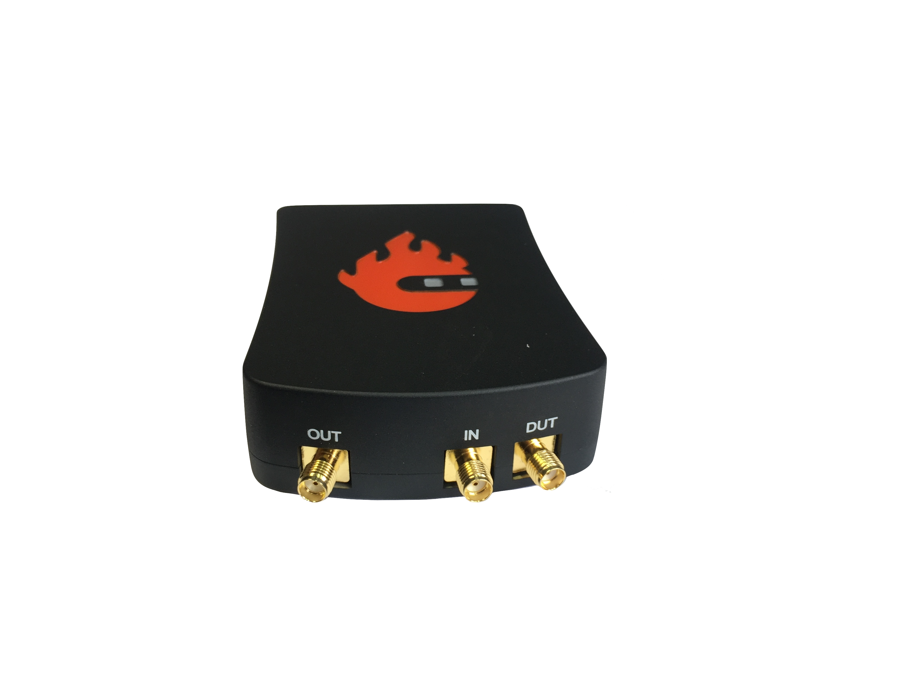
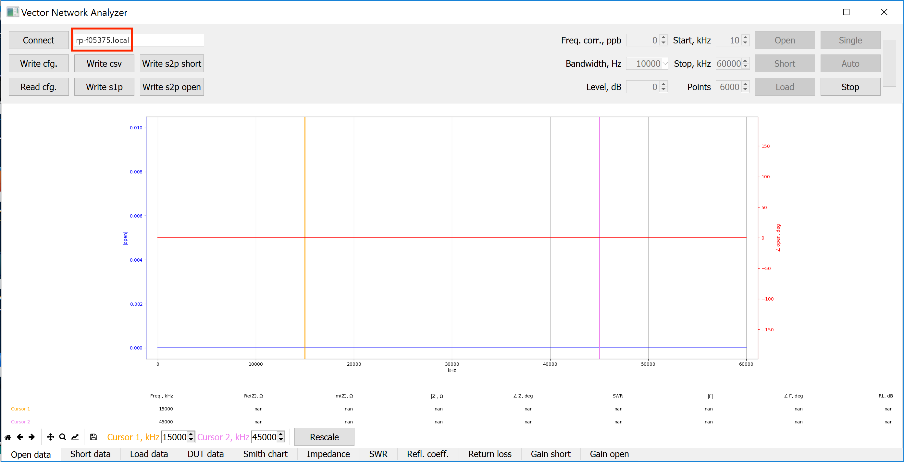
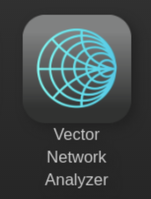
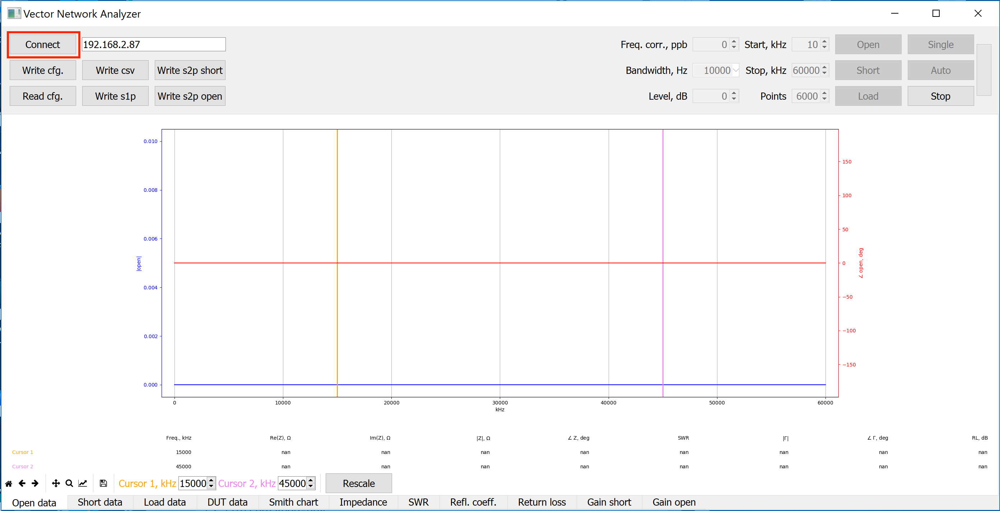
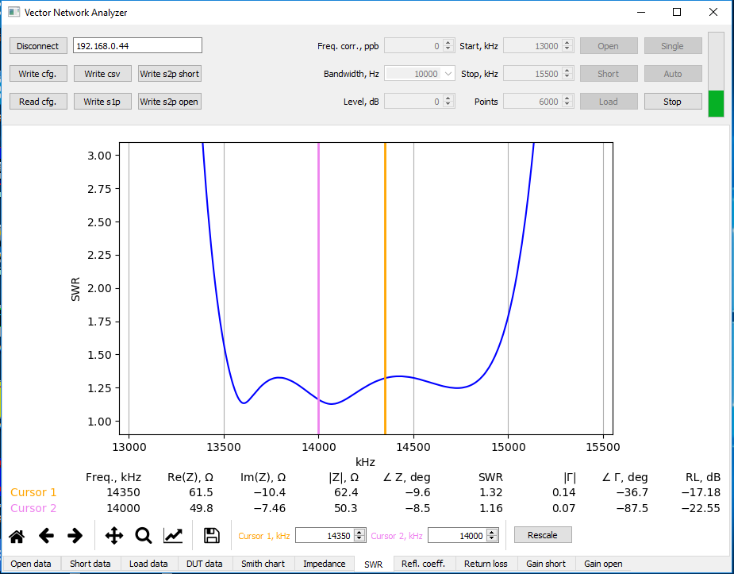
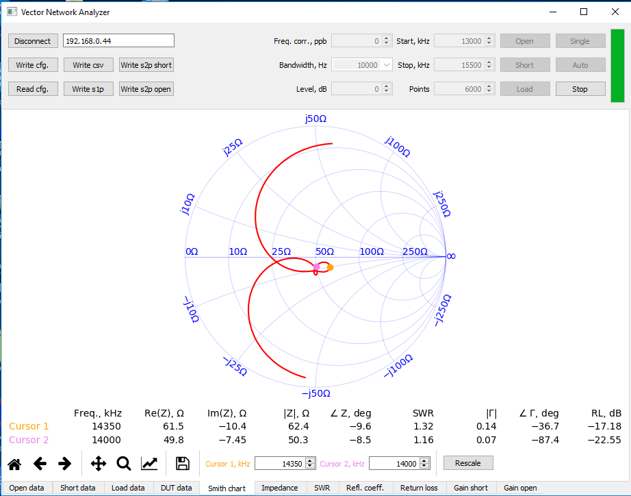

.. _vna_extension:

#######################
矢量网络分析仪
#######################

.. note::

    VNA 应用是由 Pavel Demin 和 SDR 社区创建并维护的第三方应用。官方 Red Pitaya OS 中的应用移植自社区 Alpine Linux 镜像。
    如需获取最新社区更新，请查看 |red_pitaya_notes_vna|。

********************************
开始前需要什么？
********************************

1. VNA 应用要求：

    *   Windows 或基于 Linux 的个人计算机（PC）。

2. 以下配件和材料可在 Red Pitaya 商店购买：

    *   包含 STEMlab 125-14、SDRlab 122-16 或 125-10（已停产）板卡的任意套件
    *   矢量网络分析仪桥接模块

*****************************************************
开始将 Red Pitaya 用作矢量网络分析仪
*****************************************************

将矢量网络分析仪桥接模块连接到 Red Pitaya
========================================================

    *   将 VNA 模块的 OUT 连接到 Red Pitaya 的 IN1。
    *   将 VNA 模块的 IN 连接到 Red Pitaya 的 OUT1。
    *   将 Red Pitaya 上 IN1 的跳线设置到 LV 位置。

|

安装并运行矢量网络分析仪网络控制应用
=========================================================

仅限 Windows 用户
------------------

    #. 打开 VNA 应用。
    #. 下载并解压 Windows |official_os_client|。
    #. 运行 *control* 目录中的 ``vna.exe`` 程序。
    #. 输入 Red Pitaya 板卡的 IP 地址，然后点击 *Connect* 按钮。
    #. 执行校准和测量。

.. note::

    如需获取最新社区版 VNA，请查看 |red_pitaya_notes_vna|。安装说明只有少量差异：

    #. 打开 VNA 应用。
    #. 打开 |red_pitaya_notes_vna|。其中介绍了应用的内部工作原理，并提供其他有用信息的链接。
    #. 找到 **开始使用 MS Windows** 部分并遵循其中的项目。如果使用官方 Red Pitaya OS，**跳过前三项**！
    #. 从上方链接下载并解压 *发布 zip 文件夹* 到计算机。
    #. 运行 *control* 目录中的 ``vna.exe`` 程序。
    #. 输入 Red Pitaya 板卡 IP 地址，然后点击 *Connect* 按钮。
    #. 执行校准和测量。

.. |red_pitaya_notes_vna| raw:: html

   <a href="https://pavel-demin.github.io/red-pitaya-notes/vna/" target="_blank">Pavel Demin 的 Red Pitaya Notes VNA 页面</a>

.. |official_os_client| raw:: html

   <a href="https://downloads.redpitaya.com/downloads/Clients/vna/" target="_blank">控制客户端</a>

仅限 Linux 用户
----------------

    #. 打开 VNA 应用。
    #. 下载并解压 Linux |official_os_client|。
    #. 安装 |Python 3| 及所有必需库：

        .. code-block:: shell-session

            sudo apt-get install python3-dev python3-pip python3-numpy python3-pyqt5 libfreetype6-dev
            sudo pip3 install matplotlib mpldatacursor

    #. 运行控制程序：

        .. code-block:: shell-session

            cd /vna/client
            python3 vna.py

    #. 输入 Red Pitaya 板卡 IP 地址，然后点击 *Connect* 按钮。
    #. 执行校准和测量。

.. |Python 3| raw:: html

   <a href="https://www.python.org/" target="_blank">Python 3</a>

.. note::

    如需获取最新社区版 VNA，请查看 |red_pitaya_notes_vna|。安装说明只有少量差异：

    #. 打开 VNA 应用。
    #. 打开 |red_pitaya_notes_vna|。其中介绍了应用的内部工作原理，并提供其他有用信息的链接。
    #. 找到 **开始使用 GNU/Linux** 部分并遵循其中的项目。如果使用官方 Red Pitaya OS，**跳过前三项**！
    #. 安装 |Python 3| 及所有必需库：

        .. code-block:: shell-session

            apt-get install python3-numpy python3-matplotlib python3-pyqt5

    #. 将源代码仓库克隆到计算机：

        .. code-block:: shell-session

            git clone https://github.com/pavel-demin/red-pitaya-notes

    #. 运行控制程序：

        .. code-block:: shell-session

            cd red-pitaya-notes/projects/vna/client
            python3 vna.py

    #. 输入 Red Pitaya 板卡 IP 地址，然后点击 *Connect* 按钮。
    #. 执行校准和测量。

输入 Red Pitaya 板卡的 IP 或 URL 地址
=====================================================

通过输入 Red Pitaya 的 IP 连接：
----------------------------------------

要查找 Red Pitaya 板卡的 IP 地址，请先按照这些 :ref:`说明 <quick_start>` 连接到 Red Pitaya。

然后进入 **System->Network Manager**。IP 地址显示在标签旁边。
地址：xxx.xxx.xxx.xxx 。

|

通过输入 RedPitaya URL 连接：
----------------------------------

在 Red Pitaya 上运行矢量网络分析仪应用
=============================================================

|

在矢量网络分析仪控制应用中点击 "Connect"
==============================================================

|

***************************************
执行校准并开始测量
***************************************

.. note::

   在 SDRlab 122-16 上，VNA 模块适用于高于 500 kHz 的频率。请从 500 kHz 开始校准（忽略图片中的校准值）。

    .. figure::  img/3_calibrate.png
        :align: center
        :width: 600

#. 将标有字母 O 的 SMA OPEN 校准连接器连接到矢量网络分析仪桥接模块的 DUT SMA 连接器。点击 "Open" 按钮并等待校准完成。

    .. figure:: img/04_Calibration_O.jpg
        :align: center
        :width: 600

#. 将标有字母 S 的 SMA SHORT 校准连接器连接到矢量网络分析仪桥接模块的 DUT SMA 连接器。点击 "Short" 按钮并等待校准完成。

    .. figure:: img/03_Calibration_S.jpg
        :align: center
        :width: 600

#. 将标有字母 L 的 SMA LOAD 校准连接器连接到矢量网络分析仪桥接模块的 DUT SMA 连接器。点击 "Load" 按钮并等待校准完成。

    .. figure:: img/05_Calibration_L.jpg
        :align: center
        :width: 600

#. 选择底部的 Smith 图表标签页，然后点击 Single 按钮对 DUT 执行单次测量。Smith 图表圆心（@ 50 Ohm）处的点表示 VNA 正在正确测量参考 50 Ohm LOAD。

    .. figure::  img/4-load_DUT_smith_chart.png
        :align: center
        :width: 600

#. 断开 LOAD SMA 连接器，连接要测量的 DUT。

    .. figure::  img/07_Product_Combo.jpg
        :align: center
        :width: 600

|

示例：
=========

#. 21 米垂直天线的测量
    天线未正确调谐（在 14、21 MHz 频率处，SWR 应为 1.5）。

    .. figure::  img/antenna.png
        :align: center
        :width: 600

#. HAM RADIO 20 米带通滤波器
    在起始和截止频率之间，SWR 优于 1.5，滤波器负载约为 50 Ohm。

|

作者与源代码
===============

.. admonition:: 致谢

    | 矢量网络分析仪 Red Pitaya 应用的原始开发者是 Pavel Demin。
    | 我们构建时使用的仓库：

        *   `Red Pitaya Notes <https://pavel-demin.github.io/red-pitaya-notes/>`_

Pavel Demin 还开发了多个与 Red Pitaya 板卡兼容的其他 SDR 应用。这些应用位于 Pavel Demin 的 Alpine Linux OS 镜像中。
有关这些应用的更多信息，请参阅 `Red Pitaya Notes <https://pavel-demin.github.io/red-pitaya-notes/>`_。
