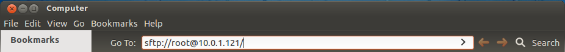
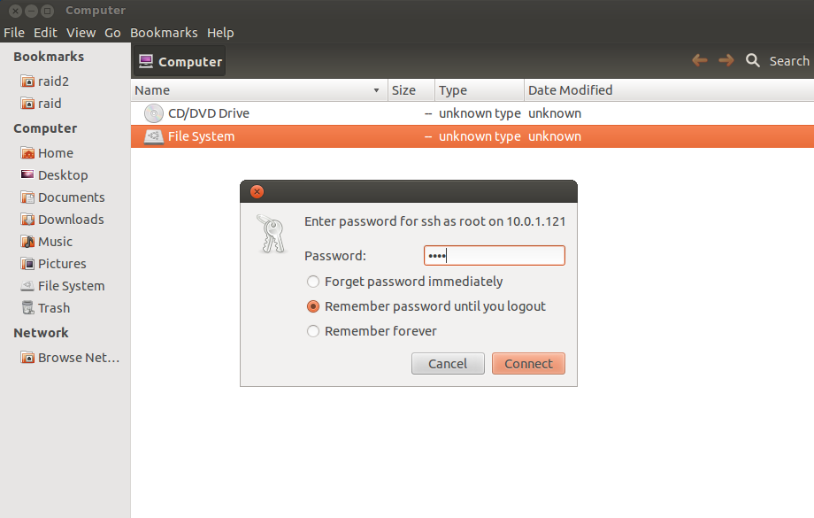
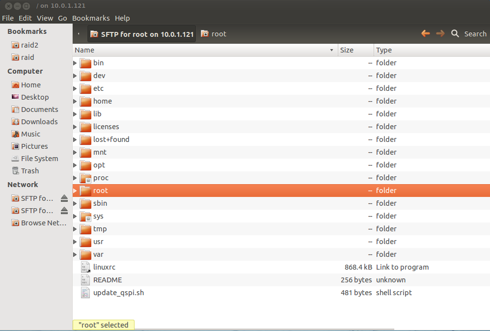
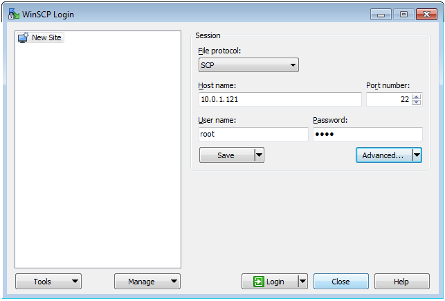
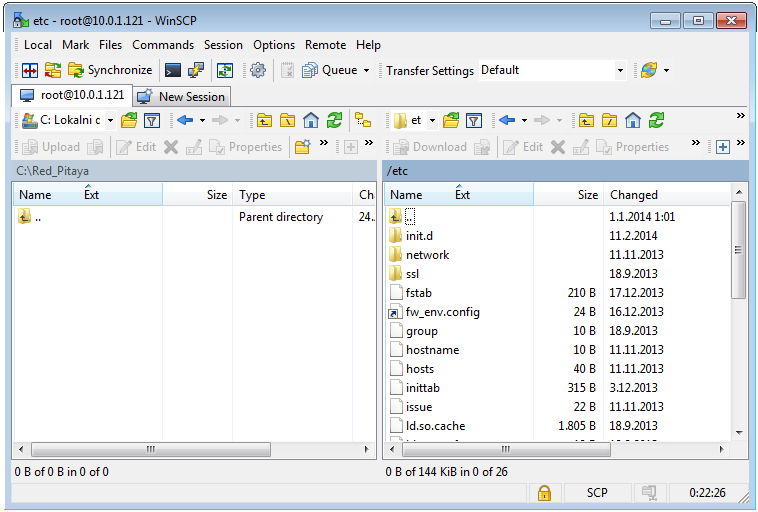
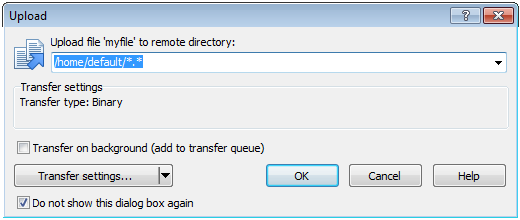

.. _other_util:

命令行工具相关的其他有用信息
======================================================

保存数据缓冲区
-------------------

建议使用 NFS 共享存储临时数据（例如使用 acquire 工具测量的信号）。使用标准 mount 命令挂载 NFS 共享（示例）：
 
.. code-block:: console
    
    redpitaya> mount -o nolock <ip_address>:/<path>  /mnt

Red Pitaya 上代表 SD 卡的 */opt* 文件系统以只读方式挂载。要在 Red Pitaya 本地存储数据，请将采集结果重定向到 */tmp* 目录中的文件。
*/tmp* 目录位于 RAM 中，因此是易失的（重启后清空）。

.. code-block:: console
    
    redpitaya> acquire 1024 8 > /tmp/my_local_file

或者，直接将数据保存到 NFS 挂载点：
 
.. code-block:: console
    
    redpitaya> acquire 1024 8 > /mnt/my_remote_file

|

复制数据 - Linux 用户
--------------------------

如果没有 NFS 共享，可以使用 Secure Copy 命令：
 
.. code-block:: console
    
    redpitaya> scp my_local_file <user>@<destination_ip>:/<path_to_directory>/

或者，Linux 用户可以使用 Nautilus（文件管理器窗口）等图形化 SCP/SFTP 客户端。要访问地址栏，请按 *[CTRL + L]*，然后输入以下 URL：*sftp://root@<ip_address>*

    
    Nautilus URL/地址栏。
    
输入 Red Pitaya 密码（见下一图）。root 账户的默认 Red Pitaya 密码为 root。要更改 root 密码，请参阅 buildroot 配置；该机制用于构建 Red Pitaya 根文件系统，其中包括包含 root 密码的 */etc/passwd* 文件。

登录后，主屏幕将显示 Red Pitaya 根文件系统的目录内容。要操作 Red Pitaya 上的文件，请导航并选择存储的数据，然后使用简单的复制粘贴和拖放操作（见图 2）。

|

复制数据 - Windows 用户
----------------------------

Windows 用户应使用 |WinSCP| 等 SCP 客户端。请按照安装说明下载并安装。登录 Red Pitaya 的示例请参见下一图。

    WinSCP 登录界面。

登录后，主屏幕将显示 Red Pitaya 根文件系统的内容。要操作 Red Pitaya 上的文件，请导航并选择存储的数据，然后使用简单的复制粘贴和拖放操作（见下一图）。

    Red Pitaya 上的目录内容。

选择用于存储数据文件的目标（本地）目录（见下一图）。

    选择文件复制目标。

|
