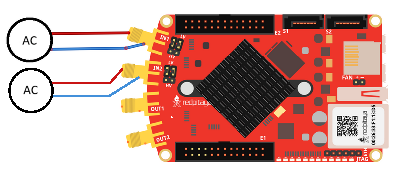

深度内存采集对比
#####################################

说明
============

本示例对比使用 Red Pitaya 深度内存采集（DMA）功能执行 Python API 命令时的不同数据采集方法。

所需硬件
==================

* Red Pitaya 设备。
* 信号（函数）发生器。

接线示例：

所需软件
==================

* IN-DEV

.. .. include:: ../sw_requirement.inc

.. include:: ../python_scpi_note.inc

API 代码示例
====================

代码 - Python API
-------------------

目前有三种方式可以从 DMA 缓冲区获取数据：

* 普通方式 - 使用自定义缓冲区类（例如 *i16Buffer*）。
* NumPy - 使用 NumPy 数组。
* 直接访问内存区域 - 不将数据复制到 NumPy 或自定义缓冲区。

第三种方式的效率明显最高。请使用下面的代码测试每种方法的性能。

.. code-block:: python

    #!/usr/bin/python3

    import time
    import numpy as np
    from rp_overlay import overlay
    import rp

    fpga = overlay()
    #rp.rp_EnableDebugReg()
    rp.rp_Init()

    memory = rp.rp_AcqAxiGetMemoryRegion()
    if (memory[0] != rp.RP_OK):
        print("Error get reserved memory")
        exit(1)

    dma_start_address = memory[1]
    dma_full_size = memory[2]

    bufferSize = 1024 * 1024 * 32
    samples = (int)(bufferSize/2)

    if (dma_full_size < bufferSize):
        bufferSize = dma_full_size

    ##### Acquisition #####
    # Set Decimation
    rp.rp_AcqAxiSetDecimationFactor(rp.RP_DEC_1)

    # Set trigger level and delay
    rp.rp_AcqSetTriggerLevel(rp.RP_T_CH_1, 0)
    rp.rp_AcqAxiSetTriggerDelay(rp.RP_CH_1,  samples)

    rp.rp_AcqAxiSetBufferSamples(rp.RP_CH_1, dma_start_address , samples)
    rp.rp_AcqAxiEnable(rp.RP_CH_1, True)

    # Start Acquisition
    print("Acq_start")
    rp.rp_AcqStart()

    time.sleep(0.1)
    # Specify trigger - input 1 positive edge
    rp.rp_AcqSetTriggerSrc(rp.RP_TRIG_SRC_NOW)
    time.sleep(0.1)

    # Trigger state
    while 1:
        trig_state = rp.rp_AcqGetTriggerState()[1]
        if trig_state == rp.RP_TRIG_STATE_TRIGGERED:
            break

    # Fill state
    while 1:
        if rp.rp_AcqAxiGetBufferFillState(rp.RP_CH_1)[1]:
            break

    print("ACQ get data")
    tp=rp.rp_AcqAxiGetWritePointerAtTrig(rp.RP_CH_1)[1]

    # Get data
    # RAW
    # Fills the passed buffer with data
    arr_i16 = np.zeros(samples, dtype=np.int16)
    arr_f = np.zeros(samples, dtype=np.float32)
    start = time.time()
    res = rp.rp_AcqAxiGetDataRawNP(rp.RP_CH_1,tp, arr_i16)
    end = time.time()

    # Volts
    # Fills the passed buffer with data
    res = rp.rp_AcqAxiGetDataVNP(rp.RP_CH_1,tp, arr_f)
    end2 = time.time()

    # Returns a memory region without copying data.
    res = rp.rp_AcqAxiGetDataRawDirect(rp.RP_CH_1,tp, samples)
    end3 = time.time()

    arrays = []
    for span in res[1]:
        arr = np.frombuffer(span, dtype=np.int16)
        arrays.append(arr)

    print("Time =",end - start, " Data = ", arr_i16)
    print("Time =",end2 - end, " Data = ", arr_f)
    print("Time =",end3 - end2, " Data = ", arrays)

