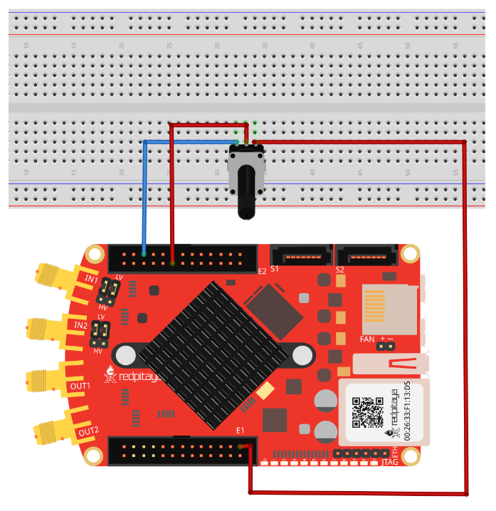
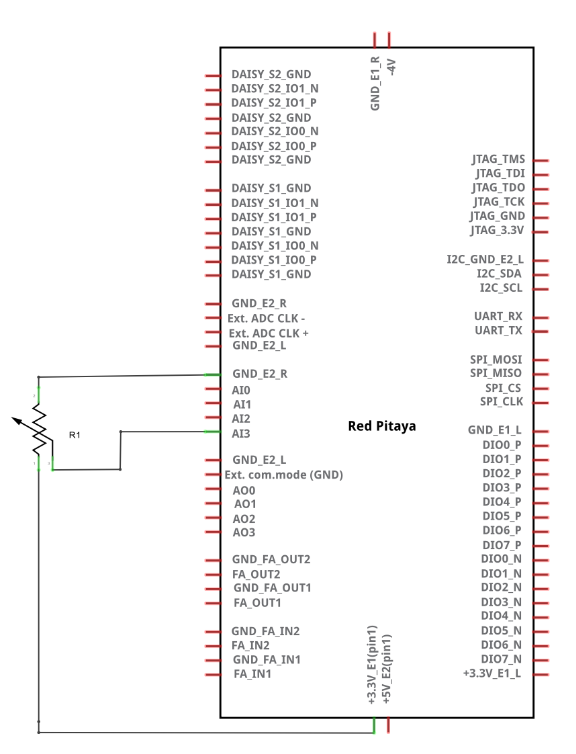
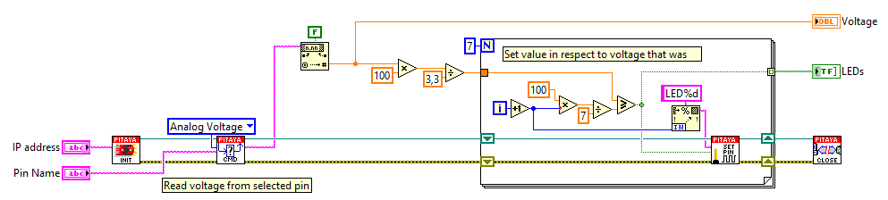

读取慢速模拟输入上的模拟电压
#########################################

描述
============

本示例展示如何测量 Red Pitaya 扩展连接器上慢速模拟输入的模拟电压。Red Pitaya 模拟输入的额定范围为 0 至 3.3 Volts。

所需硬件
==================

    - Red Pitaya 设备
    - R1 10k 电位器

接线示例：

所需软件
==================

.. include:: ../sw_requirement.inc

电路
========

SCPI 代码示例
====================

代码 - MATLAB®
---------------

.. include:: ../matlab.inc

.. code-block:: matlab

    close all;
    clc;

    %% Define Red Pitaya as TCP/IP object
    IP = 'rp-f0a235.local';             % Input IP of your Red Pitaya...
    port = 5000;
    RP = tcpclient(IP, port);

    %% Open connection with your Red Pitaya
    RP.ByteOrder = 'big-endian';
    configureTerminator(RP,'CR/LF');

    %% Setup
    a = 1;              % iteration
    v0 = [];            % Voltage arrays
    v1 = [];
    v2 = [];
    v3 = [];
    f = gcf;            % Figure
    hold on;

    volts0 = str2double(writeread(RP,'ANALOG:PIN? AIN0'));
    volts1 = str2double(writeread(RP,'ANALOG:PIN? AIN1'));
    volts2 = str2double(writeread(RP,'ANALOG:PIN? AIN2'));
    volts3 = str2double(writeread(RP,'ANALOG:PIN? AIN3'));

    %% Plotting data
    while (a < 500)
        v0(a) = str2double(writeread(RP,'ANALOG:PIN? AIN0'));
        v1(a) = str2double(writeread(RP,'ANALOG:PIN? AIN1'));
        v2(a) = str2double(writeread(RP,'ANALOG:PIN? AIN2'));
        v3(a) = str2double(writeread(RP,'ANALOG:PIN? AIN3'));
            
        % Plot 
        if (a < 150)
            plot(v0, 'LineWidth', 2, 'Color', [0 0.4470 0.7410]);
            plot(v1, 'LineWidth', 2, 'Color', [0.8500 0.3250 0.0980]);
            plot(v2, 'LineWidth', 2, 'Color', [0.9290 0.6940 0.1250]);
            plot(v3, 'LineWidth', 2, 'Color', [0.4660 0.6740 0.1880]);
        else
            clf;
            plot(v0(end-149:end), 'LineWidth', 2, 'Color', [0 0.4470 0.7410]);
            plot(v1(end-149:end), 'LineWidth', 2, 'Color', [0.8500 0.3250 0.0980]);
            plot(v2(end-149:end), 'LineWidth', 2, 'Color', [0.9290 0.6940 0.1250]);
            plot(v3(end-149:end), 'LineWidth', 2, 'Color', [0.4660 0.6740 0.1880]);
        end

        % Plot settings
        grid ON;
        xlabel('Samples');
        ylim([0 3.5]);
        ylabel('{\itU} [V]');
        title('Voltage');
        legend('v0','v1','v2','v3');
            
        pause(0.01);
        a = a+1;
    end

    %% Close connection with Red Pitaya
    clear RP;
    
代码 - Python
--------------

.. code-block:: python

    #!/usr/bin/env python3

    import sys
    import redpitaya_scpi as scpi

    IP = 'rp-f066c8.local'

    rp = scpi.scpi(IP)

    for i in range(4):
        rp.tx_txt('ANALOG:PIN? AIN' + str(i))
        value = float(rp.rx_txt())
        print ("Measured voltage on AI["+str(i)+"] = "+str(value)+"V")

    rp.close()

.. include:: ../python_scpi_note.inc

代码 - LabVIEW
---------------

- `Download Example <https://downloads.redpitaya.com/downloads/Clients/labview/Read%20analog%20voltage%20on%20slow%20analog%20input.vi>`_

API 代码示例
====================

.. include:: ../c_code_note.inc

代码 - C++ API
---------------

.. code-block:: cpp

    /* Read analog voltage on slow analog input */

    #include <stdio.h>
    #include <stdlib.h>

    #include "rp.h"

    int main (int argc, char **argv) {
        float value [4];

        // Initialization of API
        if (rp_Init() != RP_OK) {
            fprintf(stderr, "Red Pitaya API init failed!\n");
            return EXIT_FAILURE;
        }

        // Measure each XADC input voltage
        for (int i=0; i<4; i++) {
            rp_AIpinGetValue(i, &value[i]);
            printf("Measured voltage on AI[%i] = %1.2fV\n", i, value[i]);
        }

        // Releasing resources
        rp_Release();
        
        return EXIT_SUCCESS;
    }

代码 - Python API
------------------

.. code-block:: python

    #!/usr/bin/python3
    import rp

    analog_in = [rp.RP_AIN0, rp.RP_AIN1, rp.RP_AIN2, rp.RP_AIN3]

    # Initialize the interface
    rp.rp_Init()

    # Reset analog pins
    rp.rp_ApinReset()

    #####! Choose one of two methods, comment the other !#####

    #! METHOD 1: Reading all values and selecting the appropriate

    #for i in range(4):
    #    # rp_ApinGetValue returns an array - [0, Input voltage in V, Input voltage RAW]
    #    value = rp.rp_ApinGetValue(analog_in[i])[1]
    #    print (f"Measured voltage on AI[{i}] = {value} V")

    #! METHOD 2: Read just analog inputs

    for i in range(4):
        # rp_AIpinGetValue returns an array - [0, Input voltage in V, Input voltage RAW]
        value = rp.rp_AIpinGetValue(i)[1]
        print (f"Measured voltage on AI[{i}] = {value} V")

    # Release resources
    rp.rp_Release()
    
