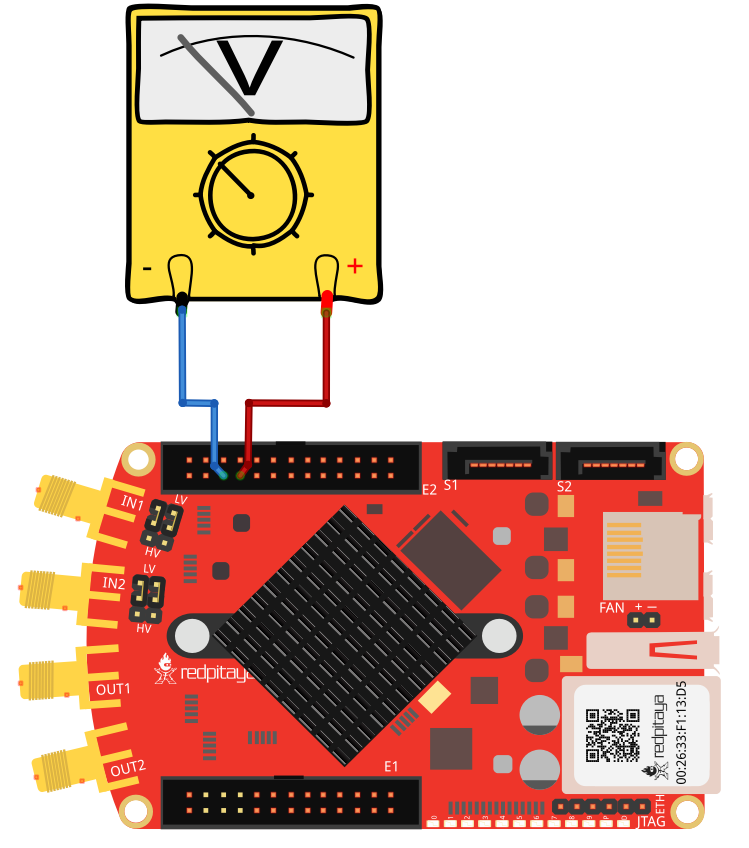
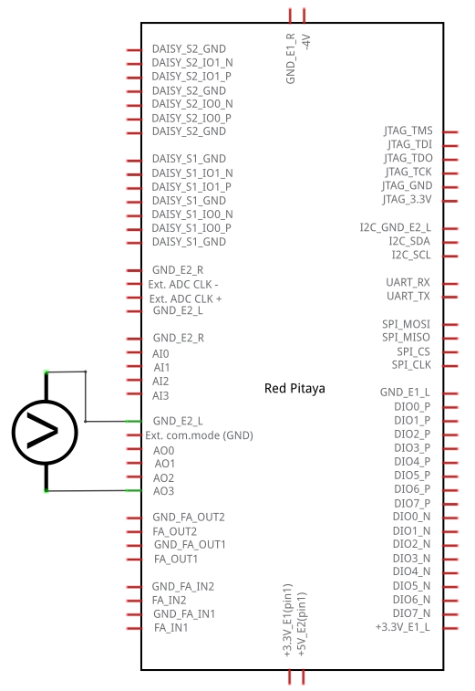
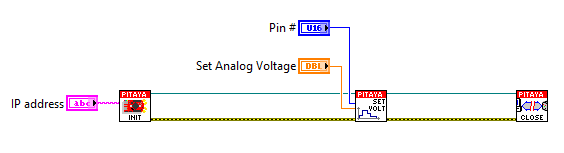

慢速模拟输出的交互式电压设置
###################################################

描述
=============

本示例演示如何使用 MATLAB 滑块设置 Red Pitaya 慢速模拟输出的模拟电压。Red Pitaya 的慢速模拟输出范围为 0 至 1.8 V。

所需硬件
====================

    - Red Pitaya 设备
    - 电压表

接线示例：

所需软件
==================

.. include:: ../sw_requirement.inc

电路
=========

SCPI 代码示例
====================

代码 - MATLAB®
----------------

.. include:: ../matlab.inc

.. code-block:: matlab 

    function RedPitaya_sliderAnalogDemo

        fig = uifigure("Position", [100 100 300 250]);      % Create figure
        p = 0;

        sld = uislider( ...                               % Create slider
            Parent= fig,...                               % Parent figure
            Value= 10,...                                 % Default value
            Limits= [0 100],...                           % Slider limits
            Orientation= 'horizontal',...                 % Orientation
            ValueChangingFcn= @(src, event)sliderCallback(src, event, p));
        
        function  sliderCallback(src, event, p)
            p = event.Value;

            %% Define Red Pitaya as TCP/IP object
            IP = '192.168.0.157';           % Input IP of your Red Pitaya...
            port = 5000;
            RP = tcpclient(IP, port);

            %% Open connection with your Red Pitaya
            RP.ByteOrder = "big-endian";
            configureTerminator(RP,'CR/LF');

            %% Set your output voltage value and pin
            out_voltage = num2str((1.8/100)*p);     % From 0 - 1.8 volts
            out_num = '2';                          % Analog outputs 0,1,2,3
            
            %% Set your SCPI command with strcat function
            scpi_command = strcat('ANALOG:PIN AOUT',out_num,',',out_voltage);

            %% Send SCPI command to Red Pitaya
            writeline(RP, scpi_command);

            %% Close connection with Red Pitaya
            clear RP;
        end
    end

代码 - LabVIEW
----------------

- `下载示例 <https://downloads.redpitaya.com/downloads/Clients/labview/Interactive%20voltage%20setting%20on%20slow%20analog%20output.vi>`_

API 代码示例
====================

.. include:: ../c_code_note.inc

.. 代码 - C++ API
.. ---------------

.. .. code-block:: cpp

代码 - Python API
------------------

.. code-block:: python

    #!/usr/bin/python3
    import time
    import rp

    analog_out = [rp.RP_AOUT0, rp.RP_AOUT1, rp.RP_AOUT2, rp.RP_AOUT3]
    out_voltage = [1.0, 1.0, 1.0, 1.0]
    is_float = True

    # Initialize the interface
    rp.rp_Init()

    # Reset analog pins
    rp.rp_ApinReset()

    #####! Choose one of two methods, comment the other !#####
    while 1:
        out_voltage = input("Enter Values of 4 analog inputs: ").split()     # Split input

        for i in range(4):
            try:
                # Try to convert input to float
                float(out_voltage[i])
            except ValueError:
                is_float = False      # set flag to false if the conversion fails
            else:
                is_float = True
                out_voltage[i] = float(out_voltage[i])  # convert input string to float

                if not 0 <= out_voltage[i] <= 1.8:   # Check for value out of bounds
                    out_voltage[i] = 1.0

        if is_float:              # If input is float
            for i in range(4):
                #! METHOD 1: Configuring specific Analog pin
                rp.rp_ApinSetValue(analog_out[i], out_voltage[i])
                print (f"Set voltage on AO[{i}] to {out_voltage[i]} V")

                #! METHOD 2: Configure just slow Analog outputs
                rp.rp_AOpinSetValue(i, out_voltage[i])
                print (f"Set voltage on AO[{i}] to {out_voltage[i]} V")
        else:
            print("Invalid input")
        time.sleep(0.2)

    # Release resources
    rp.rp_Release()
