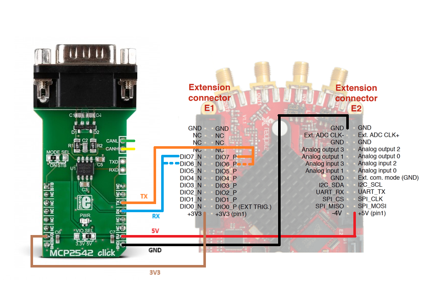
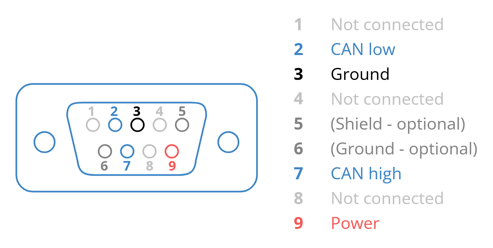

.. _can_example:

CAN 外部通信
######################

描述
============

本示例演示如何使用 Red Pitaya CAN 接口进行通信。下面的代码借助 |MCP2542-click| 在同一 Red Pitaya 的 CAN0 和 CAN1 接口之间发送 CAN 帧。相同原理也可用于与 CAN 总线上的其他设备通信。

所需硬件
==================

- Red Pitaya
- 2 个 CAN 收发器（例如 |MCP2542-click|）
- 用于连接收发器的线缆（例如 DB-9）
- 引脚跳线

.. figure:: ../general_img/RedPitaya_general.png

|

所需软件
==================

- **2.04-35 或更高版本的 OS**

.. note::

    此代码适用于 **2.04-35 或更高版本的 OS**。对于较旧的 OS 版本，请检查具体命令的发布版本（每个在 2.00 或更高版本中引入的命令都附有说明）。

连接
============

将 MCP2452 Click 板（或其他 CAN 收发器）连接到 Red Pitaya：

- 将 CAN 收发器的 TX 引脚连接到 Red Pitaya 的 CAN RX 引脚
- 将 CAN 收发器的 RX 引脚连接到 Red Pitaya 的 CAN TX 引脚
- 连接电源和接地引脚
- 使用 DB-9（或其他）线缆将 CAN 收发器连接到外部 CAN 总线或另一块 MPC2542 Click 板

.. note::

    - **CAN0** - TX == DIO7_N, RX == DIO7_P
    - **CAN1** - TX == DIO6_N, RX == DIO6_P

以下是 DB-9 连接器的 CAN 引脚定义：

    图片来源：|CSS-CAN|

  
SCPI 代码示例
====================

代码 - MATLAB®
---------------

.. include:: ../matlab.inc

.. code-block:: matlab

    %% Define Red Pitaya as TCP/IP object
    clc
    close all
    IP = 'rp-f0a235.local';           % IP of your Red Pitaya
    port = 5000;
    RP = tcpclient(IP, port);
    
    %% Variables
    
    can_bus1 = 0;
    can_bus2 = 1;
    bitrate = 200000;
    can_id = 123;
    can_id2 = 321;
    timeout = 2000;
    can_mode = 'loopback';
    
    can_info = [];
    can_data = [];
    
    tx_buffer = 0:8;
    
    %% Open connection with your Red Pitaya
    RP.ByteOrder = 'big-endian';
    configureTerminator(RP,'CR/LF');
    flush(RP);
    fprintf('Start\n');
    
    writeline(RP, append('CAN', num2str(can_bus1), ':CLOSE'));
    writeline(RP, append('CAN', num2str(can_bus2), ':CLOSE'));
    
    % INIT CAN
    writeline(RP, 'CAN:FPGA ON');
    
    %% CAN 0 SETUP
    % GPIO (N7,P7)
    writeline(RP, append('CAN', num2str(can_bus1), ':STOP'));
    writeline(RP, append('CAN', num2str(can_bus1), ':BITRate ', num2str(bitrate)));
    writeline(RP, append('CAN', num2str(can_bus1), ':MODE ', upper(can_mode), ',OFF'));
    
    %% CAN 1 SETUP
    % GPIO (N6,P6) 
    writeline(RP, append('CAN', num2str(can_bus2), ':STOP'));
    writeline(RP, append('CAN', num2str(can_bus2), ':BITRate ', num2str(bitrate)));
    writeline(RP, append('CAN', num2str(can_bus2), ':MODE ', upper(can_mode), ',OFF'));
    
    
    %% Start and open both interfaces
    writeline(RP, append('CAN', num2str(can_bus1), ':START'));
    writeline(RP, append('CAN', num2str(can_bus1), ':OPEN'));
    
    writeline(RP, append('CAN', num2str(can_bus2), ':START'));
    writeline(RP, append('CAN', num2str(can_bus2), ':OPEN'));
    
    % Send and read data
    fprintf('Transmission CAN0 => CAN1\n')
    writeline(RP, append('CAN', num2str(can_bus1), ':Send', num2str(can_id ), ' ', strjoin(compose('%d',tx_buffer(1:3)),",")));
    writeline(RP, append('CAN', num2str(can_bus1), ':Send', num2str(can_id2), ' ', strjoin(compose('%d',tx_buffer),",")));
    
    can_data = writeread(RP, append('CAN', num2str(can_bus2), ':Read:Timeout', num2str(timeout), '?'));
    [can_info, can_data] = can_data_split(can_data);
    % canID, canIDraw, EXT_Frame, ERR_frame, RTR, Length, {data1, data2, data3, ...}
    sprintf( ['Package info:\n', ...
        'CAN ID: %d\n', ...
        'CAN ID raw: %d\n', ...
        'EXT frame: %d\n', ...
        'ERR frame: %d\n', ...
        'RTR: %d\n', ...
        'Data length: %d\n'], can_info(1), can_info(2), can_info(3), can_info(4), can_info(5), can_info(6));
    fprintf('Received data: %s\n', strjoin(can_data, ","));
    
    can_data = writeread(RP, append('CAN', num2str(can_bus2), ':Read:Timeout', num2str(timeout), '?'));
    [can_info, can_data] = can_data_split(can_data);
    % canID, canIDraw, EXT_Frame, ERR_frame, RTR, Length, {data1, data2, data3, ...}
    sprintf( ['Package info:\n', ...
        'CAN ID: %d\n', ...
        'CAN ID raw: %d\n', ...
        'EXT frame: %d\n', ...
        'ERR frame: %d\n', ...
        'RTR: %d\n', ...
        'Data length: %d\n'], can_info(1), can_info(2), can_info(3), can_info(4), can_info(5), can_info(6));
    fprintf('Received data: %s\n', strjoin(can_data, ","));
    
    % Send data the other way
    fprintf('\nTransmission CAN1 => CAN0\n')
    writeline(RP, append('CAN', num2str(can_bus2), ':Send', num2str(can_id ), ' ', strjoin(compose('%d',tx_buffer(1:3)),",")));
    writeline(RP, append('CAN', num2str(can_bus2), ':Send', num2str(can_id2), ' ', strjoin(compose('%d',tx_buffer),",")));
    
    can_data = writeread(RP, append('CAN', num2str(can_bus1), ':Read:Timeout', num2str(timeout), '?'));
    [can_info, can_data] = can_data_split(can_data);
    % canID, canIDraw, EXT_Frame, ERR_frame, RTR, Length, {data1, data2, data3, ...}
    sprintf( ['Package info:\n', ...
        'CAN ID: %d\n', ...
        'CAN ID raw: %d\n', ...
        'EXT frame: %d\n', ...
        'ERR frame: %d\n', ...
        'RTR: %d\n', ...
        'Data length: %d\n'], can_info(1), can_info(2), can_info(3), can_info(4), can_info(5), can_info(6));
    fprintf('Received data: %s\n', strjoin(can_data, ","));
    
    can_data = writeread(RP, append('CAN', num2str(can_bus1), ':Read:Timeout', num2str(timeout), '?'));
    [can_info, can_data] = can_data_split(can_data);
    % canID, canIDraw, EXT_Frame, ERR_frame, RTR, Length, {data1, data2, data3, ...}
    sprintf( ['Package info:\n', ...
        'CAN ID: %d\n', ...
        'CAN ID raw: %d\n', ...
        'EXT frame: %d\n', ...
        'ERR frame: %d\n', ...
        'RTR: %d\n', ...
        'Data length: %d\n'], can_info(1), can_info(2), can_info(3), can_info(4), can_info(5), can_info(6));
    fprintf('Received data: %s\n', strjoin(can_data, ","));
    
    % Close the interface
    writeline(RP, append('CAN', num2str(can_bus1), ':CLOSE'));
    writeline(RP, append('CAN', num2str(can_bus2), ':CLOSE'));
    fprintf("Program End\n")
    
    clear RP;
    

    function [can_data_start, can_data] = can_data_split(can_str)
        % Reorganizes the CAN string received from Red Pitaya into two NumPy
        % arrays. The first one contains the CAN package information, the second
        % one the CAN data.
    
        can_str_split = convertCharsToStrings(strsplit(strip(can_str, '}'), ',{'));
        can_data_start = str2double(strsplit(can_str_split(1), ','));
        can_data = strsplit(can_str_split(2), ',');
    end

代码 - Python
---------------

**使用 SCPI 命令：**

.. code-block:: python
    
    #!/usr/bin/python3
    
    import numpy as np
    import redpitaya_scpi as scpi
    
    def can_data_split(can_str: str):
    
        """
        Reorganizes the CAN string received from Red Pitaya into two NumPy
        arrays. The first one contains the CAN package information, the second
        one the CAN data.
        """
        can_str_split = can_str.split(",{")
        can_data_start = np.array(can_str_split[0].split(",")).astype(np.int32)
        can_data = np.array(can_str_split[1].strip("}").split(","))
    
        return can_data_start, can_data
    
    IP = 'rp-f0a235.local'
    
    can_bus1 = 0
    can_bus2 = 1
    bitrate = 200000
    can_id = 123
    can_id2 = 321
    timeout_rx = 2000
    can_mode = "loopback"
    timeout_tx = 2000
    
    tx_buffer = np.arange(3)
    tx_buffer2 = np.arange(5)
    
    rp = scpi.scpi(IP)
    
    # INIT CAN #
    rp.tx_txt('CAN:FPGA ON')
    print("CAN:FPGA ON")
    rp.check_error()
    
    ## CAN 0 SETUP ##
    # GPIO (N7,P7) 
    rp.tx_txt(f'CAN{can_bus1}:STOP')
    rp.tx_txt(f'CAN{can_bus1}:BITRate {bitrate}')
    rp.tx_txt(f'CAN{can_bus1}:MODE {can_mode.upper()},OFF')
    rp.check_error()
    
    ## CAN 1 SETUP ##
    # GPIO (N6,P6) 
    rp.tx_txt(f'CAN{can_bus2}:STOP')
    rp.tx_txt(f'CAN{can_bus2}:BITRate {bitrate}')
    rp.tx_txt(f'CAN{can_bus2}:MODE {can_mode.upper()},OFF')
    
    
    # Start and open both interfaces
    rp.tx_txt(f'CAN{can_bus1}:START')
    rp.tx_txt(f'CAN{can_bus1}:OPEN')
    
    rp.tx_txt(f'CAN{can_bus2}:START')
    rp.tx_txt(f'CAN{can_bus2}:OPEN')
    
    # Send and read data
    print("Transmission CAN0 => CAN1")
    rp.tx_txt(f'CAN{can_bus1}:Send{can_id} {np.array2string(tx_buffer, separator=',').replace('[','').replace(']','')}')
    rp.tx_txt(f'CAN{can_bus1}:Send{can_id2} {np.array2string(tx_buffer2, separator=',').replace('[','').replace(']','')}')
    
    rp.tx_txt(f'CAN{can_bus2}:Read:Timeout{timeout_rx}?')
    can0_info1,can0_data1 = can_data_split(rp.rx_txt())
    # canID, canIDraw, EXT_Frame, ERR_frame, RTR, Length, {data1, data2, data3, ...}
    print("Package info:\n",
        f"CAN ID: {can0_info1[0]}\n"
        f"CAN ID raw: {can0_info1[1]}\n",
        f"EXT frame: {can0_info1[2]}\n",
        f"ERR frame: {can0_info1[3]}\n",
        f"RTR: {can0_info1[4]}\n",
        f"Data length: {can0_info1[5]}\n")
    print(f"Received data: {can0_data1}\n")
    
    rp.tx_txt(f'CAN{can_bus2}:Read:Timeout{timeout_rx}?')
    can0_info2,can0_data2 = can_data_split(rp.rx_txt())
    print("Package info:\n",
        f"CAN ID: {can0_info2[0]}\n"
        f"CAN ID raw: {can0_info2[1]}\n",
        f"EXT frame: {can0_info2[2]}\n",
        f"ERR frame: {can0_info2[3]}\n",
        f"RTR: {can0_info2[4]}\n",
        f"Data length: {can0_info2[5]}\n")
    print(f"Received data: {can0_data2}\n")
    
    # Send data the other way
    print("Transmission CAN1 => CAN0")
    rp.tx_txt(f'CAN{can_bus2}:Send{can_id} {np.array2string(tx_buffer, separator=',').replace('[','').replace(']','')}')
    rp.tx_txt(f'CAN{can_bus2}:Send{can_id2} {np.array2string(tx_buffer2, separator=',').replace('[','').replace(']','')}')
    
    rp.tx_txt(f'CAN{can_bus1}:Read:Timeout{timeout_rx}?')
    can1_info1,can1_data1 = can_data_split(rp.rx_txt())
    print("Package info:\n",
        f"CAN ID: {can1_info1[0]}\n"
        f"CAN ID raw: {can1_info1[1]}\n",
        f"EXT frame: {can1_info1[2]}\n",
        f"ERR frame: {can1_info1[3]}\n",
        f"RTR: {can1_info1[4]}\n",
        f"Data length: {can1_info1[5]}\n")
    print(f"Received data: {can1_data1}\n")
    
    rp.tx_txt(f'CAN{can_bus1}:Read:Timeout{timeout_rx}?')
    can1_info2,can1_data2 = can_data_split(rp.rx_txt())
    print("Package info:\n",
        f"CAN ID: {can1_info2[0]}\n"
        f"CAN ID raw: {can1_info2[1]}\n",
        f"EXT frame: {can1_info2[2]}\n",
        f"ERR frame: {can1_info2[3]}\n",
        f"RTR: {can1_info2[4]}\n",
        f"Data length: {can1_info2[5]}\n")
    print(f"Received data: {can1_data2}\n")
    
    # Close the interface
    rp.tx_txt(f'CAN{can_bus1}:CLOSE')
    rp.tx_txt(f'CAN{can_bus2}:CLOSE')
    rp.check_error()
    rp.close()

.. include:: ../python_scpi_note.inc

API 代码示例
====================

.. include:: ../c_code_note.inc

代码 - C++
-------------

.. include:: ../c_code_note.inc

.. code-block:: cpp
    
    /* @brief This application demonstrates communication between two devices on a CAN bus
    * using CAN0 and CAN1 ports on the Red Pitaya.
    *
    * (c) Red Pitaya  http://www.redpitaya.com
    *
    * This part of code is written in C programming language.
    * Please visit http://en.wikipedia.org/wiki/C_(programming_language)
    * for more details on the language used herein.
    */
    
    #include <stdio.h>
    #include <stdlib.h>
    #include <string.h>
    
    #include "rp.h"
    #include "rp_hw_can.h"
    
    int main(int argc, char *argv[]){
    
        int res;
        int bitrate = 200000;
    
        int can_id_1 = 123;
        int can_id_2 = 321;
    
        int timeout_rx = 2000;
    
        unsigned char tx_buffer[8];
        memset(tx_buffer, '0', 8);
    
        tx_buffer[0] = '1';
        tx_buffer[1] = '2';
        tx_buffer[2] = '3';
        tx_buffer[3] = '4';
        tx_buffer[4] = '5';
    
        printf("Tx buffer data: %s\n", tx_buffer);
    
        res = rp_CanSetFPGAEnable(true); // init can in fpga for pass can controller to GPIO (N7,P7) 
        printf("Init result: %d\n",res);
    
        /* CAN 0 SETUP */
        res = rp_CanStop(RP_CAN_0); // set can0 interface to DOWN  for configure
        printf("Stop can0: %d\n",res);
    
        res = rp_CanSetBitrate(RP_CAN_0, bitrate); // set can0 bitrate
        printf("Set bitrate: %d\n",res);
        
        res = rp_CanSetControllerMode(RP_CAN_0, RP_CAN_MODE_LOOPBACK, false); // set loopback mode
        printf("Set loopback mode OFF: %d\n",res);
        
        /* CAN 1 SETUP */
        res = rp_CanStop(RP_CAN_1); // set can1 interface to DOWN  for configure
        printf("Stop can1: %d\n",res);
        
        res = rp_CanSetBitrate(RP_CAN_1, bitrate); // set can1 bitrate
        printf("Set bitrate: %d\n",res);
        
        res = rp_CanSetControllerMode(RP_CAN_1, RP_CAN_MODE_LOOPBACK, false); // set loopback mode
        printf("Set loopback mode OFF: %d\n",res);
        
    
        /* Start and open both interfaces */
        res = rp_CanStart(RP_CAN_0); // set can0 interface to UP
        printf("Start can0: %d\n",res);
        
        res = rp_CanOpen(RP_CAN_0); // open socket for can0
        printf("Open socket: %d\n",res);
        
        res = rp_CanStart(RP_CAN_1); // set can1 interface to UP
        printf("Start can1: %d\n",res);
        
        res = rp_CanOpen(RP_CAN_1); // open socket for can1
        printf("Open socket: %d\n",res);
    
        /* Send and read data */
        res = rp_CanSend(RP_CAN_0, can_id_1, tx_buffer, 3, false, false, 0); // write buffer to can0
        printf("Write result: %d\n",res);
    
        res = rp_CanSend(RP_CAN_0, can_id_2, tx_buffer, 5, true, false, 0); // write buffer to can0
        printf("Write result: %d\n",res);
    
        rp_can_frame_t frame;
        res = rp_CanRead(RP_CAN_1, timeout_rx, &frame); // read frame from can1
        printf("Read result: %d\n",res);   
        printf("Can ID: %d data: %d,%d,%d\n", frame.can_id, frame.data[0], frame.data[1], frame.data[2]);
        
        res = rp_CanRead(RP_CAN_1, timeout_rx, &frame); // read frame from can1 without timeout
        printf("Read result: %d\n",res);
        printf("Can ID: %d data: %d,%d,%d,%d,%d\n", frame.can_id, frame.data[0], frame.data[1], frame.data[2], frame.data[3], frame.data[4]);
    
    
        /* Send data the outher way around */
        res = rp_CanSend(RP_CAN_1, can_id_1, tx_buffer, 3, false, false, 0); // write buffer to can0
        printf("Write result: %d\n",res);
    
        res = rp_CanSend(RP_CAN_1, can_id_2, tx_buffer, 5, true, false, 0); // write buffer to can0
        printf("Write result: %d\n",res);
    
        rp_can_frame_t frame_1;
        res = rp_CanRead(RP_CAN_0, timeout_rx, &frame_1); // read frame from can1
        printf("Read result: %d\n",res);   
        printf("Can ID: %d data: %d,%d,%d\n",frame_1.can_id,frame_1.data[0],frame_1.data[1],frame_1.data[2]);
        
    
        res = rp_CanRead(RP_CAN_0, timeout_rx, &frame_1); // read frame from can1 without timeout
        printf("Read result: %d\n",res);   
        printf("Can ID: %d data: %d,%d,%d,%d,%d\n",frame_1.can_id,frame_1.data[0],frame_1.data[1],frame_1.data[2],frame_1.data[3],frame_1.data[4]);
        
    
        /* Close the interface */
        res = rp_CanClose(RP_CAN_0); // close socket for can0
        printf("Close can0 result: %d\n",res);
        
        res = rp_CanClose(RP_CAN_1); // close socket for can1
        printf("Close can1 result: %d\n",res);
        return 0;
    }

代码 - Python API
-------------------

.. code-block:: python

    #!/usr/bin/env python3
    
    """ Python API example of CAN communication """
    
    import numpy as np
    import rp
    import rp_hw_can
    
    # Variables
    
    can0 = rp_hw_can.RP_CAN_0                   # RP_CAN_0 == DIO7_P, DIO7_N
    can1 = rp_hw_can.RP_CAN_1                   # RP_CAN_1 == DIO6_P, DIO6_N
    
    can_id_1 = 123
    can_id_2 = 321
    can_bitrate = 200000                        # 1 - 10000000
    can_mode = rp_hw_can.RP_CAN_MODE_LOOPBACK   # RP_CAN_MODE_LOOPBACK, RP_CAN_MODE_LISTENONLY, 
                                                # RP_CAN_MODE_3_SAMPLES, RP_CAN_MODE_ONE_SHOT,
                                                # RP_CAN_MODE_BERR_REPORTING
                                                
    can_extended_frame = False                  # Extended can frame (True/False)
    can_rtr = False                             # Remote request frame (True/False)
    can_timeout = 2000                          # Timeout in milliseconds (0 == disabled)
    
    tx_buffer = np.arange(8, dtype=np.uint8)
    rx_buffer = np.zeros(8, dtype=np.uint8)
    
    print(f"TX data: {tx_buffer}")
    print(f"RX data: {rx_buffer}")
    
    rp.rp_Init()
    
    rp_hw_can.rp_CanSetFPGAEnable(True)                         # init can in fpga for pass can controller to GPIO (N7,P7) 
    
    ## CAN 0 SETUP ##
    rp_hw_can.rp_CanStop(can0)                                  # set can0 interface to DOWN for configuration
    rp_hw_can.rp_CanSetBitrate(can0, can_bitrate)               # set can0 bitrate
        
    rp_hw_can.rp_CanSetControllerMode(can0, can_mode, False)    # disable loopback mode
    
        
    ## CAN 1 SETUP ##
    rp_hw_can.rp_CanStop(can1)                                  # set can1 interface to DOWN for configuration  
    rp_hw_can.rp_CanSetBitrate(can1, can_bitrate)               # set can1 bitrate   
    rp_hw_can.rp_CanSetControllerMode(can1, can_mode, False)    # disable loopback mode
        
    # Start and open both interfaces
    rp_hw_can.rp_CanStart(can0)                                 # set can0 interface to UP
    rp_hw_can.rp_CanOpen(can0)                                  # open socket for can0
    
    rp_hw_can.rp_CanStart(can1)                                 # set can1 interface to UP
    rp_hw_can.rp_CanOpen(can1)                                  # open socket for can1
    print("CAN ready\n")
    
    # Send and read data
    print("Transmission CAN0 => CAN1")
    # rp_CanSendNP(interface, canId, isExtended, rtr, timeout, np_buffer)
    rp_hw_can.rp_CanSendNP(can0, can_id_1, False, False, 0, tx_buffer[0:3]) # write buffer to can0
    rp_hw_can.rp_CanSendNP(can0, can_id_2, True, False, 0, tx_buffer)       # write buffer to can0
    
    # rp_CanReadNP(interface, timeout, np_buffer)
    can_info = rp_hw_can.rp_CanReadNP(can1, can_timeout, rx_buffer)         # read frame from can1  
    print(f"Data received: {rx_buffer}\n",
          f"Can ID: {can_info[1]}\n",
          f"Data length: {can_info[2]}\n",
          f"Success (0 == OK): {can_info[0]}\n")
    rx_buffer = np.zeros(8, dtype=np.uint8)                                 # clear buffer
    
    can_info = rp_hw_can.rp_CanReadNP(can1, can_timeout, rx_buffer)         # read frame from can1  
    print(f"Data received: {rx_buffer}\n",
          f"Can ID: {can_info[1]}\n",
          f"Data length: {can_info[2]}\n",
          f"Success (0 == OK): {can_info[0]}\n")
    rx_buffer = np.zeros(8, dtype=np.uint8)                                 # clear buffer
    
    # Send data the other way
    print("Transmission CAN1 => CAN0")
    # rp_CanSendNP(interface, canId, isExtended, rtr, timeout, np_buffer)
    rp_hw_can.rp_CanSendNP(can1, can_id_1, False, False, 0, tx_buffer[0:3]) # write buffer to can0
    rp_hw_can.rp_CanSendNP(can1, can_id_2, True, False, 0, tx_buffer)       # write buffer to can0
    
    # rp_CanReadNP(interface, timeout, np_buffer)
    can_info = rp_hw_can.rp_CanReadNP(can0, can_timeout, rx_buffer)         # read frame from can1  
    print(f"Data received: {rx_buffer}\n",
          f"Can ID: {can_info[1]}\n",
          f"Data length: {can_info[2]}\n",
          f"Success (0 == OK): {can_info[0]}\n")
    rx_buffer = np.zeros(8, dtype=np.uint8)                                 # clear buffer
    
    can_info = rp_hw_can.rp_CanReadNP(can0, can_timeout, rx_buffer)         # read frame from can1  
    print(f"Data received: {rx_buffer}\n",
          f"Can ID: {can_info[1]}\n",
          f"Data length: {can_info[2]}\n",
          f"Success (0 == OK): {can_info[0]}\n")
    rx_buffer = np.zeros(8, dtype=np.uint8)                                 # clear buffer
    
    # Close the interface and release resources
    rp_hw_can.rp_CanClose(can0)             # close socket for can0
    rp_hw_can.rp_CanClose(can1)             # close socket for can1
    
    print("End Program")
    rp.rp_Release()
    
