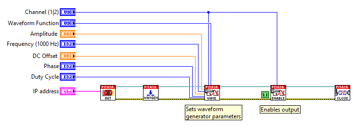

生成连续信号
##########################

说明
=============

本示例展示如何编程 Red Pitaya，生成幅度为 1 V、频率为 2 kHz 的模拟正弦波信号。电压和频率范围取决于 Red Pitaya 型号。

所需硬件
==================

    - Red Pitaya device

.. figure:: ../general_img/RedPitaya_general.png

所需软件
==================

.. include:: ../sw_requirement.inc

SCPI 代码示例
====================

代码 - MATLAB®
---------------

.. include:: ../matlab.inc

.. code-block:: matlab

    %% Define Red Pitaya as TCP/IP object
    IP = 'rp-f0a235.local';           % Input IP of your Red Pitaya...
    port = 5000;
    RP = tcpclient(IP, port);

    %% Open connection with your Red Pitaya
    RP.ByteOrder = 'big-endian';
    configureTerminator(RP, 'CR/LF');

    waveform = 'sine';
    freq = 20000;
    ampl = 0.4;

    writeline(RP,'GEN:RST');

    writeline(RP, append('SOUR1:FUNC ', waveform));             % Set function of output signal % {sine, square, triangle, sawu,sawd, pwm}
    writeline(RP, append('SOUR1:FREQ:FIX ', num2str(freq)));    % Set frequency of output signal
    writeline(RP, append('SOUR1:VOLT ', num2str(ampl)));        % Set amplitude of output signal

    writeline(RP,'SOUR1:TRig:SOUR INT');
    writeline(RP,'OUTPUT1:STATE ON');               % Set output to ON

    writeline(RP,'SOUR1:TRig:INT');                 % Generate trigger

    %% Close connection with Red Pitaya
    clear RP;

代码 - Python
----------------

**使用 SCPI 命令：**

.. code-block:: python

    #!/usr/bin/env python3
    
    import sys
    import redpitaya_scpi as scpi
    
    IP = "192.168.178.111"
    rp = scpi.scpi(IP)

    wave_form = 'sine'
    freq = 2000
    ampl = 1

    rp.tx_txt('GEN:RST')

    rp.tx_txt('SOUR1:FUNC ' + str(wave_form).upper())
    rp.tx_txt('SOUR1:FREQ:FIX ' + str(freq))
    rp.tx_txt('SOUR1:VOLT ' + str(ampl))

    # Enable output
    rp.tx_txt('OUTPUT1:STATE ON')
    rp.tx_txt('SOUR1:TRig:INT')

    rp.close()

**使用函数：**

.. code-block:: python

    #!/usr/bin/env python3
    
    import sys
    import redpitaya_scpi as scpi
    
    wave_form = 'sine'
    freq = 2000
    ampl = 1

    IP = "192.168.178.111"
    rp = scpi.scpi(IP)
    
    rp.tx_txt('GEN:RST')
    
    # Function for configuring a Source 
    rp.sour_set(1, wave_form, ampl, freq)
    
    # Enable output
    rp.tx_txt('OUTPUT1:STATE ON')
    rp.tx_txt('SOUR1:TRig:INT')

    rp.close()

.. include:: ../python_scpi_note.inc

代码 - LabVIEW
---------------

- `下载示例 <https://downloads.redpitaya.com/downloads/Clients/labview/Generate%20continuous%20signal.vi>`_

API 代码示例
====================

.. include:: ../c_code_note.inc

代码 - C++ API
---------------

.. code-block:: cpp

    /* Red Pitaya C++ API example of Continuous generation on a specific channel */ 

    #include <stdio.h>
    #include <stdint.h>
    #include <stdlib.h>
    #include <unistd.h>

    #include "rp.h"

    int main(int argc, char **argv){

        /* Print error, if rp_Init() function failed */
        if(rp_Init() != RP_OK){
            fprintf(stderr, "Rp api init failed!\n");
        }

        /* Reset generator */
        rp_GenReset();

        /* Generation */
        rp_GenWaveform(RP_CH_1, RP_WAVEFORM_SINE);    // Waveform
        rp_GenFreq(RP_CH_1, 2000.0);                  // Frequency
        rp_GenAmp(RP_CH_1, 1.0);                      // Amplitude

        // Emable channel output
        rp_GenOutEnable(RP_CH_1);

        // Trigger generation
        rp_GenTriggerOnly(RP_CH_1);

        /* Releasing resources */
        rp_Release();

        return 0;
    }

代码 - Python API
------------------

.. code-block:: python

    #!/usr/bin/python3

    import time
    import rp

    #? Possible waveforms:
    #?   RP_WAVEFORM_SINE, RP_WAVEFORM_SQUARE, RP_WAVEFORM_TRIANGLE, RP_WAVEFORM_RAMP_UP,
    #?   RP_WAVEFORM_RAMP_DOWN, RP_WAVEFORM_DC, RP_WAVEFORM_PWM, RP_WAVEFORM_ARBITRARY,
    #?   RP_WAVEFORM_DC_NEG, RP_WAVEFORM_SWEEP

    channel = rp.RP_CH_1        # rp.RP_CH_2
    waveform = rp.RP_WAVEFORM_SINE
    freq = 2000
    ampl = 1

    # Initialize the interface
    rp.rp_Init()

    # Reset generator
    rp.rp_GenReset()

    ###### Generation #####
    rp.rp_GenWaveform(channel, waveform)
    rp.rp_GenFreqDirect(channel, freq)
    rp.rp_GenAmp(channel, ampl)

    # Enable output and trigger the generator
    rp.rp_GenOutEnable(channel)
    rp.rp_GenTriggerOnly(channel)

    # Release resources
    rp.rp_Release()
