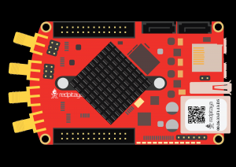

.. _LA_spi_loopback_fpga:

解码 SPI 协议（FPGA 回环）
######################################

描述
============

本示例演示如何使用逻辑分析仪命令解码 SPI 协议。Red Pitaya 在 SPI 端口上生成 SPI 消息，并在指定的数字输入上对其进行解码。捕获的数据存储在 ``spi_data.bin`` 文件中，可用于进一步分析。
配置本示例时，请确保 SPI API 设置与 SPI 解码器设置相匹配。

将 SPI 引脚连接到数字引脚：

- **SPI CLK (E2) <-> DIO2_P (E1)**
- **SPI MISO (E2) <-> DIO0_P (E1)**
- **SPI MOSI (E2) <-> DIO1_P (E1)**
- **SPI CS (E2) <-> DIO3_P (E1)**

.. include:: la_spi_settings.inc

.. note::

    Red Pitaya API 的 SPI 速度会四舍五入到最接近的可编程值。对于 1 MHz，实际速度为 SPI 时钟速度 781250 Hz。

所需硬件
==================

    - Red Pitaya
    - 引脚跳线

|

所需软件
===================

.. include:: ../sw_requirements_indev.inc

API 代码示例
==================

代码 - Python
--------------

.. code-block:: python

    #!/usr/bin/python3
    """ Example of using the Logic Analyzer Python API to decode an internal SPI signal on Red Pitaya.
    """
    import sys
    import time
    import rp_la
    import rp_hw
    import rp_hw_profiles
    import numpy as np
    from rp_overlay import overlay

    # Define callback
    class Callback(rp_la.CLACallback):
        def captureStatus(self, controller, isTimeout, bytes, samples, preTrig, postTrig):
            print("CaptureStatus timeout =",isTimeout,"bytes =",bytes,"samples =",samples,"preTrig =",preTrig,"postTrig =",postTrig)

        def decodeDone(self, controller, name):
            print("Decode done ", name)

    print("""Before the test, connect:
        - the output SPI MISO (E2) <-> any DIO _P (E1)
        - the output SPI MOSI (E2) <-> any DIO _P (E1)
        - the output SPI CLK (E2)  <-> any DIO _P (E1)
        - the output SPI CS  (E2)  <-> any DIO _P (E1)""")

    data = list("TEST string")
    data_int = [ord(char) for char in data]     # Convert data to ASCII values
    data_size = len(data_int)

    ## SPI API settins ##
    spi_mode = rp_hw.RP_SPI_MODE_LIST   		# LISL, LIST, HISL, HIST
    spi_cs_mode = rp_hw.RP_SPI_CS_NORMAL        # NORMAL, HIGH
    spi_speed = 1000000                         # 1 - 100000000
    spi_word_size = 8                           # 7, 8
    spi_bit_order = rp_hw.RP_SPI_ORDER_BIT_MSB  # MSB, LSB

    msg_num = 1

    ## SPI decoder settings ##
    # - LISL - Low  idle level, sample on leading edge  - cpol=0, cpha=0
    # - LIST - Low  idle level, sample on trailing edge - cpol=0, cpha=1
    # - HISL - High idle level, sample on leading edge  - cpol=1, cpha=0
    # - HIST - High idle level, sample on trailing edge - cpol=1, cpha=1

    dec_bit_order = 0                   # MsbFirst = 0, LsbFirst = 1
    dec_cpha = 0                        # 0, 1
    dec_cpol = 0                        # 0, 1
    dec_invert_bit = 0
    dec_word_size = 8                   # 7, 8
    dec_cs_polarity = 0                 # ActiveLow = 0, ActiveHigh = 1
    dec_cs = 4                          # SPI CS   (1 - first line.  Valid values are from 1 to 8)
    dec_clk = 3                         # SPI CLK
    dec_miso = 1                        # SPI MISO
    dec_mosi = 2                        # SPI MOSI

    # LA acquisition
    trigger_ch = rp_la.LA_T_CHANNEL_2   # Trigger chanels are 1 to 8
    trig_edge = rp_la.LA_RISING_OR_FALLING   # LOW, HIGH, RISING, FALLING, RISING_OR_FALLING

    enable_RLE = True
    decimation = 8
    acq_rate = int(rp_hw_profiles.rp_HPGetBaseSpeedHzOrDefault() / decimation)
    pre_trig_samples = int(125e6/decimation * 1e-3)
    post_trig_samples = int(125e6/decimation * 2e-3)
    print(f"Pre post trigger: {pre_trig_samples} {post_trig_samples}")

    # Change FPGA image to logic analyzer "logic"
    fpga = overlay("logic")

    # Create controller and initialize FPGA
    rp_cla = rp_la.CLAController()
    rp_cla.initFpga()

    callback = Callback()
    rp_cla.setDelegate(callback.__disown__())

    # Initialize and configure SPI on Red Pitaya
    rp_hw.rp_SPI_Init()
    rp_hw.rp_SPI_InitDevice("/dev/spidev2.0")
    rp_hw.rp_SPI_SetMode(spi_mode)
    rp_hw.rp_SPI_SetCSMode(spi_cs_mode)
    rp_hw.rp_SPI_SetSpeed(spi_speed)
    rp_hw.rp_SPI_SetWordLen(spi_word_size)
    rp_hw.rp_SPI_SetOrderBit(spi_bit_order)

    # Apply settings to SPI
    rp_hw.rp_SPI_SetSettings()

    # Reserve space for messages
    rp_hw.rp_SPI_CreateMessage(msg_num)

    # Copy data to buffer
    tx_buff = rp_hw.Buffer(data_size)
    for i in range(data_size):
        tx_buff[i] = data_int[i]

    # Set buffer for first message and create RX buffer
    #                           message number, tx_buffer, init_rx_buff,      size, toggle cs
    rp_hw.rp_SPI_SetBufferForMessage(        0,  tx_buff,         True,  data_size,     False)

    # Set LA parameters
    rp_cla.setEnableRLE(True)
    rp_cla.setDecimation(decimation)
    rp_cla.setTrigger(trigger_ch, trig_edge)
    rp_cla.setPreTriggerSamples(pre_trig_samples)
    rp_cla.setPostTriggerSamples(post_trig_samples)

    # Add SPI decoder and configure decoder settings
    rp_cla.addDecoder("SPI", rp_la.LA_DECODER_SPI)
    rp_cla.setDecoderSettingsUInt("SPI", "acq_speed", acq_rate)
    rp_cla.setDecoderSettingsUInt("SPI", "bitOrder", dec_bit_order)
    rp_cla.setDecoderSettingsUInt("SPI", "cpha", dec_cpha)
    rp_cla.setDecoderSettingsUInt("SPI", "cpol", dec_cpol)
    rp_cla.setDecoderSettingsUInt("SPI", "invert_bit", dec_invert_bit)
    rp_cla.setDecoderSettingsUInt("SPI", "word_size", dec_word_size)
    rp_cla.setDecoderSettingsUInt("SPI", "cs_polarity", dec_cs_polarity)
    rp_cla.setDecoderSettingsUInt("SPI", "cs", dec_cs)
    rp_cla.setDecoderSettingsUInt("SPI", "clk", dec_clk)
    rp_cla.setDecoderSettingsUInt("SPI", "miso", dec_miso)
    rp_cla.setDecoderSettingsUInt("SPI", "mosi", dec_mosi)

    # Start acquisition
    rp_cla.runAsync(0)
    print("Started acquire data")

    time.sleep(0.1)     # Wait for LA to acquire some data

    # Pass message to SPI
    rp_hw.rp_SPI_ReadWrite()

    # Wait for trigger
    res = rp_cla.wait(2000)
    if res:
        print("Exit by timeout")
        sys.exit(1)

    # Save data to file
    rp_cla.saveCaptureDataToFile("spi_data.bin")

    # Get captured data
    rawBytesCount = rp_cla.getCapturedDataSize()
    raw_data = np.zeros(rawBytesCount, dtype=np.uint8)
    print(f"Packed samples count: {rp_cla.getDataNP(raw_data)}")

    # Get unpacked RLE data
    rle_data = np.zeros(rp_cla.getCapturedSamples(), dtype=np.uint8)
    print(f"Unpacked samples count: {rp_cla.getUnpackedRLEDataNP(rle_data)}")
    print(f"RLE DATA {raw_data}")
    print(f"UNPACKED DATA {rle_data}\n")

    rp_cla.printRLE(False)

    print("\nDecoded data")
    decode = rp_cla.getDecodedData("SPI")
    for index in range(len(decode)):
        print(f"{rp_cla.getAnnotation(rp_la.LA_DECODER_SPI, decode[index]['control'])} = {decode[index]}")

    # Delete all messages and release SPI resources
    rp_hw.rp_SPI_DestroyMessage()
    rp_hw.rp_SPI_Release()
    del rp_cla
