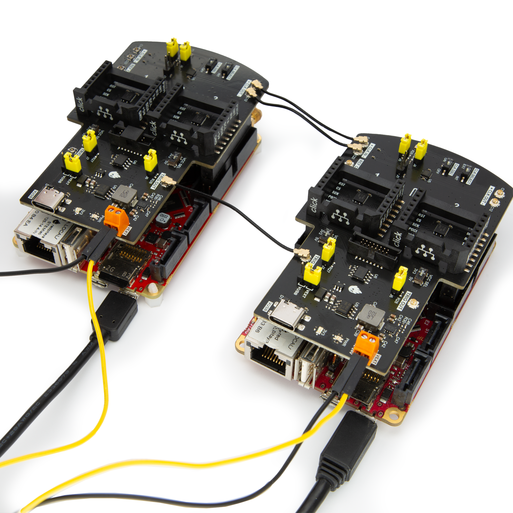

.. _click_shield_sync_acq:

Click Shield 同步采集
#####################################################

描述
============

本示例演示如何使用 Red Pitaya Click Shield 同步多块 Red Pitaya 板卡，从而在多台 Red Pitaya 设备（快速 RF 输入和输出）上同时采集生成信号的 16k 个采样点。
Red Pitaya 可以通过 DIO0_N 发送触发信号，并通过 DIO0_P 接收该信号。

本示例可轻松修改为同步生成：配置信号生成、选择主板触发，将所有从板触发设置为 EXT_NE，最后将菊花链触发源更改为 DAC。

所需硬件
===================

    -   两台或更多 Red Pitaya 外部时钟设备（STEMlab 125-14 Ext. clk.、SDRlab 122-16 Ext. Clk.、STEMlab 125-14 4-Input）
    -   每台设备配备一块 Red Pitaya Click Shield
    -   U.FL 线缆
    -   SMA 线缆
    -   SMA T 型连接器

.. note::

    STEMlab 125-14 4-Input 配有 Clock Select 引脚，用于确定使用内部时钟还是外部时钟。有关更多信息，请参阅 :ref:`STEMlab 125-14 4-Input 文档 <top_125_14_4-IN>`。

所需软件
==================

- **2.04-35 或更高版本的 OS**

.. note::

    此代码适用于 **2.04-35 或更高版本的 OS**。对于较旧的 OS 版本，请检查具体命令的发布版本（每个在 2.00 或更高版本中引入的命令都附有说明）。

.. .. include:: ../sw_requirement.inc

接线示例
====================

Red Pitaya Click Shield 可以将多台 Red Pitaya 设备同步在一起。由于时钟和触发同步使用 U.FL 线缆，因此链路中还可以包含其他外部时钟设备。
这种连接可将多台 Red Pitaya 设备之间的时钟信号延迟降至最低，因为两台设备之间只有一个 ZL40213 LVDS 时钟扇出缓冲器。

要同步两台或更多 Red Pitaya 设备，请使用 U.FL 线缆在主板（发送时钟和触发信号）与从板（接收时钟和触发信号）之间建立以下连接。根据需要连接外部时钟还是使用 Red Pitaya Click Shield 上的振荡器，选择下面两种方案之一。

振荡器
-----------

.. figure:: img/Click_Shield_Oscillator_Sync.png
    :width: 500
    :align: center

使用振荡器时，第一块 Red Pitaya Click Shield 会将时钟和触发信号发送到链路中的所有设备。请重点检查以下事项：

**主板：**

- 连接跳线 J4 和 J5，将振荡器连接到时钟传输线路。
- 连接跳线 J6 和 J7，将 Red Pitaya 触发信号连接到触发传输线路。
- 断开跳线 J1（使用单线时钟时除外）。
- 将 CLK OSC 开关置于 ON 位置。
- 将 CLK SELECT 开关置于 EXT 位置。

**从板：**

- 连接跳线 J6，将触发信号连接到 Ext. Trigger 引脚。
- 断开跳线 J1（使用单线时钟时除外）。
- 将 CLK OSC 开关置于 OFF 位置。
- 将 CLK SELECT 开关置于 EXT 位置。

如果使用外部触发信号，请将从板的触发连接方式复制到主板（断开 J7，并连接外部触发 U.FL 线缆）。
否则，DIO0_N 用作外部触发输出（位于主板），DIO0_P 用作外部触发输入。

外部时钟
---------------

.. figure:: img/Click_Shield_Ext_Clock_Sync.png
    :width: 500
    :align: center

使用外部时钟和外部触发时，时钟和触发信号会发送到链路中的所有设备。所有 Click Shield 使用相同配置：

**主板和从板：**

- 连接跳线 J6，将触发信号连接到 Ext. Trigger 引脚。
- 断开跳线 J1（使用单线时钟时除外）。
- 将 CLK OSC 开关置于 OFF 位置。
- 将 CLK SELECT 开关置于 EXT 位置。

.. note::

    有关连接器、开关和跳线位置的更多信息，请参阅 :ref:`Red Pitaya Click Shield 文档 <click_shield>`。

.. note::

    来自 SATA 连接器和 DIO0_P（外部触发引脚）的触发信号会在软件中执行 OR 运算。生成与采集的触发沿作用于“OR 门”之后，并根据 ``DAISY:TRIG_O:SOUR <mode>`` 命令触发 DAC 或 ADC。

SCPI 代码示例
====================

代码 - MATLAB®
---------------

.. include:: ../matlab.inc

.. code-block:: matlab
        
    %% ### CLICK SHIELD EXAMPLE ###
    % This example is for setting up two units (one primary and one secondary)
    % For multiple secondary units duplicate the code for the secondary unit
    % and change the IP address and RP_SEC to for example, RP_SECx (where x is
    % a consecutive secondary unit)
    % This example is for External clock Red Pitaya units connected with Red
    % Pitaya Click Shields

    %% Parameters
    close all;
    clc

    % Generation
    wave_form = 'SINE';
    freq = 100e3;
    ampl = 1;

    % Acquisition
    dec = 2;
    trig_lvl = 0.5;
    trig_dly = 7000;

    %% Set up the IP and SCPI server
    IP_PRI = 'rp-f066c8.local';           % Primary unit
    IP_SEC = 'rp-f0ac90.local';           % Secondary unit

    port = 5000;
    RP_PRI = tcpclient(IP_PRI, port);           % create a TCP client object
    RP_SEC = tcpclient(IP_SEC, port);

    RP_PRI.ByteOrder = 'big-endian';            % Define byte order and terminator for both units
    configureTerminator(RP_PRI, 'CR/LF'); 
    RP_SEC.ByteOrder = 'big-endian';
    configureTerminator(RP_SEC, 'CR/LF');       % defines the line terminator (end sequence of input characters)

    flush(RP_PRI);
    fprintf('Program start');

    %% Reseting Generation and Acquisition
    writeline(RP_PRI,'GEN:RST');
    writeline(RP_PRI,'ACQ:RST');

    writeline(RP_SEC,'GEN:RST');
    writeline(RP_SEC,'ACQ:RST');

    %%% PRIMARY UNIT %%%
    writeline(RP_PRI,'DAISY:TRig:Out:ENable ON');
    writeline(RP_PRI,'DAISY:TRig:Out:SOUR ADC');      % Select which trigger will be shared

    writeline(RP_PRI,'DIG:PIN LED5,1');     % indicator

    fprintf('DIO0_N trigger: %s\n', writeread(RP_PRI,'DAISY:TRig:Out:ENable?'));
    fprintf('Trigger source: %s\n', writeread(RP_PRI,'DAISY:TRig:Out:SOUR?'));

    %%% SECONDARY UNIT %%%
    % this section must be copied if using multiple secondary devices (once for each device)
    writeline(RP_SEC,'DAISY:TRig:Out:ENable OFF');

    writeline(RP_SEC,'DIG:PIN LED5,1');     % indicator

    %% Generation - Primary unit
    writeline(RP_PRI, append('SOUR1:FUNC ', wave_form));
    writeline(RP_PRI, append('SOUR1:FREQ:FIX ', num2str(freq)));
    writeline(RP_PRI, append('SOUR1:VOLT ', num2str(ampl)));

    writeline(RP_PRI, 'OUTPUT1:STATE ON');
    fprintf('Generation start\n');

    %% Acquisition Setup
    % Primary unit
    writeline(RP_PRI, append('ACQ:DEC:Factor ', num2str(dec)));
    writeline(RP_PRI, append('ACQ:TRig:LEV ', num2str(trig_lvl)));
    writeline(RP_PRI, append('ACQ:TRig:DLY ', num2str(trig_dly)));

    % Secondary unit
    writeline(RP_SEC, append('ACQ:DEC:Factor ', num2str(dec)));
    writeline(RP_SEC, append('ACQ:TRig:LEV ', num2str(trig_lvl)));
    writeline(RP_SEC, append('ACQ:TRig:DLY ', num2str(trig_dly)));

    %% Acquisition Start
    fprintf('ACQ Start\n');
    % First on secondary unit
    writeline(RP_SEC, 'ACQ:START');
    writeline(RP_SEC, 'ACQ:TRig EXT_NE');

    % Then on primary unit
    writeline(RP_PRI, 'ACQ:START');
    pause(0.05);
    writeline(RP_PRI, 'ACQ:TRig CH1_PE');

    pause(0.1);
    writeline(RP_PRI, 'SOUR1:TRig:INT');    % Simulate a trigger

    % Acquisition check if data is ready

    % ## Primary unit ##
    % while 1
    %     % Get Trigger Status
    %     trigger = writeread(RP_PRI, 'ACQ:TRig:STAT?');
    %     if strcmp(trigger,'TD')      % Triggerd?
    %         break
    %     end
    % end
    % fprintf('Trigger primary condition met.\n');

    while 1
        if strcmp(writeread(RP_PRI,'ACQ:TRig:FILL?'),'1')
            break
        end
    end
    fprintf('Buffer primary filled.\n');

    % ## Secondary unit ##
    % while 1
    %     % Get Trigger Status
    %     if strcmp(writeread(RP_SEC,'ACQ:TRig:STAT?'),'TD')      % Triggerd?
    %         break
    %     end
    % end
    % fprintf('Trigger secondary condition met.\n');

    while 1
        if strcmp(writeread(RP_SEC,'ACQ:TRig:FILL?'),'1')
            break
        end
    end
    fprintf('Buffer secondary filled.\n');

    %% Read and plot data
    data_str_pri = writeread(RP_PRI,'ACQ:SOUR1:DATA?');
    data_str_sec = writeread(RP_SEC,'ACQ:SOUR1:DATA?');

    data_pri = str2num(data_str_pri(2:length(data_str_pri) - 1));
    data_sec = str2num(data_str_sec(2:length(data_str_sec) - 1));

    % Plotting
    x = 0:16383;

    % MATLAB 2019b or higher
    t = tiledlayout(2,1);     % for MATLAB r2023a or higher use t = tiledlayout("vertical");

    nexttile
    plot(x, data_pri)
    title('Primary unit data')
    ylabel('V')
    xlabel('Samples')

    nexttile
    plot(x,data_sec)
    title('Secondary unit data')
    ylabel('V')
    xlabel('Samples')

    title(t, 'Acquired data')

    writeline(RP_PRI,'DIG:PIN LED5,0');
    writeline(RP_SEC,'DIG:PIN LED5,0');
    writeline(RP_PRI, 'OUTPUT1:STATE OFF');

    clear RP_PRI RP_SEC;

代码 - Python
---------------

**使用 SCPI 命令：**

.. code-block:: python

    #!/usr/bin/env python3
    """ Click shield daisy chain example for Red Pitaya. """

    import time
    import matplotlib.pyplot as plt
    import numpy as np

    import redpitaya_scpi as scpi

    # Connect OUT1 primary with IN1 primary and IN1 secondary

    wave_form = "sine"
    freq = 100000
    ampl = 1

    dec = 2
    trig_lvl = 0.5
    trig_dly = 7000

    IP_PRIM = 'rp-f0a235.local'   # Red Pitaya IP
    IP_SEC = 'rp-f0ac90.local'

    rp_prim = scpi.scpi(IP_PRIM)
    rp_sec = scpi.scpi(IP_SEC)

    print("Program Start")

    rp_prim.tx_txt('GEN:RST')
    rp_prim.tx_txt('ACQ:RST')

    rp_sec.tx_txt('GEN:RST')
    rp_sec.tx_txt('ACQ:RST')

    ###### ENABLING THE DAISY CHAIN PRIMARY UNIT ######

    rp_prim.tx_txt('DAISY:TRig:Out:ENable ON')   # Enables DIO0_N as trigger output
    rp_prim.tx_txt('DAISY:TRig:Out:SOUR ADC')    # Ext trigger will trigger the ADC
  
    rp_prim.tx_txt('DIG:PIN LED5,1')             # LED Indicator

    time.sleep(0.2)

    print(f"DIO0_N trig: {rp_prim.txrx_txt('DAISY:TRig:Out:ENable?')}\n")
    print(f"Trig source: {rp_prim.txrx_txt('DAISY:TRig:Out:SOUR?')}\n")

    ###### ENABLING THE DAISY CHAIN SECONDARY UNIT ######
  
    rp_sec.tx_txt('DAISY:TRig:Out:ENable OFF')   # Disables DIO0_N as trigger output
    rp_sec.tx_txt('DAISY:TRig:Out:SOUR ADC')    # Ext trigger will trigger the ADC
  
    rp_sec.tx_txt('DIG:PIN LED5,1')             # LED Indicator

    print("Start generator\n")

    ### Generation ### - Primary unit
    rp_prim.tx_txt(f'SOUR1:FUNC {wave_form}')
    rp_prim.tx_txt(f'SOUR1:FREQ:FIX {freq}')
    rp_prim.tx_txt(f'SOUR1:VOLT {ampl}')
  
    rp_prim.tx_txt('OUTPUT1:STATE ON')

    ### Aquisition ###

    # Primary unit
    rp_prim.tx_txt(f'ACQ:DEC:Factor {dec}')
    rp_prim.tx_txt(f'ACQ:TRig:LEV {trig_lvl}')
    rp_prim.tx_txt(f'ACQ:TRig:DLY {trig_dly}')

    # Secondary unit
    rp_sec.tx_txt(f'ACQ:DEC:Factor {dec}')
    rp_sec.tx_txt(f'ACQ:TRig:LEV {trig_lvl}')
    rp_sec.tx_txt(f'ACQ:TRig:DLY {trig_dly}')

  
    rp_sec.tx_txt('ACQ:START')
    rp_sec.tx_txt('ACQ:TRig EXT_NE')          #! CH1_PE (without sync trig) EXT_NE (with sync trig)
                                              # If not synchronised make sure no signal arrives before both units are set up

    rp_prim.tx_txt('ACQ:START')
    time.sleep(0.2)
    rp_prim.tx_txt('ACQ:TRig CH1_PE')

    time.sleep(1)                             # Symulating a trigger after one second
    rp_prim.tx_txt('SOUR1:TRig:INT')

    print("ACQ start")

    # while 1:
    #     # Get Trigger Status
    #     if rp_prim.txrx_txt('ACQ:TRig:STAT?') == 'TD':               # Triggerd?
    #         break
    # print("Trigger primary condition met.")

    while 1:
        if rp_prim.txrx_txt('ACQ:TRig:FILL?') == '1':
            break
    print("Buffer primary filled.")

    # while 1:
    #     # Get Trigger Status
    #     if rp_sec.txrx_txt('ACQ:TRig:STAT?') == 'TD':               # Triggerd?
    #         break
    # print("Trigger secondary condition met.")

    while 1:
        if rp_sec.txrx_txt('ACQ:TRig:FILL?') == '1':
            break
    print("Buffer secondary filled.")

    # Read data and plot
    rp_prim.tx_txt('ACQ:SOUR1:DATA?')               # Read full buffer primary (source 1)
    data_string1 = rp_prim.rx_txt()                 # data into a string

    rp_sec.tx_txt('ACQ:SOUR1:DATA?')                # Read full buffer secondary (source 1)
    data_string2 = rp_sec.rx_txt()

    # Display both buffers at once
    n = 2
    buff = np.zeros((n,16384))

    # Remove brackets and empty spaces + string => float
    data_string1 = data_string1.strip('{}\n\r').replace("  ", "").split(',')
    data_string2 = data_string2.strip('{}\n\r').replace("  ", "").split(',')
    # Transform data into data series
    buff[0, :] = list(map(float, data_string1))
    buff[1, :] = list(map(float, data_string2))

    ######## PLOTTING THE DATA #########
    fig, axs = plt.subplots(n, sharex = True)               # plot the data (n subplots)
    fig.suptitle("Measurements P1 S2")

    for i in range(0,n,1):                                  # plotting the acquired buffers            
        axs[i].plot(buff[i])

    plt.show()

    rp_prim.close()
    rp_sec.close()

**使用函数：**

.. code-block:: python

    #!/usr/bin/env python3
    """ Click shield daisy chain example for Red Pitaya """

    import time
    import matplotlib.pyplot as plt
    import numpy as np

    import redpitaya_scpi as scpi

    # Connect OUT1 primary with IN1 primary and IN1 secondary

    IP_PRIM = 'rp-f0a235.local'   # Red Pitaya IP
    IP_SEC = 'rp-f0ac90.local'

    rp_prim = scpi.scpi(IP_PRIM)
    rp_sec = scpi.scpi(IP_SEC)

    print("Program Start")

    rp_prim.tx_txt('GEN:RST')
    rp_prim.tx_txt('ACQ:RST')

    rp_sec.tx_txt('GEN:RST')
    rp_sec.tx_txt('ACQ:RST')

    ###### ENABLING THE DAISY CHAIN PRIMARY UNIT ######

    rp_prim.tx_txt('DAISY:TRig:Out:ENable ON')   # Enables DIO0_N as trigger output
    rp_prim.tx_txt('DAISY:TRig:Out:SOUR ADC')    # Ext trigger will trigger the ADC
  
    rp_prim.tx_txt('DIG:PIN LED5,1')            # LED Indicator

    time.sleep(0.2)

    print(f"DIO0_N trig: {rp_prim.txrx_txt('DAISY:TRig:Out:ENable?')}\n")
    print(f"Trig source: {rp_prim.txrx_txt('DAISY:TRig:Out:SOUR?')}\n")

    ###### ENABLING THE DAISY CHAIN SECONDARY UNIT ######
  
    rp_sec.tx_txt('DAISY:TRig:Out:ENable OFF')   # Disables DIO0_N as trigger output
    rp_sec.tx_txt('DAISY:TRig:Out:SOUR ADC')    # Ext trigger will trigger the ADC
  
    rp_sec.tx_txt('DIG:PIN LED5,1')            # LED Indicator

    print("Start generator\n")

    ### Generation ### - Primary unit
    rp_prim.sour_set(1, "sine", 1, 100000)
    rp_prim.tx_txt('OUTPUT1:STATE ON')

    ### Aquisition ###

    # Primary unit
    rp_prim.acq_set(dec = 2,
                    trig_lvl = 0.5,
                    trig_delay = 7000)

    # Secondary unit
    rp_sec.acq_set(dec = 2,
                   trig_lvl = 0.5,
                   trig_delay = 7000)

    rp_sec.tx_txt('ACQ:START')
    rp_sec.tx_txt('ACQ:TRig EXT_NE')          #! CH1_PE (without sync trig) EXT_NE (with sync trig)
                                              # If not synchronised make sure no signal arrives before both units are set up

    rp_prim.tx_txt('ACQ:START')
    time.sleep(0.2)
    rp_prim.tx_txt('ACQ:TRig CH1_PE')

    time.sleep(1)                             # Symulating a trigger after one second
    rp_prim.tx_txt('SOUR1:TRig:INT')

    print("ACQ start")

    # while 1:
    #    # Get Trigger Status
    #    if rp_prim.txrx_txt('ACQ:TRig:STAT?') == 'TD':               # Triggerd?
    #        break
    # print("Trigger primary condition met.")

    while 1:
        if rp_prim.txrx_txt('ACQ:TRig:FILL?') == '1':
            break
    print("Buffer primary filled.")

    # while 1:
    #    # Get Trigger Status
    #    if rp_sec.txrx_txt('ACQ:TRig:STAT?') == 'TD':               # Triggerd?
    #        break
    # print("Trigger secondary condition met.")

    while 1:
        if rp_sec.txrx_txt('ACQ:TRig:FILL?') == '1':
            break
    print("Buffer secondary filled.")

    # Read data and plot
    rp_prim.tx_txt('ACQ:SOUR1:DATA?')               # Read full buffer primary (source 1)
    data_string1 = rp_prim.rx_txt()                 # data into a string

    rp_sec.tx_txt('ACQ:SOUR1:DATA?')                # Read full buffer secondary (source 1)
    data_string2 = rp_sec.rx_txt()

    # Display both buffers at once
    n = 2
    buff = np.zeros((n,16384))

    # Remove brackets and empty spaces + string => float
    data_string1 = data_string1.strip('{}\n\r').replace("  ", "").split(',')
    data_string2 = data_string2.strip('{}\n\r').replace("  ", "").split(',')
    # Transform data into data series
    buff[0, :] = list(map(float, data_string1))
    buff[1, :] = list(map(float, data_string2))

    ######## PLOTTING THE DATA #########
    fig, axs = plt.subplots(n, sharex = True)               # plot the data (n subplots)
    fig.suptitle("Measurements P1 S2")

    for i in range(0,n,1):                                  # plotting the acquired buffers            
        axs[i].plot(buff[i])

    plt.show()

    rp_prim.close()
    rp_sec.close()

.. include:: ../python_scpi_note.inc

API 代码示例
====================

.. include:: ../c_code_note.inc

    
.. Code - C++ API
.. ---------------

代码 - Python API
------------------

.. code-block:: python

    #!/usr/bin/python3
    
    import time
    import numpy as np
    import rp
    
    ########! Primary unit code !#########
    channel = rp.RP_CH_1        # rp.RP_CH_2
    waveform = rp.RP_WAVEFORM_SINE
    freq = 100000
    ampl = 1.0
    
    trig_lvl = 0.5
    trig_dly = 0
    
    dec = rp.RP_DEC_1
    
    gen_trig_sour = rp.RP_GEN_TRIG_SRC_INTERNAL
    
    acq_trig_sour = rp.RP_TRIG_SRC_CHA_PE
    
    N = 16384
    
    # Initialize the interface
    rp.rp_Init()
    
    # Reset Generation and Acquisition
    rp.rp_GenReset()
    rp.rp_AcqReset()
    
    ###### Enable Daisy Chain #####
    rp.rp_SetDpinEnableTrigOutput(True)             # Enable trigger output on DIO0_N
    
    # Choose which trigger to synchronise (rp.OUT_TR_ADC, rp.OUT_TR_DAC)
    rp.rp_SetSourceTrigOutput(rp.OUT_TR_ADC)
    
    # LED indicator
    rp.rp_DpinSetState(rp.RP_LED5, rp.RP_HIGH)
    
    ###### Generation #####
    print("Gen_start")
    rp.rp_GenWaveform(channel, waveform)
    rp.rp_GenFreqDirect(channel, freq)
    rp.rp_GenAmp(channel, ampl)
    
    rp.rp_GenTriggerSource(channel, gen_trig_sour)
    rp.rp_GenOutEnable(channel)
    
    ##### Acquisition #####
    rp.rp_AcqSetDecimation(dec)
    
    # Set trigger level and delay
    rp.rp_AcqSetTriggerLevel(rp.RP_T_CH_1, trig_lvl)
    rp.rp_AcqSetTriggerDelay(trig_dly)
    
    # Start Acquisition
    print("Acq_start")
    rp.rp_AcqStart()
    
    # Specify trigger - input 1 positive edge
    rp.rp_AcqSetTriggerSrc(acq_trig_sour)
    
    rp.rp_GenTriggerOnly(channel)       # Trigger generator
    
    # Trigger state
    # while 1:
    #    trig_state = rp.rp_AcqGetTriggerState()[1]
    #    if trig_state == rp.RP_TRIG_STATE_TRIGGERED:
    #        break
    
    # Fill state
    while 1:
        if rp.rp_AcqGetBufferFillState()[1]:
            break
    
    ### Get data ###
    # Volts
    fbuff = rp.fBuffer(N)
    res = rp.rp_AcqGetDataV(rp.RP_CH_1, 0, N, fbuff)
    
    data_V = np.zeros(N, dtype = float)
    
    for i in range(0, N, 1):
        data_V[i] = fbuff[i]
    
    print(f"Data in Volts: {data_V}")
    
    # Release resources
    rp.rp_Release()
    
    
    
    ########! Secondary unit code !#########
    channel = rp.RP_CH_1        # rp.RP_CH_2
    waveform = rp.RP_WAVEFORM_SINE
    freq = 100000
    ampl = 1.0
    
    trig_lvl = 0.5
    trig_dly = 0
    
    dec = rp.RP_DEC_1
    
    # Initialize the interface
    rp.rp_Init()
    
    # Reset Generation and Acquisition
    rp.rp_GenReset()
    rp.rp_AcqReset()
    
    ###### Enable Daisy Chain #####
    rp.rp_SetDpinEnableTrigOutput(False)             # Disable trigger output on DIO0_N
    
    # LED indicator
    rp.rp_DpinSetState(rp.RP_LED5, rp.RP_HIGH)
    
    ##### Acquisition #####
    rp.rp_AcqSetDecimation(dec)
    rp.rp_AcqSetTriggerDelay(trig_dly)
    
    # Start Acquisition
    print("Acq_start")
    rp.rp_AcqStart()
    
    # Specify trigger - must be EXT_NE
    rp.rp_AcqSetTriggerSrc(rp.RP_TRIG_SRC_EXT_NE)
    
    # # Trigger state
    # while 1:
    #    trig_state = rp.rp_AcqGetTriggerState()[1]
    #    if trig_state == rp.RP_TRIG_STATE_TRIGGERED:
    #        break
    
    while 1:
        if rp.rp_AcqGetBufferFillState()[1]:
            break
    
    ### Get data ###
    
    # Volts
    fbuff = rp.fBuffer(N)
    res = rp.rp_AcqGetDataVNP(rp.RP_CH_1, 0, N, fbuff)
    
    data_V = np.zeros(N, dtype = float)
    
    for i in range(0, N, 1):
        data_V[i] = fbuff[i]
    
    print(f"Data in Volts: {data_V}")
    
    # Release resources
    rp.rp_Release()
