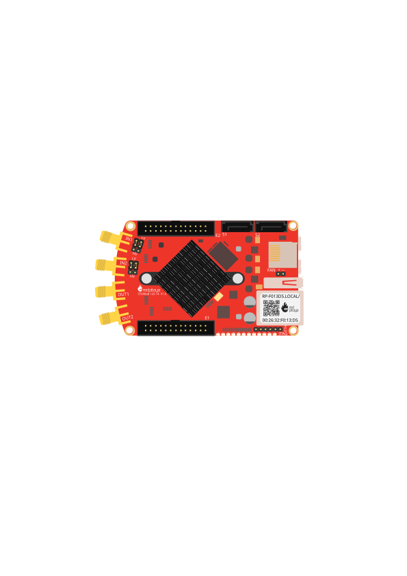

.. _streaming_adc_api_example:

ADC API Streaming 教程
############################

本教程演示如何使用 Streaming 客户端库，将 Red Pitaya ADC 通道的数据连续传输到计算机。
您将学习如何配置采集参数、处理传入数据包，以及使用 numpy 数组高效存储样本。

.. contents:: Table of contents
    :local:
    :backlinks: top

|

概览
=========

本示例展示了 ADC Streaming 的完整实现，包括：

* 双通道同步采集
* 通过抽取配置采样率
* 实时监测数据丢失
* 使用 numpy 数组高效存储
* 自动管理缓冲区

**完整源代码：** :rp-github:`在 GitHub 上查看 adc_1_stream.py → <RedPitaya-Examples/blob/main/python-api/Streaming/adc_1_stream.py>`

|

前置条件
==============

.. TODO fix picture

**硬件：**

    - Red Pitaya 设备（任意型号）

**软件：**

    - Python 3.8 或更高版本
    - Red Pitaya Streaming 库（包含在 :ref:`Streaming 命令行客户端 <streaming_pc_clients>` 中）
    - NumPy 库：``pip install numpy``
    - Red Pitaya 上运行的 Streaming 应用（参见 :ref:`快速入门 <streaming_top>`）

|

核心概念
=============

架构
-------------

本示例使用**基于回调的架构**高效处理数据：

.. code-block:: console

    Your Computer                           Red Pitaya
    +---------------------+                +------------------+
    | ADCStreamClient     |    TCP/IP      | Streaming Server |
    |   |                 |<---------------|   |              |
    |   +--> connect()    |                |   +--> FPGA ADC  |
    |   +--> sendConfig() |                |                  |
    |   +--> startStream()|                |   Deep Memory    |
    |                     |                |   Buffer (4 MB)  |
    | Callback Class      |                +------------------+
    |   +--> receivePack()|<--- Data arrives automatically
    |         +--> Store  |
    +---------------------+

|

.. note::

    以下代码示例为清晰起见进行了简化。完整的生产级代码（包含完整错误处理）请参见 :rp-github:`GitHub 上的完整示例 <RedPitaya-Examples/blob/main/python-api/Streaming/adc_1_stream.py>`。

采样率配置
--------------------------

Red Pitaya ADC 的基础速率为 **125 MS/s**。实际采样率由抽取因子控制：

.. math::

    \text{Sample Rate} = \frac{125\text{ MS/s}}{\text{decimation}}

**示例：**

.. list-table::
    :header-rows: 1
    :widths: 30 35 35

    * - 抽取因子
      - 采样率
      - 每秒样本数
    * - 1
      - 125 MS/s
      - 125,000,000
    * - 8
      - 15.625 MS/s
      - 15,625,000
    * - 256
      - 488.28 kS/s
      - 488,281
    * - 1024
      - 122.07 kS/s
      - 122,070
    * - 65536
      - 1.907 kS/s
      - 1,907

|

实现说明
===========================

步骤 1：回调类
-----------------------

回调类负责处理传入的数据包，并高效地存储数据：

.. code-block:: python

    class Callback(streaming.ADCCallback):
        def __init__(self, max_samples_per_channel=25_000_000):
            super().__init__()
            # Pre-allocate numpy arrays for efficiency
            self.ch1_buffer = np.zeros(max_samples_per_channel, dtype=np.int16)
            self.ch2_buffer = np.zeros(max_samples_per_channel, dtype=np.int16)
            self.counter = 0
            self.fpgaLost = 0
        
        def receivePack(self, client, pack):
            """Called automatically when new data arrives"""
            # Extract channel data
            ch1_data = np.array(pack.channel1.raw, dtype=np.int16)
            ch2_data = np.array(pack.channel2.raw, dtype=np.int16)
            
            # Store in pre-allocated arrays
            samples = len(ch1_data)
            self.ch1_buffer[self.counter:self.counter+samples] = ch1_data
            self.ch2_buffer[self.counter:self.counter+samples] = ch2_data
            self.counter += samples
            
            # Monitor data loss
            self.fpgaLost += pack.channel1.fpgaLost

**要点：**

* 预分配数组，避免重复分配内存
* 使用 numpy 执行高效数值运算
* 跟踪 ``fpgaLost`` 以检测缓冲区溢出

|

步骤 2：配置
----------------------

配置采集参数：

.. code-block:: python

    # Sample rate configuration
    decimation = 256                    # 125 MS/s ÷ 256 = 488 kS/s
    sample_rate = 125e6 / decimation
    capture_duration = 1                # seconds
    
    # Network and memory configuration
    block_size = 131072                 # 128 KB packets
    adc_size = 4 * 1024 * 1024         # 4 MB FPGA buffer
    
    # Channel selection
    ch1_state = 'ON'
    ch2_state = 'ON'
    
    # Calculate buffer size
    max_samples = int(sample_rate * capture_duration)

**配置提示：**

* **更低的抽取因子** = 更高的采样率（可能增加数据丢失）
* **更大的 block_size** = 更高效的网络传输
* **更大的 adc_size** = 更多缓冲（降低数据丢失风险）

|

步骤 3：客户端设置
---------------------

创建并配置 Streaming 客户端：

.. code-block:: python

    # Create client and callback
    client = streaming.ADCStreamClient()
    callback = Callback(max_samples_per_channel=max_samples)
    client.setReceiveDataCallback(callback.__disown__())
    
    # Connect to Red Pitaya
    if not client.connect():
        print("ERROR: Failed to connect!")
        exit(1)
    
    # Send configuration
    client.sendConfig('adc_decimation', f'{decimation}')
    client.sendConfig('block_size', f'{block_size}')
    client.sendConfig('adc_size', f'{adc_size}')
    client.sendConfig('channel_state_1', ch1_state)
    client.sendConfig('channel_state_2', ch2_state)

.. note::

    ``__disown__()`` 方法将回调的所有权转移给客户端，防止其被垃圾回收器过早回收。

|

步骤 4：启动 Streaming
-------------------------

开始采集并等待完成：

.. code-block:: python

    # Start streaming
    if not client.startStreaming():
        print("ERROR: Failed to start streaming!")
        exit(1)
    
    print("Streaming started - collecting data...")
    
    # Block until complete (or Ctrl+C to stop)
    try:
        client.wait()
    except KeyboardInterrupt:
        print("\nStopping...")
        client.stopStreaming()
    
    # Retrieve results
    ch1_samples, ch2_samples = callback.get_data()
    print(f"Collected {len(ch1_samples):,} samples per channel")
    print(f"Data loss: {callback.fpgaLost} samples")

|

预期结果
=================

运行示例时，应看到类似以下输出：

.. code-block:: console

    ======================================================================
    Red Pitaya ADC Streaming Configuration
    ======================================================================
    Sample rate:     0.49 MS/s (decimation: 256)
    Capture time:    1 seconds
    Samples/channel: 488,281
    Memory usage:    1.9 MB total
    ======================================================================
    
    Connecting to Red Pitaya...
    Configuring streaming parameters...
    Current decimation: 1
    
    Starting data acquisition...
    Streaming started - collecting data...
    
    ======================================================================
    ACQUISITION COMPLETE
    ======================================================================
    Total samples received: 976,562
    Samples lost by FPGA:   0
    
    Channel 1: 488,281 samples collected
      Min:   -145  Max:    132  Mean:   -2.34
      First 10 samples: [-12  -8  -3   2   8  12  15  18  19  18]
    
    Channel 2: 488,281 samples collected
      Min:    -98  Max:     87  Mean:    1.12
      First 10 samples: [  5   8  10  11  10   8   5   1  -3  -7]
    ======================================================================

|

故障排除
================

数据丢失（fpgaLost > 0）
-------------------------

**现象：** ``Samples lost by FPGA`` 不为零

**原因与解决方案：**

1. **采样率对网络而言过高**
   
   * 增大抽取率：``decimation = 512`` 或更高
   * 减少活动通道数量

2. **网络拥塞**
   
   * 使用有线以太网（而非 Wi-Fi）
   * 增大 ``block_size`` 以提高数据包效率

3. **FPGA 缓冲区过小**
   
   * 增大 ``adc_size``： ``adc_size = 8 * 1024 * 1024`` （8 MB）
   * 参阅 :ref:`深度内存分配 <deepMemoryMode>`

|

连接失败
------------------

**现象：** ``Failed to connect!``

**解决方案：**

1. 确认流式传输服务器正在运行（LED 2 亮起，LED 0 闪烁）
2. 检查 Red Pitaya 是否可访问：``ping rp-xxxxxx.local``
3. 确保已加载流式传输应用：``overlay.sh stream_app``
4. 检查计算机上的防火墙设置

|

未接收到数据
-----------------

**现象：** ``counter`` 保持为 0

**解决方案：**

1. 确认通道已启用：``channel_state_1 = 'ON'``
2. 检查配置是否已接受：``client.getConfig('channel_state_1')``
3. 重启 Red Pitaya 上的流式传输服务器

|

后续步骤
===========

了解 ADC 流式传输基础后：

* **实时处理** - 在 ``receivePack()`` 回调中添加信号处理
* **保存到文件** - 将数据导出为 CSV、HDF5 或二进制格式
* **实时可视化** - 使用 matplotlib 实时绘图
* **多通道** - 同步多个板卡以进行 4 个以上通道的采集

|

相关示例
=================

* :ref:`快速入门指南 <streaming_quickstart>` - 最小可运行示例
* :ref:`DAC 流式传输 <examples_streaming>` - 生成信号
* :ref:`API 参考 <streaming_api_reference>` - 完整方法文档
* :ref:`多板同步 <x-ch_streaming>` - 扩展到 4 个以上通道

|

完整源代码
=====================

**查看完整的生产就绪实现：** :rp-github:`在 GitHub 上查看 adc_1_stream.py → <RedPitaya-Examples/blob/main/python-api/Streaming/adc_1_stream.py>`

GitHub 版本包括：

* 完整的错误处理和验证
* 详细的内联注释
* 配置验证
* 内存使用量计算
* 输出格式化和统计
