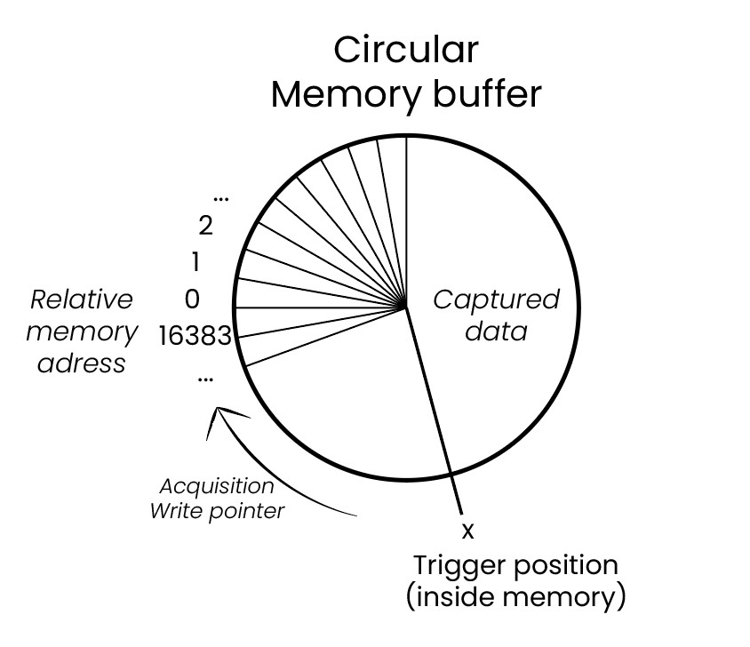
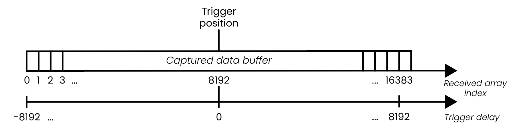

.. _intro_gen_acq:

使用 Red Pitaya 进行数据采集与生成简介
*******************************************************************

本节将从最简单到最复杂，介绍使用 Red Pitaya 生成和采集数据的所有可用选项。
我们还将讨论每种模式的限制以及可能遇到的实现问题。

.. note::

    某些板卡（例如 :ref:`SDRlab 122-16 <top_122_16>`）的输入和输出采用交流耦合，这可能会限制可用的数据采集与生成频率范围。

以下按从简单到复杂的顺序排列：

* :ref:`示波器及其他应用 <intro_oscilloscope_apps>`。
* :ref:`SCPI 命令 <intro_scpi_commands>`。
* :ref:`API 命令（C++、Python） <intro_api_commands>`。
* :ref:`深度内存采集（DMA） <intro_dma>`。
* :ref:`数据流应用 <intro_streaming>`。
* :ref:`自定义数据采集与生成（FPGA） <intro_custom_fpga>`。

.. _intro_oscilloscope_apps:

示波器及其他应用
======================================

采集数据最简单的方法，是使用可通过 Web 界面访问的预构建应用，例如示波器、频谱分析仪、波特图分析仪等。如果希望将 Red Pitaya
用作软件定义仪器，且很少需要将数据下载到计算机进行处理（通常截图和 CSV 数据表就足够），请使用此选项。

每个通道的数据都会采集到一个包含 16384 个采样点的缓冲区中，经处理后显示在 Web 界面中。目前只能在用户请求时从应用中提取数据。
除 :ref:`数据流控制 <streaming_top>` 外，暂不支持由其他应用进行远程数据采集。

数据生成选项也是如此——示波器和频谱分析仪等应用还具有信号发生器功能，因此可以同时使用输入和输出。信号发生器可以生成预定义波形，
例如正弦波、方波、上升锯齿波、下降锯齿波等，也可以作为 |wiki-arbitrary-waveform| 使用。信号发生器还包括*突发*和*扫频*生成功能。

要使用 AWG 功能，需要通过 :ref:`ARB 波形管理器应用 <arb_manager_app>` 以 CSV 格式上传一个包含 16384 个采样点、代表自定义信号一个周期的波形。
上传的自定义波形可以从 *Waveform Type* 下拉菜单中选择。创建自定义波形时需要注意一些事项，详见 :ref:`SCPI 命令 <intro_scpi_commands>` 一节。

有关应用及其工作方式的更多信息，请参阅：

* :ref:`Red Pitaya applications <all_apps>`
* 应用源代码位于我们的 :rp-github:`GitHub <RedPitaya/tree/master/apps-tools>`。

同时运行多个 Web 应用
---------------------------------------------------

.. warning::

    **不建议** 同时运行多个 Web 应用（例如示波器和 SCPI 服务器）。每个 Web 模块都以*独占模式*运行，以避免 FPGA 冲突，因此启动第二个应用
    可能导致数据采集和生成发生冲突，进而产生未定义行为。

例外情况是，同时运行使用 v0.94 FPGA 镜像的 Web 应用（例如 **Oscilloscope**）和 **JupyterLab**；但必须采取以下预防措施：

-   JupyterLab 代码 **不得** 干扰示波器（例如，不要设置与示波器冲突的触发、抽取或通道参数）。
-   JupyterLab 代码 **不得** 重启 FPGA——这样极有可能使板卡冻结。
    -   在 JupyterLab 初始化代码中使用 :code:`rp.rp_InitReset(False)`，而不是标准初始化调用。此函数会初始化内存访问，**不会** 重置 FPGA 设置，
    从而允许两个应用共存。

也可以在 SSH 控制台中与示波器（或其他 Web 应用）同时执行 API 代码，但同样必须遵守上述预防措施。

.. _intro_scpi_commands:

SCPI 命令
================

要通过计算机上运行的 Python、MATLAB 或 LabVIEW 程序远程控制 Red Pitaya，并将 Red Pitaya 的数据采集到计算机进行后续处理，请使用 SCPI 命令。
代码在计算机上执行，字符串命令通过 |wiki-network-socket| 在 Red Pitaya 与计算机之间传输。SCPI 命令到达 Red Pitaya 后，会被解析，
随后在后台执行相应的 C++ API 函数。

.. note::

    SCPI 服务器运行时，**绝不要** 使用示波器或其他 Web 应用。这可能导致 SCPI 命令出现不可预测的行为。

SCPI 数据采集
-------------------

使用 SCPI 命令正确采集数据时，必须指定触发条件，否则返回的数据可能无效或损坏，因为 FPGA 从寄存器采集数据的速度远快于 Linux 操作系统的读取速度。

开始采集并满足第一个触发条件后，Red Pitaya 的每个输入通道会采集 16384 个采样点，并将其存储在 **循环内存缓冲区** 中。**循环内存缓冲区** 存储
16384 个采样点，触发位置位于其中的随机采样点处：

随后，**循环内存缓冲区** 会转换为一个包含 16384 个采样点的 **数据缓冲区**，触发位置处于缓冲区中间（第 8192 个采样点的位置）。必须区分 **循环内存缓冲区**
与 **数据缓冲区**。大多数 SCPI 命令针对的是 **数据缓冲区** 及其位置，但也有一些命令针对 **循环内存缓冲区** 中的位置。数据指针命令始终指向
**循环内存缓冲区** 中的位置。

.. note::

    **循环内存缓冲区 != 数据缓冲区**

    **循环内存缓冲区** 内的触发位置取决于采集开始的时刻，可视为随机位置；而 **数据缓冲区** 内的触发位置固定为第 8192 个采样点。用户通常看不到
    **循环内存缓冲区**，请求数据时获得的是 **数据缓冲区**。

收到请求后，**数据缓冲区** 会转换为字符串并发送到计算机，在计算机上可将其转换回浮点格式。要继续采集数据，必须重启采集，因此连续两次数据采集之间会存在死区时间。

要正确设置触发器，必须配置以下设置：

* 触发电平。
* 触发通道——IN1、IN2 或 External。STEMlab 125-14 4-Input 还提供 IN3 和 IN4。
* 触发延迟——见下文说明。

通过 SCPI 命令采集数据时，触发时刻位于 **数据缓冲区** 的中间（第 8192 个采样点）。这意味着一半数据在触发前采集（0 到 8192 之间的采样点），
另一半数据在触发后采集（8193 到 16383 之间的采样点）。通过更改 Trigger Delay 参数，可以在触发事件之前采集更多数据（指定负触发延迟，最大值为 -8192），
也可以在触发事件之后采集更多数据（指定正触发延迟）。如下图所示：

可以通过以下方式采集数据：

#. 读取整个 **数据缓冲区** （``ACQ:SOUR<n>:DATA?``）。
#. 读取 **数据缓冲区** 中最早的采样点（``ACQ:SOUR<n>:DATA:Old:N? <size>``）。
#. 读取 **数据缓冲区** 中最新的采样点（``ACQ:SOUR<n>:DATA:LATest:N? <size>``）。
#. 从 **数据缓冲区** 中读取相对于触发条件的采样点（``ACQ:SOUR<n>:DATA:TRig? <size>,<t_pos>``）。
#. 从 **循环内存缓冲区** 中读取起始位置到结束位置之间的指定数量采样点（``ACQ:SOUR<n>:DATA:STArt:End?``）。
#. 从 **循环内存缓冲区** 的起始位置读取指定数量采样点（``ACQ:SOUR<n>:DATA:STArt:N?``）。

使用 :ref:`深度内存采集（DMA） <intro_dma>` 模式可以实现可变长度的缓冲区。

使用采集 SCPI 命令编程的一般提示
~~~~~~~~~~~~~~~~~~~~~~~~~~~~~~~~~~~~~~~~~~~~~~~~~~~~~~~~~~~~~

#. 始终检查 Red Pitaya OS 版本，因为并非所有命令都兼容所有 OS 版本。命令的发布版本可在 :ref:`命令表的 Ecosystem 列 <command_list>` 中找到。
#. :ref:`SCPI 代码示例 <examples>` 适用于最新版本的 Red Pitaya OS。
#. 使用 ``ACQ:RST`` 命令开始。
#. 然后设置采集参数。
#. 设置触发参数。
#. 开始采集（``ACQ:START``）。
#. 确保在触发条件到达前，Red Pitaya 有足够时间更新 **数据缓冲区** 的一半（按当前抽取率）。这样可避免缓冲区前半部分与后半部分的信号频率不同。
#. 检查触发条件是否满足，以及 **数据缓冲区** 是否已填满。
#. 发送数据请求。
#. 要采集另一个 **数据缓冲区**，请重启采集（``ACQ:START``）。注意，在重启 Red Pitaya 或执行 ``ACQ:RST`` 命令前，采集参数保持不变。

SCPI 信号生成
------------------

Red Pitaya 的 SCPI 生成命令可分为四类：

* 连续信号生成。
* 突发信号生成。
* 扫频信号生成。
* 任意波形生成。

所有类别的基本功能相似，但每一类都有一些需要特别说明的情况。

.. _intro_continuous_generation:

连续信号生成
~~~~~~~~~~~~~~~~~~~~~~~~~~~~~~~

我们先从最容易理解的连续信号生成开始。首先定义信号参数：

* 波形类型（正弦波、方波、三角波、上升锯齿波、下降锯齿波等）。
* 频率 [Hz]——范围为 1 Hz 至 50 MHz。
* 幅度 [V]——相对于 GND 的单向幅度，范围为 +-1 V。

.. note::

    此处限制针对 STEMlab 125-14 编写，其他板卡型号可能有所不同。

这些是生成连续信号所需的最少参数。还有其他参数，但为简化说明，此处略过。

接下来设置发生器触发源，用于定义发生器如何触发以及由何处触发。触发源可以设置为内部（通过代码命令手动激活），也可以设置为外部上升沿或下降沿
（由 :ref:`E1 扩展连接器 <E1_orig_gen>` 上 DIO0_P 引脚的外部触发信号触发）。

外部触发信号进入 FPGA 时会经过消抖滤波器，默认设置为 500 微秒。可以使用 ``SOUR:TRig:EXT:DEBouncer[:US]`` 命令更改此值。

剩下的就是触发信号生成，但这里有一个容易出错的地方。通常只需触发生成即可；而在 Red Pitaya 上，必须先启用输出，再触发生成。

* ``OUTPUT<n>:STATE ON``——启用指定输出。
* ``SOUR<n>:TRig:INT``——触发指定输出的信号生成。

要同时启用两个输出，请使用以下命令。

* ``OUTPUT:STATE ON``——启用两个输出。
* ``SOUR:TRig:INT``——触发两个输出的信号生成。

当然，如果触发源配置为外部触发，则不需要执行第二条命令。

.. note::

    **生成触发器 != 采集触发器**
    生成触发器和采集触发器完全不同，背后使用的是彼此独立的逻辑。

突发信号生成
~~~~~~~~~~~~~~~~~~~~~~~~~~

突发信号与连续信号非常相似。两者的主要区别是，突发信号通常是有限的（经过一段时间后结束）。要完整描述突发信号，除连续信号使用的参数外，
还需要了解几个参数：

* 周期数（NCYC）——一次突发中的信号周期数。
* 重复次数（NOR）——连续突发的次数。
* 周期 [µs]——一次突发开始到下一次突发开始之间的时间（以微秒为单位）。

这些参数与定义连续信号的参数一起，构成生成任意突发信号所需的最少参数。还有其他参数，但为简化说明，此处略过。

除了定义新参数外，还需要将 Red Pitaya 从连续模式切换到突发模式，使用以下命令完成：

* ``SOUR<n>:BURS:STAT BURST``.

生成突发信号的最后一步是触发信号。更多信息请参阅 :ref:`连续信号生成 <intro_continuous_generation>` 一节。

.. note::

    测量突发信号时，请将示波器触发切换为*正常*模式。

如上所述，突发信号在触发后通常只持续有限时间，但也可以设置连续的突发信号生成。为此，请将 Red Pitaya 的 NOR 设置为允许的最大值（65536）。

突发生成还需注意连续触发。必须确认上一次突发结束后，才能在同一通道上触发下一次生成，否则 Red Pitaya 可能会将两个突发叠加。

扫频信号生成
~~~~~~~~~~~~~~~~~~~~~~~~~

扫频信号是在指定时间内、于两个设定频率值之间改变频率的连续信号。除连续信号参数外，还需要：

* 扫频起始频率 [Hz]。
* 扫频结束频率 [Hz]。
* 扫频时间 [µs]——扫频信号从起始频率移动到结束频率所需的时间。

这些是生成任意扫频信号所需的最少参数。还有其他参数，但为简化说明，此处忽略。

使用以下命令手动开启扫频模式：

* ``SOUR<n>:SWeep:STATE ON``.

停止扫频模式时，发生器不会返回初始状态，而是以扫频模式最后一步的频率生成连续信号。例如，假设在 1 kHz 和 10 kHz 之间进行持续 1 秒的扫频。
我们决定停止扫频生成并执行该命令。命令执行时，扫频正在生成 8.5 kHz 信号；关闭扫频模式后，该信号会继续作为连续信号生成。

任意波形信号生成
~~~~~~~~~~~~~~~~~~~~~~~~~~~~~~~~~~~~~~

最后一种生成选项是任意波形发生器（AWG），用于生成用户定义的自定义信号波形。Red Pitaya 要求用户传入一个包含 16384 个采样点、代表自定义信号一个周期的波形。
电压电平应处于输出限制（+-1 V）以内，否则 Red Pitaya 会对整个波形进行归一化。

使用以下 SCPI 命令将自定义周期传入 Red Pitaya：

* ``SOUR<n>:TRAC:DATA:DATA <array>``.

AWG 默认生成连续信号，需要定义相同的基本参数（幅度和频率）。要启用 AWG，在选择波形时将 ARBITRARY 关键字作为波形类型传入：

* ``SOUR<n>:FUNC ARBITRARY``.

使用任意波形发生器时，有一些技巧和问题需要注意。

**如果 AWG 缓冲区中包含多个信号周期，会发生什么？**

请看以下示例。我们定义一个包含 16384 个采样点、其中含有两个正弦周期的自定义波形缓冲区，将该缓冲区传给 Red Pitaya，设置频率为 10 kHz、
幅度为 1 V，然后生成信号。

测量生成的信号时，实际输出频率发生了变化——得到的是 20 kHz 正弦波。这是怎么回事？原因很简单：我们以 10 kHz 的频率生成了两个正弦波周期，
因此得到 20 kHz 的正弦波。

可以使用以下公式计算实际输出频率：

.. math::

    f_{output} = f_{buff}\cdot\frac{N_{buff}}{N_{period}}

其中，:math:`f_{output}` 是实际输出频率，:math:`f_{buff}` 是整个缓冲区的频率（作为参数传给 Red Pitaya），:math:`N_{buff}` 是 numpy 缓冲区中的采样点总数（16384），
而 :math:`N_{period}` 是一个信号周期在 numpy 缓冲区中占用的采样点数。

使用 AWG 可以强制 Red Pitaya 生成高于 50 MHz 的频率脉冲。

.. note::

    如果可能，应避免计算得到的输出频率超过 50 MHz，因为 Red Pitaya 没有足够的点数来生成平滑波形，这可能导致不可预测的结果。

**如果传入的采样点少于 16384 个，会发生什么？**

**避免向 Red Pitaya 传入少于 16384 个采样点，因为这可能导致不可预测的结果。** 此时结果与上例类似。假设我们定义一个包含 8192 个采样点、含有一个正弦周期的自定义波形缓冲区。
将此缓冲区传给 Red Pitaya，设置频率为 10 kHz、幅度为 1 V 并生成信号。实际输出是 20 kHz 正弦波。

在这种情况下，波形会在缓冲区内重复（读指针以两倍速度遍历波形）。

使用生成 SCPI 命令编程的一般提示
~~~~~~~~~~~~~~~~~~~~~~~~~~~~~~~~~~~~~~~~~~~~~~~~~~~~~~~~~~~~

#. 始终检查 Red Pitaya OS 版本，因为并非所有命令都兼容所有 OS 版本。命令的发布版本可在 :ref:`命令表的 Ecosystem 列 <command_list>` 中找到。
#. :ref:`SCPI 代码示例 <examples>` 适用于最新版本的 Red Pitaya OS。
#. 使用 ``GEN:RST`` 命令开始。
#. 设置连续信号参数。
#. 可选：切换到突发模式并设置突发信号参数。
#. 可选：切换到扫频模式并设置扫频信号参数。
#. 设置发生器触发参数。
#. 启用输出。
#. 触发输出。
#. 请记住 Red Pitaya 会保存设置，因此稍后要重复生成相同信号时，只需再次触发即可（无需重新定义整个生成信号）。也可以只更改某些参数。
#. 默认情况下，Red Pitaya 设置为生成幅度为 1 V 的 1kHz 正弦波。

有关 SCPI 服务器的更多信息，请参阅：

* :ref:`安装说明 <scpi_commands>`。
* :ref:`SCPI 命令完整表格 <command_list>`。
* :ref:`SCPI 示例 <examples>`。

.. _intro_api_commands:

API 命令（C++、Python）
==========================

控制 Red Pitaya 的另一种方式，是使用运行在 Red Pitaya Linux OS 上的 C++ 和 Python API 命令。与 SCPI 命令相比，API 命令速度更快，因为不需要将数据
转换为字符串、通过以太网发送，再重新构造数据。此外，还可以完全访问 Linux 操作系统，这意味着可以配置程序在启动时直接运行、自定义数据解释方式，
或编写自己的驱动来增强现有代码。最后，还可以直接访问 FPGA 的寄存器空间，从而更容易编写自己的软件。

Python API 命令与 C++ API 命令相同，因为它们只是 C++ 命令的 Python 前端。从 Red Pitaya 2.00-30 OS 开始，无需额外配置即可直接在 Red Pitaya 上运行 Python 代码。

总体功能与 SCPI 命令完全相同，区别在于这里使用函数而不是字符串命令，并且有更多尚未提供 SCPI 版本的命令可用。

需要注意的是，对于长数据序列的深度内存采集，可以使用 C++ 或 Python 程序采集数据，然后与计算机建立 TCP 连接。与使用 SCPI 命令相比，这样可以实现更快的传输。
这需要编写自定义代码来建立连接、向计算机传输数据，并从 MATLAB 等程序接收数据以进行处理。

有关运行 C++ 和 Python 程序的全部信息，请参阅：

* :ref:`C++ 与 Python API 命令 <API_commands>`。
* :rp-github:`GitHub API 源代码 <RedPitaya/tree/master/rp-api>`。

.. _intro_streaming:

数据流应用
========================

如果需要连续数据采集，请查看 :ref:`数据流应用 <streaming_top>`（也称为“数据流控制”）。它允许将 Red Pitaya 一个或两个输入的
数据连续采集到计算机上的文件中。采集可以无限进行，但存在速度限制，目前也没有触发选项。直接流式传输到计算机或 SD 卡时，输入端（IN1 和 IN2）的总数据流量有限。
更多详情和限制请参见 :ref:`此处 <streaming_limits>`。

数据流传输有两种方式：通过以太网传输到计算机上的 *bin*、*tdms* 或 *wav* 文件，或者传输到 Red Pitaya 的 SD 卡。也可以通过桌面客户端应用控制数据流参数。
如果多块板卡处于同一网络中（例如使用 :ref:`X-channel 系统 <x-ch_streaming>`），则可以从客户端应用同时控制所有板卡。

有关数据流应用的全部信息，请参阅以下链接：

* :ref:`数据流应用 <streaming_top>`。
* :rp-github:`GitHub 源代码 <RedPitaya/tree/master/apps-tools/streaming_manager>`。

.. _intro_dma:

深度内存采集（DMA）
================================

.. note:: 

    Red Pitaya OS 2.00-23 及更高版本支持深度内存采集。

深度内存采集是一种特殊的数据采集方式，允许用户以 125 Msps 的全采样速率（取决于板卡型号）将数据直接流式写入 Red Pitaya 的 DDR3 RAM。
缓冲区长度可变并可由用户指定，但不能超过已分配 RAM 区域的大小。用户可以增加专用 RAM 的数量，但建议至少保留 100 MB DDR，以确保 Linux OS 正常运行。
深度内存采集基于 `AXI protocol (AXI DMA and AXI4-Stream) <https://adaptivesupport.amd.com/s/article/1053914?language=en_US>`_ （缩写重复，含义加倍）。

采集完成后，Red Pitaya 需要一些时间将整个文件传输到计算机（需要清空 RAM），之后才能重置采集。DMA 可以使用 SCPI、Python API 和 C++ API 命令进行配置，
触发选项也相同。

若要通过 SCPI 提高 DMA 数据传输到计算机的速度，应以二进制格式采集数据（``ACQ:DATA:FORMAT BIN``）。

有关 DMA 的全部信息，请参阅以下链接：

* :ref:`深度内存采集 <deepMemoryAcq>`。

.. _intro_custom_fpga:

自定义数据采集与生成（FPGA）
=============================================

数据采集与生成的最后一种选项，是重新编程并自定义 FPGA 镜像，以创建新方法或扩展现有功能。Red Pitaya 是一个开源平台，因此可以针对特定应用微调软件。
如有需要，Red Pitaya 团队也可以提供定制服务。

* :rp-github:`Red Pitaya 生态系统 GitHub 仓库 <RedPitaya>`。
* :rp-github:`Red Pitaya FPGA GitHub 仓库 <RedPitaya-FPGA>`。
* :ref:`Red Pitaya 定制服务 <customization>`。

:ref:`Back to top <intro_gen_acq>`
