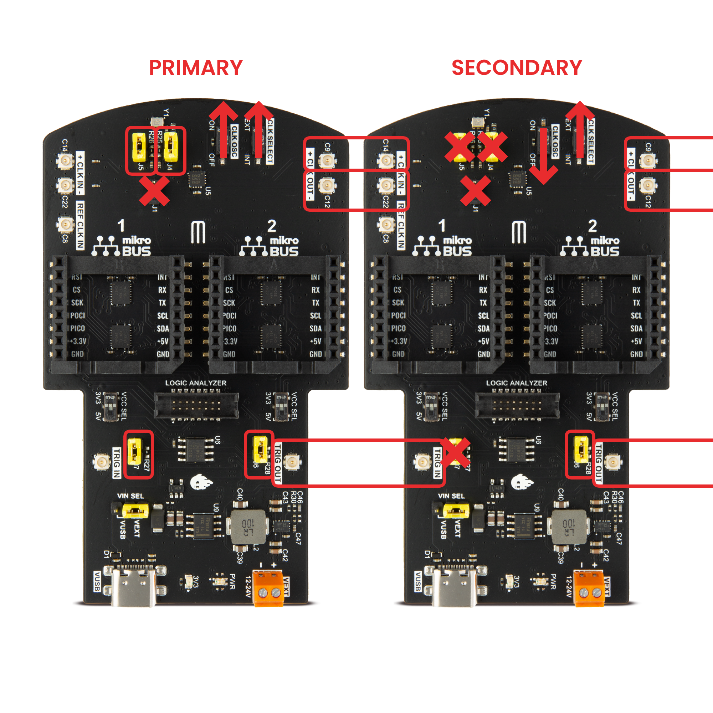
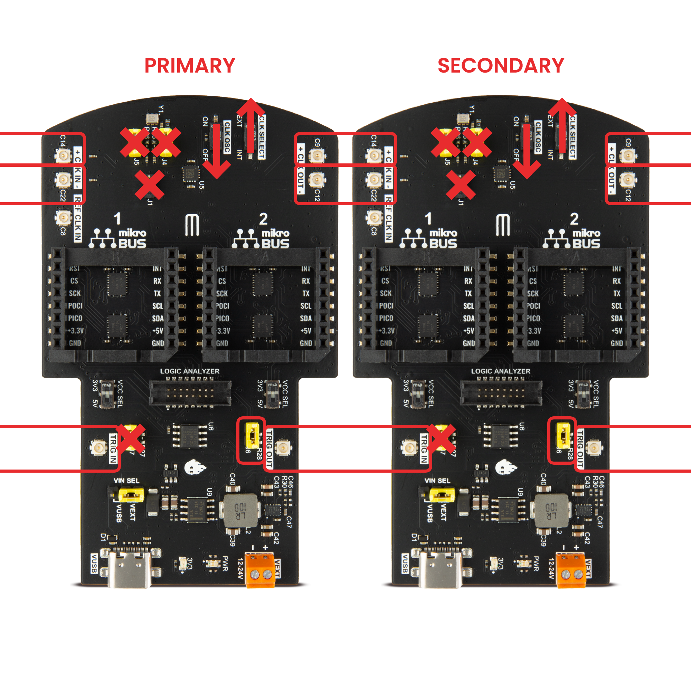
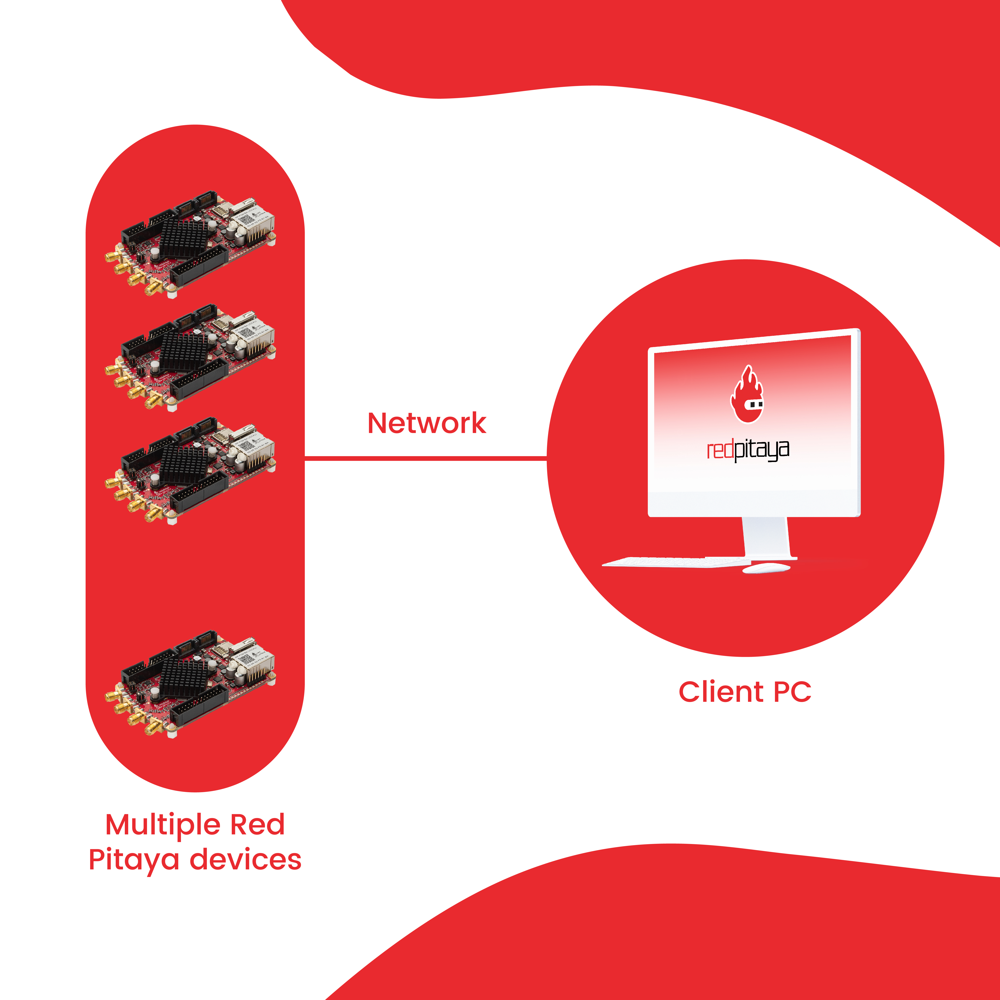

.. _multiboard_sync:

多板同步
############################

多板同步功能可在多块 Red Pitaya 开发板之间同步时钟和触发信号，
从而获得更多用于采集或生成的快速模拟通道。

可通过两种方式在多块 Red Pitaya 开发板之间实现时钟和触发同步：

1.  **Red Pitaya X-Channel System 2.0 (Click Shield)** —— 使用配有专用 ZL40213 LVDS 时钟扇出缓冲器的 Click Shield，同步 **多块外部时钟 Red Pitaya 开发板**。
    可在较长的菊花链中提供最佳信号完整性，并将时钟和触发抖动降至最低。

#.  **Red Pitaya X-Channel System** —— **一块 primary 和多块 secondary Red Pitaya 开发板** 通过 SATA（初代）
    或 USB-C (Gen 2) 电缆以菊花链方式连接。这是一种经济高效的方案，适合由 2–3 块开发板组成、采用中高采样率的系统。

同步后的开发板可像普通 Red Pitaya 开发板一样控制。不过通常更适合从计算机远程控制，因为这样更灵活，也便于通过同一程序控制
多块开发板。

有关两种系统的详细比较，请参阅 :ref:`问答章节 <faq_multiboard>`。

.. note::

    多通道生成目前仍在开发中，尚未得到完全支持。

.. note::

    有关流传输应用的多板设置（网络配置、客户端检测、带宽注意事项），请参阅
    :ref:`多板流传输文档 <multiboard_stream>`。

.. contents:: 目录
   :local:
   :depth: 2
   :backlinks: top

|

如何控制同步开发板？
======================================

* :ref:`SCPI 命令 <scpi_commands>`。
* :ref:`C++ 与 Python API 命令 <API_commands>` （配置较复杂，因为必须分别在每块开发板上执行程序）。
* :ref:`流传输应用 <streaming_top>`（使用 :ref:`桌面客户端应用 <stream_desktop_app>` 或 :ref:`命令行客户端 <stream_command_client>`）。

.. note::

    应用程序和控制方式的所有约束或限制也适用于多板同步。不过，这些限制应按 **每块开发板** 理解，而不是针对整个系统。
    例如，如果 *Data stream control* 应用的输入数据限制为每块开发板 20 MB/s (OS 2.05-37)，而系统中有三块开发板，则总输入数据速率为 60 MB/s（每块 20 MB/s）。

|

.. _click_shield_sync:

X-Channel System 2.0 (Click Shield) 同步
===================================================

Red Pitaya Click Shield 使用专用 ZL40213 LVDS 时钟扇出缓冲器，在多台 Red Pitaya 或其他设备之间实现高性能时钟和触发同步。
这种专业级时钟分配方案无论菊花链长度如何，都能保持最佳信号完整性和最低抖动。

**适用场景：**

* **大型多板系统：** 4 块以上开发板，整条链路保持一致性能
* **最高采样率：** 在最高采集速度下保持信号质量
* **最低抖动要求：** 要求所有开发板精确定时的应用
* **较长菊花链：** 无论链路长度如何都能保持信号完整性
* **混合设备系统：** 可通过 U.FL 连接集成其他外部时钟设备

**主要优势：**

* **专用时钟缓冲器：** ZL40213 LVDS 扇出缓冲器在整条链路中保持陡峭的时钟边沿
* **最小信号劣化：** 专业级时钟分配确保所有采样率下信号洁净
* **无累积信号劣化：** 每一级的时钟缓冲器可防止信号质量损失
* **低抖动性能：** 所有开发板均实现低漂移精确定时
* **自定义外部时钟支持：** 可通过 U.FL 电缆将自定义外部时钟源连接至菊花链

.. note::

    使用 Click Shield 的时钟和触发同步仅适用于可接收外部时钟的 Red Pitaya 型号
    （外部时钟型号、STEMlab 125-14 4-Input 和 Gen 2 Pro 版本）。更多信息请参阅 :ref:`Click Shield 兼容性章节 <click_shield_compatibility>`。

|

设置
-------

借助 :ref:`Red Pitaya Click Shield <click_shield>`，可同步多台外部时钟 Red Pitaya。由于时钟和触发同步使用 U.FL 电缆，链路中也可加入其他外部时钟设备。
两台设备之间只有一个 ZL40213 LVDS 时钟扇出缓冲器，因此这种连接可将多台 Red Pitaya 之间的时钟信号延迟降至最低。

要同步两台或更多外部时钟 Red Pitaya，请使用 U.FL 电缆在 primary 开发板（发送时钟和触发信号）与 secondary 开发板（接收时钟和触发信号）之间建立以下连接。
根据要连接外部时钟还是使用 Red Pitaya Click Shield 上的振荡器，选择两种方案之一。链路中的任何附加开发板均采用 secondary 开发板配置。

振荡器
----------

使用振荡器时，第一个 Red Pitaya Click Shield 将时钟和触发信号传输到链路中的所有设备。最重要的检查项如下：

**Primary 开发板：**

* 连接跳线 J4 和 J5，将振荡器接入时钟传输线。
* 连接跳线 J6 和 J7，将 Red Pitaya 触发接入触发传输线。
* 断开跳线 J1（使用单线时钟时除外）。
* 将 CLK OSC 开关置于 ON。
* 将 CLK SELECT 开关置于 EXT。

**Secondary 开发板：**

* 连接跳线 J6，将触发接入 Ext. trigger 引脚。
* 断开跳线 J1（使用单线时钟时除外）。
* 将 CLK OSC 开关置于 OFF。
* 将 CLK SELECT 开关置于 EXT。

如果使用外部触发信号，请在 primary 开发板上采用 secondary 开发板的触发连接方式（断开 J7 并连接外部触发 U.FL 电缆）。
否则，DIO0_N 用作外部触发输出（位于 primary 开发板），DIO0_P 用作外部触发输入。

外部时钟
---------------

使用外部时钟和外部触发时，时钟与触发信号会传输到链路中的所有设备。所有 Click Shield 采用相同配置：

**Primary 和 Secondary 开发板：**

* 连接跳线 J6，将触发接入 Ext. trigger 引脚。
* 断开跳线 J1（使用单线时钟时除外）。
* 将 CLK OSC 开关置于 OFF。
* 将 CLK SELECT 开关置于 EXT。

**外部时钟类型：**

根据数据手册，|ZL40213| 扇出缓冲器支持多种差分或单端输入时钟信号：

* LVPECL
* LVDS
* CML
* HSTL
* LVCMOS

有关外部时钟信号的更多信息，请查阅 |ZL40213| 数据手册。输入采用 AC 耦合配置，芯片由 3V3 电源供电。

硬件规格
-------------------------

有关 Click Shield 的更多信息，请参阅 :ref:`Click Shield 文档 <click_shield>`。

|

.. _x-ch_streaming:

X-Channel 同步（已停产）
=========================================

Red Pitaya X-Channel System 使用 SATA（初代）或 USB-C (Gen 2) 电缆构成菊花链拓扑，在多块 Red Pitaya 开发板之间提供时钟和触发同步。
系统通过每块开发板的 FPGA 依次传递时钟和触发信号，因此是一种无需额外同步硬件的经济型方案。

X-Channel System 由一台 **primary** 设备和一台或多台以菊花链连接的 **secondary** 设备组成。

.. note::

    **此设置不同于 Red Pitaya X-Channel System 2.0 (Click Shield)**；后者使用专用 ZL40213 LVDS 时钟扇出缓冲器，在较长菊花链中实现最佳信号完整性。

**适用场景：**

* **中小型系统：** 2–3 块开发板，信号质量仍保持出色
* **中低采样率：** 性能可与 X-Channel 2.0 (Click Shield) 同步相媲美
* **经济型设置：** 除电缆外无需额外同步硬件
* **快速部署：** 开发板之间直接用电缆连接，无需外部组件
* **完整 GPIO 访问：** 所有 GPIO 引脚仍可供用户应用使用

**技术特性：**

* **时钟同步：** 所有开发板共享来自 primary 开发板的公共时钟
* **触发同步：** 由 primary 开发板同步启动采集
* **相位对齐：** 所有开发板的数据相位对齐
* **信号路由：** 时钟和触发信号依次通过每块开发板的 FPGA 传播

.. note::

    对于大型系统（4 块以上开发板）或要求多块开发板均达到最高采样率的应用，:ref:`X-Channel 2.0 (Click Shield) 同步 <click_shield_sync>`
    通过专用时钟缓冲器在较长菊花链中保持最佳信号完整性。

.. note::

    本文使用 primary 和 secondary 设备术语，取代传统的 master 和 slave 设备术语。

|

设置
-------

.. figure:: img/Primary-and-secondary.png
    :width: 800

Red Pitaya X-Channel 系统包含两种设备：

.. tabs::

    .. group-tab:: Gen 2

        * 一台 primary 设备（STEMlab 125-14 PRO Gen 2 或 STEMlab 125-14 PRO Z7020 Gen 2）。
        * 一台或多台 secondary 设备（STEMlab 125-14 PRO Gen 2 或 STEMlab 125-14 PRO Z7020 Gen 2），以“S”标贴标识。

    .. group-tab:: Original Gen

        * 一台 primary 设备（STEMlab 125-14 Low Noise）。
        * 一台或多台 secondary 设备（STEMlab 125-14 Low Noise），以“S”标贴标识。

.. note::

    **Secondary 设备并非标准 Red Pitaya 开发板。** 它们需要在工厂进行硬件修改，才能通过 FPGA 接收 primary 设备的时钟信号。
    Secondary 开发板以“S”标贴标识，必须专门订购或在工厂修改。

S1 和 S2 连接器用于连接 primary 与 secondary 设备：

    * **S1** —— 时钟和触发信号输出。
    * **S2** ——（外部）时钟和触发信号输入。

为实现同步，primary 设备通过 S1 连接器输出时钟和触发信号。因此，应使用电缆将 primary 设备的 S1 连接器连接到 secondary 设备的 S2 连接器。
要继续延伸菊花链，请将第一台 secondary 设备的 S1 连接器连接到第二台 secondary 设备的 S2 连接器，依此类推。

请注意，**secondary 设备在硬件上与 primary 设备不同**。Secondary 设备是一种特殊的外部时钟 Red Pitaya，从“FPGA”接收时钟信号。

|

电缆方向
------------------

S1 和 S2 在初代开发板上为 SATA 连接器，在 Gen 2 开发板上为 USB-C 连接器。USB-C 电缆通常可双向连接，
但 S1 和 S2 用于共享时钟与触发信号，而不是连接外部设备，因此电缆方向非常重要。Gen 2 开发板的 S1 连接器旁有两个 LED
（**L** —— Link，**O** —— Orientation）：

* **O** LED 指示电缆方向。
* **L** LED 指示开发板之间是否成功建立连接。

连接开发板时，请确保两个 LED 均亮起。如果 **O** LED 未亮，请改变电缆方向。

.. note::

    **没有外部时钟时能否启动 secondary 单元？**
    如果不提供外部时钟，官方 Red Pitaya OS 无法在 secondary 单元上启动，因为它依赖读取 FPGA 寄存器映射，而该映射仅在 ADC 时钟存在时可用。
    不过，通过修改软件，即使没有外部时钟，Linux OS 本身也能启动；但请注意，在没有外部时钟时尝试读取 FPGA 会导致系统崩溃。

.. note::

    建议 X-Channel 系统使用 :ref:`OS 2.00-23 或更高版本 <prepareSD>`。

    * 使用 OS 2.00 或更高版本时，primary 和 secondary 设备使用 **相同 OS**！
    * 使用 OS 1.04 时，primary 和 secondary 开发板使用 **不同 OS**！
    * 更早的 OS 版本完全不支持 X-Channel 系统。

|

S1 和 S2 连接器的其他用途
-----------------------------------------

S1 和 S2 连接器还可用于将外部设备直接连接到 FPGA。在使用 SATA 连接器的初代开发板上，由于采用标准 SATA 连接器，这种连接稍容易一些。
Gen 2 则更具挑战，因为 S1 和 S2 连接器不支持 USB-C 标准。

无论哪种情况，将外部设备连接到 S1 和 S2 都需要修改 FPGA，因为默认固件不支持此功能。

有关使用 S1 和 S2 连接外部设备的更多信息，请参阅 :ref:`FPGA 开发 <fpga_development>` 文档，
并查阅相应开发板型号的 :ref:`硬件原理图 <dev_guide_hardware>`。

|

开发板兼容性
---------------------

X-Channel 同步可直接兼容以下 Red Pitaya 开发板型号：

**Primary 设备（标准开发板）：**

* :ref:`STEMlab 125-14 PRO Gen 2 <top_125_14_pro_gen2>`
* :ref:`STEMlab 125-14 PRO Z7020 Gen 2 <top_125_14_pro_Z7020_gen2>`
* :ref:`STEMlab 125-14 <top_125_14>`
* :ref:`STEMlab 125-14 Low Noise <top_125_14_LN>`
* :ref:`STEMlab 125-14 Z7020 Low Noise <top_125_14_Z7020_LN>`

**Secondary 设备（需要特殊硬件修改）：**

.. warning::

    **Secondary 设备并非标准 Red Pitaya 开发板。** 它们需要在工厂进行硬件修改，才能通过 FPGA 接收 primary 设备的时钟信号。
    Secondary 开发板以“S”标贴标识，必须专门订购或在工厂修改。
    
    未经 Red Pitaya 硬件修改的 **标准 Red Pitaya 开发板不能用作 secondary 设备**。

Red Pitaya 提供基于上述兼容型号的 Secondary 设备，它们是构建 X-Channel 系统所必需的。

**配有连接器但不支持 X-Channel 的开发板：**

*STEMlab 125-14 4-Input* 和 *SDRlab 122-16* 等型号配有 S1/S2 连接器，但其硬件不允许通过这些连接器共享时钟信号。
这些开发板不能用于 X-Channel 配置。

|

示例——信号采集（流传输客户端）
-------------------------------------------------

**同时采集 6 路输入信号。**

本示例从三台同步的 Red Pitaya（X-Channel 系统）采集数据，共获得六路 RF 输入通道。有关客户端安装和使用方法，请参阅 :ref:`流传输应用 <streaming_top>` 文档。

.. code-block:: shell-session

    PRIMARY_IP=192.168.2.141, SECONDARY1_IP=192.168.2.60 SECONDARY2_IP=192.168.2.25

1.  通过 Web 界面在所有 Red Pitaya 开发板（primary 和 secondary）上 **打开流传输应用**。
#.  **调整流传输模式和设置。** 有关具体设置的更多信息，请查看 :ref:`流传输配置 <streaming_configuration_top>`。

    .. code-block:: shell-session

        rpsa_client.exe -c -h 192.168.2.141,192.168.2.60,192.168.2.25 -s F -f test.conf -v

        2022.06.02-15.20.21.173:  Connected: 192.168.2.141
        2022.06.02-15.20.21.176:  Connected: 192.168.2.25
        2022.06.02-15.20.21.178:  Connected: 192.168.2.60
        2022.06.02-15.20.21.278:  Send configuration to: 192.168.2.141
        2022.06.02-15.20.21.291:  Send configuration to: 192.168.2.25
        2022.06.02-15.20.21.291:  SET: 192.168.2.141 [OK]
        2022.06.02-15.20.21.303:  Send configuration to: 192.168.2.60
        2022.06.02-15.20.21.309:  Send configuration save command to: 192.168.2.141
        2022.06.02-15.20.21.324:  SET: 192.168.2.25 [OK]
        2022.06.02-15.20.21.332:  Send configuration save command to: 192.168.2.25
        2022.06.02-15.20.21.337:  SET: 192.168.2.60 [OK]
        2022.06.02-15.20.21.343:  Send configuration save command to: 192.168.2.60
        2022.06.02-15.20.21.350:  SAVE TO FILE: 192.168.2.141 [OK]
        2022.06.02-15.20.21.357:  SAVE TO FILE: 192.168.2.25 [OK]
        2022.06.02-15.20.21.363:  SAVE TO FILE: 192.168.2.60 [OK]

#.  **启动 6 路输入的 X-Channel 流传输**。

    .. code-block:: shell-session

        --streaming --host PRIMARY IP, SECONDARY1 IP, SECONDARY2 IP, --format=wav --dir=NAME
        --limit=SAMPLES

        rpsa_client.exe -s -h 192.168.2.141,192.168.2.60,192.168.2.25 -f wav -d ./acq -l 10000000 -v

        2022.06.02-15.25.00.795:  Connected: 192.168.2.141
        2022.06.02-15.25.00.798:  Connected: 192.168.2.25
        2022.06.02-15.25.00.804:  Connected: 192.168.2.60
        2022.06.02-15.25.00.907:  Send stop command to master board 192.168.2.141
        2022.06.02-15.25.00.925:  Streaming stopped: 192.168.2.141 [OK]
        2022.06.02-15.25.01.32:  Send stop command to slave board 192.168.2.25
        2022.06.02-15.25.01.36:  Send stop command to slave board 192.168.2.60
        2022.06.02-15.25.01.37:  Streaming stopped: 192.168.2.25 [OK]
        2022.06.02-15.25.01.45:  Streaming stopped: 192.168.2.60 [OK]
        2022.06.02-15.25.01.156:  Send start command to slave board: 192.168.2.25
        2022.06.02-15.25.01.169:  Send start command to slave board: 192.168.2.60
        2022.06.02-15.25.01.286:  Streaming started: 192.168.2.25 TCP mode [OK]
        2022.06.02-15.25.01.307:  Streaming started: 192.168.2.60 TCP mode [OK]
        2022.06.02-15.25.01.407:  Send start command to master board: 192.168.2.141
        2022.06.02-15.25.01.542:  Streaming started: 192.168.2.141 TCP mode [OK]
        2022.06.02-15.25.01.639:  Send start ADC command to slave board: 192.168.2.25
        Run write to: ./1/data_file_192.168.2.25_2022-06-02_13-25-00.wav
        Run write to: ./1/data_file_192.168.2.60_2022-06-02_13-25-00.wav
        Run write to: ./1/data_file_192.168.2.141_2022-06-02_13-25-00.wav
        2022.06.02-15.25.01.659:  Send start ADC command to slave board: 192.168.2.60
        2022.06.02-15.25.01.660:  ADC is run: 192.168.2.25
        Available physical memory: 16260 Mb
        Used physical memory: 8130 Mb
        Available physical memory: 16260 Mb
        Used physical memory: 8130 Mb
        Available physical memory: 16260 Mb
        2022.06.02-15.25.01.741:  Connect 192.168.2.25
        2022.06.02-15.25.01.730:  ADC is run: 192.168.2.60
        Used physical memory: 8130 Mb
        2022.06.02-15.25.01.752:  Connect 192.168.2.141
        2022.06.02-15.25.01.764:  Connect 192.168.2.60
        2022.06.02-15.25.01.826:  Send start ADC command to master board: 192.168.2.141
        2022.06.02-15.25.01.834:  ADC is run: 192.168.2.141
        2022.06.02-15.25.04.402:  Error 192.168.2.25
        2022.06.02-15.25.04.408:  Error 192.168.2.141
        2022.06.02-15.25.04.410:  Error 192.168.2.60
        2022.06.02-15.25.04.415:  Send stop command to master board 192.168.2.141
        2022.06.02-15.25.04.420:  Streaming stopped: 192.168.2.141 [OK]
        2022.06.02-15.25.04.422:  Streaming stopped: 192.168.2.141 [OK]
        2022.06.02-15.25.04.526:  Send stop command to slave board 192.168.2.25
        2022.06.02-15.25.04.529:  Send stop command to slave board 192.168.2.60
        2022.06.02-15.25.04.530:  Streaming stopped: 192.168.2.25 [OK]
        2022.06.02-15.25.04.533:  Streaming stopped: 192.168.2.60 [OK]
        2022.06.02-15.25.04.536:  Streaming stopped: 192.168.2.25 [OK]
        2022.06.02-15.25.04.545:  Streaming stopped: 192.168.2.60 [OK]

        2022.06.02-15.25.04.635 Total time: 0:0:2.794

    .. code-block:: none

        =====================================================================================================================
        Host              | Bytes all         | Bandwidth         |    Samples CH1    |    Samples CH2    |      Lost        |
        +--------------------------------------------------------------------------------------------------------------------|
        192.168.2.141     | 38.188 Mb         | 13.668 MB/s       | 10010624          | 10010624          |                  |
                          +...................+...................+...................+...................+ 0                |
                          |Lost in UDP: 0                         |Lost in file: 0                        |                  |
                          +...................+...................+...................+...................+..................|
        192.168.2.25      | 38.188 Mb         | 13.668 MB/s       | 10010624          | 10010624          |                  |
                          +...................+...................+...................+...................+ 0                |
                          |Lost in UDP: 0                         |Lost in file: 0                        |                  |
                          +...................+...................+...................+...................+..................|
        192.168.2.60      | 38.188 Mb         | 13.668 MB/s       | 10010624          | 10010624          |                  |
                          +...................+...................+...................+...................+ 0                |
                          |Lost in UDP: 0                         |Lost in file: 0                        |                  |
                          +...................+...................+...................+...................+..................|
        =====================================================================================================================

#.  要 **查看采集的数据**，请将 .wav 文件从 **/acq** 拖入 |Audacity|。

    .. figure:: img/audacity_2.png
        :width: 800

    本示例将 1 kHz 正弦波信号连接到全部 6 路输入。

|

代码示例
=================

以下示例演示如何通过 SCPI 命令同步 X-Channel 系统和 Click Shield。

* :ref:`多板同步示例 <examples_multiboard_sync>`。

|

.. _faq_multiboard:

多板同步问答
===============================

本问答章节专门介绍 Red Pitaya Click Shield，并将其与 X-Channel System 进行比较。有关 Red Pitaya 的一般问题，
请参阅 :ref:`常见问题章节 <faq>`。

能否使用 Click Shield 同步多个不同的 Red Pitaya 开发板型号？
--------------------------------------------------------------------------------------

可以。Red Pitaya Click Shield 菊花链中可包含不同的开发板型号。例如，primary 设备可以是 *STEMlab 125-14 4-Input*，
第一台 secondary 设备可以是 *STEMlab 125-14 ext. clk.*，第二台 secondary 设备则是另一块 *4-Input*。
这样可灵活构建具有不同通道数组合的多通道系统。建议仅以菊花链连接核心时钟速度相同的设备。

请注意，*SDRlab 122-16 ext. clk.* 设计用于接收 122.88 MHz 时钟信号。因此，虽然可以与 *STEMlab 125-14* 开发板同步，但我们不建议这样做。

虽然可用菊花链连接多个不同开发板型号，但某些功能可能不可用。请参阅 :ref:`Click Shield 兼容性章节 <click_shield_compatibility>`。

Red Pitaya X-Channel System 与 Red Pitaya X-Channel 2.0 (Click Shield) 同步有何区别？
------------------------------------------------------------------------------------------------------------------------

本节介绍 Red Pitaya X-Channel System 与 Red Pitaya X-Channel 2.0 (Click Shield) 同步之间的差异。
两者看似完全相同，实际却有很大区别。

.. note::

    请注意，两种系统在流传输应用（连续流传输）方面具有相同限制。更多信息请参阅 :ref:`此处 <streaming_limits>`。

+--------------------------------+--------------------------------------------------+--------------------------------------------------+
|                                | **X-Channel System**                             | **X-Channel 2.0 (Click Shield) 同步**            |
+================================+==================================================+==================================================+
| **时钟与采样率**                                                                                                                     |
+--------------------------------+--------------------------------------------------+--------------------------------------------------+
| 建议采样率                     | 最高 100 ksps                                    | 最高可达全采样率                                 |
+--------------------------------+--------------------------------------------------+--------------------------------------------------+
| 共享时钟信号                   | Primary 设备 CLK                                 | Click Shield 振荡器或外部时钟                    |
+--------------------------------+--------------------------------------------------+--------------------------------------------------+
| 外部时钟类型                   | N/A                                              | 参见 |ZL40213| AC 时钟输入规格                   |
+--------------------------------+--------------------------------------------------+--------------------------------------------------+
| 时钟信号延迟                   | 每台设备的延迟略高；                             | 时钟缓冲器（每台 1 个）——|ZL40213|               |
|                                | （信号通过每个 FPGA） [#f1]_                     |                                                  |
+--------------------------------+--------------------------------------------------+--------------------------------------------------+
| 触发信号延迟                   | 每台设备的延迟略高；                             | 触发缓冲器（每台 1 个）——                        |
|                                | （信号通过每个 FPGA） [#f1]_                     | |74FCT38072DCGI|                                 |
+--------------------------------+--------------------------------------------------+--------------------------------------------------+
| **引脚排列**                                                                                                                         |
+--------------------------------+--------------------------------------------------+--------------------------------------------------+
| GPIO 访问                      | 完整访问 [#f2]_                                  | 最多 10 个数字引脚 [#f3]_                        |
+--------------------------------+--------------------------------------------------+--------------------------------------------------+
| 慢速模拟访问                   | 完整访问 (4/4)                                   | 最多 2 个引脚 (2/4) [#f3]_                       |
+--------------------------------+--------------------------------------------------+--------------------------------------------------+
| 数字通信引脚                   | UART (1x)、SPI (1x)、I2C (1x)、CAN (2x)          | UART (2x)、SPI (2x)、I2C (2x)（无 CAN）[#f3]_    |
+--------------------------------+--------------------------------------------------+--------------------------------------------------+
| **设备**                                                                                                                             |
+--------------------------------+--------------------------------------------------+--------------------------------------------------+
| 兼容的 Red Pitaya 开发板       | Primary——STEMlab 125-14 LN；                     | STEMlab 125-14 Pro Gen 2 系列；                  |
| 型号                           | Secondary——STEMlab 125-14 LN Secondary           | STEMlab 125-14 4-Input；                         |
|                                |                                                  | STEMlab TI 系列；                                |
|                                |                                                  | SDRlab 122-16 Ext Clk；                          |
|                                |                                                  | STEMlab 125-14 (LN) Ext Clk                      |
+--------------------------------+--------------------------------------------------+--------------------------------------------------+
| 可在外部时钟与内部时钟之间     | 否                                               | 是 [#f4]_                                        |
| 选择                           |                                                  |                                                  |
+--------------------------------+--------------------------------------------------+--------------------------------------------------+
| 铝制外壳兼容性                 | 否                                               | 是                                               |
+--------------------------------+--------------------------------------------------+--------------------------------------------------+

有关硬件的更多信息，请参阅：

* :ref:`Red Pitaya Click Shield <click_shield>` 用于 X-Channel 2.0 同步。
* :ref:`X-Channel 硬件 <top_125_14_MULTI>`

.. rubric:: 脚注

.. [#f1] 精确测量结果将在未来提供。
.. [#f2] 根据开发板型号，可能有 16、19 或 22 个 GPIO 引脚。更多信息请查看 :ref:`初代产品 <rp-board-comp-orig_gen>` 或 :ref:`Gen 2 <rp-board-comp-gen2>` 对比表。
.. [#f3] 通过 microBUS 连接器。
.. [#f4] PRO Gen 2 系列、TI 系列和 4-Input。

.. substitutions

.. |ZL40213| replace:: `ZL40213 <https://ww1.microchip.com/downloads/en/DeviceDoc/ZL40213-Data-Sheet.pdf>`__

.. |74FCT38072DCGI| replace:: `74FCT38072DCGI <https://www.digikey.si/en/products/detail/renesas-electronics-corporation/74FCT38072DCGI/2017578>`__
