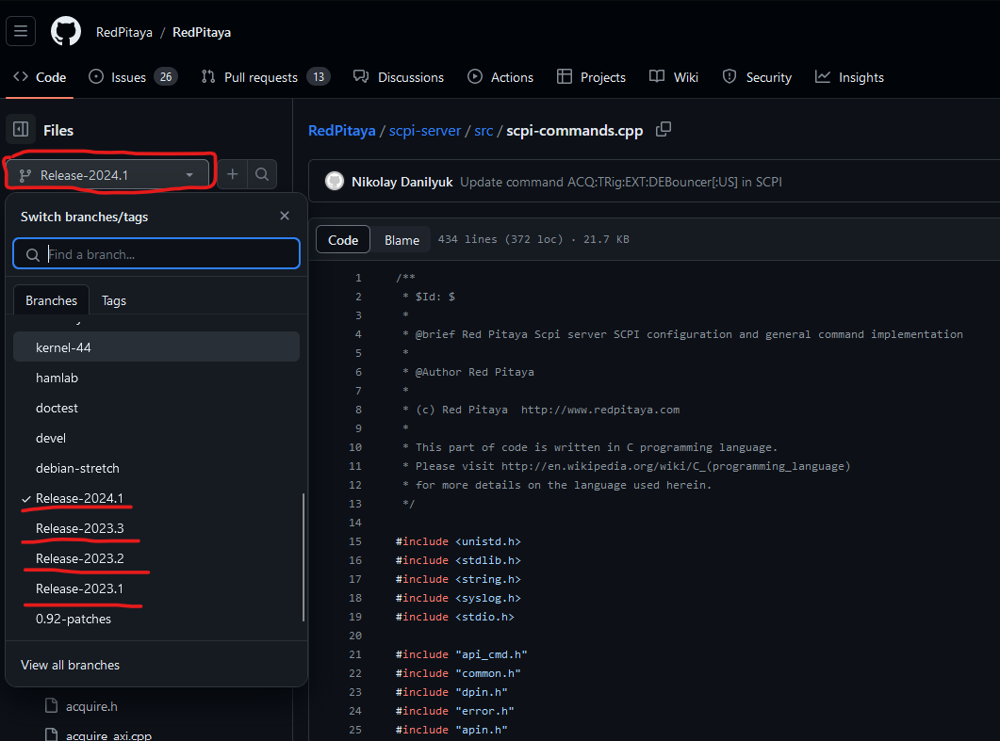

.. _command_list:

********************************************
支持的 SCPI 和 API 命令列表
********************************************

这里列出所有可用的 SCPI、API 和 JupyterLab 命令。命令按功能组织在不同表格中。每行表示 SCPI、Python API、C++ API 和 JupyterLAB 中的同一条命令。
Jupyter 命令与 Python API 命令完全相同，请参考后者。表格最后两列分别为命令描述和命令首次出现的生态系统版本。

每个表格开头列出了所有命令参数选项和可用宏。

API 命令的详细说明见以下 C++ 头文件：

* `Red Pitaya GitHub API header files <https://github.com/RedPitaya/RedPitaya/tree/master/rp-api/api/include>`_.

|

.. toctree::
    :caption: Command list
    :maxdepth: 1

    command_list/commands-init.rst
    command_list/commands-board.rst
    command_list/commands-digital.rst
    command_list/commands-analog.rst
    command_list/commands-pll.rst
    command_list/commands-daisy.rst
    command_list/commands-gen.rst
    command_list/commands-acq.rst
    command_list/commands-dmm.rst
    command_list/commands-lcr.rst
    command_list/commands-uart.rst
    command_list/commands-spi.rst
    command_list/commands-i2c.rst
    command_list/commands-can.rst
    command_list/commands-status-leds.rst
    command_list/commands-temp-prot.rst

|

**如何查找各 OS 版本提供的全部 SCPI 命令？**

使用 ``SYSTem:Help?`` SCPI 命令可列出所有可用的 SCPI 命令。

还可以在此处根据 Red Pitaya OS 版本查找板卡接受的所有 SCPI 命令：

* 最新 Beta OS：|all_os_scpi_commands|。

对于其他 Red Pitaya OS 版本，请打开上方链接，并将分支版本改为：

* 3.00-57 - 2026.1 分支 *（文件扩展名为 .cpp）*。
* 2.07-48 - 2025.2 分支 *（文件扩展名为 .cpp）*。
* 2.07-43 - 2025.1 分支 *（文件扩展名为 .cpp）*。
* 2.05-37 - 2024.3 分支 *（文件扩展名为 .cpp）*。
* 2.04-35 - 2024.2 分支 *（文件扩展名为 .cpp）*。
* 2.00-30 - 2024.1 分支 *（文件扩展名为 .cpp）*。
* 2.00-23 - 2023.3 分支 *（文件扩展名为 .cpp）*。
* 2.00-18 - 2023.2 分支 *（文件扩展名为 .c）*。
* 2.00-15 - 2023.1 分支 - |all_os_scpi_commands_2.00-15| *（文件扩展名为 .c）*。
* 1.04-28 - 2022.2 分支 *（文件扩展名为 .c）*。
* 1.04-18 - 2022.1 分支 *（文件扩展名为 .c）*。

.. |all_os_scpi_commands| replace:: :rp-github:`Red Pitaya GitHub - scpi-server/src/scpi-commands.cpp <RedPitaya/blob/master/scpi-server/src/scpi-commands.cpp>`

.. |all_os_scpi_commands_2.00-15| replace:: :rp-github:`Red Pitaya GitHub 2023.1- scpi-server/src/scpi-commands.c <RedPitaya/blob/Release-2023.1/scpi-server/src/scpi-commands.c>`

|

:ref:`返回顶部 <command_list>`
