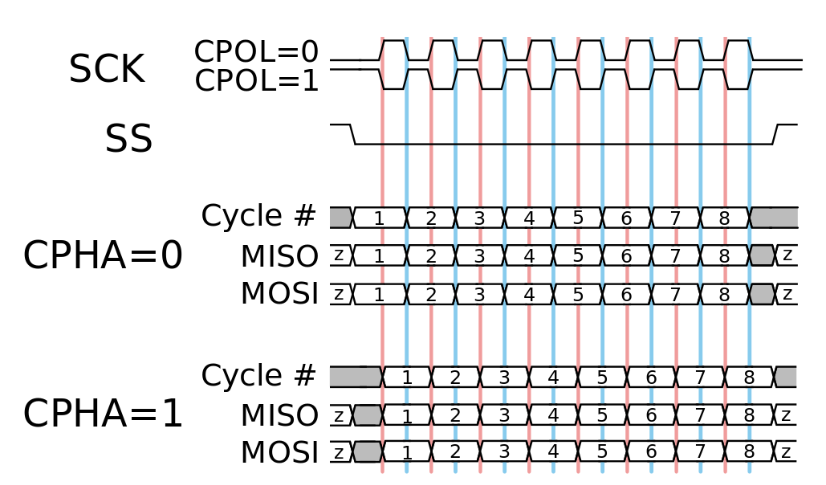

.. _commands_spi:

====
SPI
====

功能概览
------------------------

Red Pitaya SPI 不使用标准的 ``cpol`` 和 ``cpha`` 参数，模式可以是以下之一：

* ``LISL`` - 低电平空闲, 在上升沿采样 - 等价于 ``cpol=0, cpha=0``
* ``LIST`` - 低电平空闲, 在下降沿采样 - 等价于 ``cpol=0, cpha=1``
* ``HISL`` - 高电平空闲, 在上升沿采样 - 等价于 ``cpol=1, cpha=0``
* ``HIST`` - 高电平空闲, 在下降沿采样 - 等价于 ``cpol=1, cpha=1``

    SPI 模式 (`图片来源 <https://digilent.com/blog/wp-content/uploads/2018/09/SPI_timing_diagram.svg_.png>`_)

SPI 命令提供三种不同功能来配置消息缓冲区（以下使用 SCPI 命令说明，API 命令同样适用）。

* ``SPI:MSG<n>:TX<m>:RX`` - Creates both the read (receive) and write (send) buffers for the specified message.
* ``SPI:MSG<n>:TX<m>`` - 仅为指定消息创建写缓冲区，并删除同一消息此前创建的读缓冲区。
* ``SPI:MSG<n>:RX<m>`` - 仅为指定消息创建读缓冲区，并删除同一消息此前创建的写缓冲区。

在后台（API 命令中），所有命令都调用同一函数 ``rp_SPI_SetBufferForMessage()`` 该函数同时初始化发送和接收缓冲区的数据。
对同一消息多次调用该函数会删除之前的缓冲区并创建新缓冲区。 这意味着要同时创建发送和接收缓冲区，必须使用 ``SPI:MSG<n>:TX<m>:RX`` 命令。
先调用 ``SPI:MSG<n>:TX<m>`` 命令，再调用 ``SPI:MSG<n>:RX<m>`` 命令时，前者会创建发送缓冲区 （且不初始化接收缓冲区），随后第二个命令会删除此前创建的发送缓冲区，并创建新的接收缓冲区。
因此，无法通过这些命令序列同时创建发送和接收缓冲区 通过 ``SPI:MSG<n>:TX<m>`` 和 ``SPI:MSG<n>:RX<m>`` 命令序列，因为其中一个缓冲区始终不会初始化；尝试读写数据时会出错（对于 SCPI 命令，尝试从不存在的缓冲区读取数据可能导致无限循环）。

为命令添加 ``:CS`` 后缀 （或将 *cs_change* 设置为 ``true``）会使命令在发送/接收消息后切换 CS 线。 对于大多数基本应用，这不是必需的。

重要说明
----------------

* Gen 2 板卡上的 SPI 设备路径为 "/dev/spidev2.0" 而不是传统的 "/dev/spidev1.0".

代码示例
-----------------

以下是如何在 Red Pitaya 上使用 SPI 命令的示例：

* :ref:`Digital communication examples <examples_digcom>`.

|

参数与命令表
-----------------------------

**参数选项：**

- ``<mode> = {LISL, LIST, HISL, HIST}``  默认值： ``LISL``
- ``<cs_mode> = {NORMAL, HIGH}``  默认值： ``NORMAL``
- ``<bits> = {7, 8}``  默认值： ``8``
- ``<speed> = {1...100000000}`` 默认值： ``50000000``
- ``<data> = {XXX, ... | #HXX, ... | #QXXX, ... | #BXXXXXXXX, ... }`` 以逗号分隔的数据数组

   - ``XXX`` = 十进制格式
   - ``#HXX`` = 十六进制格式
   - ``#QXXX`` = 八进制格式
   - ``#BXXXXXXXX`` = 二进制格式

**可用的 Jupyter 和 API 宏：**

- SPI mode - ``RP_SPI_MODE_LISL, RP_SPI_MODE_LIST, RP_SPI_MODE_HISL, RP_SPI_MODE_HIST``
- SPI bit order - ``RP_SPI_ORDER_BIT_MSB, RP_SPI_ORDER_BIT_LSB``
- SPI state - ``RP_SPI_STATE_NOT, RP_SPI_STATE_READY``
- SPI CS mode - ``RP_SPI_CS_NORMAL, RP_SPI_CS_HIGH``

.. tabularcolumns:: |p{50mm}|p{50mm}|p{60mm}|p{30mm}|

.. list-table::
    :widths: 44 123 84 20
    :header-rows: 1

    * - SCPI
      - API, Jupyter
      - 描述
      - 适用版本
    * - ``SPI:INIT`` |br| 示例： |br| ``SPI:INIT``
      - C++: ``rp_SPI_Init()`` |br| Python: ``rp_SPI_Init()``
      - 初始化用于 SPI 操作的 API。
      - 1.04-18 and up
    * - ``SPI:INIT:DEV <path>`` |br| 示例： |br| ``SPI:INIT:DEV "/dev/spidev1.0"``
      - C++: ``rp_SPI_InitDevice(const char *device)`` |br| Python: ``rp_SPI_InitDevice(<device>)``
      - 初始化用于 SPI 操作的 API。 ``<path>`` - SPI 设备路径。 |br| 某些板卡可能不同于标准路径： /dev/spidev1.0 |br| Gen 2 板卡应设置为 /dev/spidev2.0。
      - 1.04-18 and up
    * - ``SPI:RELEASE`` |br| 示例： |br| ``SPI:RELEASE``
      - C++: ``rp_SPI_Release()`` |br| Python: ``rp_SPI_Release()``
      - 释放所有已使用的资源。
      - 1.04-18 and up
    * - ``SPI:SETtings:DEFault`` |br| 示例： |br| ``SPI:SETtings:DEFault``
      - C++: ``rp_SPI_SetDefaultSettings()`` |br| Python: ``rp_SPI_SetDefaultSettings()``
      - 将 SPI 设置恢复为默认值。
      - 1.04-18 and up
    * - ``SPI:SETtings:SET`` |br| 示例： |br| ``SPI:SETtings:SET``
      - C++: ``rp_SPI_SetSettings()`` |br| Python: ``rp_SPI_SetSettings()``
      - 设置指定的 SPI 参数。 |br| 在指定通信参数后执行。
      - 1.04-18 and up
    * - ``SPI:SETtings:GET`` |br| 示例： |br| ``SPI:SETtings:GET``
      - C++: ``rp_SPI_GetSettings()`` |br| Python: ``rp_SPI_GetSettings()``
      - 获取指定的 SPI 设置。
      - 1.04-18 and up
    * - ``SPI:SETtings:MODE <mode>`` |br| 示例： |br| ``SPI:SETtings:MODE LIST``
      - C++: ``rp_SPI_SetMode(rp_spi_mode_t mode)`` |br| Python: ``rp_SPI_SetMode(<mode>)``
      - 设置 SPI 模式。 |br| - LISL = 低电平空闲, 在上升沿采样 |br| - LIST = 低电平空闲, 在下降沿采样 |br| - HISL = 高电平空闲, 在上升沿采样 |br| - HIST = 高电平空闲, 在下降沿采样
      - 1.04-18 and up
    * - ``SPI:SETtings:MODE?`` > ``<mode>`` |br| 示例： |br| ``SPI:SETtings:MODE?`` > ``LIST``
      - C++: ``rp_SPI_GetMode(rp_spi_mode_t *mode)`` |br| Python: ``rp_SPI_GetMode()``
      - 获取指定的 SPI 模式。
      - 1.04-18 and up
    * - ``SPI:SETtings:CSMODE <cs_mode>`` |br| 示例： |br| ``SPI:SETtings:CSMODE NORMAL``
      - C++: ``rp_SPI_SetCSMode(rp_spi_cs_mode_t cs_mode)`` |br| Python: ``rp_SPI_SetCSMode(<cs_mode>)``
      - 设置 CS 模式。 |br| - NORMAL = 消息传输后， |br| CS 线设置为 HIGH 状态。 |br| - HIGH = 消息传输后， |br| CS 线设置为 LOW 状态。
      - 2.00-18 and up
    * - ``SPI:SETtings:CSMODE?`` > ``<cs_mode>`` |br| 示例： |br| ``SPI:SETtings:CSMODE?`` > ``NORMAL``
      - C++: ``rp_SPI_GetCSMode(rp_spi_cs_mode_t *cs_mode)`` |br| Python: ``rp_SPI_GetCSMode()``
      - 获取 SPI 的指定 CS 模式。
      - 2.00-18 and up
    * - - (NA)
      - C++: ``rp_SPI_SetOrderBit(rp_spi_order_bit_t order)`` |br| Python: ``rp_SPI_SetOrderBit(<order>)``
      - 设置 SPI 位序。
      - 2.04-35 and up
    * - - (NA)
      - C++: ``rp_SPI_GetOrderBit(rp_spi_order_bit_t *order)`` |br| Python: ``rp_SPI_GetOrderBit()``
      - 获取 SPI 位序。
      - 2.04-35 and up
    * - ``SPI:SETtings:SPEED <speed>`` |br| 示例： |br| ``SPI:SETtings:SPEED 1000000``
      - C++: ``rp_SPI_SetSpeed(int speed)`` |br| Python: ``rp_SPI_SetSpeed(<speed>)``
      - 设置 SPI 连接速度。
      - 1.04-18 and up
    * - ``SPI:SETings:SPEED?`` > ``<speed>`` |br| 示例： |br| ``SPI:SETtings:SPEED?`` > ``1000000``
      - C++: ``rp_SPI_GetSpeed(int *speed)`` |br| Python: ``rp_SPI_GetSpeed()``
      - 获取 SPI 连接速度。
      - 1.04-18 and up
    * - ``SPI:SETtings:WORD <bits>`` |br| 示例： |br| ``SPI:SETtings:WORD 8``
      - C++: ``rp_SPI_SetWordLen(int len)`` |br| Python: ``rp_SPI_SetWordLen(<len>)``
      - 指定字长（位数）。必须大于或等于 7。
      - 1.04-18 and up
    * - ``SPI:SETtings:WORD?`` > ``<bits>`` |br| 示例： |br| ``SPI:SETtings:WORD?`` > ``8``
      - C++: ``rp_SPI_GetWordLen(int *len)`` |br| Python: ``rp_SPI_GetWordLen()``
      - 返回字长。
      - 1.04-18 and up
    * - ``SPI:MSG:CREATE <n>`` |br| 示例： |br| ``SPI:MSG:CREATE 1``
      - C++: ``rp_SPI_CreateMessage(size_t len)`` |br| Python: ``rp_SPI_CreateMessage(<len>)``
      - 为 SPI 创建消息队列 (为数据缓冲区预留空间) |br| 创建后需要对其进行初始化。 |br| ``<n>`` - 队列中的消息数量。 |br| 消息队列可在一次 CS 状态切换内运行。
      - 1.04-18 and up
    * - ``SPI:MSG:DEL`` |br| 示例： |br| ``SPI:MSG:DEL``
      - C++: ``rp_SPI_DestroyMessage()`` |br| Python: ``rp_SPI_DestroyMessage()``
      - 删除所有消息及为其分配的数据缓冲区。
      - 1.04-18 and up
    * - ``SPI:MSG:SIZE?`` > ``<n>`` |br| 示例： |br| ``SPI:MSG:SIZE?`` > ``1``
      - C++: ``rp_SPI_GetMessageLen(size_t *len)`` |br| Python: ``rp_SPI_GetMessageLen()``
      - 返回消息队列长度。
      - 1.04-18 and up
    * - ``SPI:MSG<n>:TX<m> <data>`` |br| ``SPI:MSG<n>:TX<m>:CS <data>`` |br| 示例： |br| ``SPI:MSG0:TX4 1,2,3,4`` |br| ``SPI:MSG1:TX3:CS 2,3,4``
      - C++: ``rp_SPI_SetBufferForMessage(size_t msg,const uint8_t *tx_buffer,bool init_rx_buffer,size_t len, bool cs_change)`` |br| Python: ``rp_SPI_SetBufferForMessage(<msg>, <tx_buffer>, <init_rx_buffer>, <len>, <cs_change>)``
      - 为指定消息的写缓冲区设置数据。 |br| CS - 发送/接收此消息后切换 CS 状态。 |br| ``<n>`` - 消息索引 0 <= n < msg queue size. |br| ``<m>`` - TX 缓冲区长度. |br| 发送 ``<m>`` '字节' 来自消息 ``<n>``. 不接收数据。
      - 1.04-18 and up
    * - ``SPI:MSG<n>:TX<m>:RX <data>`` |br| ``SPI:MSG<n>:TX<m>:RX:CS <data>`` |br| 示例： |br| ``SPI:MSG0:TX4:RX 1,2,3,4`` |br| ``SPI:MSG1:TX3:RX:CS 2,3,4``
      - C++: ``rp_SPI_SetBufferForMessage(size_t msg,const uint8_t *tx_buffer,bool init_rx_buffer,size_t len, bool cs_change)`` |br| Python: ``rp_SPI_SetBufferForMessage(<msg>, <tx_buffer>, <init_rx_buffer>, <len>, <cs_change>)``
      - 为指定消息的读写缓冲区设置数据。 |br| CS - 发送/接收此消息后切换 CS 状态。 |br| ``<n>`` - 消息索引 0 <= n < msg queue size. |br| ``<m>`` - TX 缓冲区长度. |br| 读缓冲区也会以相同长度创建，并初始化为零。 |br| 发送 ``<m>`` '字节' 来自消息 ``<n>`` and 接收相同数量的数据 |br| 从数据线
      - 1.04-18 and up
    * - ``SPI:MSG<n>:RX<m>`` |br| ``SPI:MSG<n>:RX<m>:CS`` |br| 示例： |br| ``SPI:MSG0:RX4`` |br| ``SPI:MSG1:RX5:CS``
      - C++: ``rp_SPI_SetBufferForMessage(size_t msg,const uint8_t *tx_buffer,bool init_rx_buffer,size_t len, bool cs_change)`` |br| Python: ``rp_SPI_SetBufferForMessage(<msg>, <tx_buffer>, <init_rx_buffer>, <len>, <cs_change>)``
      - 初始化用于读取指定消息的缓冲区。 |br| CS - 接收消息后切换 CS 状态。 |br| ``<n>`` - 消息索引 0 <= n < msg queue size. |br| ``<m>`` - RX 缓冲区长度. |br| 接收 ``<m>`` '字节' 写入消息 ``<n>``. 不发送数据。
      - 1.04-18 and up
    * - ``SPI:MSG<n>:RX?`` > ``<data>`` |br| 示例： |br| ``SPI:MSG1:RX?`` > ``{2,4,5}``
      - C++: ``rp_SPI_GetRxBuffer(size_t msg, const uint8_t **buffer, size_t *len)`` |br| Python: ``rp_SPI_GetRxBuffer(<msg>)``
      - 返回指定消息的读缓冲区。
      - 1.04-18 and up
    * - ``SPI:MSG<n>:TX?`` > ``<data>`` |br| 示例： |br| ``SPI:MSG1:TX?`` > ``{2,4,5}``
      - C++: ``rp_SPI_GetTxBuffer(size_t msg, const uint8_t **buffer, size_t *len)`` |br| Python: ``rp_SPI_GetTxBuffer(<msg>)``
      - 返回指定消息的写缓冲区。
      - 1.04-18 and up
    * - ``SPI:MSG<n>:CS?`` > ``ON|OFF`` |br| 示例： |br| ``SPI:MSG1:CS?`` > ``ON``
      - C++: ``rp_SPI_GetCSChangeState(size_t msg, bool *cs_change)`` |br| Python: ``rp_SPI_GetCSChangeState(<msg>)``
      - 返回指定消息的 CS 模式设置。
      - 1.04-18 and up
    * - ``SPI:PASS`` |br| 示例： |br| ``SPI:PASS``
      - C++: ``rp_SPI_ReadWrite()`` |br| Python: ``rp_SPI_ReadWrite()``
      - 将准备好的消息发送到 SPI 设备。
      - 1.04-18 and up
    * - - (NA)
      - C++: NA |br| Python: ``Buffer(<size>)``
      - 创建用于收发数据的缓冲区。
      - 2.04-35 and up

|

* :ref:`Back to top <commands_spi>`
* :ref:`Back to command list <command_list>`
