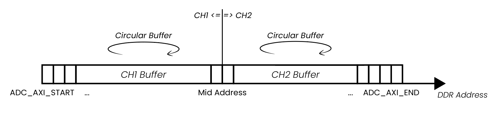

.. _deepMemoryMode:

#######################
深度内存模式（DMM）
#######################

深度内存模式（DMM）包含深度内存采集（DMA）和深度内存发生（DMG）。它允许用户充分利用 Red Pitaya 的 DDR3 RAM 进行数据采集和发生。深度内存采集支持高速捕获数据，而深度内存发生则可利用扩展的内存能力生成复杂波形。

DMM 的所有功能都通过直接内存访问（通常标记为 DMA）访问 Red Pitaya 的 DDR3 RAM，以实现高速数据传输和处理。分配的 RAM 区域也称为 DMM 区域，由采集和发生功能共享。用户可以配置 DMM 区域，但建议至少保留 100 MB DDR 供 Linux OS 正常运行。

.. contents::
   :local:
   :backlinks: top

|

.. _deepMemoryAcq:

深度内存采集（DMA）
==============================

说明
-----------

深度内存采集是一种特殊的数据采集方式，允许用户以完整采样速率 125 MS/s（取决于板卡型号）将数据直接写入 Red Pitaya 的 DDR3 RAM。
缓冲区长度可变并可由用户指定（必须是 64 Bytes 的倍数），但不能超过已分配 RAM 区域的大小。用户可以增加专用 RAM，但建议至少保留 100 MB DDR 供 Linux OS 正常运行。深度内存采集基于 `AXI protocol (AXI DMA and AXI4-Stream)`_。深度内存采集使用直接内存访问（DMA）。

采集完成后，Red Pitaya 需要一些时间将整个文件传输到计算机（需要清空 RAM），之后才能重置采集。DMA 可通过 SCPI、Python API 和 C++ API 命令配置。

DMA 有两种工作模式：

* 单缓冲区模式 — 数据以完整 ADC 采样速率（最高 125 MS/s）采集到 DDR 内存缓冲区。缓冲区填满后采集停止，数据即可传输到计算机。通过 SCPI、Python API 或 C++ API 命令配置 DMA 时使用此模式。
* **真实流式模式** — 数据从 FPGA 经 DDR 内存持续流式传输，并通过网络发送到主机计算机。此模式的数据速率限制为 :ref:`62.5 MB/s <streaming_limits>`。真实流式模式**仅可通过** :ref:`流式命令行客户端 <stream_command_client>` **和** :ref:`数据流控制应用 <streaming_top>` 使用。相比单缓冲区模式，真实流式模式需要预留更多 DDR 内存；预留不足时，应用和 API 代码都会发出警告。

**特性**

* 在 v0.94 FPGA 中，深度内存采集可与普通数据捕获模式并行运行，两个模式仅共享触发器。
* 默认分配给 DMM 的 RAM 区域为 32 MB（从所有输入通道捕获数据的最大空间）。
* 单缓冲区模式以完整 ADC 核心时钟速率运行（STEMlab 125-14 最高 125 MS/s）；与 SCPI、Python API 和 C++ API 一起使用。
* 真实流式模式限制为 :ref:`62.5 MB/s <streaming_limits>`，且仅可通过 :ref:`流式命令行客户端 <stream_command_client>` 使用。
* 真实流式模式相比单缓冲区模式需要预留更多内存；预留不足时会发出警告。
* 预留内存只能分配给一个缓冲区，即将全部内存分配给单个通道。
* 可与深度内存发生并行运行。

.. note::

    **共享资源** - 预留内存区域由深度内存采集和深度内存发生共享。如果同时使用两项功能，预留区域总大小必须小于或等于已分配内存区域的大小。

|

所需硬件
------------------

* 任意 Red Pitaya 设备。

所需软件
------------------

* Red Pitaya OS 2.00-18 或更高版本。
* FPGA v0.94 镜像。

|

功能
-----------------

下面说明 DMA 数据保存的工作方式：

为便于说明，DMA 缓冲区的起始和结束地址分别标记为 **ADC_AXI_START** 和 **ADC_AXI_END**。数据以 32-bit 块保存（每个样本 4 Bytes）。**ADC_AXI_START** 指向第一个样本的第一个 Byte，**ADC_AXI_END** 指向为 DMA 预留的 DDR 中最后一个样本的第一个 Byte。整个缓冲区大小为 **ADC_AXI_SIZE**。这些标签仅用于示意，并不引用任何宏。

DMA 缓冲区的起始地址（**ADC_AXI_START**）和大小（**ADC_AXI_SIZE**）通过 **rp_AcqAxiGetMemoryRegion** 函数获取。

内存区域可以从单个通道捕获数据（全部内存分配给单个通道），也可以在多个输入通道（CH1 (IN1) 和 CH2 (IN2)，*STEMlab 125-14 4-Input* 还包括 CH3 和 CH4）之间分配，方法是向 *rp_AcqAxiSetBuffer()* 函数传入以下参数：

    * 捕获通道编号（*RP_CH_1* 或 *RP_CH_2*；*STEMlab 125-14 4-Input* 还包括 *RP_CH_3* 或 *RP_CH_4*）。
    * 起始地址。
    * 样本数量（待捕获）。

在下面的示例中，内存区域在两个通道之间分配，每个通道捕获 1024 个样本。

上图中的 Mid Address 表示预留 DMM 区域内通道 2 缓冲区的起始点，其值设为 ADC_AXI_START + (ADC_AXI_SIZE/2)（两个通道可以捕获相同数量的数据）。

采集完成后，通过 *rp_AcqAxiGetDataRaw* 或 *rp_AcqAxiGetDataV* 函数并传入以下参数获取数据：

    * 通道编号。
    * 触发时刻的地址（使用 ``rp_AcqAxiGetWritePointerAtTrig`` 函数）。
    * 数据大小。
    * 数据存储位置（缓冲区起始地址）。使用整数缓冲区存储 RAW 值，使用浮点缓冲区存储以 Volts 为单位的值。

.. note::

    根据采集数据量以及为深度内存采集预留的 DDR 内存大小，从 DDR 传输数据可能需要一段时间。
    以下是一些加速提示：

    * **SCPI commands** - acquire the data in **RAW binary** format (``ACQ:DATA:FORMAT BIN``, ``ACQ:AXI:DATA:UNITS RAW``). With the latest OS versions, we have optimized the SCPI server to transfer
      **RAW binary** 数据以二进制格式传输，这比以字符串传输快得多（其他组合为 VOLTS、ASCII）。这种方法仍略慢于使用 Python 或 C++ API 创建带优化命令的自定义 TCP 服务器，但差距不大。
    * **Python API**:

        * Use the new functions ``rp_AcqAxiGetDataRawNP(channel, pos, np_buffer)`` and ``rp_AcqAxiGetDataVNP(channel, pos, np_buffer)`` that return the data as a Numpy buffer directly.
        * The fastest possible acquisition is achieved by using the ``rp_AcqAxiGetDataRawDirect(channel, pos, size)``, which directly returns the memory region without copying it to a Numpy buffer.

    * **Python or C++ API** - to transfer the data to the computer establish a `websocket TCP connection`_ with the Red Pitaya and transfer the data over the socket. This is slightly faster than
      **RAW BIN** SCPI，并且比使用 SCPI 命令的 **VOLTS ASCII** 快得多，因为避免了字符串和电压转换开销。可以使用 Python 或 C++ API 创建自定义 TCP 服务器（也可以基于 SCPI 服务器）来处理数据传输。

完成后请务必释放资源和预留的内存位置，否则 Red Pitaya 的性能可能会随时间降低。

|

.. _deepMemoryGen:

深度内存发生（DMG）
==============================

说明
-----------

深度内存发生是一种特殊的数据发生方式，允许用户将数据从 Red Pitaya 的 DDR3 RAM 直接流式传输到快速模拟输出。缓冲区长度可变并可由用户指定（至少 128 Bytes），但不能超过已分配 DMM 区域的大小。用户可以增加专用 RAM，但建议至少保留 100 MB DDR 供 Linux OS 正常运行。深度内存发生基于 `AXI protocol (AXI DMA and AXI4-Stream)`_。

DMG 有两种工作模式：

* **单缓冲区模式** — 波形加载到 DDR 内存缓冲区，并以完整 DAC 核心时钟速率（125 MHz）连续回放。周期信号的输出频率取决于缓冲区中编码的完整信号周期数和缓冲区大小：

  .. math::

      f_{out} = \frac{f_{clock} \times N_{periods}}{N_{samples}}

  由于每个样本都以完整核心速率（125 MHz）送入 DAC，用户可以在缓冲区中编码**多个周期**以生成更高频率的信号。每个缓冲区只有一个周期时，最小 64 样本缓冲区决定输出频率下限：

  .. math::

      f_{out,\ 1\ period} = \frac{125\ \text{MHz}}{64} \approx 1.953\ \text{MHz}

  实际上限是 DAC 的奈奎斯特频率（STEMlab 125-14 为 62.5 MHz，因为每个周期至少需要 2 个样本）。通过 Python API 或 C++ API 命令配置 DMG 时使用此模式。

* **真实流式模式** — 波形从主机计算机经网络持续流式传输到 DAC 输出。此模式的数据速率限制为
  :ref:`62.5 MB/s <streaming_limits>`。**连续两个样本之间的输出波形保持不变**（零阶保持；FPGA 不进行插值以补偿真实流式模式较低的吞吐量）。真实流式模式**仅可通过** :ref:`流式命令行客户端 <stream_command_client>` **和** :ref:`数据流控制应用 <streaming_top>` 使用。相比单缓冲区模式，真实流式模式需要预留更多 DDR 内存；预留不足时应用和 API 代码会发出警告。

DMG 可通过 Python API 和 C++ API 命令配置。未来将加入 SCPI 命令支持。

**特性**

* 深度内存发生可以生成具有可变缓冲区长度的自定义波形。
* 默认分配给 DMM 的 RAM 区域为 32 MB（存储所有输出通道数据的最大空间）。
* 单缓冲区模式以完整 DAC 核心时钟速率（125 MHz）运行，与 Python API 和 C++ API 一起使用。输出频率为 :math:`f_{clock} \times N_{periods} / N_{samples}`；最小 64 样本缓冲区包含单个周期时频率为 1.953 MHz，但在缓冲区中编码多个周期可以实现更高频率（实际上限为 DAC 奈奎斯特频率，STEMlab 125-14 为 62.5 MHz）。
* 真实流式模式限制为 :ref:`62.5 MB/s <streaming_limits>`，且仅可通过 :ref:`流式命令行客户端 <stream_command_client>` 使用。
* 在真实流式模式下，数据以缓冲区形式到达（长度在配置文件中设置）；最大平均处理速率为 62.5 MB/s。每个样本的保持时间由 ``dac_rate`` 设置。如果配置的 ``dac_rate`` 超过可持续网络吞吐量，缓冲区之间会出现间隙，此时 DAC 保持上一个样本值。FPGA 不执行插值。
* 真实流式模式相比单缓冲区模式需要预留更多内存；预留不足时会发出警告。
* 预留内存只能分配给一个缓冲区，即将全部内存分配给单个输出通道。
* 可与深度内存采集并行运行。

.. note::

    **共享资源** - 预留内存区域由深度内存采集和深度内存发生共享。如果同时使用两项功能，预留区域总大小必须小于或等于已分配内存区域的大小。

.. note::

    **波形模板与幅度** - DMG 波形定义为具有归一化值的**模板**。实际输出电压由通过 ``SOUR<n>:VOLT`` 命令单独设置的**幅度乘数**决定。FPGA 使用的公式为：

    **Output = (Waveform Template Value × Calibrated Amplitude Multiplier) + Calibration Offset**

    - 波形模板值必须在 ``-1`` 到 ``1`` 范围内（1 = DAC 最大值，-1 = DAC 最小值）。
    - FPGA 将模板乘以校准后的幅度乘数，再加上校准偏移量。
    - FPGA 并不知道 DAC 的满量程电压；使用校准值确保正确输出。
    - 将发送到 DMG 的所有波形数据加载到内存前，必须正确归一化到 ``[-1, 1]`` 范围。

|

所需硬件
------------------

* 任意 Red Pitaya 设备。

所需软件
------------------

* Red Pitaya OS 2.07-43 或更高版本。
* FPGA v0.94 镜像。

|

功能
-----------------

深度内存发生（DMG）使用与深度内存采集（DMA）相同的预留内存区域。DMG 可利用扩展内存能力生成复杂波形，从而支持更长、更详细的信号。其功能与 DMA 类似，但它不是捕获数据，而是从预留内存区域生成数据并将其流式传输到 DAC 输出。

**单缓冲区模式**

在单缓冲区模式下，波形从 DDR 内存读取，并以完整核心时钟速率（大多数板卡为 125 MHz）送至 DAC 输出。由于每个样本都以完整核心时钟速率输出，周期信号的输出频率由缓冲区中编码的完整周期数决定：

.. math::

    f_{out} = \frac{f_{clock} \times N_{periods}}{N_{samples}}

因此，用户可以通过在缓冲区中编码多个周期，**自由生成高于 1.953 MHz 的信号**。1.953 MHz 是最小 64 样本缓冲区包含单个周期时得到的输出频率，表示最小缓冲区大小下满幅连续信号可实现的最低频率，而不是严格的上限。实际上限是 DAC 的奈奎斯特频率（STEMlab 125-14 为 62.5 MHz），因为表示正弦信号时每个周期至少需要 2 个样本。

* 最小缓冲区大小为 64 个样本（每通道 128 Bytes）。
* 缓冲区起始地址必须是 4096 的倍数（DDR 页大小）。

每个样本在 DAC 输出端恰好保持**一个核心时钟周期（125 MHz 时为 8 ns）**。由于 FPGA 不执行插值，输出波形具有
**阶梯状（零阶保持）形状**：用于描述一个波形周期的样本越多，输出看起来越平滑。对于低频信号（缓冲区必须表示缓慢变化信号的多个周期），当样本数较少时，颗粒感可能变得明显。需要更平滑模拟输出而不增加缓冲区大小的用户必须在 FPGA 中**实现插值**（自定义 FPGA 镜像）。当前 DMG 实现不包含插值滤波器。

.. note::

    核心时钟频率不同的板卡仍会以完整核心时钟速率生成样本（SIGNALlab 250-12 为 250 MHz，SDRlab 122-16 为 122.88 MHz）。

**真实流式模式**

在真实流式模式下，波形数据以**缓冲区序列**的形式通过网络从主机计算机发送到 Red Pitaya。用户在
:ref:`配置文件 <stream_dac_config>` 中指定缓冲区长度。Red Pitaya 处理输入数据的最大**平均速率为 62.5 MB/s**，这限制了缓冲区到达并转发到 DAC 的速度。网络数据速率决定连续缓冲区到达板卡的速度，而不是单个样本输出的时钟速度。

* 连续样本之间的输出波形保持**不变**（零阶保持），与单缓冲区模式完全相同；FPGA 不执行插值。
* 每个样本的有效**保持时间**不再固定为 8 ns，而由 :ref:`配置文件 <stream_dac_config>` 中的 DAC 输出采样率（``dac_rate`` 变量）设置，该文件与 :ref:`流式命令行客户端 <stream_command_client>` 配合使用：
  :math:`t_{hold} = 1 / \text{dac\_rate}`。因此，与单缓冲区模式相比，真实流式模式的波形颗粒感**更加明显**，尤其是在需要较低 ``dac_rate`` 以满足流式数据速率限制时。
* **缓冲区间隙** — 如果配置的 ``dac_rate`` 导致平均数据速率超过 Red Pitaya 硬件可维持的速率（62.5 MB/s），板卡会在下一个缓冲区到达前耗尽当前缓冲区。在缓冲区间隙期间，DAC 输出会**保持已完成缓冲区的最后一个样本值**，直到收到新数据。为避免间隙，乘积 :math:`\text{dac\_rate} \times N_{channels} \times \text{BpS}` 的平均值不得超过 62.5 MB/s。
* 假设每个缓冲区包含一个信号周期，真实流式模式的最大输出信号频率受最小缓冲区大小（64 个样本）限制为 1.953 MHz，但实际可达频率还受可用数据速率和配置的 ``dac_rate`` 限制。
* 需要更平滑模拟输出的用户必须在 FPGA 中实现插值（自定义 FPGA 镜像）。
* 真实流式模式相比单缓冲区模式需要预留更多 DDR 内存。预留不足时，应用和 API 代码会发出警告。

有关 62.5 MB/s 网络吞吐量限制的更多信息，请参阅 :ref:`数据流限制 <streaming_limits>`。

|

.. _DMM_change_reserved_memory:

更改预留内存
=========================

深度内存模式默认内存区域为 32 MB，足以应对大多数简单应用。如果应用需要更多内存，可以在设备树文件中增加预留区域大小。设备树文件位于 **/opt/redpitaya/dts/$(monitor -f)** 目录，是描述 Red Pitaya 板卡硬件配置的二进制文件，由 Linux 内核在启动时配置硬件。分配给 DMM 的 DDR 内存可通过 **reg** 参数配置。之后必须**重新构建设备树**并**重启** Red Pitaya 才能生效。

.. note::

    **共享资源** - 预留区域由深度内存采集和深度内存发生共享。如果同时使用这两项功能，预留区域总大小必须小于或等于已分配内存区域的大小。

最大内存分配受板卡 DDR 大小限制（STEMlab 125-14 为 512 MB）。但是，DMM 和 Linux 共享 DDR 资源，因此为 DMM 分配过多资源可能降低性能。为避免问题，建议至少为 Linux 保留 100 MB DDR，因此 STEMlab 125-14 的 DMM 区域最大为 412 MB。

#.  **建立 SSH 连接** - :ref:`SSH <ssh>`。
#.  **以写权限重新挂载 SD 卡**，并打开 **dtraw.dts** 文件。

    .. code-block:: console

        root@rp-f066c8:~# rw
        root@rp-f066c8:~# nano /opt/redpitaya/dts/$(monitor -f)/dtraw.dts

#.  在文件中**搜索**“buffer”关键字，并配置以下行：

    .. code-block:: default

        buffer@1000000 {
            phandle = <0x39>;
            reg = <0x1000000 0x2000000>;
        };

    **reg** 的第一个参数是*起始地址（0x1000000）*（深度内存区域开始处的十六进制地址），第二个参数是*区域大小（0x2000000）*（32 MiB）。保持起始地址不变，并根据程序需要修改区域大小。数值采用十六进制格式。

    以下是 32 MiB 区域的计算示例：

    .. math::

        32 MiB = 32 \cdot 1 MiB = 32 \cdot 1024 \cdot 1024 Bytes = 2^{25} Bytes = 0x2000000

    .. note::

        1 MiB = 1024·1024 Bytes = :math:`2^{20}` Bytes = 1048576 Bytes.
        此处使用 Mebibytes（MiB）而不是 Megabytes（MB），以避免与十进制系统混淆。

#.  **重新构建设备树**并**重启板卡**。

    .. code-block:: console

        root@rp-f066c8:~# cd /opt/redpitaya/dts/$(monitor -f)/
        root@rp-f066c8:~# dtc -I dts -O dtb ./dtraw.dts -o devicetree.dtb
        root@rp-f066c8:~# reboot

.. note::

    为避免性能下降，建议至少保留 100 MB DDR 供 Linux OS 正常运行。对于具有 512 MB RAM 的板卡（例如 STEMlab 125-14 和 SDRlab 122-16），建议的 DMM 区域最大值为 412 MB；对于具有 1 GB RAM 的板卡（例如 SIGNALlab 250-12），最大值为 924 MB。

|

检查预留内存
----------------------------

检查预留内存区域最简单的方法是使用 :ref:`monitor 命令行工具 <monitor_util>`。该工具会显示预留内存区域的起始地址、结束地址和字节大小。以下是命令及输出示例：

.. code-block:: console

    redpitaya> monitor -r
    Reserved memory:
        start:  0x1000000 (16777216)
        end:    0x3000000 (50331648)
        size:   0x2000000 (33554432) 32768 kB

|

API 函数
===============

请查看命令列表中的 :ref:`DMA 和 DMG 部分 <commands_dmm>`。

|

API 代码示例
===================

* :ref:`DMA 和 DMG API/SCPI/Python/C++ 代码示例 <examples_dmm>`。
* :ref:`流式命令行客户端示例（ADC） <stream_adc_cli_example>` 和 :ref:`（DAC） <stream_dac_cli_example>` — 展示由命令行客户端触发的单缓冲区模式和真实流式模式。
* :ref:`流式 API 示例 <examples_streaming>` — 基于 Python API 的 ADC 和 DAC 流式传输示例。

|

.. links and references

.. _websocket TCP connection: https://www.geeksforgeeks.org/web-tech/what-is-web-socket-and-how-it-is-different-from-the-http/

.. _AXI protocol (AXI DMA and AXI4-Stream): https://adaptivesupport.amd.com/s/article/1053914?language=en_US
