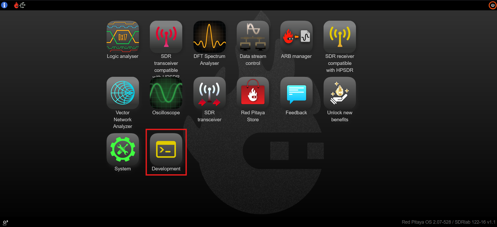
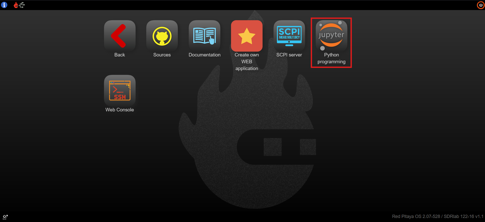

.. _jupyterlab:

#################
Jupyter Lab
#################

JupyterLab 是面向笔记本、代码和数据的最新 Web 交互式开发环境。其灵活界面允许用户配置和安排数据科学、科学计算、计算新闻学和机器学习工作流。模块化设计支持通过扩展来拓展和丰富功能。

JupyterLab 包含 Jupyter Notebook 的全部功能（Jupyter Notebook 是一个开源 Web 应用，可创建和共享包含可运行代码、公式、可视化、说明文字以及直接控制或监控硬件功能的文档）。

JupyterLab 位于 Red Pitaya Web 界面的 **Development** 部分。

|

功能
============

* 在浏览器中编辑代码，并自动提供语法高亮、缩进和制表符补全/自省。
* 在浏览器中执行代码，并将计算结果附加到生成该结果的代码上。
* 使用 HTML、LaTeX、PNG、SVG 等丰富媒体表示形式显示计算结果。例如，可以内嵌由 |matplotlib| 库渲染的出版级图形。
* 使用 |Markdown| 标记语言在浏览器中编辑富文本，为代码提供说明，不局限于纯文本。
* 使用 LaTeX 在 Markdown 单元格中轻松加入数学符号，并由 |MathJax| 原生渲染。

.. note::

    **尽量减少活动内核和打开的笔记本数量：** 不建议同时运行超过 10 个 JupyterLab 内核（打开的笔记本数量），因为板卡可能耗尽内存并强制关闭 JupyterLab 应用。Red Pitaya 会记住上次使用 JupyterLab 时打开的笔记本，因此不关闭大多数笔记本就退出应用可能导致 JupyterLab 加载时间很长。因此，不建议在打开超过 5 个标签页（笔记本）时退出 JupyterLab。

    活动内核位于此处：

    .. figure:: img/Jupyter_kernel.png
        :width: 800

笔记本文档
----------------------

笔记本文档包含交互会话的输入和输出，以及伴随代码但不用于执行的附加文本。因此，笔记本文件可以作为完整的会话计算记录，将可执行代码与说明文字、数学内容和结果对象的丰富表示交织在一起。这些文档是内部 |JSON-wiki| 文件，以 *.ipynb* 扩展名保存。由于 JSON 是纯文本格式，因此可以进行版本控制并与同事共享。

通过 |nbconvert| 命令可以将笔记本导出为多种静态格式，包括 HTML（例如用于博客文章）、reStructuredText、LaTeX、PDF 和幻灯片。

此外，任何可通过公共 URL 获取的 *.ipynb* 笔记本文档都可以通过 Jupyter Notebook Viewer（nbviewer）共享。该服务从 URL 加载笔记本文档并将其渲染为静态网页。因此可以与同事共享结果或将其作为公开博客文章，而无需其他用户自行安装 Jupyter Notebook。实际上，nbviewer 就是 Web 服务形式的 nbconvert，因此无需依赖 nbviewer，也可以使用 nbconvert 自行进行静态转换。

|

硬件 - 传感器扩展模块
======================================

虽然使用 JupyterLab 除 Red Pitaya 板卡外不需要其他硬件，但拥有大量可以立即派上用场的传感器会让电子入门更加有趣。无论您想测量温度、振动、运动等，我们都有与 |Seeed-Grove| 的 **Grove** 模块兼容的扩展模块。您只需选定所需模块、找到正确连接器，即可开始项目。扩展模块上还配备了 Arduino 扩展板排针。

.. figure:: img/extension_module_and_sensors.png
    :width: 500

有关 :ref:`传感器扩展模块 <sensor_extension_module>` 的更多信息请参见此处。

|

示例
===========

代码示例位于：

* :ref:`JupyterLab 示例 <examples>` （使用 Python API 示例）。
* :github:`Red Pitaya Jupyter GitHub <RedPitaya/jupyter/tree/master>`。
* :github:`Red Pitaya JupyterLab 欢迎页面 <RedPitaya/jupyter/blob/master/welcome.ipynb>`。
