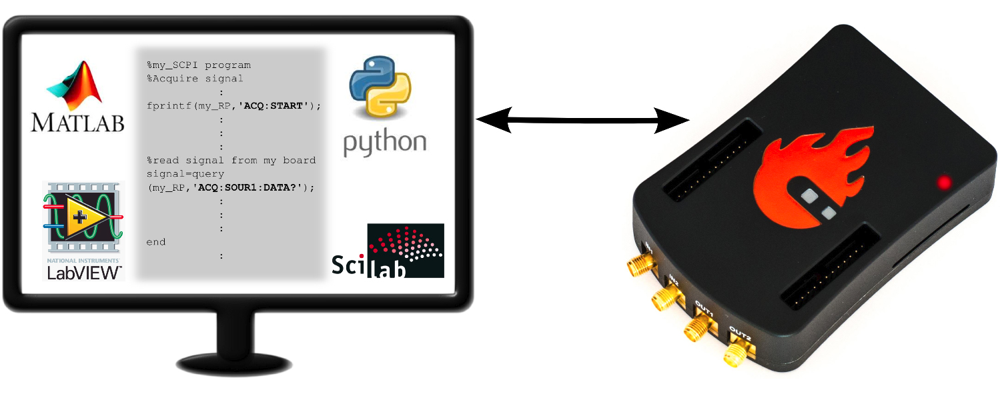
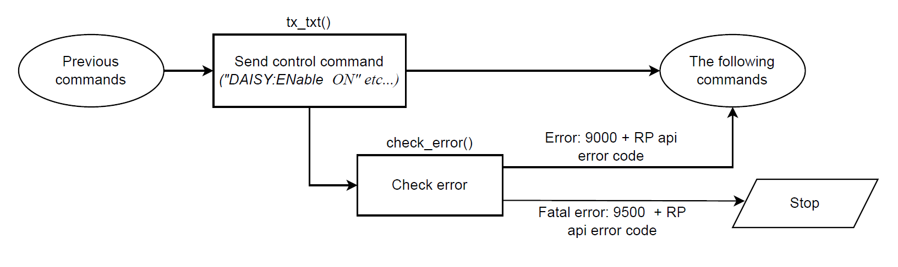
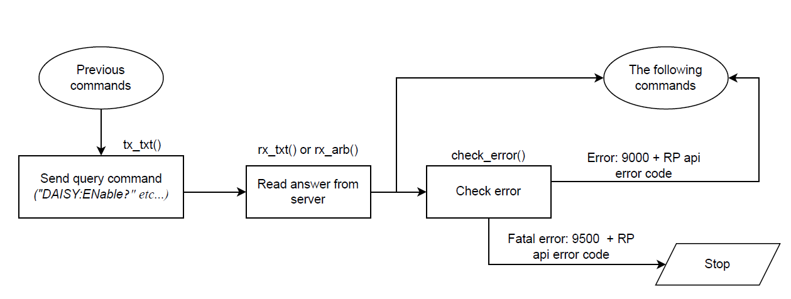

.. _scpi_commands:

SCPI 服务器（MATLAB、LabVIEW 或 Python）
##################################################

|

通过 Red Pitaya SCPI（可编程仪器标准命令）命令列表，可以使用 MATLAB、LabVIEW 或 Python，经由 LAN 或无线接口远程控制 Red Pitaya 板卡。
SCPI 接口/环境通常用于开发、研究或测试自动化中的 T&M 仪器控制。SCPI 使用一组仪器可识别的命令来执行特定操作（例如从快速模拟输入采集数据、生成信号以及控制 Red Pitaya 平台的其他外设）。
当需要复杂的信号分析时，SCPI 命令非常有用。MATLAB 等提供强大数据分析工具的软件环境与 SCPI 命令结合，可以方便地访问 Red Pitaya 板卡采集的原始数据。

**功能**

* 使用 MATLAB、LabVIEW 或 Python 快速编写控制例程和程序。
* 使用 MATLAB、LabVIEW 或 Python 等强大的数据分析工具分析 Red Pitaya 板卡采集的原始信号。
* 编写测试脚本和例程。
* 将 Red Pitaya 和 LabVIEW 集成到测试及生产线中。
* 直接在 PC 上快速测量。

.. note::

    同时与 SCPI 服务器通信并使用基于 Web 的仪器可能降低 Red Pitaya 的性能，因为两项任务使用相同的资源。

|

***********
快速开始
***********

要启动 SCPI 服务器，只需点击 SCPI 服务器图标。SCPI 服务器运行后，系统会显示板卡的 IP 地址。应将此 IP 地址写入脚本中。
也可以使用 Terminal 手动启动 SCPI 服务器（参见下方说明）。

要运行示例，请按照以下说明操作：

#.  **打开 Red Pitaya Web 界面并进入 Development 部分**。

    .. figure:: img/scpi-homepage.png
        :width: 800

#.  **打开 SCPI 服务器**

    .. figure:: img/scpi-development.png
        :width: 800

#.  **选择一个 ``RUN`` 按钮启动 SCPI 服务器**。

    * **TCP（推荐）** - 使用 TCP 协议启动 SCPI 服务器。这是 SCPI 通信最常用的协议，与大多数支持 SCPI 命令的软件环境兼容。
    * **UART** - 通过 UART 接口启动 SCPI 服务器。此选项用于串行通信，适合支持串行通信协议的环境。
    * **Arduino** - 以 Arduino 模式启动 SCPI 服务器。此选项适用于基于 Arduino 的环境，可与 Arduino 项目无缝集成。
    * **Arduino TCP** - 以 Arduino TCP 模式启动 SCPI 服务器。此选项结合 TCP 和 Arduino 模式的功能，为各种应用提供灵活的解决方案。

    .. figure:: img/scpi_app_run.png
        :width: 800

#.  **记下 IP 地址** （本例为 *192.168.178.100*）或 Red Pitaya 板卡的 .local 地址（本例为 *rp-f03e5f.local*），建立套接字通信时需要使用该地址。

    .. figure:: img/scpi-app-stop.png
        :width: 800

#.  **开始编程**。根据计算机的 OS 环境遵循下方说明。

.. contents::
    :local:
    :backlinks: none
    :depth: 1

6.  **完成后点击 ``STOP`` 按钮停止 SCPI 服务器**。

    .. note::

        请勿让 SCPI 服务器与 :ref:`示波器 <osc_app>` 等其他 Web 应用并行运行，否则应用和 SCPI 程序都可能出现未定义行为。

        为避免未定义行为，在最新 OS 版本中，必须先点击 ``STOP`` **按钮才能退出 SCPI 服务器应用**。

|

======
MATLAB
======

要求与设置
-----------------------

基本 MATLAB 安装已包含控制 Red Pitaya 所需的一切。不过，我们建议安装 **Signal Processing** 和 **Instrumentation Control** 工具箱，以便在需要时使用。

运行代码
---------------

#.  **在计算机上打开 MATLAB**。
#.  **复制 blink 示例代码**。在 MATLAB 工作区中粘贴 :ref:`blink <blink>` 教程示例中的代码。
#.  **替换示例中的 IP**，改为 Red Pitaya 板卡的 IP 或 **"rp-xxxxxx.local"** 地址。
#.  **运行示例**。点击 ``RUN`` 或按键盘上的 ``F5`` 运行代码。

有关通过 MATLAB 控制 Red Pitaya 的更多示例，请参见 :ref:`此处 <examples>`。

|

======
Python
======

要求与设置
-----------------------

Python 是一种强大的编程语言，广泛用于科学计算、数据分析和自动化。其庞大的库和工具生态系统使其非常适合远程控制 Red Pitaya 板卡。对于偏好开源方案或希望获得更灵活编程环境的用户，Python 也是很好的选择。

这里介绍在 |VSCode| 中设置环境的方法，因为它适应性强且易于扩展。不过，也可以使用任何支持 Python 的其他编程环境。

1.  **安装 Python 3.10 或更高版本。** 链接见 |python_main|。
#.  **在安装过程中将 python.exe 添加到 PATH** （勾选对应复选框）！

    .. figure:: img/install_python.png
        :width: 600

#.  **安装编程环境。** 建议使用 |VSCode|。

    .. figure:: img/install_vsc.png
        :width: 600

#.  **为编程环境安装扩展**（**Python Extension Pack** 和 **Better Comments** 是 VS Code 的推荐组合）。
#.  **配置工作区。** 设置或创建新的 |workspace|。这里有一些 Visual Studio Code 的 |tutorials|。
#.  **创建虚拟环境（可选）。** 参见此处说明 - |venv|。
#.  **选择 Python 解释器。**

    .. figure:: img/select_interpreter.png
        :width: 800

#.  **更新 Python 软件包。** 确保 Python 软件包为最新版本，并安装以下 Python 库：

    * numpy
    * matplotlib

    .. tabs::

        .. tab:: Linux

            打开 Terminal，或使用 VS Code 中的 *Terminal*，输入：

            .. code-block:: shell-session
    
                sudo pip3 install numpy matplotlib

        .. tab:: Windows

            打开 *Command Prompt*，或使用 VS Code 中的 *Terminal*，输入：

            .. code-block:: shell-session
    
                py -m pip install numpy matplotlib

#.  **启用“Running Scripts”选项**。Windows 用户必须启用 ``Running Scripts`` 选项。它应位于 **Settings > Update&Security > For developers** 下的 **Power Shell** 部分（也可以搜索 ``How to enable running scripts on Windows 10/11``）。
#.  **再次检查 Python 版本**，必要时重新选择 Python 解释器（参见步骤 5）。

    .. code-block:: shell-session

       $ python --version
       Python 3.11.6

    在 Windows 上，可以在命令行中使用 **py** 代替 **python**。

#.  **下载并保存 redpitaya_scpi.py 库** 到 VS Code 工作区文件夹/目录中。该库必须与 Python 脚本位于同一文件夹。库的源代码位于 GitHub：|redpitaya_scpi lib github|。也可以从此处直接下载：|redpitaya_scpi.py|。

    .. figure:: img/scpi-examples.png
        :width: 600

#.  **创建包含以下代码的新 Python 文件。** 保存后检查 NumPy 库的显示方式。如果它带有黄色下划线，说明当前 Python 环境未正确安装这些库。

    .. code-block:: python

        import numpy as np

        print("Hello world!\n")

#.  **运行测试文件。** Terminal 中不应显示错误或警告（会打印 “Hello world!”）。

    .. figure:: img/hello_world.png
        :width: 1000

|

redpitaya_scpi.py 库
-----------------------------

|redpitaya_scpi.py| 库是一个 Python 脚本，用于建立计算机与 Red Pitaya 板卡之间的套接字连接。它提供易于使用的接口，用于向 Red Pitaya 板卡发送 SCPI 命令并接收响应。该库设计简单直观，让您可以专注于编写控制例程，而不必担心底层通信细节。

该库提供以下函数：

.. list-table::
    :widths: 30 70
    :header-rows: 1

    * - 函数
      - 描述
    * - ``__init__(ip)``
      - 使用提供的 IP 地址初始化与 Red Pitaya 板卡的连接。
    * - ``__del__()``
      - 删除对象时关闭套接字连接。
    * - ``check_error()``
      - 检查响应中的错误。
    * - ``close()``
      - 关闭与 Red Pitaya 板卡的套接字连接。
    * - ``rx_txt()``
      - 从 Red Pitaya 板卡接收文本响应。
    * - ``rx_txt_check_error()``
      - 接收文本响应并检查错误。
    * - ``rx_arb()``
      - 从 Red Pitaya 板卡接收二进制数据。
    * - ``rx_arb_check_error()``
      - 接收二进制数据并检查错误。
    * - ``tx_txt(txt)``
      - 向 Red Pitaya 板卡发送文本命令。
    * - ``tx_txt_check_error(txt)``
      - 发送文本命令并检查响应中的错误。
    * - ``txrx_txt(txt)``
      - 发送文本命令并接收文本响应。

``tx`` 函数用于向 Red Pitaya 板卡发送命令，``rx`` 函数用于接收响应。``check_error`` 函数用于检查响应中的错误。该库还提供用于收发二进制数据的简单接口。

.. note::

    如果向 Red Pitaya 板卡传入错误命令，或命令执行期间发生错误，**rx** 函数将不会返回任何数据，程序会因等待永远不会到达的响应而陷入无限循环。为避免这种情况，请确保 SCPI 命令语法正确，并在发送命令后定期使用 **check_error** 函数检查错误。

**redpitaya_scpi.py** 库的 GitHub 仓库包含多个不同的库：

* **redpitaya_scpi.py** - 用于控制 Red Pitaya 板卡的主库，也包含便于控制板卡的可选函数（包含核心功能）。
* **redpitaya_scpi_core.py** - 仅包含建立连接及收发数据所需基本函数的核心库。
* **old** - 包含不再维护的旧版库。

可以在 GitHub 上找到该库的源代码：

* |redpitaya_scpi lib github|.

.. |python_main| replace:: |python| download webpage

.. |workspace| replace:: |vscode-workspace|

.. |tutorials| replace:: |vscode-tutorials|

.. |venv| replace:: |vscode-venv|

.. |redpitaya_scpi lib github| replace:: :github:`redpitaya_scpi GitHub source code <RedPitaya/RedPitaya-Examples/tree/main/SCPI_examples/Python/lib>`

.. |redpitaya_scpi.py| replace::

    :download:`redpitaya_scpi.py <https://github.com/RedPitaya/RedPitaya-Examples/blob/main/SCPI_examples/Python/lib/redpitaya_scpi.py>`

|

运行代码
-----------------

1.  **复制 blink 示例代码**。打开 :ref:`blink <blink>` 教程，将代码复制到常用文本编辑器中。
#.  **将 blink 示例**以 ``blink.py`` 的名称保存到“work”文件夹。确保 **redpitaya_scpi.py** 位于其旁边。

    .. note::

       ``redpitaya_scpi.py`` 库是建立 PC 与 Red Pitaya 板卡连接所需的标准脚本。如果该库不在 Python 代码所在的同一文件夹中，代码将无法执行。

    .. figure:: img/scpi-examples.png
        :width: 600

#.  **更改 IP 地址**。修改 ``blink.py`` 中的 ``IP`` 变量，使其包含 Red Pitaya 的 IP 或 "rp-xxxxxx.local" 地址。
#.  **运行示例**。点击 VS Code 右上角的向左箭头，或打开 ``Terminal`` 并进入包含 Python 脚本（``examples_py``）的文件夹，然后输入：``python blink.py``

    .. code-block:: shell-session

        cd <python_file_location>
        python blink.py

有关使用 Python 控制 Red Pitaya 的更多示例，请参见 :ref:`此处 <examples>`。

.. note::
   
    Python 示例也可以直接在 RP 设备本身上运行。首先启动 SCPI 服务器，然后使用设备本地 IP：``127.0.0.1``。

|

=======
LabVIEW
=======

要求与设置
-----------------------

要正常运行，必须安装 |LabVIEW_driver|。该驱动程序功能完整，未来还会添加更多示例和代码更新。

1.  从 Framatome GitLab 下载 |LabVIEW_driver|。
#.  解压下载的归档文件，并将 **RedPitaya** - 驱动程序文件夹复制到 LabVIEW 安装目录的 ``instr.lib`` 文件夹中。
    **LabVIEW 2020 32-bit** （例如免费的 Community Edition）所需路径为：

    .. code-block:: none

        C:\Program Files (x86)\National Instruments\LabVIEW 2020\instr.lib

    对于其他 LabVIEW 版本，请相应调整年份以及 ``Program Files`` / ``Program Files (x86)`` 文件夹（64 位版本安装在 ``Program Files`` 下）。

    .. note::

        如果使用 **较新版本的 LabVIEW**，可以在 LabVIEW 内部以新格式保存库来升级驱动程序。这不会影响驱动程序的功能。

#.  **复制文件夹后重启 LabVIEW**。

随后可以在 Block Diagram 的以下位置找到 Red Pitaya 核心：

**Block Diagram → Functions → Instrument I/O → Instr Drivers → RedPitaya**

.. note::

    根据设置，*Instrument I/O* 面板可能处于隐藏状态。请查阅 LabVIEW Help，了解如何显示或隐藏面板类别。

|

运行代码
--------------

可以通过以下路径访问示例 VI：

#.  *Help -> Find Examples...*
#.  选择 *Search tab*。
#.  在 Enter keyword(s) 字段中输入 **RedPitaya**。

有关从 LabVIEW 控制 Red Pitaya 的更多示例，请参见 :ref:`此处 <examples>`。

|

*****************************
手动启动 SCPI 服务器
*****************************

1.  **建立 SSH 连接**。通过 :ref:`SSH <ssh>` 连接到 Red Pitaya。

#.  **停止 Nginx 服务**。启动 SCPI 服务器前，请确保 Nginx 服务未运行。同时运行两者会产生冲突，因为它们访问相同的硬件。

    .. code-block:: shell-session

        systemctl stop redpitaya_nginx

    .. note::
   
        这只会暂时停止 Web 界面，下次启动时它会重新启动。有关服务管理的详情，请参见 :ref:`服务管理 <service_management>`。

#.  **使用以下命令启动 SCPI 服务器：**

    .. code-block:: shell-session

        systemctl start redpitaya_scpi &

    .. figure:: img/scpi-ssh.png
        :width: 400

.. note::

    请确保已加载“default” **v0.94 FPGA 镜像**。对于 2.00-23 或更高版本的 OS，请执行以下命令：

    .. figure:: img/scpi-run2.png
        :width: 400

    要在执行命令时查看服务器日志：

    .. code-block::

        RP:LOGmode CONSOLE

|

.. _scpi_boot_time:

**********************************
在启动时启动 SCPI 服务器
**********************************

以下命令会启用 SCPI 服务器开机运行，并禁用 Nginx 服务。

.. code-block:: shell-session

    systemctl disable redpitaya_nginx
    systemctl enable  redpitaya_scpi

.. note::

    这些命令配置开机时启动的服务。有关更多服务管理选项，请参见 :ref:`服务管理 <service_management>`。

|

***************************
SCPI 命令如何工作？
***************************

这里解释 redpitaya_SCPI.py 脚本在“幕后”执行的功能，该脚本负责建立 Red Pitaya（主机）与计算机（客户端）之间的套接字连接。
这里介绍的原理也适用于其他已支持 SCPI 命令的环境（MATLAB、LabVIEW），或可作为开发其他环境 SCPI 命令脚本的基础。

SCPI 命令本质上是字符串命令：它们要么包含需要在板卡设置中修改的用户定义参数，要么请求板卡返回特定设置或采集数据。因此，可以将 SCPI 命令分为两类：*控制命令* 和 *查询命令*，下文将分别讨论。

SCPI 命令易于使用和记忆，但速度较慢，因为所有数据无论大小或类型都必须转换为字符串，再通过 TCP 连接发送。当 SCPI 命令字符串到达 Red Pitaya 板卡后，会与所有可能的 SCPI 命令列表进行比较；找到正确命令后，从字符串中取出参数并转换回通常格式，然后执行相应的 C++ API 函数。否则会返回错误。

|

==================
控制命令
==================

控制命令将用户定义的设置发送到 Red Pitaya。

* 控制命令不会返回任何内容。
* 通过状态字节进行错误检查。
* 错误检查是可选的。
* API 错误代码由两部分组成：``9000`` 或 ``9500`` 表示错误是普通错误还是严重错误，另一部分是 API 错误编号。例如：``9500 + RP_EOED = 9501`` （Failed to Open EEPROM Device）。

|

================
查询命令
================

查询命令请求向用户返回数据或设置，其末尾总是带有问号（?）。

* 查询命令始终返回数据。
* 通过状态字节进行错误检查。
* 错误检查是可选的。
* 命令返回的数据有两种类型：二进制数据和文本数据。
* 二进制数据响应格式为 ``#<DATA SIZE><BYTES>``。发生错误时，响应格式为 ``#0``。
* 文本数据格式：``<ANSWER>\r\n`` 或 ``<ANSWER>;<ANSWER>;...;<ANSWER>\r\n``（一次发送多条命令时）。发生错误时，响应格式为 ``\r\n``。
* 在 ASCII 模式下，数据缓冲区表示为 ``{dd,dd,dd,...,dd}``。
* API 错误代码由两部分组成：``9000`` 或 ``9500`` 表示错误是普通错误还是严重错误，另一部分是 API 错误编号。例如：``9500 + RP_EOED = 9501`` （Failed to Open EEPROM Device）。

|

.. substitutions

.. |LabVIEW_driver| replace:: `Red Pitaya LabVIEW driver <https://gitlab.com/framatome-atms-community/red-pitaya-labview-driver>`__
