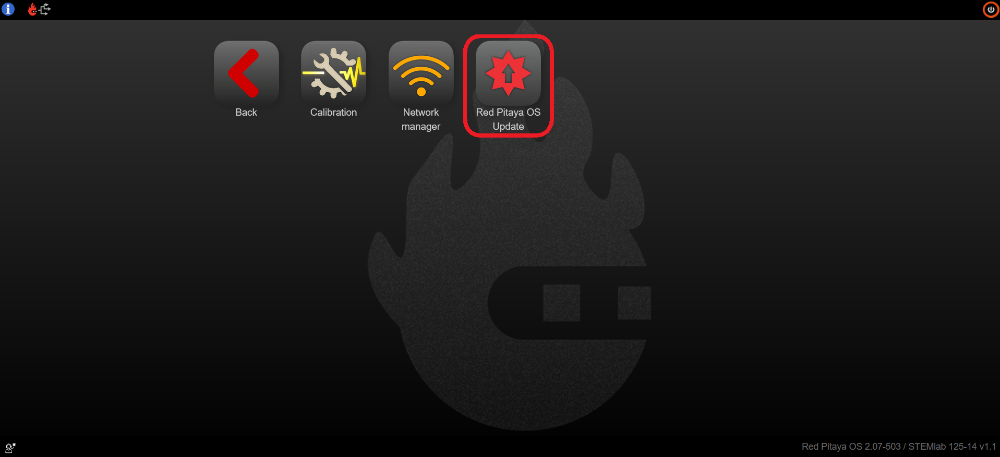
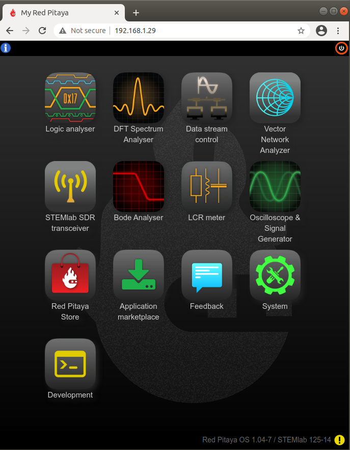

.. _software_update_manager:

########################
软件更新管理器
########################

要打开软件更新管理器应用，请点击 **System Tools**，然后选择 **Red Pitaya OS Update**。

.. image:: ../img/Main_menu_system.jpg
    :align: center
    :width: 1200

软件更新管理器允许你检查并安装 Red Pitaya 操作系统（OS）和生态系统的更新。OS 是运行在 Red Pitaya 硬件上的底层软件，而生态系统包含运行在 OS 之上的应用和工具。
也可以从主 Web 界面右下角点击 **生态系统版本标签** 访问该功能。

如果 Red Pitaya 板卡可以访问互联网，当有新的 OS 版本可用时，生态系统版本标签旁会显示 **黄色感叹号** 通知。

软件更新管理器会检查当前 OS 版本，并将其与 `Red Pitaya 下载仓库 <https://downloads.redpitaya.com/downloads/Unify/ecosystems/>`_ 中的文件进行比较。

|

更新 OS
----------------

.. note::

    如需最快地更新 OS，请 :ref:`手动下载最新 OS 版本 <prepareSD>`。

#.  启动 OS 更新器应用，等待应用列出可用的 OS 版本（步骤 3）。
    
    .. figure:: img/OS_update_running.png
        :align: center
        :width: 800

#.  选择列出的某个生态系统版本。

    .. figure:: img/SDcard_update_manager.png
        :align: center
        :width: 600

#.  等待更新过程完成。根据互联网连接速度，更新过程可能需要一段时间。
    *我们计划未来添加进度条。*

    .. note::

        OS 升级可能会导致 Red Pitaya 桌面冻结几分钟。

|

软件更新管理器故障排除
----------------------------------------

软件更新管理器运行期间可能报告以下问题之一：

#.  **步骤 1：Red Pitaya 当前处于离线状态**。请按照快速入门说明使其上线。如果 Red Pitaya 未连接到互联网，软件更新管理器将在步骤 1 停止。
    
    .. figure:: img/No_connection.png
        :align: center
        :width: 800
    
    要解决此问题，请确保 Red Pitaya 已连接互联网。请参阅 :ref:`网络管理器 <network_manager>` 章节，将 Red Pitaya 连接到互联网。

#.  **步骤 3：当前 Linux 版本不支持最新 Ecosystem**。如果更新管理器在步骤 3 停止且未列出任何可用 OS 版本，则表示当前 Linux 版本与最新 Ecosystem 版本不兼容。
    请 :ref:`手动更新 Red Pitaya OS <prepareSD>`。

    .. figure:: img/Ecosystem_not_supported.png
        :align: center
        :width: 800

#.  如果更新管理器报告需要更新 Linux 版本，请按照 :ref:`下载并安装 SD 卡镜像 <prepareSD>` 的说明手动重新安装 SD 卡。

|

更新生态系统和 Red Pitaya Linux OS 的其他方式
------------------------------------------------------------

.. include:: ../../../quickStart/OS_update/OS_update_options.inc
