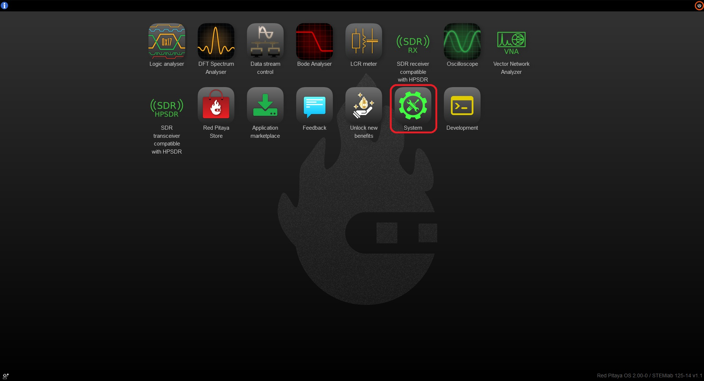
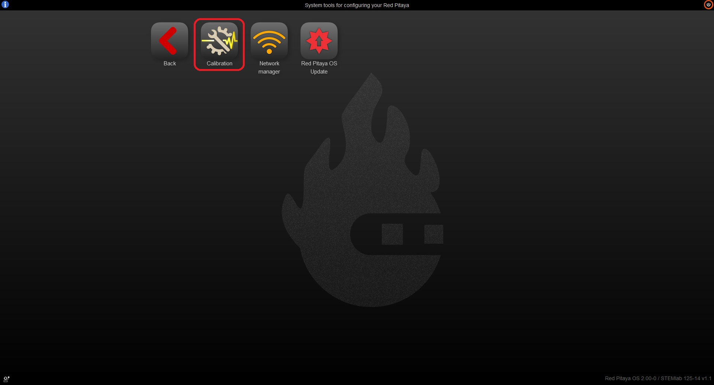
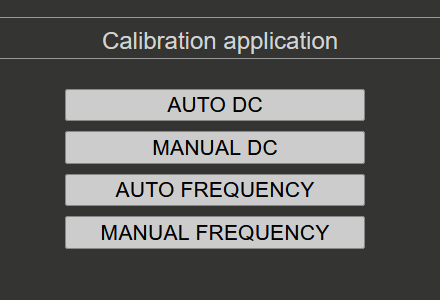

.. _calibration_app:

###########
校准
###########

.. contents:: 目录
    :local:
    :depth: 1
    :backlinks: top

|

概述
==========

校准是 Red Pitaya 系统的重要组成部分，可确保 ADC 和 DAC 正常工作并保证测量准确。校准应用支持执行 DC 校准和频率校准。

**校准可以修正什么？**

* **DC 校准** - 修正 ADC 和 DAC 的 DC 偏移与增益误差，确保电压测量和信号生成准确。
* **频率校准** - 补偿 LV 和 HV 电压范围模拟前端电阻、电容分压电路中的器件偏差。该滤波器确保整个频率范围内的幅度测量准确。

通过 *系统工具* 菜单中的校准应用可以最方便地重新校准 Red Pitaya 板卡。当然，也可以通过以下方式完成校准：

* :ref:`校准应用 <calibration_app>`。
* :ref:`校准命令行工具 <calib_util>`。
* :ref:`频率校准命令行工具 <filter_calib_util>`。
* :ref:`C++ 或 Python API 命令 <API_commands>`。

要打开校准应用，请点击 **系统工具**，然后选择 **校准**。

打开校准应用后，您将看到四个选项：

|

何时进行校准
===================

Red Pitaya 板卡在出厂前已完成校准，购买后通常即可提供准确测量。但在以下情况下应进行校准：

* **初次设置后** - 如果希望确保特定使用场景下的最佳准确度。
* **每年一次** - 器件值会随时间缓慢漂移，因此建议每年重新校准以保持准确度。
* **环境变化后** - 板卡工作环境（温度、湿度）发生显著变化时。
* **准确度下降时** - 测量结果出现不一致或不准确时。

.. note::

    应在板卡正常工作温度下进行校准。如果板卡在非标准环境中工作，请在相同条件下校准以获得最佳准确度。

|

所需设备
===================

所需设备取决于板卡世代和校准类型：

**所有板卡：**

* 两根高质量 SMA 或 BNC 电缆（使用 BNC 电缆时还需合适的适配器）
* 一或两个 SMA-T 适配器
* 两个 SMA 短路端接器（用于 DC 校准）

**仅 Original Generation 板卡：**

* 两个 50 Ω 端接器（用于校准期间的阻抗匹配）

**DC 校准：**

* 稳定的电压基准源（越稳定，校准准确度越高）
* 用于测量基准电压和 DAC 输出的高精度万用表

**频率校准（可选）：**

* 能够在 1 kHz 生成 ±1 V 至 ±20 V 方波的外部基准函数发生器（可选，也可使用内部发生器）

|

快速参考指南
======================

要正确校准 Red Pitaya 板卡，请遵循以下步骤。具体说明会因所用板卡型号略有不同。
校准期间应注意匹配输入和输出阻抗，以获得准确结果。

Original Generation 板卡
---------------------------

Original Generation 板卡（STEMlab 125-14、SIGNALlab 250-12、SDRlab 122-16 等）在校准期间需要使用 50 Ω 端接器，以确保准确的阻抗匹配。例如，STEMlab 125-14 的 DAC 输出阻抗为 50 Ω，因此校准时应在输出端连接 50 Ω 负载。由于 ADC 输入阻抗为 1 MΩ，校准时应在输入端使用 50 Ω 端接器，以匹配 DAC 的输出阻抗。另一方面，SDRlab 122-16 的输入和输出阻抗均为 50 Ω，因此校准过程中将输入连接到输出时无需额外端接器。

.. warning::

    对于 Original Generation 板卡，频率校准滤波器可能影响测量输入数据的幅度（尤其是峰峰值）。为确保测量准确，DC 校准期间应保持滤波器禁用。OS 版本 2.07-44 及更高版本的 DC 校准流程会自动处理此问题。对于较旧的 OS 版本，请参阅 :ref:`禁用频率校准滤波器说明 <disable_frequency_filter>`。

**校准流程：**

1. **禁用频率校准滤波器** - 如果使用较旧的 OS 版本，请在开始 DC 校准前禁用频率校准滤波器。OS 版本 2.07-44 及更高版本会由 DC 校准流程自动处理此步骤。
#. **DC 校准** - 首先执行 DC 校准。请遵循 :ref:`DC 校准说明 <dc_calibration>`。DC 校准期间会自动禁用频率校准滤波器。
#. **频率校准** - 完成 DC 校准后执行频率校准。请遵循 :ref:`频率校准说明 <frequency_calibration>`。
#. **第二次 DC 校准（可选）** - 为获得最佳准确度，在频率校准后启用频率校准滤波器，再执行一次 DC 校准。这是因为频率校准可能轻微影响 DC 偏移和增益，第二次 DC 校准可微调参数以获得最佳准确度。

|

Second Generation 板卡
-------------------------

Second Generation 板卡（STEMlab 125-14 Gen 2、STEMlab 125-14 PRO Gen 2、STEMlab 65-16 TI 等）采用改进的模拟前端电路，无需 50 Ω 端接器和频率校准滤波器，因此校准流程更加简单。

**校准流程：**

1. **DC 校准** - 执行 DC 校准。请遵循 :ref:`DC 校准说明 <dc_calibration>`。
#. **频率校准（可选）** - 对 Second Generation 板卡而言，改进的模拟前端设计显著降低了频率校准的必要性，因此频率校准是可选的。不过，如需通过频率校准获得最佳准确度，请遵循 :ref:`频率校准说明 <frequency_calibration>`。
#. **第二次 DC 校准（可选）** - 为获得最佳准确度，在频率校准后启用频率校准滤波器，再执行一次 DC 校准。这是因为频率校准可能轻微影响 DC 偏移和增益，第二次 DC 校准可微调参数以获得最佳准确度。

|

校准方法
====================

.. toctree::
    :maxdepth: 2

    dc_calibration
    frequency_calibration

|

.. _calibration_backup_restore:

校准备份与恢复（EEPROM）
=========================================

校准应用在 **设置菜单 → EEPROM 信息** 下的 **手动 DC 校准** 视图中提供内置备份与恢复功能。您可以保存并重新加载校准数据（出厂校准或当前用户校准），无需使用命令行。

有关 EEPROM 信息菜单及备份/恢复步骤的完整详情，请参阅 :ref:`手动 DC 校准 — 设置菜单 <dc_calibration>` 部分。

有关命令行备份和恢复选项，请参阅 :ref:`calib 工具文档 <calib_util>`。

|

命令行校准
=========================

命令行工具 *calib* 也可用于校准任务。

有关命令行工具和不同校准格式的更多信息，请参阅：

* 标准校准请参阅 :ref:`calib_util 工具文档 <calib_util>`。
* 频率校准请参阅 :ref:`filter_calib_util 工具文档 <filter_calib_util>`。

|

已知问题
=================

* **OS 2.07-44 至 2.07-48** - DC 校准期间，STEMlab 125-14 4-Input 的 CH3 偏移会被复制到 CH2 偏移。请更新到最新 Nightly OS 版本 3.00-728 或更高版本以解决此问题。
* **OS 2.05-37** - 频率校准存在错误。请改用手动频率校准。

|
