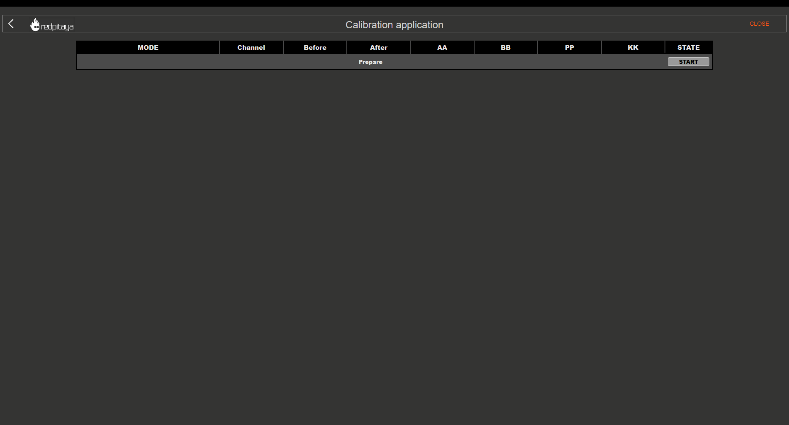
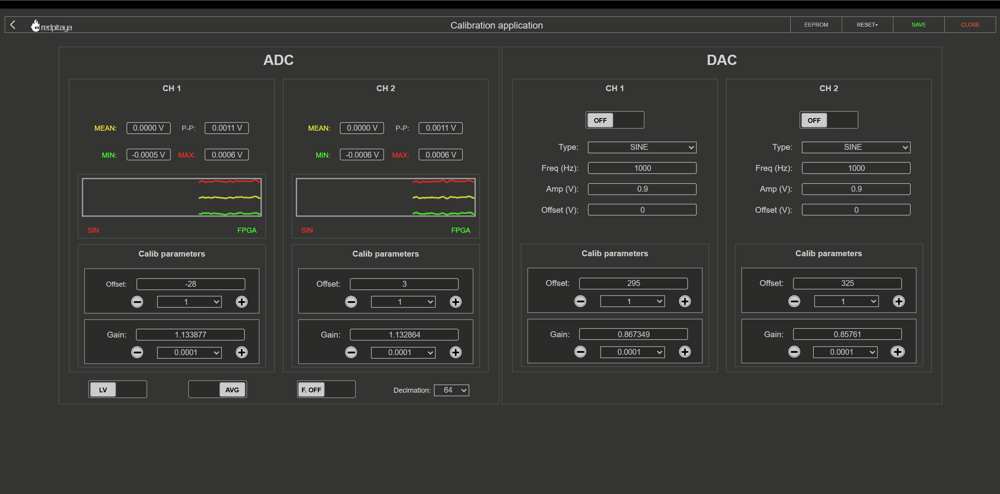
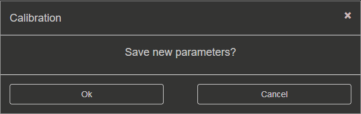
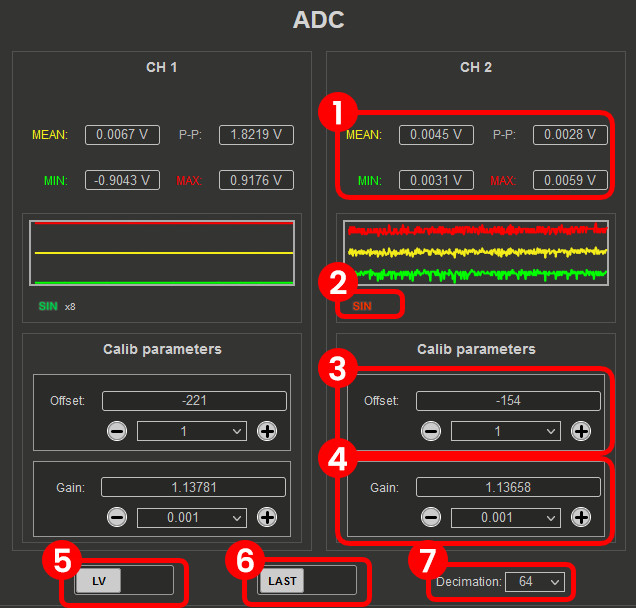
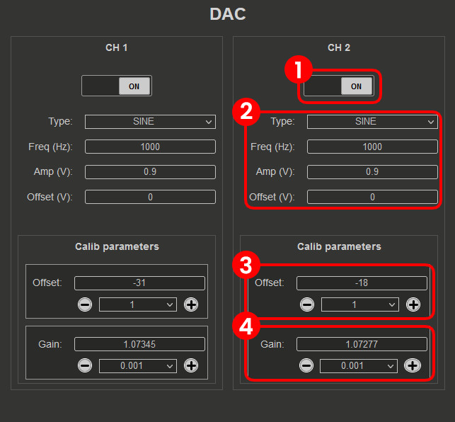

.. _dc_calibration:

##############
DC 校准
##############

.. contents:: 目录
    :local:
    :depth: 2
    :backlinks: top

|

**目的：** DC 校准修正 ADC 和 DAC 的 DC 偏移与增益误差，确保 DC 和低频下的电压测量与信号生成准确。

通过 DC 校准，可以微调 Red Pitaya 的 ADC 和 DAC，以补偿器件容差和漂移。

|

自动 DC 校准
====================

自动 DC 校准会逐步引导您完成校准流程，是我们推荐初学者使用的选项。

启动自动 DC 校准后，将显示以下窗口：

表头各列含义如下：

    * **MODE** - 校准流程的当前步骤，同时显示输入通道当前的跳线设置。
    * **Channel (CH1, CH2, etc.)** - 表示其下方列设置所适用的通道。
    * **Before and After** - 校准前后的测量值。
    * **Value** - 偏移和增益的新值。校准完成并点击 "DONE" 按钮后，这些值会应用到 **User zone**。
    * **STATE** - 显示校准流程的进度。

请注意 **STATE** 列，其中会出现用于推进流程的可点击按钮。

|

1. 频率均衡滤波器
---------------------------------

自动 DC 校准的第一步是将校准值重置为默认值。在此步骤中会出现提示，要求选择如何处理频率均衡滤波器。
可选项如下：

1. **旁路（推荐）** - 旁路频率均衡滤波器，实际上会在 DC 校准过程中禁用它。
2. **应用** - 在 DC 校准过程中应用频率均衡滤波器：

    * **禁用** - 在 DC 校准过程中禁用频率均衡滤波器。
    * **保留当前值** - 在 DC 校准过程中应用当前滤波器值。
    * **恢复默认设置** - 在 DC 校准过程中应用默认滤波器值。

为确保 DC 校准准确，应旁路或禁用频率均衡滤波器，因为它可能影响测量输入信号的幅度，尤其是峰峰值：

* **对于 OS 版本 2.07-44 及更高版本**，DC 校准流程会自动处理此步骤，您只需点击 "OK" 继续。
* **对于较旧的 OS 版本**，由于滤波器值会自动应用，请手动禁用频率校准滤波器。

.. note::

    第二次 DC 校准（频率校准之后）期间，应使用当前值或默认值应用频率均衡滤波器，以获得最佳准确度。

.. warning::

    **频率均衡滤波器** **仅适用于 Original Generation 板卡**。对于 Second Generation 板卡，改进的模拟前端设计不再需要频率均衡滤波器，因此可以忽略此步骤。

|

2. HV (1:20) 校准
-------------------------

此步骤校准跳线设置为 HV 位置的通道。请按照 **STATE** 列中的说明完成此步骤。

1.  **跳线设置** - 将跳线设置到 HV 位置。
#.  **ADC 偏移（1:20）** - 将所有输入通道连接到 GND，然后点击 "Calibrate" 按钮。校准将测量偏移误差并计算所需的修正值。

    .. figure:: img/Calib_DC_auto_HV_offset.png
        :align: center
        :width: 600

#.  **ADC 增益（1:20）** - 将所有输入通道连接到稳定的电压基准源（例如精密电源或电压基准 IC），输入基准电压，然后点击 "Calibrate" 按钮。校准将测量增益误差并计算所需的修正值。

    .. figure:: img/Calib_DC_auto_HV_gain.png
        :align: center
        :width: 600

.. note::

    对于 HV 校准，增益校准的基准电压应至少为 10 V（最大 ±20 V）。例如，可以使用能够在此范围内提供稳定电压的精密电源或电压基准 IC。

|

3. LV (1:1) 校准
-------------------------

4.  **跳线设置** - 将跳线切换到 LV 位置。
#.  **ADC 偏移（1:1）** - 将跳线切换到 LV 位置，把所有输入通道连接到 GND，然后点击 "Calibrate" 按钮。校准将测量偏移误差并计算所需的修正值。

#.  **ADC 增益（1:1）** - 将所有输入通道连接到稳定的电压基准源（例如精密电源或电压基准 IC），输入基准电压，然后点击 "Calibrate" 按钮。校准将测量增益误差并计算所需的修正值。

.. note::

    对于 LV 校准，增益校准的基准电压应至少为 0.5 V（最大 ±1 V）。例如，可以使用能够在此范围内提供稳定电压的精密电源或电压基准 IC。

|

4. DAC 校准
-----------------------

7.  **连接输出端** - 使用 SMA 电缆将输出端连接到输入端（IN1 连接 OUT1，IN2 连接 OUT2）。对于 Original Generation 板卡，请确保输出端连接 **50 Ω 端接器**，以获得准确校准结果。
#.  **DAC 增益** - 点击 DAC 增益行中的 "Calibrate" 按钮。校准会在输出端生成 ±0.9 V DC 信号，通过输入端测量该信号，并计算 DAC 增益所需的修正值。
#.  **DAC 偏移** - 点击 DAC 偏移行中的 "Calibrate" 按钮。校准会禁用 DAC，从而在输出端实际生成 0 V DC 信号，通过输入端测量该信号，并计算 DAC 偏移所需的修正值。
#.  **DAC 增益和偏移验证** - DAC 校准流程的第二和第三阶段会重新计算 DAC 增益和偏移校准（实际上重复前两个步骤），以验证应用的校准值正确并能提供准确测量。

|

5. 完成校准
-------------------------

完成 HV 和 LV 校准步骤后，点击 "DONE" 按钮将校准值保存到 **User zone**，并返回校准应用的起始界面。

6. 视频指南
----------------

.. note::

    以下视频基于旧版校准应用，因此界面可能有所不同。不过校准流程仍然相同，视频可作为校准流程的参考。

分步视频指南：

.. raw:: html

    

        <iframe src="https://www.youtube.com/embed/vLCa9oU7DMI" frameborder="0" allowfullscreen style="position: absolute; top: 0; left: 0; width: 100%; height: 100%;"></iframe>
    

YouTube 视频也可通过 |YT-video| 查看。

.. |YT-video| replace:: `此链接 <https://www.youtube.com/watch?v=vLCa9oU7DMI>`__

|

手动 DC 校准
======================

手动 DC 校准允许您手动执行校准并微调所有变量。除校准外，此选项还可帮助您识别测量线路中的寄生效应。

.. note::

    由于 **Original Generation 板卡**上的 DAC 输出阻抗为 **50 Ω**，校准期间应在输出端（DAC）连接 **50 Ω 负载**，以获得准确结果。

界面元素分为三个部分：

1. **设置菜单** - *APPLY* 校准参数、恢复 *DEFAULT* 参数、*DISABLE* 频率校准滤波器，或 *CLOSE* 手动 DC 校准。
2. **ADC 校准参数** - 修改 ADC 偏移和增益，选择电压范围（根据跳线设置选择 LV 或 HV），并观察电压测量值。
3. **DAC 校准参数** - 修改输出波形、频率、幅度和偏移，以及 DAC 偏移和增益。

|

1. 设置菜单
-----------------

设置菜单用于管理校准流程，选项如下：

1.  **EEPROM 信息** - 查看 EEPROM 中存储的 **Factory zone 和 User zone** 当前校准值。**Factory zone** 包含出厂设置的校准值，**User zone** 包含板卡当前使用的值。点击 "APPLY" 按钮保存校准值时会更新 **User zone**。

    校准版本和值在 :ref:`校准参数部分 <calib_params>` 中有更详细的说明。

    EEPROM 信息菜单还允许您将当前校准值**备份**到文件，并从之前保存的文件中**恢复**：

    * **备份** - 将 **Factory** 或 **User** 校准区保存为计算机上的二进制 ``.bin`` 文件。文件包含板卡型号、MAC 地址、创建时间戳和 MD5 校验和，以确保数据完整性。
    * **恢复** - 加载之前保存的 ``.bin`` 备份文件，并将校准参数写回 EEPROM。写入前会验证 MD5 校验和；如果文件损坏或被修改，恢复操作将被拒绝。

    这对于在 OS 更新后保留校准设置、快速恢复到已知正常状态或传输校准数据很有用。

    .. tip::

        收到板卡后以及每次成功重新校准后，应立即保存出厂校准备份。

    .. figure:: img/Calib_DC_EEPROM.png
        :align: center
        :width: 800
    
#.  **RESET** - 重置校准值。可选择两个选项：

    * **DEFAULT** - 将所有偏移值重置为 0，将增益值重置为 1。
    * **FACTORY** - 将板卡重置为出厂校准参数。如果出厂校准版本低于当前校准版本，则改为执行默认重置。

#.  **APPLY** - 将当前校准保存到 **User zone**。
#.  **CLOSE** - 关闭手动 DC 校准并返回上一级菜单。

不保存值而关闭应用时，会出现以下提示：

.. note::

    SDRlab 122-16 只能使用手动 DC 校准。由于 SDRlab 122-16 没有用于切换电压范围的跳线，并且因 AC 耦合只能生成正弦波形，因此其界面功能较少。

    .. figure:: img/Calib_DC_manual_sdr.png
        :align: center
        :width: 1200

|

2. ADC 校准参数
-------------------------------

1.  电压测量（平均值、最小值、最大值和峰峰值）。在图形中以对应颜色显示。
#.  **正弦波检测**。检测通道上是否存在正弦波。"x" 表示检测到的正弦周期数。
#.  **FPGA**。校准应用于 FPGA 内部时变为绿色（校准版本 6 及更高版本）。
#.  **ADC 偏移**。通过中间的数值修改偏移量，可从下拉菜单选择调整量。
#.  **ADC 增益**。通过中间的数值修改增益，可从下拉菜单选择调整量。
#.  **LV/HV**。选择校准电压范围，应与输入跳线设置一致。
#.  **LAST/AVG**。选择最近一次或平均电压测量值。校准推荐使用 AVG，因为测量更稳定；LAST 可用于实时观察修改效果。
#.  **抽取**。从下拉菜单选择抽取率。出厂校准使用 1024，快速校准可使用 64。较高抽取率会提供更准确的测量，但值更新需要更长时间；较低抽取率更新更快，但准确度较低。快速校准可使用 64 以加快流程，最终校准建议使用 1024 以获得最佳准确度。

|

3. DAC 校准参数
------------------------------

1.  **ON/OFF**。打开或关闭指定输出。输出打开时，将按指定设置生成波形；输出关闭时，将生成 0 V DC 信号。
#.  **DAC 设置**。修改输出波形（类型）、频率、幅度和偏移。
#.  **DAC 偏移**。使用中间数值旁的 + 或 - 按钮修改偏移（调整量可从下拉菜单选择），也可以手动编辑数值。
#.  **DAC 增益**。使用中间数值旁的 + 或 - 按钮修改增益（调整量可从下拉菜单选择），也可以手动编辑数值。

|
