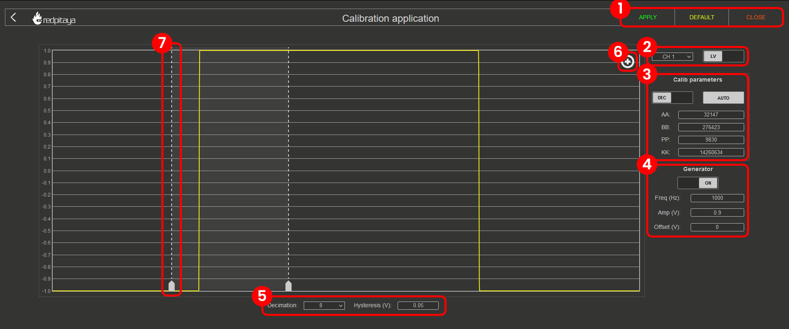

.. _frequency_calibration:

.. TODO: Screenshots in this page are outdated - update to new OS

######################
频率校准
######################

.. contents:: 目录
    :local:
    :depth: 2
    :backlinks: top

|

**用途：** 在 LV 和 HV 电压范围之间切换时，频率校准用于补偿模拟前端电阻和电容分压电路中的元件不匹配。
通过在 FPGA 中应用数字校正滤波器，可确保整个频谱范围内的幅度测量准确。

.. note::

    尽管理论上元件匹配可以消除频率校准的需要，但采用滤波器方案可以实现量产，同时保持合理的板卡成本、高精度和小型化外形。

|

自动频率校准
===========================

自动频率校准会逐步引导你完成校准流程，是我们为初学者推荐的选项。

**分步指南：**

启动自动频率校准后，将显示以下窗口：

.. figure:: img/Calib_freq_auto_start.png
    :align: center
    :width: 1200

表头各列含义如下：

    * **MODE** - 对应跳线的设置方式。
    * **Channel** - 表示后续列设置所适用的通道。
    * **Before and After** - 校准前后的数值。
    * **AA、BB、PP 和 KK** - FPGA 内部影响输入的滤波器系数。详情请参阅“手动频率校准”章节。
    * **STATE** - 显示校准过程的进度。

请注意 **STATE** 列，其中会出现用于推进流程的可点击按钮。

1.  **LV 校准**：

    .. figure:: img/Calib_freq_auto_LV.png
        :align: center
        :width: 1200

    * 点击“START”按钮将显示进一步说明，并可在内部和外部参考信号发生器之间进行选择：

    .. figure:: img/Calib_freq_auto_LV_int.png
        :align: center
        :width: 800

    * 如果没有外部参考信号发生器，请选择“INTERNAL”。Red Pitaya 将使用 OUT1 生成 0.9 Volt、1 kHz 的方波信号。
    * 将跳线设为 LV 位置，并使用 SMA 线缆和 T 型适配器将 OUT1 连接到 IN1 和 IN2。
    * 点击 Calibrate 按钮开始校准过程。

    .. figure:: img/Calib_freq_auto_LV_ext.png
        :align: center
        :width: 800

    * 配置外部参考信号发生器以产生 1 kHz 方波，并输入信号的“参考电压”（单向幅度）。
    * 将跳线设为 LV 位置，并使用 SMA 或 BNC 线缆及 T 型适配器，将外部发生器的输出连接到 Red Pitaya 的 IN1 和 IN2。
    * 点击 Calibrate 按钮开始校准过程。

2.  **LV 校准进行中**：

    .. figure:: img/Calib_freq_auto_LV_load.png
        :align: center
        :width: 1200

    请等待 LV 校准完成。

3.  **HV 校准**：

    .. figure:: img/Calib_freq_auto_HV.png
        :align: center
        :width: 1200

    * 将跳线切换到 HV 位置并选择发生器信号源。

    .. figure:: img/Calib_freq_auto_HV_int.png
        :align: center
        :width: 800

    .. figure:: img/Calib_freq_auto_HV_ext.png
        :align: center
        :width: 800

    * 对于 HV 校准，外部参考信号发生器的幅度应至少设置为 10 V（最大 ±20 V）。

4.  **HV 校准进行中**：

    .. figure:: img/Calib_freq_auto_HV_load.png
        :align: center
        :width: 1200

    * 请等待 HV 校准完成。

5.  **保存校准值**：

    .. figure:: img/Calib_freq_auto_save.png
        :align: center
        :width: 1200

6.  **完成校准**：

    .. figure:: img/Calib_freq_auto_complete.png
        :align: center
        :width: 1200

    * 点击“DONE”按钮将返回 Calibration 应用的起始界面。

|

手动频率校准
=============================

手动频率校准允许你手动执行校准并微调所有变量。除校准外，此选项还可用于识别测量线路中的寄生效应。

手动模式适用于希望完成以下操作的用户：

* 验证或微调自动生成的系数；
* 修复边沿响应已知不理想的通道；
* 补偿特定的测量设置；或
* 优化高于自动校准所用 1 kHz 方波参考频率的响应。

**界面元素：**

* **设置菜单** - 使用 *APPLY* 应用校准参数、恢复 *DEFAULT* 参数、使用 *DISABLE* 禁用频率校准滤波器，或使用 *CLOSE* 关闭手动频率校准。
* **通道与跳线设置** - 选择要校准的通道和电压范围（根据跳线设置选择 LV 或 HV）。
* **校准参数** - 在 *DEC* 和 *HEX* 值之间选择，点击 *AUTO* 执行自动频率校准，并输入 FPGA 滤波器系数（AA、BB、PP、KK）。
* **发生器设置** - 将内部发生器（OUT1）设为 *ON* 或 *OFF*。频率、单向幅度和偏移不可更改。
* **抽取率与迟滞** - 更改抽取率和迟滞。
* **边沿缩放** - 放大方波边沿，以便更好地校准。
* **光标** - 可移动光标观察正向或负向边沿，光标之间的白色区域表示放大区域。

有关 FPGA 滤波器系数的技术细节，请参阅 :ref:`技术参考章节 <fpga_filter_math>`。

| 

手动调谐流程
----------------------

频率均衡滤波器是 ADC 之后在 FPGA 中应用的数字校正滤波器，用于补偿每个通道和增益路径的模拟前端响应。

手动调谐时，四个系数的重要性并不相同：

* **AA** 和 **BB** 是主要均衡系数，主要决定阶跃响应的形状，因此对过冲、下冲、振铃和稳定过程影响最大。
* **PP** 是次级极点，主要用于在 **AA** 和 **BB** 已接近合适值后微调剩余幅度和残余稳定误差。
* **KK** 是整体缩放项，通常最后使用，作为最终增益微调。

实际使用时，建议按以下顺序操作：

1. 从当前或默认系数集开始；
#. 观察方波边沿并同时调节 **AA** 和 **BB**；
#. 使用 **PP** 校正剩余幅度误差；
#. 仅使用 **KK** 进行最终增益校正。

| 

手动调谐分步流程
------------------------------------

以下流程适用于 LV 或 HV 校准。请针对每个通道和每条增益路径分别重复执行。

1.  **准备板卡**

    * 打开 *Calibration* 应用并选择 **Manual Frequency Calibration**。
    * 选择要校准的通道。
    * 将输入跳线设置为正确的增益范围（**LV** 或 **HV**），并在应用中选择相同范围。
    * 如果校准的是 Original Generation 板卡，请使用与实际测量设置相同的阻抗条件。如果设置通常使用 50 Ω 端接，校准时也应保持该端接。

2.  **连接方波参考信号**

    * 如需快速建立基线，请打开内部发生器 **ON**，并将 **OUT1** 连接到所选输入。
    * 为获得最佳重复性，请使用干净的外部方波发生器。
    * **LV** 模式使用约 **0.9 V 单向幅度**，**HV** 模式使用至少 **10 V**。
    * 从 **1 kHz** 开始，这是自动校准使用的相同参考频率。

3.  **加载安全起点**

    * 如果通道之前已校准，请从当前值开始并记录这些值。
    * 如果响应严重失真，请先点击 **AUTO** 或恢复默认值，然后返回手动模式。
    * 如果希望暂时移除均衡效果，请使用 :ref:`禁用频率校准滤波器 <disable_frequency_filter>` 中所述的禁用滤波器值。

4.  **设置显示以检查边沿**

    * 启用 **Edge zoom**。
    * 将光标定位在一个跳变边沿附近，使上升沿或下降沿填满大部分放大区域。
    * 调整 **Decimation** 和 **Hysteresis**，直到边沿稳定，且在改变系数时便于比较。

5.  **首先调节 AA 和 BB**

    * 以小步长改变 **AA** 和 **BB**。
    * 每次改变后，等待显示波形稳定并比较边沿形状。
    * 目标是最小化：

      * 高于最终值的过冲；
      * 低于最终值的下冲；
      * 跳变后的振铃；以及
      * 缓慢稳定到最终平台。

    * 实用规则是：在趋势明确前一次只移动一个参数，然后交替对 **AA** 和 **BB** 进行更小幅度的调整。

6.  **使用 PP 微调幅度和残余稳定误差**

    * 边沿形状接近理想后，调整 **PP**。
    * 使用 **PP** 校正剩余幅度误差，并减少 **AA** 和 **BB** 调整后残留的少量边沿失真。
    * 如果改变 **PP** 导致边沿形状明显变差，请恢复之前的值，改用更小幅度的 **AA/BB** 调整。

7.  **使用 KK 进行最终增益校正**

    * 边沿形状和稳定性达到要求后，调整 **KK**，使测得的幅度与参考信号匹配。
    * **KK** 通常应最后调整，因为它会缩放整个响应，但不会改善基本的边沿校正。

8.  **应用并保存结果**

    * 点击 **APPLY** 将数值写入用户校准区域。
    * 如有需要，对每个通道以及 **LV** 和 **HV** 两种模式重复相同流程。

| 

波形异常时的调整方法
--------------------------------------------

确切的最佳调整方向取决于板卡和通道，但调谐时以下经验规则很有用：

* **过大的过冲或振铃**通常表示均衡过强。首先降低 **AA/BB** 校正强度，然后重新检查边沿。
* **圆钝或缓慢的边沿**通常表示均衡过弱。逐步增加 **AA/BB** 校正，直到边沿变陡且不引入过多振铃。
* **边沿形状正确但幅度错误**通常是 **PP** 或 **KK** 的问题。先尝试 **PP**，最后使用 **KK**。
* **低频幅度正确但高频响应较差**通常表示边沿整形系数 **AA** 和 **BB** 仍需改进。

如果某项更改使波形在各方面都变差，请立即恢复该更改，并继续使用更小步长调整。

| 

高于 1 kHz 的手动校准
-------------------------------

自动校准使用 **1 kHz 方波**，因为它能提供稳定且可重复的阶跃响应，用于寻找基本均衡系数。这并不意味着滤波器仅在 1 kHz 下有效。
方波边沿包含高频成分，因此 1 kHz 参考信号主要作为优化瞬态响应的便利方式。

对于要求在更高频率下获得最佳精度的应用，请采用以下两阶段方法：

1.  **首先在 1 kHz 下建立稳定基线**

    * 在 1 kHz 下执行自动校准或手动边沿调谐。
    * 将得到的系数集保存为该通道和增益路径的基线。

2.  **然后在目标频率范围内手动优化**

    * 将 1 kHz 方波替换为设置在实际工作范围附近一个或多个频率上的外部发生器信号。
    * 检查幅度平坦度时优先使用正弦波，检查边沿形状和振铃时使用方波。
    * 在预期工作带宽内的多个点进行测量，例如低频、中频和高频。

建议的优化顺序是：

1. 首先保持 **KK** 不变；
#. 观察幅度和形状仍可靠的最高频率波形，并略微调整 **AA** 和 **BB**；
#. 重新检查低频点，确认校正没有变得过强；
#. 使用 **PP** 微调整个频带内剩余的幅度误差；
#. 使用 **KK** 进行最终的整体增益校正。

换言之，如果板卡将用于远高于 1 kHz 的频率，应将 1 kHz 校准视为起点，而不是最终依据。

.. note::

    针对最干净的 1 kHz 方波边沿优化的系数集，与针对带宽上限处最小幅度误差优化的系数集略有不同是正常现象。最佳选择取决于应用更重视瞬态保真度、幅度平坦度，还是两者兼顾。

.. tip::

    进行高频优化时，应在更改任何系数前记录多个频率下的幅度误差。然后一次只更改一组系数，并再次比较完整的测量结果。这可以避免优化某个频率点却使频带其余部分变差。

| 

建议的高频验证流程
---------------------------------------------

手动调谐后，使用外部发生器验证结果：

1. 在预期工作带宽内的多个频率上施加正弦波。
#. 记录校准通道上的测量幅度。
#. 将其与发生器设置值或可信的参考仪器进行比较。
#. 在工作带宽上部附近使用方波重复测试，检查是否重新出现过冲或振铃。
#. 如有需要，返回手动模式，以保存的基线为基础进行小幅修正。

当校准是针对窄带高频应用而非通用示波器用途进行优化时，此验证步骤尤其重要。

|

.. _disable_frequency_filter:

禁用频率校准滤波器
=======================================

要禁用频率校准滤波器，请执行以下步骤：

1.  从 *System Tools* 菜单打开 Calibration 应用。
2.  点击 **Manual Frequency Calibration** 选项。
3.  点击设置菜单中的 **Disable** 按钮。对每个输入通道和每个电压范围（LV 和 HV）重复此过程。
4.  如果使用旧版 OS 界面，可以输入以下校准参数来禁用频率校准滤波器：

    * AA = 0
    * BB = 0
    * PP = 0
    * KK = 16777215（十六进制为 0xFFFFFF）

.. note::

    这些值实际上会创建一个没有相位校正的单位增益滤波器，效果等同于旁路频率校准。

|

.. _fpga_filter_math:

技术参考
===================

FPGA 滤波器数学
-----------------------

频率校准使用 FPGA 中实现的数字滤波器来补偿模拟元件不匹配。该滤波器由四个系数定义：**AA**、**BB**、**PP** 和 **KK**。

从功能上看，该滤波器可解释为：

* 一个由 **BB** 控制的零点；
* 两个由 **AA** 和 **PP** 控制的递归极点；
* 四个采样点的流水线延迟；以及
* 一个由 **KK** 控制的整体增益项。

因此 **AA** 和 **BB** 主导边沿形状，而 **PP** 和 **KK** 通常在后续作为校正项使用。

**滤波器传递函数：**

.. math::

    H[z] = \frac{K \cdot (z - B)}{z^4 \cdot (z - P) \cdot (z - A)}

|

**其中：**

* :math:`K = \frac{KK}{2^{24}}`
* :math:`B = 1 - \frac{BB}{2^{28}}`
* :math:`P = \frac{PP}{2^{16}}`
* :math:`A = 1 - \frac{AA}{2^{25}}`

系数摘要：

* **AA** - 主极点项，主要影响稳定时间和振铃。
* **BB** - 零点项，主要影响高频预加重和边沿锐度。
* **PP** - 次级极点项，主要用于幅度微调和残余稳定调整。
* **KK** - 整体增益缩放项。

**MATLAB 仿真代码：**

以下 MATLAB 代码用于仿真 FPGA 滤波器的频率响应：

.. code-block:: matlab
    
    clc
    close all
    clear

    % Filter parameters %
    aa_hex = '7D93'
    bb_hex = '437C7'
    pp_hex = '2666'
    kk_hex = 'D9999A'

    aa = hex2dec(aa_hex)
    bb = hex2dec(bb_hex)
    pp = hex2dec(pp_hex) 
    kk = hex2dec(kk_hex)

    % H[z]=K*(z-B) / (z^4*(z-P) * (z-A))
    % where:
    % K = KK / 2^24
    % B = 1 - (BB / 2^28)
    % P = PP / 2^16
    % A = 1 - (AA / 2^25)

    fs = 125e6;
    f = 0:1e3:fs;

    z = exp(j*2*pi*f/fs);

    k = kk/(2^24);
    b = 1-(bb/2^28);
    p = pp/2^16;
    a = 1-(aa/2^25);

    h = k*(z-b)./(z.^4.*(z-p).*(z-a));

    % Figure
    % plot(f,20*log10(abs(h)))
    figure
    semilogx(f, 20*log10(abs(h)))
    title(strcat('Frequency response for AA=',aa_hex,' BB=',bb_hex,' PP=',pp_hex,' KK=',kk_hex))
    xlabel('frequency (Hz)')
    ylabel('gain (dB)')

|
