.. _network_manager:

###############
网络管理器
###############

网络管理器是用于配置 Red Pitaya 板卡网络设置的工具。

要打开网络管理器应用，请点击 **系统工具**，然后选择 **网络管理器**。

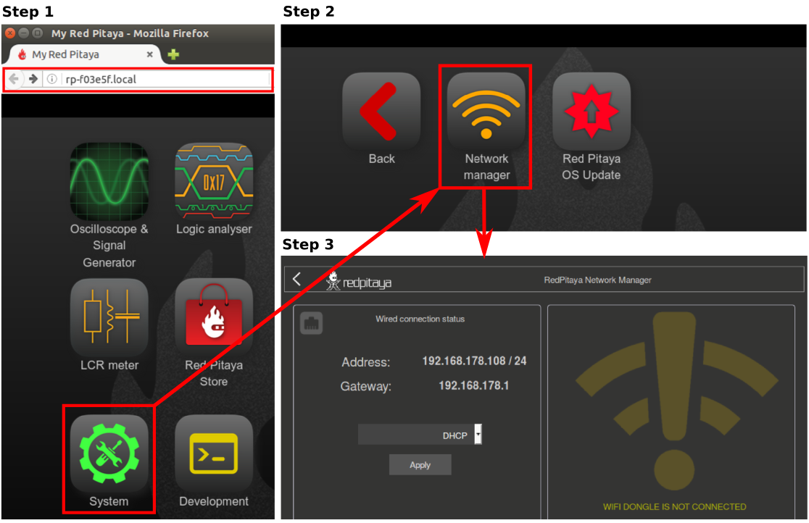

我们建议使用网络管理器应用配置 Red Pitaya 连接设置。不过，仍然可以 :ref:`手动建立连接 <network>`。

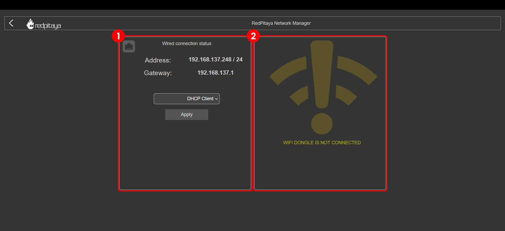

网络管理器界面分为两个部分：

1. **有线连接状态** - 显示有线连接（LAN）的状态以及分配给 Red Pitaya 板卡的 IP 地址。
2. **无线连接状态** - 显示无线连接（WiFi）的状态以及分配给 Red Pitaya 板卡的 IP 地址。

如果两种连接中的任一种不可用，相应设置也将不可用，并显示连接不存在的警告（见上图）。

每种连接的设置及其配置说明都会显示出来。

您可以通过以下方式连接到 Red Pitaya 板卡：

.. contents::
    :local:
    :depth: 2
    :backlinks: none

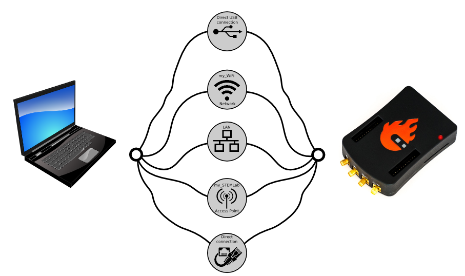

    Red Pitaya 板卡网络连接选项。

.. note::

    **Windows 7/8** 用户应安装 :rp-download:`Bonjour Print Services <tools/BonjourPSSetup.exe>`，否则无法访问 ``*.local`` 地址。

    Windows 10 或更高版本已支持 mDNS 和 DNS-SD，无需安装其他软件。

.. note::

    Red Pitaya 板卡在以下情况下需要访问互联网：

    * 通过 OS 更新应用更新 OS。
    * 从应用市场安装应用。

.. warning::

    将板卡连接到包含多个路由器、交换机或防火墙的复杂网络，或具有增强安全层的网络（例如每个用户都必须通过专用登录页面登录的大学网络）时，可能会遇到连接问题。
    此时建议在 Red Pitaya 板卡与 PC 之间建立直接连接，或联系网络管理员寻求帮助。

|

1. 有线连接
============

有线连接状态显示 Red Pitaya 板卡当前的 IP 地址、子网掩码和网关。有线连接通过连接到路由器或直接连接到 PC 以太网插口的以太网电缆建立。

有三种可能的工作模式：

*   DHCP 客户端（默认模式） - Red Pitaya 等待路由器（DHCP 服务器）自动分配 IP 地址。分配 IP 地址后，Red Pitaya 板卡即可在本地网络中使用。如果启动后 1 分钟内未收到 IP 地址，则会进入 DHCP 服务器模式。
*   DHCP 服务器 - Red Pitaya 充当 DHCP 服务器，为自身及连接到同一网络的其他设备分配 IP 地址。
*   静态 IP - Red Pitaya 使用指定的静态 IP 地址。

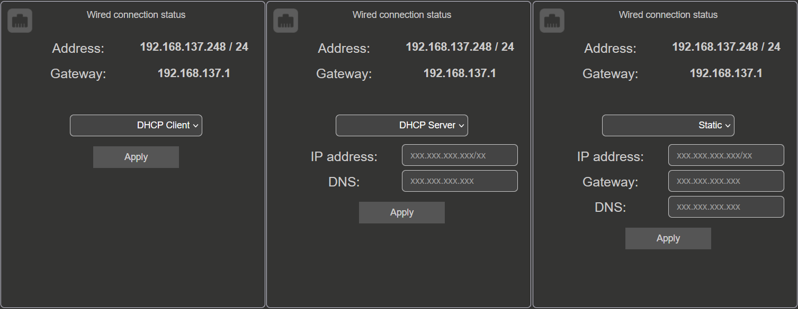

    Red Pitaya 板卡网络连接选项。

|

.. _LAN:

局域网（LAN）
-------------------------

我们建议 Red Pitaya 板卡使用局域网（LAN）连接。LAN 连接通过连接到路由器或直接连接到 PC 以太网插口的以太网电缆建立。Red Pitaya 板卡会从路由器（DHCP 服务器）自动获取 IP 地址，并可在本地网络中使用。您可以在 Web 浏览器中通过 URL ``rp-xxxxxx.local/`` 访问 Red Pitaya 板卡。

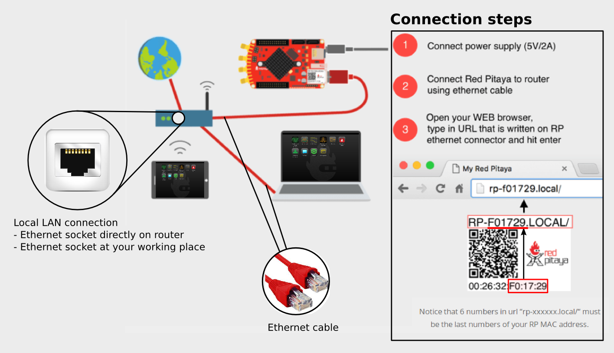
    
    将 Red Pitaya 板卡连接到 LAN 网络。

1.  将电源和以太网电缆连接到 Red Pitaya 板卡。
#.  将 Red Pitaya 板卡连接到路由器，或直接连接到 PC 以太网插口。
#.  打开 Web 浏览器（推荐 Google Chrome），在 URL 栏中输入 ``rp-xxxxxx.local/``。其中 ``xxxxxx`` 是 Red Pitaya 板卡 MAC 地址的后 6 个字符，MAC 地址标注在以太网连接器上。

    .. figure:: img/Main-web-interface.png
        :width: 1000

        Red Pitaya 主页面用户界面。

要设置局域网（LAN）连接，请在网络管理器应用中将模式设置为 **DHCP 客户端**。

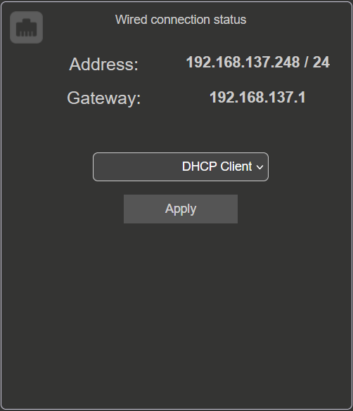

|

.. _dir_cab_connect:

直接以太网电缆连接与 DHCP 服务器
-------------------------------------------------

第二种方式是使用以太网电缆将 Red Pitaya 板卡直接连接到 PC。没有路由器，或希望不经过路由器建立直接连接时（例如使用 Wi-Fi 连接的笔记本电脑），此方式很有用。

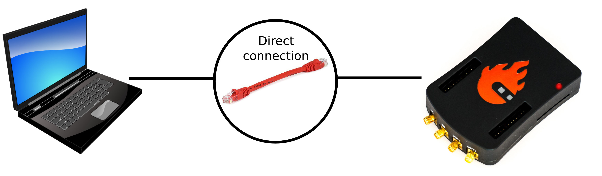

    Red Pitaya 板卡与 PC 之间的直接以太网连接。

1.  在 **Linux** 中打开 **网络设置**，进入 **编辑连接**，并在 *LAN 网络 IPv4 设置* 下选择 **共享给其他计算机**。
#.  将以太网电缆从 PC 插入 Red Pitaya 板卡，等待约 2 分钟。
#.  打开 Web 浏览器（推荐 Google Chrome），在 URL 栏中输入 ``rp-xxxxxx.local/``。其中 ``xxxxxx`` 是 Red Pitaya 板卡 MAC 地址的后 6 个字符，MAC 地址标注在以太网连接器上。
#.  如果 Web 界面无法打开，请尝试使用命令行 ping Red Pitaya 板卡。打开命令行并输入：

    .. code-block:: bash

        ping rp-xxxxxx.local

要设置 DHCP 服务器模式，请输入以下设置：

    * ``<IP address>/<subnet prefix>`` （subnet prefix == 子网掩码中的有效位数）。
    * ``<DNS>`` 服务器。

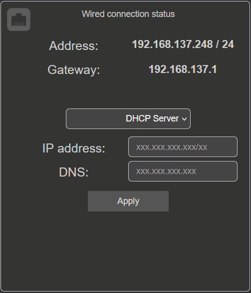

.. note::

    **Linux 和 macOS**
        
    如果直接以太网连接无法工作，请检查以太网连接器是否启用了 DHCP。如果 **共享给其他计算机**模式不起作用，请尝试使用 **仅本地**。

    如果 ping 板卡后问题仍然存在，请尝试在 **PC** 上**禁用 WiFi** 连接（如果已启用），并**重置 Red Pitaya** 板卡（关闭再打开电源）。如果问题仍未解决，可以尝试下述 :ref:`静态 IP 配置 <static_ip>`。

.. _static_ip:

静态 IP 配置
-------------------------

要设置 **静态 IP** 模式，必须先建立 LAN 连接，然后才能配置网络管理器设置。

1.  按照 :ref:`LAN 连接 <LAN>` 说明将 Red Pitaya 板卡连接到 LAN 网络。

#.  在网络管理器应用的 **有线连接状态** 下选择 **静态**选项。输入以下数据并点击 **应用**：

    * ``<IP address>/<subnet prefix>`` （subnet prefix == 子网掩码中的有效位数）。
    * ``<Gateway>`` （路由器 IP）。
    * ``<DNS>`` 服务器。

    .. figure:: img/wired-settings-static-IP.png
        :width: 400

    更多信息请参阅 |wiki-subnet| 和 |wiki-ip-address|。

#.  虽然界面没有任何变化，Red Pitaya 会自动切换到静态 IP 地址。

#.  打开新的浏览器窗口，在 URL 栏输入新的 IP 地址，以测试连接。

    .. figure:: img/connection-static-IP.png
        :width: 800

|

将直接以太网连接与静态 IP 结合使用
-----------------------------------------------------

将直接以太网连接与静态 IP 结合使用时，PC 可能需要一些额外设置。下面以 Ubuntu 14.04 为例，其他操作系统中的步骤也非常相似。

以下是在 **Ubuntu 14.04** 上配置直接以太网连接的步骤（其他操作系统中的步骤也非常相似）：

1. 在计算机上启动网络管理器。

#. 添加新的以太网连接。

    .. figure:: img/static-IP-comp1.png
        :width: 400

#. 选择“以太网”连接，然后点击“创建”按钮。

    .. figure:: img/static-IP-comp2.png
        :width: 400

#. 选择新以太网连接的名称。

    .. figure:: img/static-IP-comp3.png
        :width: 400

#. 选择“方式 - 手动”，点击“添加”按钮，然后输入：

    * PC 的 ``static IP address`` （必须不同于 Red Pitaya 板卡的 IP 地址）。
    * ``Netmask`` （通常为 ``255.255.255.0`` ）。
    * ``Gateway`` （可留空）。
    * ``DNS servers`` （可留空）。

    .. figure:: img/static-IP-comp4.png
        :width: 400

#. 点击“保存”按钮。

完成这些设置后，用以太网电缆连接 Red Pitaya 板卡与 PC，打开 Web 浏览器，在浏览器 URL 栏中输入所选 Red Pitaya 板卡静态 IP（本例为 ``192.168.0.15``），然后按 Enter。

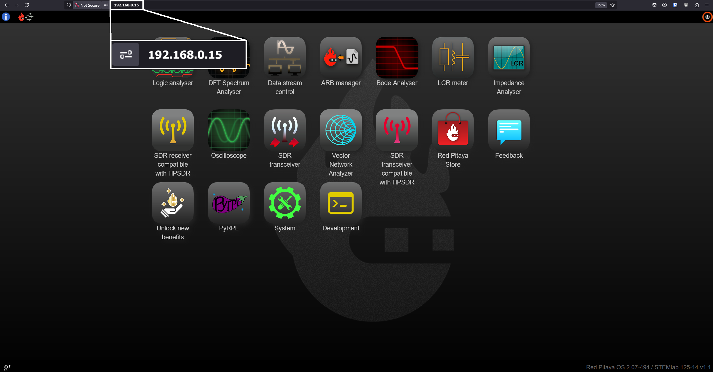

|

.. _wireless:

2. 无线连接
============

要使用无线连接，必须将 Wi-Fi 网卡连接到 Red Pitaya 的 USB 端口。某些板卡可能需要 USB-A 转 USB-C 适配器。Wi-Fi 网卡必须受 Red Pitaya OS 支持，但也可以修改 Linux 内核以支持其他 Wi-Fi 网卡。下面简要介绍不同 Red Pitaya OS 版本支持的 Wi-Fi 网卡：

.. tabs::

    .. tab:: OS 3.00 及更高版本

        建议使用 TP-Link 的 **Archer T3U AC1300** Wi-Fi 网卡，该网卡使用 RTL8812BU 芯片组。
        另外，使用 **RTL8812BU 芯片组**的任意 Wi-Fi 网卡都应可以工作。也支持 **RTL8188CUS 芯片组**。
    
    .. tab:: OS 2.07-51 及更早版本

        建议使用 :rp-web:`我们网上商店提供的 Wi-Fi 网卡 <product/red-pitaya-wi-fi-dongle/>`。
        通常，所有基于 RTL8188CUS 芯片组的 Wi-Fi 网卡都应可以工作。

    .. tab:: OS 1.04 及更早版本

        旧版 OS 主要支持 Edimax EW-7811Un V2 Wi-Fi 网卡，但如今可能难以购买。
        通常，所有基于 RTL8188CUS 芯片组的 Wi-Fi 网卡都应可以工作。

.. note::

    :ref:`支持的 Wi-Fi 适配器列表 <support_wifi_adapter>`。

无线连接状态显示：

* ``Mode of operation`` （无线或接入点）。
* Wi-Fi 网络的 ``SSID``。
* Red Pitaya 板卡的 ``IP address``。

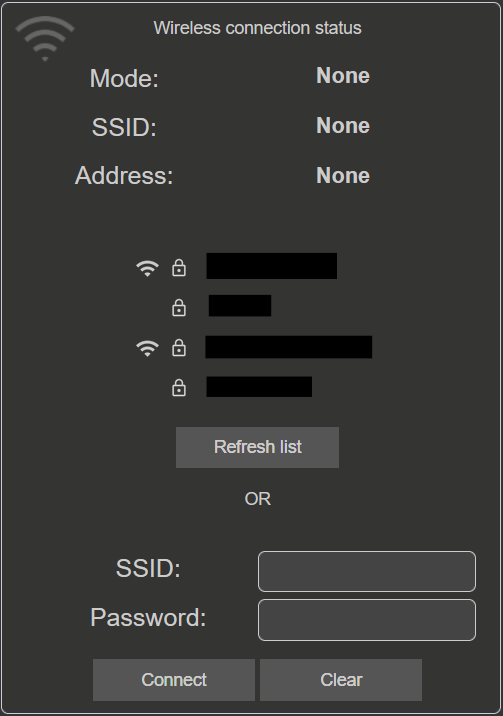

|

无线网络连接
----------------------------

要在 Red Pitaya 上设置 Wi-Fi 接口，必须先建立 :ref:`LAN 连接 <LAN>` 或 :ref:`直接以太网连接 <dir_cab_connect>`。

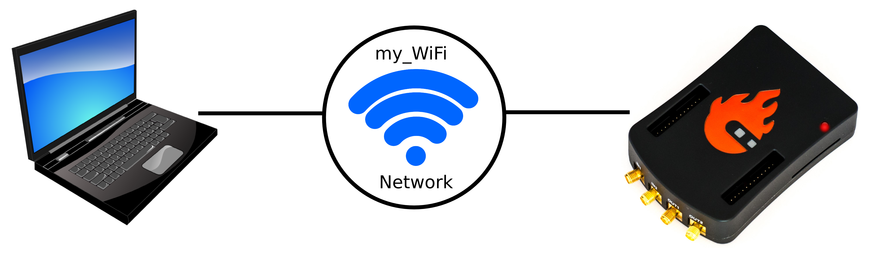

通过 Wi-Fi 网络连接 Red Pitaya 板卡的步骤：
 
1.  连接到 Red Pitaya Web 界面并打开 *网络管理器* 应用。

    .. figure:: img/instructions-connect.png
        :width: 800

#.  将 Wi-Fi 网卡插入 Red Pitaya 板卡的 USB 端口。系统会自动识别网卡，并在 Web 界面右侧启用**无线状态设置**。

    .. figure:: img/wireless-settings-wifi.png
        :width: 600

#.  选择所需的 Wi-Fi 网络，输入密码并点击“连接”按钮。如果列表中没有该 Wi-Fi 网络，可以手动输入其 SSID 和密码，或点击“刷新列表”重新扫描可用网络。

    .. figure:: img/Instructions-wifi.png
        :width: 600

#.  Red Pitaya 板卡会自动连接到所选 Wi-Fi 网络。连接过程可能需要几秒钟。连接后，Red Pitaya 板卡的 IP 地址会显示在**无线连接设置**中。如果界面未自动更新，可以刷新 Web 浏览器页面。

#.  在 Web 浏览器 URL 栏中输入 Wi-Fi IP 地址并按 Enter，以检查连接。
   
    .. figure:: img/connection-wifi-IP.png
        :width: 1000

#.  断开 Red Pitaya 板卡上的 LAN 电缆。然后打开新的浏览器窗口，在 URL 栏中输入 Wi-Fi IP 地址或 .local 地址（``rp-xxxxxx.local/``）。其中 ``xxxxxx`` 是 Red Pitaya 板卡 MAC 地址的后 6 个字符，MAC 地址标注在以太网连接器上。

#.  重启 Red Pitaya 板卡，然后重新测试连接。Red Pitaya 应会自动连接到所选 Wi-Fi 网络。

.. note::
    
    Wi-Fi 网络通常不如有线连接稳定，因此某些应用的性能可能会下降。

|

.. _access_point_mode:

接入点模式（当前不支持）
-------------------------------------------

没有 LAN 或 Wi-Fi 网络可用时，Red Pitaya 可以充当接入点，使 PC、笔记本电脑、平板电脑或智能手机能够通过 Wi-Fi 直接连接到 Red Pitaya。

要设置接入点模式，必须先通过 :ref:`LAN 连接 <LAN>` 或 :ref:`直接以太网连接 <dir_cab_connect>` 与板卡建立连接。

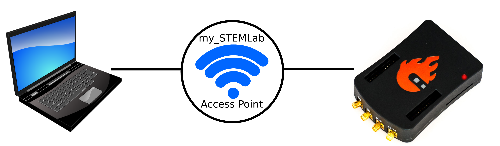

设置接入点模式的步骤如下：

1.  使用 :ref:`LAN 连接 <lan>` 连接 Red Pitaya 板卡，并打开 *网络管理器* 应用。
#.  将 Wi-Fi 网卡插入 Red Pitaya 板卡的 USB 端口。系统会自动识别网卡，并在 Web 界面右侧启用**无线状态设置**。
#.  从下拉菜单中选择*接入点模式*。
#.  输入名称和密码以创建接入点网络。密码至少应包含 8 个字符，不允许使用特殊字符。接入点网络名称可以任意设置，但建议使用容易记忆的名称。
#.  断开 Red Pitaya 板卡上的 LAN 电缆。板卡会自动切换到接入点模式，并使用上一步指定的名称创建新的 Wi-Fi 网络。

    .. figure:: img/instructions-access-point.png
        :width: 800

#.  将 PC、笔记本电脑、平板电脑或手机连接到 Red Pitaya 板卡创建的网络。
#.  在 Web 浏览器 URL 栏中输入接入点网络 IP 地址，然后按 Enter。
    
.. note::

    每次启动时都会自动激活接入点，直到在网络管理器应用中将其禁用。
    
    Red Pitaya 在接入点模式下的 IP 地址始终为：``192.168.128.1``。

.. note::

    尽管接入点模式当前已禁用，但有用户报告称可以通过修改 Red Pitaya OS 启用该模式。

|

.. _manual_network_configuration:

3. 手动配置
========================

如果不使用 Web 界面或网络管理器应用，也可以通过 :ref:`SSH <ssh>` 或 :ref:`串行控制台 <console>` 使用命令行界面（CLI）手动配置 Red Pitaya 板卡的网络设置。

底层网络模板存储在 ``/etc/systemd/network/`` 目录中。

对于有线连接，运行时配置文件存储在 FAT 分区中，路径如下：

* ``/etc/systemd/network/wired.network`` - 有线连接设置。

对于 Wi-Fi，运行时配置文件存储在 FAT 分区中，路径如下：

* ``/opt/redpitaya/wpa_supplicant.conf`` - Wi-Fi 客户端模式凭据。
* ``/opt/redpitaya/hostapd.conf`` - Wi-Fi 接入点模式设置。

系统会根据这些文件是否存在选择活动无线模板，相关说明见 :ref:`网络 <network>` 指南。有关完整的 systemd-networkd 和服务流程，请参阅 :ref:`无线设置章节 <wireless_setup>`。
