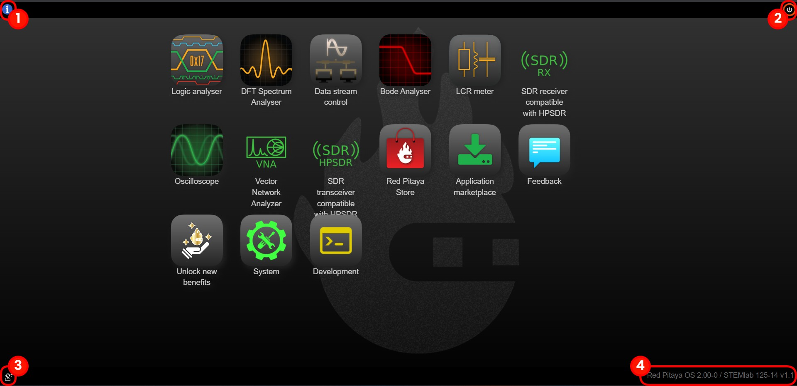
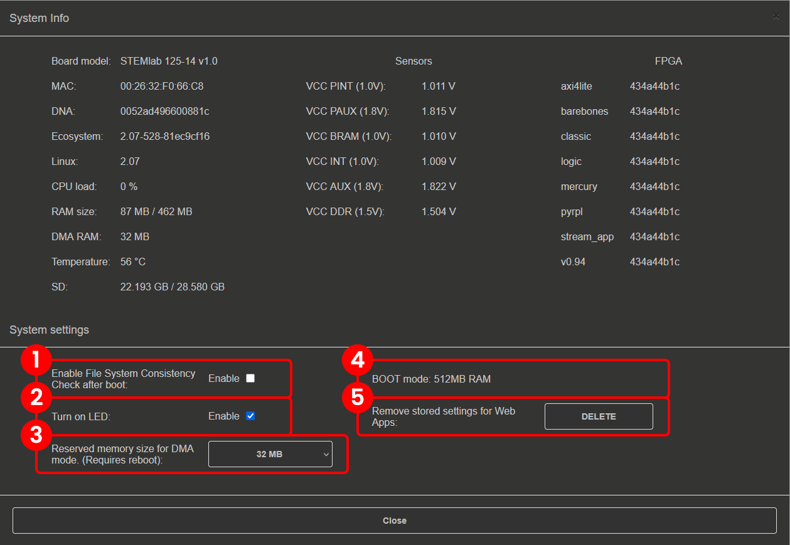
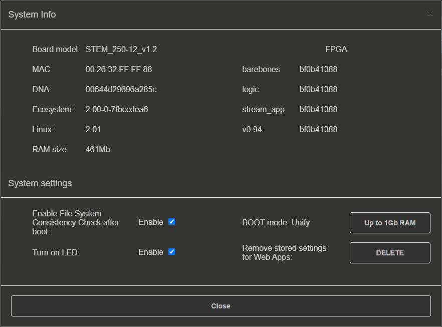
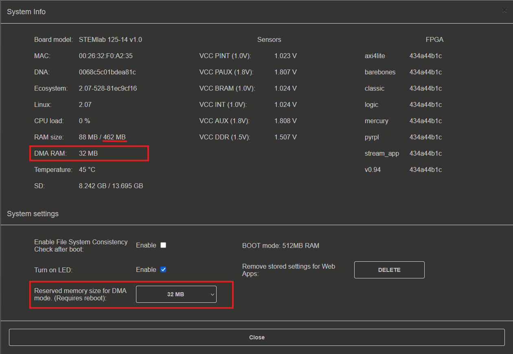

.. _system_info:

###############
系统信息
###############

Red Pitaya Web 界面的四个角落有以下小组件：

1. **常规系统信息按钮：** 包含可打开/关闭的可选功能。更多信息请参见下文。
2. **电源按钮：** 手动对板卡执行 *Power Off* 或 *Reboot*。
3. **下载系统错误报告：** 下载包含开发人员所需信息的 .zip 文件。请将其与问题描述一起附加到支持邮件中。报告应在约 15 秒后下载。
4. **当前 OS 和生态系统版本：** 点击后跳转到 :ref:`软件更新工具 <software_update_manager>`。启动时，Red Pitaya 会检查软件更新；如果有新版本，此处会显示黄色感叹号。

.. note::

    从 OS 3.00 开始，如果 EEPROM 包含无效校准值，常规系统信息按钮上会显示**警告图标**。如果看到此图标，请重新安装 :ref:`最新 OS 版本 <prepareSD>`，并执行 :ref:`出厂校准重置 <calibration_app>`。如果问题仍然存在，请 :ref:`联系我们 <report_problem>`。

.. note::

    nightly 构建的生态系统版本标记为 2.00-0，如上图所示。

|

常规 OS 和生态系统信息
=================================

点击 Info 按钮后，会显示以下设置：

**System Info** 部分显示 *Board model*、*MAC address*、*DNA number* 等常规信息。

**System Settings** 部分包含以下选项：

    1.  **Boot-up File consistency check：** 选中后，启动期间会检查 SD 卡文件系统，从而增加总体启动时间。
    #.  **Turn ON LED：** 选中后，启用红色（Heartbeat）和橙色（SD 卡读取）LED。
    #.  **BOOT mode：** 具有 1 GB RAM 的板卡（SIGNALlab 250-12 和 STEMlab 125-14 PRO Z7020 Gen 2）在此处有一个 **1 GB RAM** 按钮（见下图）。切换该按钮可在 1 GB 和 512 MB RAM 之间切换。更改 RAM 大小需要重启。
    #.  **Restore default app settings：** 将所有已保存的应用设置恢复为默认值。
    #.  **DMA reserved memory size：** 用于选择 :ref:`深度存储模式 <deepMemoryMode>` 保留内存大小的内存管理器。从下拉菜单中选择保留内存量，默认值为 32 MB。更改保留内存大小需要重启。

        .. note ::

            要手动更改 DMA 保留内存大小，请参见 :ref:`DMM 下的更改保留内存章节 <deepMemoryMode>`。

    #.  **Clock Rate：** 允许输入高精度的自定义外部时钟采样率（单位为 MHz，例如 80.12345678 MHz）。此设置会覆盖板卡配置文件中存储的默认软件时钟速率。设置后，PS 侧的所有应用和模块都会使用此值而不是默认值。这对于使用外部时钟源的板卡（例如 SDRlab 122-16 Ext Clk）尤其有用，因为实际采样率可能不同于 OS 采用的标称速率。留空或设置为 0 可使用配置文件默认值。

    SIGNALlab 250-12 的系统信息。

.. note::

    对于具有 1 GB RAM 的板卡（SIGNALlab 250-12 和 STEMlab 125-14 Pro Z7020 Gen 2），*Sensors* 部分显示的预期 VCCDDR 电压为 1.35 V；其他板卡为 1.5 V。

DMM 内存管理器
--------------------

:ref:`深度存储模式 <deepMemoryMode>` 内存管理器可以直接从 *OS info settings* 自动调整 RAM 保留内存区域大小，方式类似于 :ref:`DMM 更改保留内存章节 <DMM_change_reserved_memory>` 中介绍的手动调整。

    DMM 内存管理器。

如上图所示，系统信息页面同时显示 DMA 保留内存的当前大小，以及系统其余部分可用的 RAM。为 DMA 模式保留的内存越多，系统其余部分可用的内存就越少。
分配的备份内存最大值因板卡型号而异。下表显示每种板卡型号分配的备份内存最大值。

+--------------------------------+--------------------------------------------+----------------------+----------------------+--------------------------------------------+
|                                | **STEMlab 125-14 Gen 2** |br|              | **STEMlab 125-14 PRO Z7020 Gen 2** |br|     | **STEMlab 125-10 (discontinued)**          |
|                                | **STEMlab 125-14 PRO Gen 2** |br|          | **SIGNALlab 250-12**                        |                                            |
|                                | **STEMlab 125-14** |br|                    |                                             |                                            |
|                                | **STEMlab 125-14 4-Input** |br|            |                                             |                                            |
|                                | **SDRlab 122-16**                          |                                             |                                            |
|                                |                                            |                                             |                                            |
+================================+============================================+======================+======================+============================================+
| RAM 模式                       | N/A                                        | 512 MB 模式          | 1 GB 模式            | N/A                                        |
+--------------------------------+--------------------------------------------+----------------------+----------------------+--------------------------------------------+
| 板载 RAM                       | 512 MB                                     | 1 GB                                        | 256 MB                                     |
+--------------------------------+--------------------------------------------+----------------------+----------------------+--------------------------------------------+
| 最大 DMM 大小                  | 256 MB                                     | 256 MB               | 512 MB               | 128 MB                                     |
+--------------------------------+--------------------------------------------+----------------------+----------------------+--------------------------------------------+

更改保留内存大小后必须重启板卡，设置才会生效。

.. note::

    分配限制适用于 Memory Manager 下拉菜单中的选项。使用手动方法可以更精确地调整保留区域大小。
    超过上表规定的最大值前必须仔细评估并进行测试，因为这可能影响内存密集型应用和程序的运行。

.. substitutions
